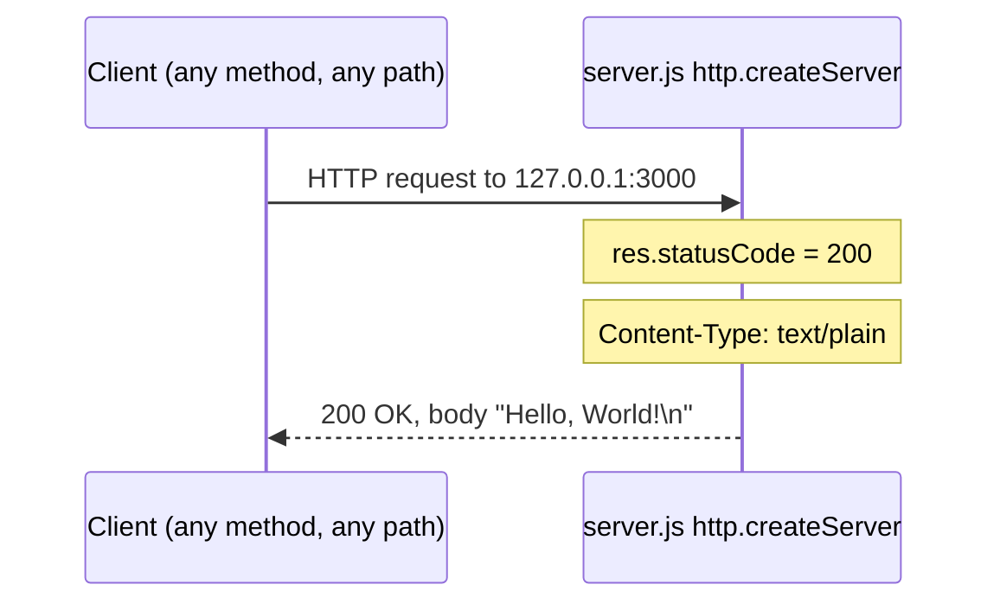
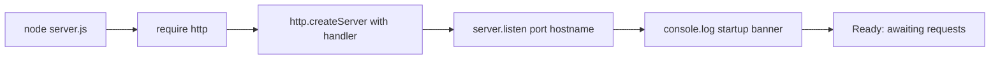

# hao-backprop-test

> **Note:** This README's title is `hao-backprop-test`, but the npm package is named `hello_world`. See [Notes / Known Discrepancies](#notes--known-discrepancies). _Source: README.md:L1; package.json:L2_

A minimal HTTP server built with the Node.js built-in `http` module. It listens on `http://127.0.0.1:3000/` and replies to **every** request — any HTTP method, any URL path — with a single static plain-text response: `Hello, World!`. _Source: server.js:L17,L26,L33,L49-L53_

## Table of Contents

- [Overview](#overview)
- [Prerequisites](#prerequisites)
- [Setup / Installation](#setup--installation)
- [Usage / Quick Start](#usage--quick-start)
- [API Documentation](#api-documentation)
- [Configuration](#configuration)
- [Deployment Guide](#deployment-guide)
- [Code Walkthrough](#code-walkthrough)
- [Project Structure](#project-structure)
- [Notes / Known Discrepancies](#notes--known-discrepancies)
- [License](#license)

## Overview

This project is a "Hello world in Node.js" application: a deliberately minimal, single-file HTTP server. _Source: package.json:L4_ It is implemented entirely with the Node.js standard library (the `http` module) and has **no third-party dependencies**. _Source: server.js:L17; package-lock.json:L6-L12_

| Field | Value |
|-------|-------|
| Package name | `hello_world` _Source: package.json:L2_ |
| Version | `1.0.0` _Source: package.json:L3_ |
| Author | `hxu` _Source: package.json:L9_ |
| License | MIT _Source: package.json:L10_ |

## Prerequisites

- **Node.js** — a current [LTS release](https://nodejs.org/) is recommended. The project declares no `engines` field and ships no `.nvmrc` or `.node-version`, so the runtime version is not pinned; any reasonably recent Node.js that includes the built-in `http` module will work. _Source: package.json:L1-L11_
- **npm** — bundled with Node.js. This project is an npm package (it ships a `package.json` manifest and a `package-lock.json` lockfile), so npm is used for installation. _Source: package.json:L1-L11; package-lock.json:L1-L13_

## Setup / Installation

1. Clone the repository:

   ```bash
   git clone <repository-url>
   cd <repository-directory>
   ```

2. Install dependencies:

   ```bash
   npm install
   ```

   `npm install` reads the npm manifest and resolves **zero** third-party packages — the lockfile records only the root package. _Source: package.json:L1-L11; package-lock.json:L6-L12_

## Usage / Quick Start

Start the server by running the script directly with Node.js — `server.js` is the runnable entry-point script that creates the HTTP server and begins listening: _Source: server.js:L1-L15,L49-L65_

```bash
node server.js
```

> There is no `start` script defined, so `npm start` will not work — run `node server.js` directly. _Source: package.json:L6-L8_

Once listening, the server prints to standard output: _Source: server.js:L63-L64_

```text
Server running at http://127.0.0.1:3000/
```

## API Documentation

The server exposes a single, universal endpoint with **no routing and no method discrimination** — every request receives the same response. _Source: server.js:L49-L53_

### Endpoint

| Property | Value |
|----------|-------|
| Base URL | `http://127.0.0.1:3000/` _Source: server.js:L26,L33_ |
| Methods | Any (GET, POST, …) — all identical _Source: server.js:L49-L53_ |
| Path | Any — all identical _Source: server.js:L49-L53_ |

### Request / Response

| Aspect | Value |
|--------|-------|
| Request body | Ignored _Source: server.js:L49-L53_ |
| Status | `200 OK` _Source: server.js:L50_ |
| Header | `Content-Type: text/plain` _Source: server.js:L51_ |
| Body | `Hello, World!\n` _Source: server.js:L52_ |

### Example (curl)

Send any request to the base URL — the host and port come from the `hostname` and `port` constants: _Source: server.js:L26,L33_

```bash
curl -i http://127.0.0.1:3000/
```

Expected response (status `200`, header `Content-Type: text/plain`, body `Hello, World!\n`; auto-generated headers omitted): _Source: server.js:L50-L52_

```text
HTTP/1.1 200 OK
Content-Type: text/plain

Hello, World!
```

The body is exactly `Hello, World!` followed by a single newline. _Source: server.js:L52_

### Request/Response Flow

Any request — regardless of HTTP method or URL path — to `127.0.0.1:3000` receives status `200`, `Content-Type: text/plain`, and the body `Hello, World!\n`: _Source: server.js:L26,L33,L49-L53_



## Configuration

All configuration is hardcoded as module-level constants in `server.js`. There are **no environment variables** and **no configuration files**. _Source: server.js:L26,L33_

| Constant | Value | Purpose |
|----------|-------|---------|
| `hostname` | `127.0.0.1` | IPv4 loopback bind address _Source: server.js:L26_ |
| `port` | `3000` | TCP listen port _Source: server.js:L33_ |

To change the host or port, edit these constants in `server.js` and restart. _Source: server.js:L26,L33_

## Deployment Guide

A **single-process** application with no build step. _Source: server.js:L49-L65; package.json:L6-L8_

**Run:** `node server.js` _Source: server.js:L1-L15,L49-L65; package.json:L5_

**Stop:** Press `Ctrl+C`. There is no graceful-shutdown handler; the process terminates immediately. _Source: server.js:L63-L65_

- **Entry point:** `package.json` declares `"main": "index.js"`, but no `index.js` exists in the repository (see [Project Structure](#project-structure)) — the actual entry point is `server.js`. _Source: package.json:L5_
- **No `start` script:** only a placeholder `test` script is defined. _Source: package.json:L6-L8_
- **Loopback binding:** binding to `127.0.0.1` means the server is reachable only from the local machine. _Source: server.js:L26_

### Startup Lifecycle

The boot sequence below maps to `require('http')`, `http.createServer`, `server.listen`, and the `console.log` startup banner: _Source: server.js:L17,L49,L63-L64_



### Troubleshooting

- **`EADDRINUSE`:** Port `3000` is already in use — stop the other process or change the `port` constant. _Source: server.js:L33_
- **Unreachable from another host:** Expected — the server binds to loopback `127.0.0.1`. _Source: server.js:L26_

## Code Walkthrough

The executable portion of `server.js` is **11 non-comment lines** organized into four regions; including its JSDoc documentation comments, the full file spans 65 lines. _Source: server.js:L1-L65_

1. **Import the `http` module** _Source: server.js:L17_ — loads Node's built-in `http` module (the only dependency).

   ```javascript
   const http = require('http');
   ```

2. **Configuration constants** _Source: server.js:L26,L33_ — loopback host and listen port.

   ```javascript
   const hostname = '127.0.0.1';
   const port = 3000;
   ```

3. **Create server + request handler** _Source: server.js:L49-L53_ — an anonymous arrow function set as the request listener; for every request it sets status `200`, `Content-Type: text/plain`, and ends with `Hello, World!\n`; `req` is unused. _Source: server.js:L50-L52_

   ```javascript
   const server = http.createServer((req, res) => {
     res.statusCode = 200;
     res.setHeader('Content-Type', 'text/plain');
     res.end('Hello, World!\n');
   });
   ```

4. **Listen + log** _Source: server.js:L63-L65_ — binds to port/host and logs `Server running at http://127.0.0.1:3000/` when ready. _Source: server.js:L64_

   ```javascript
   server.listen(port, hostname, () => {
     console.log(`Server running at http://${hostname}:${port}/`);
   });
   ```

## Project Structure

Four files at the root, no subfolders:

```text
.
├── README.md           # This documentation
├── package.json        # npm manifest
├── package-lock.json   # npm lockfile (zero dependencies)
└── server.js           # HTTP server (runnable entry point)
```

_Source: package.json:L1-L11; package-lock.json:L1-L13; server.js:L1-L65_

## Notes / Known Discrepancies

Documented here, **not fixed** (source/manifest changes are out of scope):

1. **Entry-point mismatch:** `main: index.js`, but `index.js` does not exist (it is absent from the [Project Structure](#project-structure) listing); the entry point is `server.js`. _Source: package.json:L5_
2. **Name/title mismatch:** package `hello_world` vs. README title `hao-backprop-test`. _Source: package.json:L2; README.md:L1_
3. **Superseded note:** the prior README's "test project for backprop integration. Do not touch!" is superseded by this documentation. _Source: original (pre-documentation) README.md:L2, preserved in Git history at the initial-import commit 0c2e871; superseded by this rewrite_

## License

Licensed under the **MIT** License. _Source: package.json:L10_
