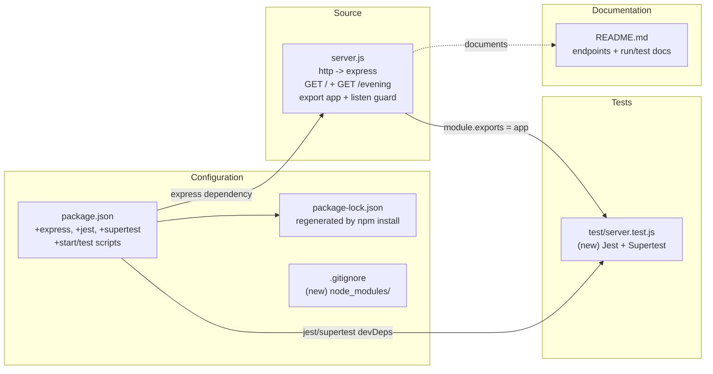

# Technical Specification

# 0. Agent Action Plan

## 0.1 Intent Clarification

### 0.1.1 Core Objective

Based on the provided requirements, the Blitzy platform understands that the objective is to evolve a minimal Node.js tutorial HTTP server — which today serves a single hard-coded `Hello, World!\n` response using the Node.js core `http` module [server.js:L1-L14] — into an Express.js application that exposes the existing greeting plus a second endpoint returning `Good evening`, accompanied by a comprehensive testing strategy and per-line source comments as mandated by the user's rules.

The verbatim user request is preserved below for fidelity:

> **User Prompt (verbatim):** "this is a tutorial of node js server hosting one endpoint that returns the response 'Hello world'. Could you add expressjs into the project and add another endpoint that return the response of 'Good evening'?"

The requirements, restated with technical precision:

- **O1 — Introduce Express.js as a runtime dependency.** Add `express` (version `^5.2.1`, the current stable major) to `package.json` and lock the resolved dependency graph in `package-lock.json`. The project currently declares zero dependencies [package.json:L1-L11], so this is a net-new dependency introduction.
- **O2 — Migrate the server from the Node core `http` module to Express.** Replace `const http = require('http')` and the `http.createServer(...)` construction [server.js:L1,L6] with an Express application instance (`const app = express()`), preserving the existing host/port binding of `127.0.0.1:3000` [server.js:L3-L4].
- **O3 — Preserve the existing "Hello world" behavior.** Register the current response as an Express route at `GET /` that returns the byte-identical body `Hello, World!\n` previously emitted by `res.end('Hello, World!\n')` [server.js:L9].
- **O4 — Add a new endpoint returning "Good evening".** Register a second route that responds with the literal string `Good evening`. The user did not specify a path, so the path `GET /evening` is proposed (see implicit requirement A1).
- **O5 — (Rule "04-june-rules") Comment every line of code.** Every line in all generated and modified JavaScript source and test files must carry an explanatory inline comment.
- **O6 — (Rule "Add Testing Rule IW") Produce and implement a testing strategy.** Analyze the codebase and generate unit, integration, API-scenario, edge-case, and coverage-improvement recommendations prioritized by business impact and risk, backed by a runnable suite using Jest (`^30.4.2`) and Supertest (`^7.2.2`).

**Implicit requirements and ambiguities surfaced:**

- **A1 — New endpoint path is unspecified.** The user requested "another endpoint that return... 'Good evening'" without naming a path. Resolution: propose `GET /evening` while keeping the greeting at `GET /`. This is a low-risk assumption that can be trivially adjusted.
- **A2 — Content-Type parity.** The existing handler explicitly sets `Content-Type: text/plain` [server.js:L8]. Express's `res.send(String)` defaults to `text/html`; therefore the implementation must call `res.type('text/plain')` to keep `GET /` byte- and header-compatible with the original.
- **A3 — Response literals must be preserved.** The root endpoint must continue to return `Hello, World!\n` (with trailing newline) [server.js:L9]; the new endpoint returns `Good evening` exactly as worded by the user.
- **A4 — Host/port parity.** Retain `127.0.0.1:3000` [server.js:L3-L4] so existing cold-start and verification behavior is unchanged.
- **A5 — npm scripts.** The current `test` script is a non-functional placeholder [package.json:scripts.test]. Add a real `start` script (`node server.js`) and replace the placeholder `test` with `jest`.
- **A6 — Lockfile regeneration.** Running `npm install` will regenerate `package-lock.json` to capture Express and the dev dependencies plus their transitive graph.
- **A7 — Entry-point mismatch.** `package.json` declares `main: index.js`, but no `index.js` exists; the real entry is `server.js` [package.json:L4]. Aligning `main` to `server.js` is an optional, low-priority cleanup.
- **A8 — node_modules hygiene.** Introducing dependencies creates a `node_modules/` directory; adding a `.gitignore` to exclude it is a hygiene improvement.

### 0.1.2 Task Categorization

- **Primary task type:** Mixed — a feature addition (new runtime dependency + new endpoint) combined with a Testing deliverable (strategy plus runnable suite).
- **Secondary aspects:** Configuration and dependency management (`package.json`, `package-lock.json`); source refactor (Node `http` → Express); test-suite creation; and code-comment compliance.
- **Scope classification:** Cross-cutting change — it introduces a runtime dependency and a build/install step (`npm install`), and touches source, configuration, documentation, and new test files, materially altering the project's prior zero-dependency posture.

### 0.1.3 Special Instructions and Constraints

- **Comment every line (rule "04-june-rules"):** "please Follow add Comment each of line of code". Every line of generated/modified JavaScript (`server.js` and the test file) must carry an explanatory comment. Because JSON does not support comments, this rule is applied to JavaScript source only; `package.json`/`package-lock.json` cannot carry inline comments and are documented as the explicit exception.
- **Testing strategy (rule "Add Testing Rule IW"):** "Analyze the codebase and create a testing strategy. Generate: - Unit test recommendations - Integration test recommendations - API test scenarios - Edge case validations - Coverage improvement opportunities. Prioritize tests based on business impact and risk." This makes a testing deliverable a first-class, mandatory output and brings a test runner plus a test file into scope.
- **Backward compatibility:** Preserve the existing response body, content type, host, and port so the original "Hello world" behavior is indistinguishable to a client after the migration.
- **Frozen-fixture note (conflict resolution):** The repository's `README.md` states "Do not touch!" [README.md:L2] and the existing specification characterizes this artifact as a deliberately frozen, zero-dependency, four-file fixture. The user's explicit prompt is the authoritative statement of current intent and intentionally supersedes that note and the prior constraints; this deviation is documented transparently in sections 0.7 and 0.8 rather than treated as a blocker.

### 0.1.4 Technical Interpretation

These requirements translate to the following technical implementation strategy:

- **To introduce Express (O1),** we will update `package.json` to add `express` under `dependencies` and run `npm install`, which materializes `node_modules/` and regenerates `package-lock.json` with the locked dependency tree.
- **To migrate the server (O2),** we will modify `server.js` to require `express`, instantiate `const app = express()`, and replace `http.createServer` with Express route registration, retaining the `127.0.0.1:3000` binding [server.js:L3-L4,L12].
- **To preserve the greeting (O3),** we will register `app.get('/', ...)` that calls `res.type('text/plain')` and `res.status(200).send('Hello, World!\n')`, reproducing the original body and header [server.js:L8-L9].
- **To add the new endpoint (O4),** we will register `app.get('/evening', ...)` returning `Good evening` with the same plain-text treatment.
- **To satisfy testability,** we will export the Express `app` via `module.exports` and guard the listener with `if (require.main === module)` so Supertest can exercise routes in-process without binding the port.
- **To satisfy the comment rule (O5),** we will annotate every line of `server.js` and the test file with explanatory comments.
- **To satisfy the testing rule (O6),** we will create `test/server.test.js` using Jest + Supertest and update the npm `test` script, covering both endpoints, content types, exact bodies, and edge cases (unknown routes, non-GET methods).


## 0.2 Repository Scope Discovery

### 0.2.1 Comprehensive File Analysis

An exhaustive inspection of the repository (via `git ls-files` and a filesystem walk excluding `.git`) confirms the project consists of **exactly four tracked files and no subdirectories**:

| Path | Type | Role | Affected? |
|------|------|------|-----------|
| `server.js` | JavaScript (CommonJS) | Application source; single static handler over Node core `http` [server.js:L1-L14] | Yes — UPDATE |
| `package.json` | JSON | Manifest; zero dependencies, placeholder `test` script [package.json:L1-L11] | Yes — UPDATE |
| `package-lock.json` | JSON | Lockfile, `lockfileVersion` 3, root-only entry | Yes — UPDATE (regenerated) |
| `README.md` | Markdown | Two-line project note [README.md:L1-L2] | Yes — UPDATE |

Additional findings that bound the scope:

- **No source/test/config subdirectories exist** — there is no `src/`, `lib/`, `test/`, `tests/`, `__tests__/`, `docs/`, `config/`, `.github/`, `bin/`, or `scripts/` directory.
- **No `index.js` exists** despite `package.json` declaring `main: index.js` [package.json:L4]; the operative entry point is `server.js`.
- **No hidden configuration files** are present — `.gitignore`, `.nvmrc`, `.eslintrc`, `tsconfig.json`, `.env`, and `.editorconfig` are all absent.
- **No `.blitzyignore` files** exist anywhere in the repository, so there are no ignore patterns to honor.
- **No downstream importers** of `server.js` exist — the file has no `module.exports` today [server.js:L1-L14], so refactoring it produces no import ripple beyond the new test file that will consume the exported app.

This analysis confirms the complete affected-file set, with nothing left "to be discovered": four files require modification (`server.js`, `package.json`, `package-lock.json`, `README.md`) and two new files require creation (`test/server.test.js`, `.gitignore`).

### 0.2.2 Web Search Research Conducted

Research targeted the current Express major version and conventional Express API testing practices:

- **Express 5 routing and getting-started conventions** — the standard pattern for registering routes (`const app = express(); app.get('/path', (req, res) => res.send(...)); app.listen(port, host, cb)`).
- **Testing Express APIs with Jest and Supertest** — in-process testing of an exported `app` object without binding a network port, and assertion of status, headers, and body.
- **Current published versions** of `express`, `jest`, and `supertest`.

The web search facility returned no results in this execution environment; consequently, all version and behavior claims were **validated empirically** within an isolated sandbox directory (outside the repository). The empirical validation confirmed that `express` resolves to `5.2.1` and runs on the available Node.js `v22.22.2`; that a two-route Express app returns HTTP 200 for both `GET /` and `GET /evening`; and that a Jest (`30.4.2`) + Supertest (`7.2.2`) suite executes and passes against that app. These empirically verified versions are carried into the Dependency Inventory (section 0.4).

### 0.2.3 Existing Infrastructure Assessment

- **Runtime:** Node.js `v22.22.2` with npm `11.1.0` is available. `package.json` declares no `engines` field and there is no `.nvmrc` [package.json:L1-L11], so there is no pinned Node version constraint; the active Node 22 LTS line is targeted.
- **Module system:** CommonJS (`require`) [server.js:L1]. This convention is retained — Express is consumed via `require('express')` and no ESM migration is performed.
- **Code conventions:** Two-space indentation and single-quoted string literals in `server.js` [server.js:L1-L14]; these conventions are preserved in the refactored source and new test file.
- **Build/install step:** None today — the project runs directly from cloned source via `node server.js`. Introducing Express and the test tooling adds an `npm install` step, which is a deliberate and documented change from the prior no-install posture.
- **Testing infrastructure:** None present. The only `test` script is the npm default placeholder `echo "Error: no test specified" && exit 1` [package.json:scripts.test], which exits non-zero and runs no tests. A Jest + Supertest stack is introduced to satisfy the testing rule.
- **Documentation system:** A single `README.md` with a project title and a "Do not touch!" note [README.md:L1-L2]; it will be updated to reflect the new Express stack, endpoints, and run/test instructions.


## 0.3 Scope Boundaries

### 0.3.1 Exhaustively In Scope

The following files are within scope. The set is complete; nothing is deferred or pending discovery.

- **Source code changes:**
  - `server.js` — migrate from Node core `http` to Express; register `GET /` (returns `Hello, World!\n`, `text/plain`) and `GET /evening` (returns `Good evening`); export the `app` and guard the listener; comment every line [server.js:L1-L14].
- **Configuration updates:**
  - `package.json` — add `express` to `dependencies`; add `jest` and `supertest` to `devDependencies`; add a `start` script and replace the placeholder `test` script; optionally align `main` to `server.js` [package.json:L1-L11].
  - `package-lock.json` — regenerated by `npm install` to lock Express and the dev dependencies plus their transitive graph.
  - `.gitignore` — create to exclude `node_modules/` (and npm debug logs).
- **Documentation updates:**
  - `README.md` — document the Express stack, the two endpoints, and `npm install` / `npm start` / `npm test` usage [README.md:L1-L2].
- **Test updates (rule-mandated by "Add Testing Rule IW"):**
  - `test/server.test.js` — create a Jest + Supertest suite exercising both endpoints, content types, exact bodies, and edge cases.

### 0.3.2 Explicitly Out of Scope

The following are intentionally excluded because they are neither requested by the user nor required by the rules:

- Any database, ORM, persistence, or storage layer.
- Authentication, authorization, sessions, or security middleware (e.g., `helmet`, `cors`) beyond Express defaults.
- HTTPS/TLS, reverse proxies, or production hardening; the loopback `127.0.0.1` binding is retained [server.js:L3].
- Any endpoints beyond `GET /` and `GET /evening`; no request-body parsing, query handling, templating, or view rendering.
- CI/CD pipelines (`.github/workflows`), Docker/containerization, or infrastructure-as-code.
- Linters, formatters, TypeScript, transpilers, or bundlers.
- Clustering/multi-process execution, logging frameworks, or environment-configuration libraries.
- Refactoring of unrelated concerns or renaming the project; aligning the `package.json` `main` field is optional and low-priority only.
- Creation of an `index.js` — the entry point remains `server.js`.


## 0.4 Dependency Inventory

### 0.4.1 Key Packages

The project currently declares **zero runtime and zero development dependencies** — `package.json` has neither a `dependencies` nor a `devDependencies` block [package.json:L1-L11], and `package-lock.json` (`lockfileVersion` 3) contains only the root package entry. The following packages are introduced by this change. All versions are registry-verified and were validated empirically on Node.js `v22.22.2`; no placeholder versions are used.

| Registry | Package Name | Version | Purpose |
|----------|--------------|---------|---------|
| npm | express | ^5.2.1 | Web framework providing the application instance, routing, and `res.send` used by both endpoints |
| npm | jest | ^30.4.2 | Test runner for the unit/integration suite (devDependency) |
| npm | supertest | ^7.2.2 | In-process HTTP assertion library used to exercise the Express app without binding a port (devDependency) |

### 0.4.2 Dependency Updates

- **New dependencies to add:**
  - `express`: `^5.2.1` (runtime) — required to fulfill the user's request to "add expressjs into the project" and to host both routes.
  - `jest`: `^30.4.2` (dev) — required by rule "Add Testing Rule IW" to execute the test suite.
  - `supertest`: `^7.2.2` (dev) — required to assert HTTP responses against the Express app in-process.

- **Dependencies to update:** None — there are no pre-existing dependencies to upgrade.

- **Dependencies to remove:** None — the Node core `http` module is a built-in and requires no package; it is simply no longer imported.

- **Import/Reference updates:**
  - `server.js` — change the import from `require('http')` [server.js:L1] to `require('express')`; add `module.exports = app` for testability.
  - `test/server.test.js` (new) — add `require('supertest')` and `require('../server')` to import the exported app under test.
  - Import transformation rule:
    - Old: `const http = require('http');`
    - New: `const express = require('express');`
    - Apply to: `server.js`
  - No other files reference these modules, so no further import propagation is required.


## 0.5 Implementation Design

### 0.5.1 Technical Approach

The primary objective is achieved by migrating `server.js` from the Node core `http` module to an Express application while preserving every externally observable behavior of the original server.

- **Achieve the Express migration** by replacing `const http = require('http')` [server.js:L1] with `const express = require('express')` and constructing `const app = express()` in place of `http.createServer(...)` [server.js:L6]. The host and port literals `127.0.0.1` and `3000` are retained [server.js:L3-L4].
- **Achieve byte-exact backward compatibility for the greeting** by registering `app.get('/', ...)` that sets `res.type('text/plain')` and returns `res.status(200).send('Hello, World!\n')`. The explicit `text/plain` is required because Express defaults `res.send(String)` to `text/html`, whereas the original handler set `Content-Type: text/plain` [server.js:L8-L9].
- **Achieve the new capability** by registering `app.get('/evening', ...)` that returns `Good evening` with the same plain-text treatment.
- **Achieve testability** by exporting the app (`module.exports = app`) and guarding the listener so it only binds when run directly.

The logical implementation flow (not a timeline):

- First, establish the dependency foundation by adding `express` to `package.json` and running `npm install` to generate `node_modules/` and the locked `package-lock.json`.
- Next, refactor `server.js` to construct the Express app, register both routes, export the app, and conditionally start the listener.
- Then, create `test/server.test.js` to validate both routes and edge cases via Supertest, and wire the npm `test` script to Jest.
- Finally, ensure quality and discoverability by updating `README.md` and adding `.gitignore`, and by applying per-line comments to all JavaScript.

A representative (illustrative, not final) shape of the refactored core:

```javascript
const express = require('express');           // import the Express framework
const app = express();                        // create the application instance
app.get('/', (req, res) => res.type('text/plain').status(200).send('Hello, World!\n'));
app.get('/evening', (req, res) => res.type('text/plain').status(200).send('Good evening'));
module.exports = app;                          // export for Supertest
if (require.main === module) app.listen(3000, '127.0.0.1', () => console.log('Server running'));
```

### 0.5.2 Component Impact Analysis



- **Direct modifications required:**
  - `server.js` — replace the `http` server with an Express app, add a second route, export the app, and guard the listener [server.js:L1-L14].
  - `package.json` — add the `express` dependency, the `jest`/`supertest` dev dependencies, and real `start`/`test` scripts [package.json:L1-L11].
  - `package-lock.json` — regenerated by `npm install` to capture the full locked tree.
- **Indirect impacts and dependencies:**
  - `README.md` — update documentation to reflect the new framework, endpoints, and commands [README.md:L1-L2].
  - `package-lock.json` is a downstream artifact of the `package.json` dependency edits.
- **New components introduction:**
  - `test/server.test.js` — created to host the Jest + Supertest suite (rationale: mandated by rule "Add Testing Rule IW" and enabled by exporting `app`).
  - `.gitignore` — created to exclude `node_modules/` now that dependencies are installed (rationale: repository hygiene).

### 0.5.3 User Interface Design

Not applicable. This is a backend HTTP server with no user interface, no design system, and no Figma attachments. Both endpoints return plain-text bodies consumed programmatically.

### 0.5.4 User-Provided Examples Integration

The user provided no code examples. The two response strings supplied in the prompt are treated as exact literals and preserved verbatim:

- The user's existing greeting `Hello world` maps to the root route `GET /` returning the original body `Hello, World!\n` [server.js:L9] (the trailing-newline form already present in the source is preserved for byte-exact parity).
- The user's requested `Good evening` maps to the new route `GET /evening`, returning the string `Good evening` exactly as worded.

### 0.5.5 Critical Implementation Details

- **Content-Type fidelity:** Always call `res.type('text/plain')` before `res.send(...)` on both routes so responses are `text/plain`, matching the original handler [server.js:L8] rather than Express's `text/html` default.
- **Listener guard pattern:** Use `if (require.main === module) { app.listen(port, hostname, ...) }` so importing the module under test does not bind port 3000; this keeps the test suite hermetic while `node server.js` still starts the server.
- **Module system:** Remain on CommonJS (`require`/`module.exports`) [server.js:L1]; do not introduce ESM.
- **Startup logging:** Preserve the existing startup log message format `Server running at http://127.0.0.1:3000/` [server.js:L13] to keep cold-start verification output stable.
- **Edge-case behavior:** Express returns a default `404` for unmatched routes and handles unsupported methods automatically; tests assert these defaults rather than adding custom handlers.
- **Security posture:** Retain loopback-only binding [server.js:L3]; no new network exposure, request-body parsing, or untrusted input handling is introduced.
- **Comment compliance:** Every line of `server.js` and `test/server.test.js` carries an explanatory comment per rule "04-june-rules".


## 0.6 File Transformation Mapping

### 0.6.1 File-by-File Execution Plan

Every file to be created, updated, or deleted is mapped below with the target file listed first. The list is exhaustive — nothing is pending or "to be discovered." No deletions are required.

| Target File | Transformation | Source File/Reference | Purpose/Changes |
|-------------|----------------|-----------------------|-----------------|
| `server.js` | UPDATE | `server.js` | Migrate Node `http` → Express; register `GET /` (`Hello, World!\n`, `text/plain`) and `GET /evening` (`Good evening`); add `module.exports = app`; guard `app.listen` with `require.main === module`; comment every line |
| `package.json` | UPDATE | `package.json` | Add `dependencies.express` `^5.2.1`; add `devDependencies` `jest` `^30.4.2` and `supertest` `^7.2.2`; add `scripts.start` (`node server.js`); replace `scripts.test` placeholder with `jest`; optionally align `main` to `server.js` |
| `package-lock.json` | UPDATE | `package-lock.json` | Regenerated by `npm install` to lock `express` + dev dependencies + the full transitive tree (`lockfileVersion` 3) |
| `test/server.test.js` | CREATE | `server.js` (REFERENCE) | Jest + Supertest suite: `GET /` → 200 / `text/plain` / `Hello, World!\n`; `GET /evening` → 200 / `Good evening`; edge cases (unknown route 404, non-GET method); comment every line |
| `.gitignore` | CREATE | — | Ignore `node_modules/` and npm debug logs now that dependencies are installed |
| `README.md` | UPDATE | `README.md` | Document the Express stack, both endpoints, and `npm install` / `npm start` / `npm test` instructions |

### 0.6.2 New Files Detail

- `test/server.test.js` — Jest + Supertest test suite.
  - Content type: test.
  - Based on: the exported Express `app` from `server.js` (REFERENCE), exercised in-process via Supertest.
  - Key sections/functions: a describe block per endpoint asserting status code, `Content-Type`, and exact body for `GET /` (`Hello, World!\n`) and `GET /evening` (`Good evening`); plus edge-case assertions (unknown path → 404; unsupported method behavior). Every line is commented.
- `.gitignore` — repository hygiene.
  - Content type: config.
  - Based on: standard Node.js ignore conventions.
  - Key sections/functions: ignore `node_modules/` and npm debug logs.

### 0.6.3 Files to Modify Detail

- `server.js` — full refactor [server.js:L1-L14].
  - Sections to update: the import line `const http = require('http')` (L1) becomes `const express = require('express')`; the `http.createServer((req,res) => {...})` block (L6-L10) becomes two `app.get(...)` route registrations; the `server.listen(port, hostname, ...)` call (L12-L14) becomes a guarded `app.listen(...)`.
  - New content to add: `const app = express()`, the `GET /evening` route, `module.exports = app`, the `require.main === module` guard, and a per-line comment on every line.
  - Content to remove: the `http` import and the `http.createServer` construction; the host/port literals and the startup log message are retained.
- `package.json` — manifest edits [package.json:L1-L11].
  - Sections to update: add a `dependencies` block (`express`); add a `devDependencies` block (`jest`, `supertest`); update `scripts` to add `start` and replace the placeholder `test` (`echo "Error: no test specified" && exit 1` [package.json:scripts.test]) with `jest`.
  - Optional: change `main` from `index.js` to `server.js` [package.json:L4].
- `package-lock.json` — regenerated, not hand-edited.
  - This file is produced by `npm install`; it will reflect the new packages and their transitive dependencies.
- `README.md` — documentation refresh [README.md:L1-L2].
  - Sections to add/update: a short description of the Express server, an endpoint table (`GET /` → `Hello, World!\n`; `GET /evening` → `Good evening`), and install/run/test commands.

### 0.6.4 Configuration and Documentation Updates

- **Configuration changes:**
  - `package.json`: introduce dependency and devDependency blocks and functional `start`/`test` scripts. Impact: the project gains a real dependency graph and an `npm install` build/install step where previously there was none.
  - `.gitignore`: prevent `node_modules/` from being committed. Impact: keeps the repository clean after dependency installation.
- **Documentation updates:**
  - `README.md`: replace the minimal note with accurate usage documentation. Cross-references to update: ensure the documented run command matches the new `start` script and that the endpoint list matches the routes registered in `server.js`.

### 0.6.5 Cross-File Dependencies

- `package.json` dependency edits drive the regeneration of `package-lock.json` and must remain in sync (same package versions).
- `server.js` must `export` the `app` object so `test/server.test.js` can import it via `require('../server')`; the test's correctness depends on this export and on the registered route paths.
- `README.md` run/test instructions must reference the exact npm scripts defined in `package.json` (`start`, `test`) and the exact endpoint paths defined in `server.js`.
- The endpoint paths and response literals are the single source of truth shared across `server.js`, `test/server.test.js`, and `README.md`; any path change (e.g., the `/evening` assumption A1) must be propagated to all three.


## 0.7 Rules

The user specified two implementation rules. Both are mandatory and are reproduced verbatim below with their implementation implications.

- **Rule "04-june-rules" (verbatim):** "please Follow add Comment each of line of code"
  - Implication: every line of generated and modified JavaScript — `server.js` and `test/server.test.js` — must carry an explanatory inline comment.
  - Boundary: JSON files (`package.json`, `package-lock.json`) cannot contain comments without becoming invalid JSON; this rule therefore applies to JavaScript source only, and the JSON exception is documented explicitly so reviewers do not flag missing comments there.

- **Rule "Add Testing Rule IW" (verbatim):** "Analyze the codebase and create a testing strategy. Generate: - Unit test recommendations - Integration test recommendations - API test scenarios - Edge case validations - Coverage improvement opportunities. Prioritize tests based on business impact and risk."
  - Implication: a testing strategy is a first-class deliverable, and a runnable test suite plus a test runner are brought into scope. The strategy below is prioritized by business impact and risk for this two-endpoint server.
  - **Unit test recommendations (HIGH):** assert that each route handler produces status `200`, `Content-Type: text/plain`, and the exact body (`Hello, World!\n` for `/`, `Good evening` for `/evening`). Response correctness is the core business behavior.
  - **Integration test recommendations (HIGH):** exercise the fully assembled Express `app` through Supertest to validate routing and middleware wiring end-to-end in-process.
  - **API test scenarios (HIGH):** happy-path `GET /` and `GET /evening`, verifying status, content type, and exact body for each.
  - **Edge case validations (MEDIUM):** unknown path returns Express's default `404`; unsupported HTTP method (e.g., `POST /`) behavior; trailing-slash and case-sensitivity behavior.
  - **Coverage improvement opportunities (MEDIUM):** export `app` to make handlers testable; run `jest --coverage` and target 100% line/branch coverage given the very small surface.
  - Risk-prioritization rationale: response correctness and route availability are the only business-critical behaviors, so happy-path API/integration tests rank highest; malformed-input and security paths rank low because the handlers ignore request input and the server binds to loopback only [server.js:L3].

- **Backward-compatibility rule (derived from the prompt):** the existing "Hello world" behavior must remain byte- and header-compatible — same body `Hello, World!\n` [server.js:L9], same `text/plain` content type [server.js:L8], same `127.0.0.1:3000` binding [server.js:L3-L4].


## 0.8 Special Instructions

### 0.8.1 Special Execution Instructions

- **Comment density:** apply an explanatory comment to every line of JavaScript in `server.js` and `test/server.test.js` (rule "04-june-rules"). Do not attempt to comment JSON files.
- **Testing is required output:** deliver both the testing strategy and a passing Jest + Supertest suite; wire it to `npm test` by replacing the placeholder script [package.json:scripts.test].
- **Preserve tutorial simplicity:** keep a single application file (`server.js`) rather than splitting into `app.js` + `server.js`; the export-plus-listener-guard pattern provides testability without adding files. (A split is noted only as an alternative.)
- **Run/verify locally:** after edits, `npm install`, then `npm start` should print the existing startup log [server.js:L13], and `npm test` should pass; `curl -i http://127.0.0.1:3000/` should still return `200`, `text/plain`, and `Hello, World!\n`.
- **No deployment, container, or CI/CD actions** are requested or to be performed.

### 0.8.2 Constraints and Boundaries

- **Authoritative-intent / frozen-fixture relaxation (transparency note):** the repository `README.md` states "Do not touch!" [README.md:L2], and the existing specification (sections covering the technology stack and testing strategy) characterizes this artifact as a deliberately frozen, zero-dependency, four-file test fixture. The user's explicit prompt — to add Express, add an endpoint, and add tests — is the authoritative statement of current intent and **intentionally supersedes** that note and the prior zero-dependency/fixed-file/no-install/no-test constraints. This deviation is recorded here transparently so downstream agents and reviewers understand it is sanctioned by the user, not an oversight:
  - Adding `express` introduces a runtime dependency and an `npm install` build/install step (relaxes the prior zero-dependency and no-install constraints).
  - Adding `GET /evening` introduces path-based routing where the original handler was path-agnostic [server.js:L6-L10].
  - Adding a test suite and dev dependencies relaxes the prior "testing not applicable"/fixed-file-inventory constraints.
- **Backward-compatibility boundary:** the `GET /` response, content type, host, and port must remain unchanged from the original [server.js:L3-L4,L8-L9].
- **Technical constraints:** remain on Node.js 22 / CommonJS; use only the verified package versions in section 0.4; do not introduce TypeScript, linters, bundlers, or additional frameworks.
- **Output constraints:** modify only the in-scope files enumerated in section 0.6; do not create an `index.js`; do not add endpoints, middleware, or configuration beyond what the request and rules require.
- **Assumption to confirm:** the new endpoint path is assumed to be `/evening` (ambiguity A1); if the user prefers a different path, update `server.js`, `test/server.test.js`, and `README.md` consistently.


## 0.9 Attachments

No attachments were provided for this project.

- **File attachments:** None.
- **Figma design frames:** None. Because no Figma frames or component library/design system were supplied, the Figma Analysis and Design System Alignment protocols are not applicable; this is a backend HTTP server with no user interface.

All requirements for this Agent Action Plan were derived from the user's prompt and the two user-specified rules ("04-june-rules" and "Add Testing Rule IW"), corroborated by direct inspection of the repository's four files (`server.js`, `package.json`, `package-lock.json`, `README.md`).


