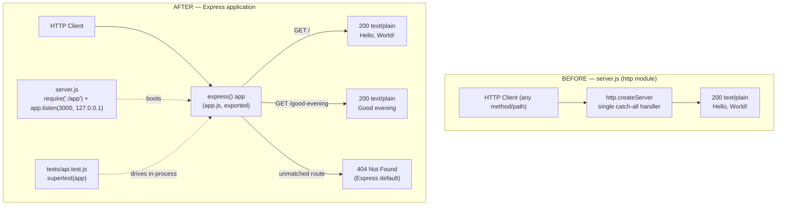

# Technical Specification

# 0. Agent Action Plan

## 0.1 Intent Clarification

### 0.1.1 Core Feature Objective

Based on the prompt, the Blitzy platform understands that the new feature requirement is to **introduce the Express.js web framework into the existing single-file Node.js HTTP server and to add a second HTTP endpoint that returns the plain-text response "Good evening," while preserving the existing endpoint that returns the current "Hello, World!" response.**

The user's request is preserved verbatim below:

> **User Example (verbatim):** "this is a tutorial of node js server hosting one endpoint that returns the response "Hello world". Could you add expressjs into the project and add another endpoint that return the response of "Good evening"?"

The repository today is a 14-line program that uses the Node.js built-in `http` module [server.js:L1] and answers **every** request — regardless of HTTP method or path — with the static body `Hello, World!\n` and status `200` [server.js:L6-L10]. Restated with technical precision, the request decomposes into the following discrete, individually verifiable objectives:

- **Add Express as a project dependency** — declare `express` in `package.json` [package.json:L1-L11], regenerate `package-lock.json` [package-lock.json:L1-L13], and populate `node_modules/` via `npm install`.
- **Re-platform the HTTP layer onto Express** — replace the raw `http.createServer` bootstrap [server.js:L6] with an Express application instance (`const app = express()`).
- **Preserve the existing greeting endpoint** — continue to serve the exact current body `Hello, World!\n` (capital "W", comma, trailing newline) [server.js:L9] through an Express route (recommended `GET /`).
- **Add the new "Good evening" endpoint** — register a second Express route (recommended `GET /good-evening`) that returns the plain-text body `Good evening`.
- **Keep the server runnable and loopback-bound** — continue listening on `127.0.0.1:3000` [server.js:L3-L4] and emitting the existing startup log [server.js:L12-L14].

#### 0.1.1.1 Implicit Requirements and Prerequisites

The following requirements are not stated literally in the prompt but are necessary consequences of the request and are therefore treated as in-scope:

- **A build/install step is now required.** Express must be installed (`npm install`), which regenerates `package-lock.json` and creates a `node_modules/` tree — the project can no longer run purely from cloned source.
- **Real request routing is introduced.** The current handler is path- and method-agnostic [server.js:L6-L10]; under Express, each route is matched explicitly, so requests that do not match `GET /` or `GET /good-evening` will receive Express's default `404 Not Found`. This is the intended consequence of moving from one catch-all handler to two distinct endpoints.
- **The application should be exported independently of `listen()`** so the rule-mandated test suite can exercise it in-process (see §0.7). The recommended structure places the Express app in `app.js` (exported, no `listen`) and keeps `server.js` as the thin runnable entry that calls `app.listen(...)`.
- **A Node.js runtime of version 18 or newer is required** because `express@5.2.1` declares `engines.node` of `">= 18"`; the environment's installed Node.js v22.22.2 satisfies this. The project declares no `engines` field today [package.json:L1-L11] (Tech Spec discrepancy D-005).
- **Test tooling must be added** to satisfy the user-specified testing rule (see §0.3 and §0.7).

### 0.1.2 Special Instructions and Constraints

- **Backward compatibility (additive change).** The user explicitly asks to add "another endpoint," so the change is additive: the existing `Hello, World!\n` response [server.js:L9] **must remain reachable** after the migration.
- **Preserve the network and process model.** The server must continue to bind to the loopback interface `127.0.0.1` [server.js:L3] and run as a single OS process. These correspond to Tech Spec constraints C-003 (loopback-only binding) and C-004 (single process) [Tech Spec §2.6.2] and are **not** being relaxed by this change.
- **The README "Do not touch!" directive is superseded.** `README.md` currently reads "test project for backprop integration. Do not touch!" [README.md:L1-L2] — captured as feature F-008 in the existing specification. The user, as the current authority, has explicitly directed modification of the project; this instruction therefore overrides the prior "Do not touch!" baseline directive for the purposes of this change.
- **Deliberate relaxation of baseline constraints.** Implementing this request intentionally relaxes several constraints documented for the pre-change baseline: introducing Express and test tooling relaxes the zero-dependency posture (C-002 / feature F-007); adding test files expands the fixed four-file inventory (C-001); adding a second distinct response relaxes the fixed-response-body constraint (C-005); and requiring `npm install` relaxes the no-build-step constraint (C-006) [Tech Spec §2.6.2]. Notably, the existing specification already anticipated these exact triggers in its "Conditions for Re-Evaluation" [Tech Spec §6.6.12], which lists "Runtime or dev dependencies introduced," "File inventory expanded beyond four files," "Build/install step permitted," and "Response body becomes dynamic" as the events that make a real testing strategy applicable.
- **Testing rule (user-specified).** The rule "Add Testing Rule IW" requires a testing strategy covering unit, integration, and API scenarios, edge-case validations, and coverage-improvement opportunities, prioritized by business impact and risk. This brings new test files into mandatory scope (see §0.7).
- **Research requirement.** Dependency versions and current framework guidance were researched against the live npm registry and established Express/testing practice; results are documented in §0.2.2.

### 0.1.3 Technical Interpretation

These feature requirements translate to the following technical implementation strategy:

- **To add Express to the project,** we will *modify* `package.json` to declare `express` under `dependencies` and *regenerate* `package-lock.json` by running `npm install` [package.json:L1-L11], [package-lock.json:L1-L13].
- **To re-platform the HTTP layer onto Express,** we will *create* `app.js` that instantiates an Express application, and *modify* `server.js` to import that app and call `app.listen(port, hostname, callback)` in place of the `http.createServer` bootstrap [server.js:L1], [server.js:L6], [server.js:L12-L14].
- **To preserve the existing greeting,** we will *register* an Express route (recommended `GET /`) that returns the exact current body `Hello, World!\n` [server.js:L9].
- **To add the "Good evening" endpoint,** we will *register* a second Express route (recommended `GET /good-evening`) that returns the body `Good evening`.
- **To preserve the runtime contract,** we will *retain* the host `127.0.0.1`, port `3000`, and the startup log message [server.js:L3-L4], [server.js:L12-L14].
- **To satisfy the testing rule,** we will *create* a Jest + Supertest test suite that exercises both endpoints and the new 404 behavior, and *modify* `package.json` to add the `jest` and `supertest` devDependencies and wire the `test` script (see §0.5 and §0.7).

#### 0.1.3.1 Flagged Ambiguities and Recommended Resolutions

The following points are not fully determined by the prompt; the Blitzy platform records its recommended resolution for each and proceeds accordingly unless the user directs otherwise:

| # | Ambiguity | Recommended Resolution |
|---|-----------|------------------------|
| a | The URL path for the new endpoint is unspecified | Use `GET /good-evening` (lowercase, kebab-case, RESTful) |
| b | Whether the "Good evening" body should include a trailing newline | Use `Good evening\n` to match the existing `Hello, World!\n` convention [server.js:L9] (minor; easily changed) |
| c | Which Express major version to adopt | Use `express` `^5.2.1` (current stable major; greenfield addition has no back-compatibility constraint forcing v4) |
| d | Whether the home route should remain path-agnostic | Register an explicit `GET /` route; unmatched routes return Express's default `404` (intended behavior for distinct endpoints) |

## 0.2 Repository Scope Discovery

### 0.2.1 Comprehensive File Analysis

The repository is a flat, four-file Node.js project with no source subdirectories [Tech Spec §1.3.4]. Every tracked file was inspected; the table below records each file, its current role, and its disposition under this feature.

| File | Current Role | Disposition |
|------|--------------|-------------|
| `server.js` | Sole executable; `http.createServer` handler returning `Hello, World!\n` and `server.listen` on `127.0.0.1:3000` [server.js:L1-L14] | **UPDATE** — becomes the Express runnable entry |
| `package.json` | Package metadata; no dependencies; placeholder `test` script [package.json:L1-L11] | **UPDATE** — add dependency, devDependencies, scripts |
| `package-lock.json` | Lockfile asserting zero dependencies; `lockfileVersion: 3` [package-lock.json:L1-L13] | **UPDATE** — regenerated by `npm install` |
| `README.md` | Project title and "Do not touch!" note [README.md:L1-L2] | **UPDATE (recommended)** — document Express usage and endpoints |

No other source files, hidden configuration (`.gitignore`, `.eslintrc`, `.nvmrc`), CI definitions, or test directories exist in the repository; the only other entry is the `.git` directory.

#### 0.2.1.1 Integration Point Discovery

Because the system is a single-component server [Tech Spec §1.2.2], every integration point is currently located inside `server.js`. The migration touches the following points:

- **HTTP server bootstrap** — `http.createServer(callback)` [server.js:L6] becomes an Express application (`express()`).
- **Request routing / handler** — the single path- and method-agnostic callback [server.js:L6-L10] is replaced by two explicit Express route handlers (`GET /` and `GET /good-evening`).
- **Response composition** — `res.statusCode = 200`, `res.setHeader('Content-Type', 'text/plain')`, and `res.end('Hello, World!\n')` [server.js:L7-L9] are expressed through Express's response helpers, preserving the exact home-route body.
- **Port / host binding and startup log** — `server.listen(port, hostname, callback)` with its `console.log` [server.js:L12-L14] becomes `app.listen(port, hostname, callback)`, retaining `127.0.0.1`, port `3000`, and the log string.
- **Package scripts** — `package.json` `scripts` [package.json:L6-L8] gains a working `test` command and a `start` command.

The following conventional integration surfaces are confirmed **absent** and therefore require no changes: there are no additional API route modules, no database models or migrations, no service classes, no controllers/handlers beyond the single server file, and no middleware or interceptors [Tech Spec §1.3.3].

### 0.2.2 Web Search Research Conducted

Research was performed to ensure dependency versions and patterns are current. Version facts were verified against the **live npm registry**; framework usage follows established Express and testing practice.

- **Library / version recommendation for the framework** — `express` current stable is `5.2.1` (npm dist-tag `latest`), with the latest v4 release at `4.22.2` (dist-tag `latest-4`). `express@5.2.1` declares `engines.node` of `">= 18"`. Recommendation: adopt `express` `^5.2.1`.
- **Library recommendation for the testing functionality** — `jest` current stable is `30.4.2` and `supertest` current stable is `7.2.2`; together they are the standard combination for testing an Express HTTP API in-process.
- **Best practices for implementing the routing feature** — register explicit routes with `app.get(path, handler)` and send plain-text bodies via Express response helpers; unmatched paths yield Express's built-in `404` handler.
- **Common pattern for the testability integration** — export the Express `app` from a module that does **not** call `listen()`, so Supertest can drive it directly without binding TCP port 3000; the runnable entry calls `listen()` separately.
- **Security considerations for this feature aspect** — adding Express deliberately introduces a third-party dependency tree, relaxing the prior zero-dependency supply-chain posture (F-007) [Tech Spec §3.3.3]; the loopback-only binding (C-003) is retained so the network attack surface is not widened, and the route handlers continue not to read untrusted request input.

### 0.2.3 New File Requirements

The following new files are required to fulfill the feature and the testing rule. Paths follow the existing flat repository layout (no `src/` directory exists today).

- **New source files:**
  - `app.js` — defines the Express application, registers `GET /` (returns `Hello, World!\n`) and `GET /good-evening` (returns `Good evening`), and exports the app **without** calling `listen` (enables in-process testing).
- **New test files (rule-mandated):**
  - `tests/api.test.js` — Jest + Supertest integration/API tests covering both endpoints, response bodies, content type, and the unknown-route `404` edge case.
- **New configuration (optional / recommended):**
  - `jest.config.js` — Jest configuration (Node test environment and coverage settings); may instead be inlined under a `jest` key in `package.json`.
  - `.gitignore` — recommended to exclude the newly created `node_modules/` and any `coverage/` output (no `.gitignore` exists today).

> Note: `node_modules/` is created by `npm install` as a build artifact rather than authored source and is not enumerated as an authored file; the recommended `.gitignore` prevents it from being committed.

## 0.3 Dependency Inventory

This feature changes the project's dependency posture for the first time: the baseline declares **zero** runtime and development dependencies [package-lock.json:L6-L12], [Tech Spec §2.6.2 C-002]. The changes below are **additions only** — no packages are removed or downgraded.

### 0.3.1 Public Package Additions

All names and versions are taken from the live npm registry; no placeholder versions are used.

| Package | Registry | Version | Type | Purpose |
|---------|----------|---------|------|---------|
| `express` | npm (public) | `^5.2.1` | dependency | Web framework providing the application object and routing for the two endpoints; `engines.node` of `">= 18"` is satisfied by the installed Node.js v22.22.2 |
| `jest` | npm (public) | `^30.4.2` | devDependency | Test runner for the rule-mandated unit/integration suite |
| `supertest` | npm (public) | `^7.2.2` | devDependency | HTTP assertion library that drives the exported Express app in-process (no real port bind) for API/integration tests |

There are no private packages or private registries involved in this feature.

### 0.3.2 Dependency Updates

#### 0.3.2.1 Import Updates

The codebase contains a single source module today, so no project-wide import rewrite is required. The import changes are localized to the files below:

- `server.js` — replace `const http = require('http')` [server.js:L1] with `const app = require('./app')`.
- `app.js` (new) — add `const express = require('express')` and `module.exports = app`.
- `tests/api.test.js` (new) — add `const request = require('supertest')` and `const app = require('../app')`.

No wildcard import sweep (e.g., `src/**/*.js`) is applicable because the repository has no `src/` tree and no other modules that import the server.

#### 0.3.2.2 External Reference Updates

- **Build / manifest files:** `package.json` [package.json:L1-L11] — add the `dependencies` and `devDependencies` blocks above; set `scripts.test` to `jest` (replacing the placeholder [package.json:L7]); add `scripts.start` of `node server.js`; optionally add `engines.node` of `">=18"` (addresses discrepancy D-005) and correct `main` from `index.js` to `server.js` (addresses discrepancy D-002).
- **Lockfile:** `package-lock.json` [package-lock.json:L1-L13] — regenerated by `npm install`; will capture `express`, `jest`, `supertest`, and their full transitive trees (`lockfileVersion` remains `3`).
- **Configuration:** `jest.config.js` (new, optional) or an inline `jest` key in `package.json`; `.gitignore` (new, recommended) to exclude `node_modules/` and `coverage/`.
- **Documentation:** `README.md` [README.md:L1-L2] — document the new endpoint, Express usage, and the `npm start` / `npm test` commands.
- **CI/CD:** none — no CI pipeline exists or is requested [Tech Spec §1.3.3].

## 0.4 Integration Analysis

### 0.4.1 Existing Code Touchpoints

All existing code touchpoints reside in `server.js`; there is no dependency-injection container, no database, and no schema in the repository, so those categories are not applicable [Tech Spec §1.2.2], [Tech Spec §1.3.3].

- **Direct modifications required:**
  - `server.js` [server.js:L1] — replace the `http` import with an import of the new `app` module.
  - `server.js` [server.js:L6-L10] — remove the `http.createServer` callback; routing and responses move into `app.js`.
  - `server.js` [server.js:L12-L14] — change `server.listen(...)` to `app.listen(port, hostname, callback)`, preserving the host `127.0.0.1`, port `3000`, and the startup log.
  - `package.json` [package.json:L6-L8] — register the `test` and `start` scripts and the dependency/devDependency blocks.
- **Dependency injections:** Not applicable — the project has no service container or wiring module [Tech Spec §1.3.3].
- **Database / schema updates:** Not applicable — the project has no persistence layer, models, or migrations [Tech Spec §1.3.3].

### 0.4.2 Before / After Topology

The diagram contrasts the current single-handler `http` server with the target Express application. The host, port, and startup log are unchanged; the catch-all handler is replaced by two explicit routes plus Express's default 404 for unmatched requests.



### 0.4.3 Behavioral Compatibility Notes

- **Preserved behavior:** the home greeting body `Hello, World!\n` [server.js:L9], the bind address `127.0.0.1:3000` [server.js:L3-L4], and the startup log line [server.js:L13] are all retained.
- **Changed behavior (intended):** the server moves from a path/method-agnostic handler [server.js:L6-L10] to explicit routing. After the change, only the matched routes return `200`; all other paths return Express's default `404`. This is the direct and desired consequence of exposing two distinct endpoints rather than one catch-all response.

## 0.5 Technical Implementation

### 0.5.1 File-by-File Execution Plan

Every file listed below must be created or modified. Modes: **CREATE**, **UPDATE**.

- **Group 1 — Core Feature Files**
  - **CREATE** `app.js` — instantiate the Express app, register `GET /` (returns `Hello, World!\n`) and `GET /good-evening` (returns `Good evening\n`), and export the app without calling `listen`.
  - **UPDATE** `server.js` [server.js:L1-L14] — import the app and call `app.listen(port, hostname, callback)`, preserving host `127.0.0.1`, port `3000`, and the startup log.
- **Group 2 — Manifests and Dependencies**
  - **UPDATE** `package.json` [package.json:L1-L11] — add `dependencies.express` (`^5.2.1`); add `devDependencies` `jest` (`^30.4.2`) and `supertest` (`^7.2.2`); set `scripts.test` to `jest`; add `scripts.start` of `node server.js`; optionally add `engines.node` (`">=18"`) and correct `main` to `server.js`.
  - **UPDATE** `package-lock.json` [package-lock.json:L1-L13] — regenerated by `npm install`.
- **Group 3 — Tests, Configuration, and Documentation**
  - **CREATE** `tests/api.test.js` — Jest + Supertest API tests for both endpoints and the `404` edge case (rule-mandated; see §0.7).
  - **CREATE (optional)** `jest.config.js` — Jest configuration, or inline a `jest` key in `package.json`.
  - **CREATE (recommended)** `.gitignore` — exclude `node_modules/` and `coverage/`.
  - **UPDATE (recommended)** `README.md` [README.md:L1-L2] — document the endpoints and the `npm start` / `npm test` commands.

### 0.5.2 Implementation Approach per File

The approach establishes the Express foundation, integrates it at the existing entry point, and then layers the rule-mandated tests on top. Illustrative snippets (2–3 lines each) show intent, not final formatting.

- **`app.js` (CREATE)** — define and export the routed application:

```js
const express = require('express');
const app = express();
app.get('/', (req, res) => res.type('text/plain').send('Hello, World!\n'));
app.get('/good-evening', (req, res) => res.type('text/plain').send('Good evening\n'));
module.exports = app;
```

- **`server.js` (UPDATE)** — keep it as the thin runnable entry that binds the preserved host/port:

```js
const app = require('./app');
const hostname = '127.0.0.1';
const port = 3000;
app.listen(port, hostname, () => console.log(`Server running at http://${hostname}:${port}/`));
```

- **`package.json` (UPDATE)** — declare the dependency, dev dependencies, and scripts so the app installs, starts, and tests cleanly.
- **`package-lock.json` (UPDATE)** — produced automatically by `npm install`; commit the regenerated lockfile.
- **`tests/api.test.js` (CREATE)** — exercise the exported app in-process and assert response bodies and status codes:

```js
const res = await request(app).get('/good-evening');
expect(res.status).toBe(200);
expect(res.text).toBe('Good evening\n');
```

- **`README.md` (UPDATE, recommended)** — document the two endpoints and run/test commands.

> No file in this plan references a user-provided Figma URL because no Figma attachments were supplied (see §0.8).

### 0.5.3 User Interface Design

**Not applicable.** This feature concerns a backend HTTP API that returns `text/plain` payloads; there is no user interface, no component library, and no design system involved [Tech Spec §7]. No Figma frames or design assets were provided. Consequently, the Design System Alignment Protocol does not apply and no "Design System Compliance" sub-section is produced.

## 0.6 Scope Boundaries

### 0.6.1 Exhaustively In Scope

Trailing wildcards are used where a pattern applies. Every path below is created or modified as part of this feature.

- **Feature source files:**
  - `app.js` — Express application and route definitions
  - `server.js` — Express runnable entry (bind + startup log)
- **Tests (rule-mandated):**
  - `tests/**/*.test.js` — specifically `tests/api.test.js` covering both endpoints and the `404` edge case
- **Manifests and lockfile:**
  - `package.json` — `dependencies`, `devDependencies`, `scripts` (and optional `engines` / `main`)
  - `package-lock.json` — regenerated by `npm install`
- **Configuration:**
  - `jest.config.js` — optional Jest configuration (or an inline `jest` key in `package.json`)
  - `.gitignore` — recommended; excludes `node_modules/` and `coverage/`
- **Documentation:**
  - `README.md` — endpoint and usage documentation
- **Generated (not authored source):**
  - `node_modules/**` — produced by `npm install`

### 0.6.2 Explicitly Out of Scope

- **Network and process model changes** — the loopback binding `127.0.0.1` (C-003) and single-process model (C-004) are preserved; binding to `0.0.0.0`, clustering, and worker threads are out of scope [Tech Spec §2.6.2].
- **Additional endpoints** — only the existing home route and the new `/good-evening` route are in scope; no further routes are added.
- **Cross-cutting capabilities not requested** — HTTPS/TLS, authentication/authorization, persistence/databases, request-input validation frameworks, structured logging, and internationalization remain out of scope [Tech Spec §1.3.3].
- **Unrelated refactoring and optimization** — no refactoring beyond what the Express migration requires, and no performance/scalability tuning beyond feature needs.
- **External "backprop" integration** — performed externally against the running server; no in-repository integration code is added [Tech Spec §2.6.3 D-006].
- **Pipeline and platform tooling** — CI/CD pipelines, containerization (Dockerfile/compose), TypeScript migration, and linting/formatting tooling are not requested. (Test files themselves are in scope via the testing rule; the automation that would run them in CI is not.)
- **Frontend / UI assets** — none; the system has no UI surface [Tech Spec §7].

## 0.7 Rules for Feature Addition

### 0.7.1 User-Specified Rule: Testing Strategy

The user supplied one explicit rule, "Add Testing Rule IW," reproduced verbatim:

> "Analyze the codebase and create a testing strategy. Generate: - Unit test recommendations - Integration test recommendations - API test scenarios - Edge case validations - Coverage improvement opportunities. Prioritize tests based on business impact and risk."

This rule makes a testing strategy and new test files **mandatory scope**, even though the feature description alone did not mention tests. A testing strategy becomes applicable precisely because this change relaxes the prior zero-dependency (C-002) and no-build-step (C-006) constraints — exactly the conditions the existing specification anticipated [Tech Spec §6.6.12]. The recommended tooling is `jest` (`^30.4.2`) as the runner and `supertest` (`^7.2.2`) for driving the exported Express app in-process (see §0.3.1).

#### 0.7.1.1 Test Recommendations by Type

- **Unit test recommendations:** Validate the response contract of each route handler — body string, status code, and `Content-Type`. Because the handlers are simple, the highest-value unit-level assertions are best expressed against the exported `app` (see integration/API below); if a handler is extracted into a named function, assert its output directly.
- **Integration test recommendations:** Verify that `app.js` correctly wires both routes into a single Express application and that `server.js` can bind and serve. Driving `supertest(app)` confirms route registration end-to-end without binding a real port; an optional smoke test can start `server.js` and confirm the startup log and a live response on `127.0.0.1:3000`.
- **API test scenarios:** See the prioritized matrix in §0.7.1.2.
- **Edge-case validations:** Unknown route returns `404`; a non-`GET` method against a `GET`-only route returns `404`; confirm the exact byte content of each body (including the trailing newline) to guard against regressions.
- **Coverage improvement opportunities:** The runtime surface is tiny, so 100% line and branch coverage is achievable; configure Jest coverage collection (and optional thresholds) so any future route addition that lacks a test fails the suite.

#### 0.7.1.2 API Test Scenarios — Prioritized by Business Impact and Risk

| Priority | Scenario | Request | Expected Result | Rationale |
|----------|----------|---------|-----------------|-----------|
| P0 | Preserve existing greeting | `GET /` | `200`, body `Hello, World!\n` | Backward-compatibility regression risk — the original behavior must survive the migration [server.js:L9] |
| P0 | New endpoint returns greeting | `GET /good-evening` | `200`, body `Good evening\n` | Core value of the requested feature |
| P1 | Content type preserved | `GET /` and `GET /good-evening` | `Content-Type: text/plain` | Preserves the original response contract [server.js:L8] |
| P1 | Unknown route | `GET /does-not-exist` | `404` | New behavior introduced by explicit routing; highest behavioral-change risk vs. the prior catch-all handler [server.js:L6-L10] |
| P2 | Unsupported method | `POST /` | `404` | Confirms method-specific routing semantics |
| P2 | Startup smoke test | boot `server.js` | startup log on `127.0.0.1:3000` | Confirms the runnable entry still binds and logs [server.js:L12-L14] |

### 0.7.2 Feature-Specific Conventions and Requirements

- **Preserve the exact existing response.** The home route must return the byte-identical string `Hello, World!\n` [server.js:L9]; do not "correct" the capitalization, comma, or trailing newline.
- **Maintain the runtime contract.** Keep the host `127.0.0.1`, port `3000`, and the startup log message unchanged [server.js:L3-L4], [server.js:L12-L14].
- **Follow the existing flat-repository convention.** Add new modules at the repository root (no `src/` directory exists today) [Tech Spec §1.3.4].
- **Use CommonJS modules.** The codebase uses `require`/`module.exports` [server.js:L1]; the new `app.js`, the updated `server.js`, and the tests should remain CommonJS for consistency.
- **Keep the change additive and backward-compatible.** The existing endpoint remains reachable; the new endpoint is added alongside it.
- **Pin dependencies to verified versions.** Use the exact registry-verified versions in §0.3.1; do not substitute `latest` or unverified placeholders.

## 0.8 Attachments

No attachments were provided with this request.

- **File attachments:** None. The `review_attachments` check returned "No attachments found for this project," so there are no PDFs, images, or documents to summarize.
- **Figma screens:** None. No Figma frames or URLs were supplied; consequently there is no design-to-component mapping and the Design System Alignment Protocol does not apply (see §0.5.3).
- **Setup instructions:** The user's single attached environment provided no setup instructions ("None provided"); the runtime/version decisions in this plan therefore derive from the repository manifests and the live npm registry (see §0.2.2 and §0.3.1).

