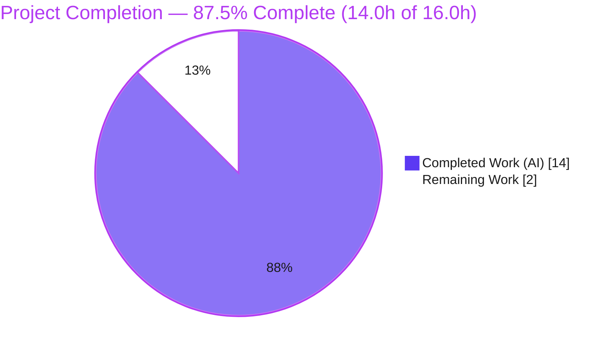
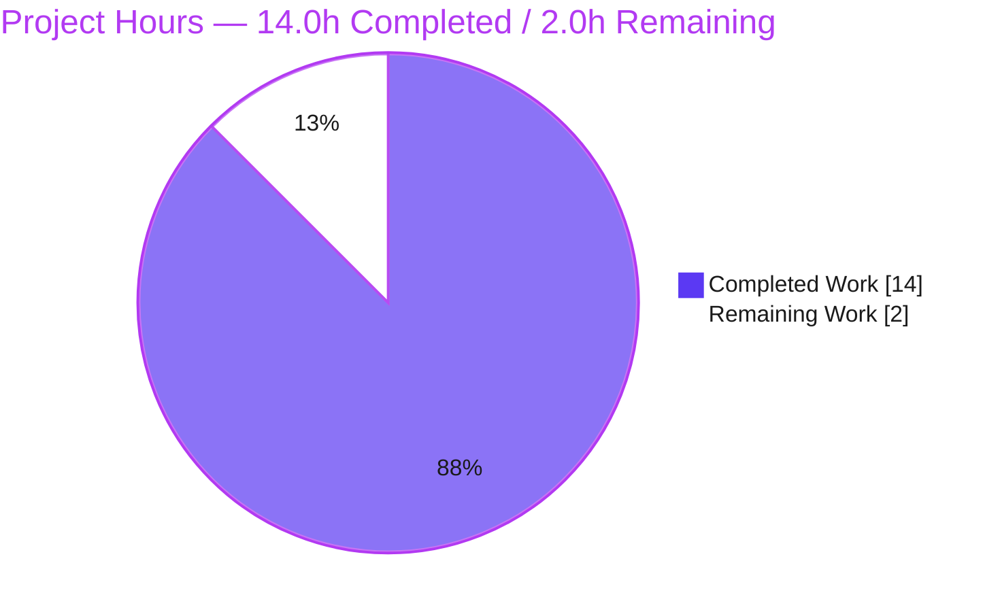
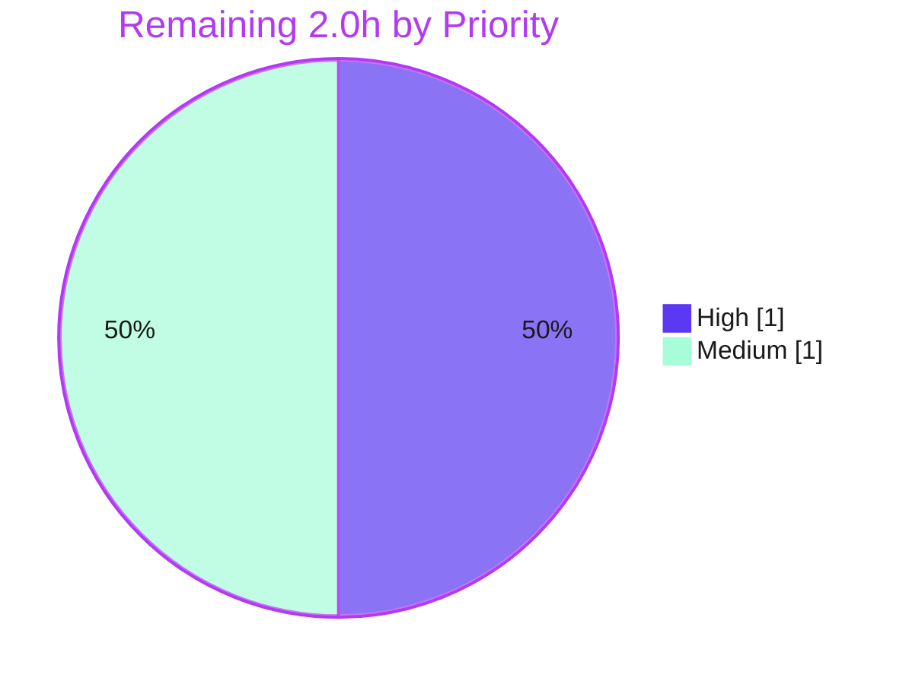

# Blitzy Project Guide

> **Project:** `hello_world` — Node.js → Express.js Tutorial Server Migration
> **Branch:** `blitzy-3d4f663b-f2df-4e73-95e2-56f6ddc64666` @ `fdfd5a2`
> **Assessment basis:** Agent Action Plan (AAP) scope + path-to-production, independently re-validated.
>
> **Brand legend:** 🟦 **Completed / AI Work** = Dark Blue `#5B39F3` · ⬜ **Remaining / Not Completed** = White `#FFFFFF` · Headings/Accents = Violet-Black `#B23AF2` · Highlight = Mint `#A8FDD9`

---

## 1. Executive Summary

### 1.1 Project Overview

This project evolves a minimal Node.js tutorial HTTP server — originally a single hard-coded `Hello, World!\n` response served via the Node core `http` module — into an **Express.js** application. It preserves the existing greeting at `GET /` byte-for-byte and adds a second endpoint, `GET /evening`, returning `Good evening`. The deliverable includes a Jest + Supertest test suite at 100% coverage and per-line source comments mandated by the user's rules. Target users are developers following the tutorial; the technical scope is a backend, loopback-bound HTTP service (`127.0.0.1:3000`) with two plain-text endpoints. Business impact: demonstrates a clean framework migration with zero behavioral regression and a complete, runnable testing strategy.

### 1.2 Completion Status



| Metric | Hours | Notes |
|--------|-------|-------|
| **Total Hours** | **16.0 h** | AAP-scoped + path-to-production only |
| 🟦 **Completed Hours (AI + Manual)** | **14.0 h** | AI/autonomous = 14.0 h · Manual = 0.0 h |
| ⬜ **Remaining Hours** | **2.0 h** | Human path-to-production gates only |
| **Percent Complete** | **87.5 %** | 14.0 ÷ 16.0 × 100 |

> **Calculation (PA1):** `Completion % = Completed ÷ (Completed + Remaining) = 14.0 ÷ (14.0 + 2.0) = 14.0 ÷ 16.0 = 87.5%`. All AAP-scoped engineering is verifiably complete; the percentage is held below 100% because human review, assumption confirmation, and merge have not yet occurred.

### 1.3 Key Accomplishments

- ✅ **Express.js 5.2.1 introduced** as a runtime dependency; lockfile regenerated (376 packages, 0 vulnerabilities).
- ✅ **Server migrated** from Node core `http` to Express, preserving the `127.0.0.1:3000` binding and startup log message.
- ✅ **`GET /` backward-compatible byte-for-byte** — `text/plain`, `Content-Length: 14`, body `Hello, World!\n` (trailing newline preserved).
- ✅ **`GET /evening` added** — `text/plain`, `Content-Length: 12`, body `Good evening`.
- ✅ **Jest + Supertest suite** — 5/5 tests pass; **100% statements / branch / functions / lines** coverage on `server.js`.
- ✅ **Per-line comments** on all JavaScript — `server.js` (19/19) and `test/server.test.js` (32/32).
- ✅ **Documentation & hygiene** — `README.md` refreshed with stack, endpoints, and run/test workflow; `.gitignore` created.
- ✅ **Independently re-validated** — `npm ci`, `node --check`, `npm test`, and live `curl` all reproduced the reported results with zero defects.

### 1.4 Critical Unresolved Issues

| Issue | Impact | Owner | ETA |
|-------|--------|-------|-----|
| _None_ — no issue blocks release of the AAP-scoped deliverable | N/A | N/A | N/A |

> No compilation errors, test failures, runtime errors, rule violations, or lockfile drift were found during autonomous validation or this independent re-validation. The only open *assumption* (not a defect) is the `/evening` path, tracked as task **HT-2** in Section 2.2 and risk **T1** in Section 6.

### 1.5 Access Issues

| System/Resource | Type of Access | Issue Description | Resolution Status | Owner |
|-----------------|----------------|-------------------|-------------------|-------|
| _None_ | — | No access issues identified | N/A | N/A |

> The project is fully self-contained (no databases, external APIs, credentials, or third-party services). `npm ci` and `npm audit` succeeded with 0 vulnerabilities against the public npm registry. **No access issues prevent build, validation, or deployment.**

### 1.6 Recommended Next Steps

1. **[High]** Review and approve the pull request (6-file diff, ~169 hand-authored lines). — *0.5 h*
2. **[High]** Confirm the `/evening` endpoint path assumption (A1) with the requester; adjust `server.js` + test + README consistently if a different path is desired. — *0.5 h*
3. **[Medium]** Run clean-environment verification: fresh clone → `npm ci` → `npm test` (5/5, 100%) → `npm start` smoke test. — *0.5 h*
4. **[Medium]** Merge `blitzy-3d4f663b-…` into `main` and delete stale worktree branches (`-w-000`, `-w-001`). — *0.5 h*

---

## 2. Project Hours Breakdown

### 2.1 Completed Work Detail

🟦 **All completed work was performed autonomously (AI). Manual hours = 0.**

| Component | Hours | Description | AAP Trace |
|-----------|-------|-------------|-----------|
| Express dependency introduction & manifest config | 2.0 | Add `express ^5.2.1` + dev `jest`/`supertest`; `start`/`test` scripts; `main` → `server.js`; regenerate `package-lock.json` | O1, A5, A6, A7 |
| Server migration: Node `http` → Express | 2.5 | `require('express')`, `const app = express()`, listener guard (`require.main === module`), `module.exports = app`, preserved host/port + startup log | O2, A4 |
| Root endpoint backward-compatibility | 1.0 | `GET /` → `res.type('text/plain').status(200).send('Hello, World!\n')`; byte/header parity with original | O3, A2, A3 |
| New `/evening` endpoint | 0.5 | `GET /evening` → `text/plain` `Good evening` | O4, A1, A3 |
| Per-line code comments | 1.0 | Explanatory comment on every JS line (`server.js` 19/19, test 32/32) | O5 (rule "04-june-rules") |
| Test suite & testing strategy | 3.0 | Jest + Supertest; 5 tests (2 happy-path + 3 edge); 100% coverage; case-sensitive routing regression; prioritized strategy | O6 (rule "Add Testing Rule IW") |
| `.gitignore` / repository hygiene | 0.5 | Ignore `node_modules/`, debug logs, `coverage/`, `.env*` | A8 |
| `README.md` documentation refresh | 1.5 | Express stack, endpoint table, routing behavior, install/run/test, examples, project structure | Documentation deliverable |
| Autonomous validation & runtime verification | 2.0 | 5 production-readiness gates: dependency install, static checks, tests, byte-exact runtime curl, commit hygiene | Path-to-production (delivered) |
| **TOTAL COMPLETED** | **14.0** | | |

> **Validation:** Sum of Hours column = **14.0 h**, which equals Completed Hours in Section 1.2. ✓

### 2.2 Remaining Work Detail

⬜ **All remaining work is human path-to-production. No AAP engineering remains.**

| Category | Hours | Priority |
|----------|-------|----------|
| Human code review & PR approval (HT-1) | 0.5 | High |
| Confirm `/evening` path assumption A1 with stakeholder (HT-2) | 0.5 | High |
| Clean-environment verification — fresh clone → `npm ci` → `npm test` → smoke (HT-3) | 0.5 | Medium |
| Merge to `main` & branch cleanup (HT-4) | 0.5 | Medium |
| **TOTAL REMAINING** | **2.0** | |

> **Validation:** Sum of Hours column = **2.0 h**, which equals Remaining Hours in Section 1.2 and the "Remaining Work" value in the Section 7 pie chart. ✓
>
> **Optional future enhancements (OUT OF AAP SCOPE — explicitly excluded from the hours math so the completion denominator is not inflated):** add `engines` field (~0.25 h), disable `X-Powered-By` (~0.25 h), CI workflow (~1–2 h), security middleware (helmet/CORS, ~2–4 h), health-check + structured logging (~2–4 h). These are listed for stakeholder awareness only and are **not** counted in the 2.0 h remaining.

### 2.3 Hours Reconciliation & Integrity Check

| Check | Expected | Actual | Status |
|-------|----------|--------|--------|
| Section 2.1 completed sum | 14.0 h | 14.0 h | ✅ |
| Section 2.2 remaining sum | 2.0 h | 2.0 h | ✅ |
| 2.1 + 2.2 = Total (Section 1.2) | 16.0 h | 16.0 h | ✅ |
| Completion % (14.0 ÷ 16.0) | 87.5 % | 87.5 % | ✅ |
| Section 1.2 Remaining = Section 2.2 = Section 7 "Remaining Work" | 2.0 h | 2.0 h | ✅ |

---

## 3. Test Results

All tests below originate exclusively from Blitzy's autonomous test-execution logs and were independently re-run during this assessment (`npm test` and `npx jest --ci --coverage`, exit 0).

| Test Category | Framework | Total Tests | Passed | Failed | Coverage % | Notes |
|---------------|-----------|-------------|--------|--------|------------|-------|
| API Happy-Path (Unit/Integration via in-process app) | Jest 30.4.2 + Supertest 7.2.2 | 2 | 2 | 0 | 100% (`server.js`) | `GET /` → 200/`text/plain`/`Hello, World!\n`; `GET /evening` → 200/`text/plain`/`Good evening` |
| Edge Cases | Jest 30.4.2 + Supertest 7.2.2 | 3 | 3 | 0 | (included above) | Unknown route → 404; `POST /` → 404 (Express default, no 405); `GET /EVENING` → 404 (case-sensitive) |
| **TOTAL** | **Jest + Supertest** | **5** | **5** | **0** | **100%** | 1 suite, ~0.75 s |

**Coverage detail (`server.js`):** 100% statements · 100% branch · 100% functions · 100% lines.

> **Transparency note:** 100% coverage is achieved in part via an `/* istanbul ignore next */` directive on the direct-execution listener block (`if (require.main === module) { app.listen(...) }`). That block is intentionally excluded from *unit* coverage because it is verified **end-to-end** through `npm start` + live `curl` (see Section 4). This is a legitimate, documented technique (commit `69f5ac5`).

---

## 4. Runtime Validation & UI Verification

**UI Verification:** ⚪ **Not Applicable** — this is a backend HTTP server with no user interface, no design system, and no Figma frames. Both endpoints return plain-text bodies consumed programmatically.

**Runtime Health & API Integration (verified live during this assessment):**

- ✅ **Server startup** — `npm start` / `node server.js` logs exactly `Server running at http://127.0.0.1:3000/`.
- ✅ **`GET /`** — HTTP 200, `Content-Type: text/plain; charset=utf-8`, `Content-Length: 14`, body bytes end `21 0A` = `!\n` → **byte-exact** `Hello, World!\n` (backward-compat A2/A3/A4).
- ✅ **`GET /evening`** — HTTP 200, `text/plain`, `Content-Length: 12`, body `Good evening` (no trailing newline).
- ✅ **`GET /does-not-exist`** — HTTP 404 (Express default not-found).
- ✅ **`POST /`** — HTTP 404 (Express does not emit 405 by default).
- ✅ **`GET /EVENING`** — HTTP 404 (case-sensitive routing enabled).
- ✅ **`GET /evening/`** — HTTP 200 (Express default non-strict trailing slash; matches README).
- ✅ **Clean shutdown** — listener released; no process left on port 3000.
- ✅ **Hermetic tests** — `require('../server')` returns the app and exits cleanly without binding the port (listener guard verified).

---

## 5. Compliance & Quality Review

| AAP Deliverable / Rule | Benchmark | Status | Progress | Evidence |
|------------------------|-----------|--------|----------|----------|
| O1 — Introduce Express `^5.2.1` | Dependency present & locked | ✅ Pass | 100% | `package.json` deps; `npm ls express@5.2.1`; lockfile v3 |
| O2 — Migrate `http` → Express | App instance + routing | ✅ Pass | 100% | `server.js`; `node --check` clean; commit `21f04a6` |
| O3 — Preserve `GET /` greeting | Byte/header parity | ✅ Pass | 100% | Runtime CL=14, bytes `21 0A`; test #1 |
| O4 — Add `GET /evening` | Returns `Good evening` | ✅ Pass | 100% | Runtime CL=12; test #2 |
| O5 — Comment every JS line | 100% line coverage by comments | ✅ Pass | 100% | `server.js` 19/19; test 32/32 |
| O6 — Testing strategy + suite | Runnable, prioritized | ✅ Pass | 100% | 5/5 tests; 100% cov; strategy in AAP §0.7 + README |
| A1 — `/evening` path | Consistent across files | ⚠ Pass (assumption) | 100% impl | Applied in 3 files; **stakeholder confirmation pending** |
| A2 — Content-Type parity | `text/plain` | ✅ Pass | 100% | `res.type('text/plain')`; runtime header |
| A4 — Host/port parity | `127.0.0.1:3000` | ✅ Pass | 100% | `server.js`; runtime |
| A5 — npm scripts | `start` + `test` real | ✅ Pass | 100% | `package.json` scripts |
| A6 — Lockfile regeneration | In sync, 0 vulns | ✅ Pass | 100% | `npm ci` 0 vulnerabilities |
| A7 — `main` → `server.js` | Optional cleanup | ✅ Pass | 100% | `package.json` `main` |
| A8 — `.gitignore` | Exclude `node_modules/` | ✅ Pass | 100% | `.gitignore` created |
| Backward compatibility | Indistinguishable `GET /` | ✅ Pass | 100% | Byte-exact runtime verification |
| Code quality (static) | `node --check` clean | ✅ Pass | 100% | Both JS files exit 0 |
| Working tree / commits | Clean & committed | ✅ Pass | 100% | `git status` empty; 10 commits |

**Fixes applied during autonomous validation:** None required — validation found zero defects; the implementation was already correct and complete.

**Outstanding items:** Stakeholder confirmation of the `/evening` path assumption (A1) — a confirmation step, not a code defect.

---

## 6. Risk Assessment

Overall posture: **LOW.** All identified risks are Low severity; most are explicit out-of-scope acceptances or already mitigated. No risk blocks release.

| Risk | Category | Severity | Probability | Mitigation | Status |
|------|----------|----------|-------------|------------|--------|
| T1 — `/evening` path assumption (A1) unconfirmed | Technical | Low | Medium | Confirm with stakeholder; trivial 3-file change if different | Open (flagged) |
| T2 — Listener block excluded from unit coverage via `istanbul ignore next` | Technical | Low | Low | Verified end-to-end via `npm start` + curl; documented in code + commit `69f5ac5` | Mitigated / Accepted |
| T3 — `express ^5.2.1` caret could resolve newer 5.x | Technical | Low | Low | `package-lock.json` pins exact tree; use `npm ci` | Mitigated |
| S1 — No security middleware (helmet/CORS/rate-limit) | Security | Low | Low | Out of AAP scope; loopback-only binding limits exposure | Accepted (out of scope) |
| S2 — `X-Powered-By: Express` header exposed | Security | Low | Low | `app.disable('x-powered-by')` if hardening (out of scope) | Accepted (out of scope) |
| S3 — Dependency vulnerabilities | Security | Low | Low | `npm audit` = 0 vulnerabilities; keep deps current | Mitigated |
| O1 — No process manager/health endpoint/structured logging | Operational | Low | Low | Out of AAP scope (tutorial); add if productionizing | Accepted (out of scope) |
| O2 — Loopback-only binding not externally reachable | Operational | Low | Low | By design (backward-compat A4) | Accepted (by design) |
| O3 — No CI/CD; tests run manually | Operational | Low | Low | Out of AAP scope; optional GitHub Actions later | Accepted (out of scope) |
| I1 — Node version variance (env 20 vs validator 22; README "20+") | Integration | Low | Low | CommonJS + Express 5 run on both; optionally add `engines` field | Mitigated |
| I2 — No external service integrations | Integration | Low | — | Zero integration surface | N/A |

---

## 7. Visual Project Status

**Project Hours Breakdown** (🟦 Completed `#5B39F3` · ⬜ Remaining `#FFFFFF`):



**Remaining Work by Priority** (High 1.0 h · Medium 1.0 h · total 2.0 h):



| Priority | Remaining Hours | Tasks |
|----------|-----------------|-------|
| High | 1.0 | Code review (HT-1), confirm `/evening` (HT-2) |
| Medium | 1.0 | Clean-env verification (HT-3), merge to main (HT-4) |
| **Total** | **2.0** | — |

> **Integrity:** Pie "Remaining Work" = 2.0 h = Section 1.2 Remaining = Section 2.2 total. ✓

---

## 8. Summary & Recommendations

**Achievements.** The project is **87.5% complete (14.0 h of 16.0 h)**. Every AAP objective (O1–O6) and every implicit requirement (A1–A8) is implemented and independently verified. The Node `http` → Express migration is complete with **byte-exact backward compatibility** on `GET /`, a working `GET /evening` endpoint, a 100%-coverage Jest + Supertest suite, per-line comments on all JavaScript, refreshed documentation, and clean repository hygiene. Independent re-validation reproduced all five production-readiness gates with **zero defects**.

**Remaining gaps.** The outstanding **2.0 h** is entirely human path-to-production: PR review, confirming the `/evening` path assumption (A1), clean-environment verification, and merging to `main`. There is no remaining engineering work within the AAP scope.

**Critical path to production.** (1) Approve the PR → (2) confirm the `/evening` path → (3) verify on a clean checkout → (4) merge to `main`. Expected effort: ~2.0 h.

**Success metrics (all met):** 5/5 tests pass · 100% coverage · 0 vulnerabilities · byte-exact `GET /` · 0 defects.

**Production-readiness assessment.** For the AAP-defined scope, the deliverable is **production-ready** and awaiting human review/merge. Items such as security middleware, HTTPS, CI/CD, containerization, and observability are **explicitly out of scope** and intentionally not addressed; adopt them separately if/when the service is exposed beyond loopback.

| Metric | Value |
|--------|-------|
| Completion | 87.5% (14.0 h / 16.0 h) |
| Remaining (human) | 2.0 h |
| Tests | 5/5 pass, 100% coverage |
| Vulnerabilities | 0 |
| Defects found | 0 |
| Overall risk | Low |

---

## 9. Development Guide

All commands below were tested during this assessment and are copy-pasteable.

### 9.1 System Prerequisites

- **Node.js 20 or newer** (verified on `v20.20.2`; validator used `v22.x` — both work).
- **npm** (verified on `10.8.2`).
- **OS:** any platform with Node (verified on Windows Server 2022).
- **No build/compile step** — plain CommonJS.

```bash
node --version    # expect v20.x or newer
npm --version     # expect 10.x or newer
```

### 9.2 Environment Setup

No environment variables are required. The host/port are constants (`127.0.0.1:3000`) in `server.js`. A `.env*` pattern is gitignored as a convention but is unused.

### 9.3 Dependency Installation

```bash
# Reproducible install from the lockfile (recommended for clean checkouts / CI):
npm ci
# → "added 375 packages, and audited 376 packages"
# → "found 0 vulnerabilities"

# Alternatively, a standard install:
npm install
```

> A benign warning `npm warn deprecated glob@10.5.0 …` may appear — it is a transitive dependency, **not** a vulnerability, and is safe to ignore.

### 9.4 Application Startup

```bash
npm start
# Runs: node server.js
# Logs: Server running at http://127.0.0.1:3000/
```

The server runs in the foreground; stop it with `Ctrl+C`.

### 9.5 Verification

```bash
# Run the test suite (expect 5 passed, 100% coverage):
npm test

# Full coverage report:
npx jest --coverage
```

With the server running, in a second terminal:

```bash
curl -i http://127.0.0.1:3000/          # 200, text/plain, "Hello, World!\n"
curl -i http://127.0.0.1:3000/evening   # 200, text/plain, "Good evening"
curl -i http://127.0.0.1:3000/missing   # 404
curl -i -X POST http://127.0.0.1:3000/  # 404
```

### 9.6 Example Usage

```bash
$ curl http://127.0.0.1:3000/
Hello, World!

$ curl http://127.0.0.1:3000/evening
Good evening
```

### 9.7 Troubleshooting

- **`EADDRINUSE` on port 3000** — another process owns the port. Identify and stop it (Linux/macOS: `lsof -i :3000`; Windows: `netstat -ano | findstr :3000` then stop the PID), or change the port constant in `server.js`.
- **`Cannot find module 'express'` / `'supertest'`** — dependencies not installed; run `npm ci` (or `npm install`).
- **`glob@10.5.0` deprecation warning** — benign transitive dependency; ignore.
- **Node version errors** — upgrade to Node 20+; Express 5 and the toolchain target Node 20+.
- **Tests hang / watch mode** — the suite runs once by default; in CI set `CI=true` (e.g., `CI=true npm test`).

---

## 10. Appendices

### A. Command Reference

| Command | Purpose |
|---------|---------|
| `npm ci` | Reproducible install from `package-lock.json` |
| `npm install` | Standard dependency install |
| `npm start` | Start the server (`node server.js`) |
| `npm test` | Run the Jest suite |
| `npx jest --coverage` | Run tests with a coverage report |
| `node --check server.js` | Static syntax check (no build step exists) |
| `curl -i http://127.0.0.1:3000/` | Verify the root endpoint |
| `curl -i http://127.0.0.1:3000/evening` | Verify the evening endpoint |
| `netstat -ano \| findstr :3000` | Find the listener PID (Windows) |

### B. Port Reference

| Port | Protocol | Bind Address | Purpose |
|------|----------|--------------|---------|
| 3000 | HTTP | `127.0.0.1` (loopback only) | Express application server |

### C. Key File Locations

| File | Role |
|------|------|
| `server.js` | Express application: both routes, export, listener guard (19 commented lines) |
| `test/server.test.js` | Jest + Supertest suite (5 tests, 32 commented lines) |
| `package.json` | Manifest: dependencies, `start`/`test` scripts, `main` |
| `package-lock.json` | Locked dependency tree (`lockfileVersion 3`, 376 packages) |
| `.gitignore` | Excludes `node_modules/`, debug logs, `coverage/`, `.env*` |
| `README.md` | Stack, endpoints, install/run/test docs |

### D. Technology Versions

| Component | Version |
|-----------|---------|
| Node.js | ≥ 20 (verified `v20.20.2`) |
| npm | `10.8.2` |
| express | `5.2.1` (declared `^5.2.1`) |
| jest | `30.4.2` (declared `^30.4.2`, dev) |
| supertest | `7.2.2` (declared `^7.2.2`, dev) |
| Module system | CommonJS |
| Lockfile | `lockfileVersion 3`, 376 packages, 0 vulnerabilities |

### E. Environment Variable Reference

| Variable | Required? | Notes |
|----------|-----------|-------|
| _none_ | No | Host/port are constants in `server.js`. `CI=true` is optional for non-interactive test runs. `.env*` is gitignored by convention but unused. |

### F. Developer Tools Guide

| Tool | Use |
|------|-----|
| `node --check <file>` | Static gate (project has no linter/transpiler by design) |
| Jest (`--coverage`) | Test execution and coverage reporting |
| Supertest | In-process HTTP assertions against the exported `app` (no port binding) |
| `curl` | Manual endpoint verification |
| `netstat` / `lsof` | Locate/free the listener port |
| `git log` / `git diff` | Review the 10-commit history and 6-file diff |

### G. Glossary

| Term | Definition |
|------|------------|
| **Express** | Minimal Node.js web framework providing the app instance, routing, and `res.send`. |
| **Supertest** | Library for issuing HTTP requests against an Express app in-process, without binding a network port. |
| **Jest** | JavaScript test runner used for the unit/integration suite and coverage. |
| **CommonJS** | Node's `require`/`module.exports` module system (this project's convention). |
| **`require.main === module` guard** | Pattern that starts the listener only when the file is run directly, keeping imports (tests) hermetic. |
| **`istanbul ignore next`** | Coverage directive excluding a block (here, the E2E-verified listener) from instrumented coverage. |
| **Byte-exact** | Response body and headers identical at the byte level to the original (`Hello, World!\n`, `text/plain`). |
| **Loopback** | The `127.0.0.1` interface, reachable only from the local machine. |
| **Non-strict routing** | Express default where `/evening` and `/evening/` both match the same route. |

---

*Generated by the Blitzy Platform. All hours and percentages are AAP-scoped (PA1 methodology); out-of-scope items are excluded from the completion denominator. Cross-section integrity (Rules 1–5) validated prior to submission.*