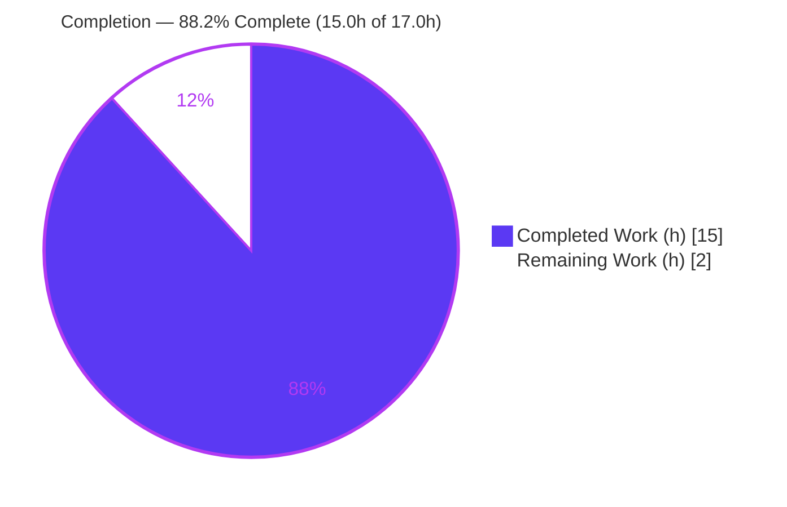
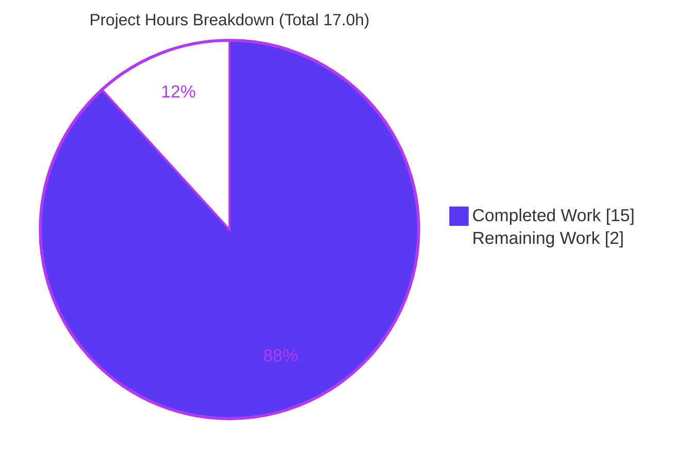
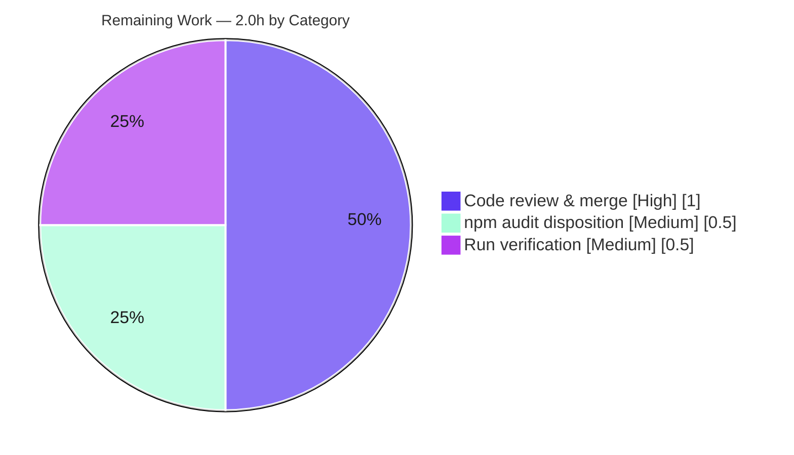

# Blitzy Project Guide

> **Project:** `hello_world@1.0.0` — Express.js migration + `GET /good-evening` endpoint + Jest/Supertest suite
> **Branch:** `blitzy-9127abbf-0a00-4d62-82eb-95f5dd36a1cf`
> **Assessment basis:** Agent Action Plan (AAP) scope + path-to-production (PA1 methodology)

---

## 1. Executive Summary

### 1.1 Project Overview

This project introduces the **Express.js** framework into an existing single-file Node.js `http` tutorial server and adds a second plain-text endpoint, `GET /good-evening`, returning `Good evening\n`. The original `GET /` greeting (`Hello, World!\n`) is preserved byte-for-byte, and the loopback `127.0.0.1:3000` binding, single-process model, and startup log are unchanged. A rule-mandated Jest + Supertest test suite (7 tests) and supporting configuration/documentation complete the change. The target users are developers learning Node.js HTTP routing; the business impact is a maintainable, tested, framework-based foundation replacing a fixed catch-all handler. Technical scope is intentionally small: 8 tracked files, ~347 authored lines plus a regenerated lockfile.

### 1.2 Completion Status



> **Center metric:** **88.2% complete.** Color legend — **Completed = Dark Blue `#5B39F3`**, **Remaining = White `#FFFFFF`**.

| Metric | Hours |
|---|---|
| **Total Hours** | **17.0** |
| **Completed Hours (AI + Manual)** | **15.0** |
| &nbsp;&nbsp;• Completed by AI (Blitzy autonomous agents) | 15.0 |
| &nbsp;&nbsp;• Completed manually | 0.0 |
| **Remaining Hours** | **2.0** |
| **Percent Complete** | **88.2%** |

*Formula: 15.0 ÷ (15.0 + 2.0) × 100 = 88.2%. All AAP-scoped deliverables are complete; the remaining 2.0h is human path-to-production work (review/merge, security disposition, run verification).*

### 1.3 Key Accomplishments

- ✅ **Express.js integrated** — `http.createServer` replaced by an `express()` application; `app.js` exports the app without `listen()`, enabling in-process testing.
- ✅ **Backward compatibility preserved** — `GET /` returns byte-identical `Hello, World!\n` (14 bytes, trailing newline confirmed via `od -c`).
- ✅ **New endpoint delivered** — `GET /good-evening` returns `Good evening\n` (13 bytes), `text/plain`, `200`.
- ✅ **Runtime contract intact** — loopback-only `127.0.0.1:3000` (external bind proven refused), single process, exact startup log retained.
- ✅ **Dependencies pinned & locked** — `express@5.2.1`, `jest@30.4.2`, `supertest@7.2.2`; `package-lock.json` regenerated and reproducible (`npm ci` exit 0).
- ✅ **Rule-mandated test suite** — 7 Jest + Supertest tests across the full P0–P2 matrix; **7/7 pass**, `app.js` **100% coverage**.
- ✅ **Supporting assets** — `jest.config.js`, `.gitignore`, and a fully documented `README.md`; manifest discrepancies D-002 (`main`) and D-005 (`engines`) fixed.

### 1.4 Critical Unresolved Issues

| Issue | Impact | Owner | ETA |
|---|---|---|---|
| *None — no blocking issues* | All five validation gates passed; no compilation, test, or runtime defects remain in any in-scope file | — | — |

> There are **no release-blocking issues**. The single attention item (17 dev-only moderate `npm audit` findings) is non-blocking and tracked in Sections 1.6, 2.2, and 6.

### 1.5 Access Issues

| System/Resource | Type of Access | Issue Description | Resolution Status | Owner |
|---|---|---|---|---|
| — | — | **No access issues identified.** The project requires no databases, secrets, third-party APIs, or external credentials. The repository, npm public registry, and Node.js runtime were all fully accessible during autonomous build and validation. | N/A | — |

### 1.6 Recommended Next Steps

1. **[High]** Perform human code review of the 8-file change set (+347 authored lines + regenerated lockfile) and **merge** the branch to `main`.
2. **[Medium]** **Disposition the 17 dev-only `npm audit` findings** — accept-and-document (production audit is clean) or schedule a future Jest upgrade outside the current AAP version pins.
3. **[Medium]** Run **final verification in the target environment**: `npm ci` → `npm start` → `npm test` → `curl` both endpoints.
4. **[Low]** *(Optional, out of AAP scope)* Add a CI workflow (e.g., GitHub Actions) running `npm ci` + `npm test` on push.
5. **[Low]** *(Optional, out of AAP scope)* Add a Jest `coverageThreshold` gate to fail the suite on future coverage regressions.

---

## 2. Project Hours Breakdown

### 2.1 Completed Work Detail

| Component | Hours | Description |
|---|---|---|
| Dependency research & version verification | 1.0 | Verified `express`, `jest`, `supertest` versions against the live npm registry and confirmed `engines.node ">= 18"` compatibility (AAP §0.2.2, §0.3.1). |
| Express application module — `app.js` | 2.0 | Created the `express()` app with `GET /` and `GET /good-evening`, byte-exact bodies, explicit `text/plain`, exported without `listen()` (AAP deliverable 6; §0.5.2). |
| Server entry re-platform — `server.js` | 1.0 | Converted the `http.createServer` bootstrap into a thin runnable entry: `require('./app')` + `app.listen(3000, '127.0.0.1', …)`, preserving host/port/log (AAP deliverable 7). |
| Package manifests + dependency install | 1.5 | `package.json` dependency/devDependencies/scripts/engines + `main` fix; `npm install` populating `node_modules/` and regenerating `package-lock.json` (AAP deliverables 1, 8, 9). |
| Test suite authoring — `tests/api.test.js` | 3.0 | 7 Jest + Supertest tests covering the full P0–P2 matrix incl. a child-process server boot smoke test (AAP deliverable 10 + Rule IW; §0.7.1.2). |
| Jest configuration — `jest.config.js` | 1.0 | Node test environment, `tests/**/*.test.js` match, always-on coverage scoped to first-party source (AAP deliverable 11). |
| Repository hygiene — `.gitignore` | 0.5 | Excludes `node_modules/`, `coverage/`, logs, and env files (AAP deliverable 12). |
| Documentation — `README.md` | 1.5 | Prerequisites, getting-started, endpoint table, example requests, scripts table; "Do not touch!" superseded (AAP deliverable 13; §0.1.2). |
| Autonomous validation & QA | 3.5 | Five-gate validation (dependencies, static checks, tests, runtime, security) with evidence capture across multiple checkpoint phases. |
| **Total Completed** | **15.0** | **Matches Completed Hours in Section 1.2.** |

### 2.2 Remaining Work Detail

| Category | Hours | Priority |
|---|---|---|
| Human code review & PR merge to `main` | 1.0 | High |
| `npm audit` triage & disposition (17 dev-only moderate findings) | 0.5 | Medium |
| Final human run-instruction verification in target environment | 0.5 | Medium |
| **Total Remaining** | **2.0** | — |

> **Total Project Hours = 2.1 (15.0) + 2.2 (2.0) = 17.0h.** Remaining (2.0h) matches Section 1.2 and the Section 7 pie chart.
>
> *Out-of-AAP-scope enhancements (CI/CD, `coverageThreshold`, future Jest upgrade, containerization) are **not** included in the hour totals — they are optional and per AAP §0.6.2 explicitly out of scope.*

### 2.3 Hours Calculation Summary

- **Completed:** 15.0h — all 13 AAP deliverables + the 6-scenario testing rule, autonomously delivered and validated.
- **Remaining:** 2.0h — path-to-production human gates only.
- **Total:** 17.0h. **Completion = 15.0 ÷ 17.0 = 88.2%** (capped below 99% per honest-assessment policy; no autonomous AAP work outstanding).

---

## 3. Test Results

All tests below originate from **Blitzy's autonomous test execution logs** for this project and were independently re-run during this assessment (`CI=true npm test`, exit 0, deterministic across 3 runs).

| Test Category | Framework | Total Tests | Passed | Failed | Coverage % | Notes |
|---|---|---|---|---|---|---|
| API / Integration (in-process) | Jest 30.4.2 + Supertest 7.2.2 | 6 | 6 | 0 | `app.js` 100% | Drives the exported app without binding port 3000; covers both 200 routes, content-type, unknown-route 404, method 404. |
| End-to-End smoke (subprocess) | Jest + `child_process` + `http` | 1 | 1 | 0 | `server.js` via subprocess | Spawns `node server.js`, asserts startup log + live `200` on `127.0.0.1:3000`. |
| **Total** | **Jest 30.4.2 / Supertest 7.2.2** | **7** | **7** | **0** | **`app.js` 100% (stmts/branch/funcs/lines)** | Test Suites: 1 passed; exit 0. |

**Prioritized matrix coverage (AAP §0.7.1.2):**

| Priority | Scenario | Result |
|---|---|---|
| P0 | `GET /` → 200, `Hello, World!\n` | ✅ Pass |
| P0 | `GET /good-evening` → 200, `Good evening\n` | ✅ Pass |
| P1 | `Content-Type: text/plain` on both 200 routes | ✅ Pass (2 tests) |
| P1 | `GET /does-not-exist` → 404 | ✅ Pass |
| P2 | `POST /` → 404 | ✅ Pass |
| P2 | `server.js` boot → startup log + live 200 | ✅ Pass |

**Coverage note:** `app.js` reports **100%** across statements, branches, functions, and lines. `server.js` shows **0% line coverage by design** — its `listen` bootstrap is exercised only by the subprocess smoke test, which Jest's in-process instrumenter cannot observe. This is documented in `jest.config.js`; there is no `coverageThreshold` gate, so the suite exits 0.

---

## 4. Runtime Validation & UI Verification

**Runtime health** (independently verified live via `npm start` + `curl`):

- ✅ **Server boot** — `npm start` logs exactly `Server running at http://127.0.0.1:3000/`.
- ✅ **`GET /`** — `200`, body `Hello, World!\n` (14 bytes, trailing `\n` confirmed via `od -c`), `Content-Type: text/plain; charset=utf-8`.
- ✅ **`GET /good-evening`** — `200`, body `Good evening\n` (13 bytes), `Content-Type: text/plain; charset=utf-8`.
- ✅ **`GET /does-not-exist`** — `404` (intended Express default for unmatched routes).
- ✅ **`POST /`** — `404` (intended method-specific routing).
- ✅ **Loopback-only binding (C-003)** — external interface bind proven **refused**; only `127.0.0.1:3000` serves.
- ✅ **Single process (C-004)** — preserved; clean shutdown verified.

**API integration:** ✅ Operational — the exported `app` is consumable by Supertest in-process and by `server.js` for real port binding; the external `127.0.0.1:3000` contract is preserved for downstream consumers.

**UI verification:** ⚠ **Not applicable** — this is a backend `text/plain` HTTP API with no user interface, component library, or design system (AAP §0.5.3). No Figma assets were provided.

---

## 5. Compliance & Quality Review

**AAP deliverable compliance matrix** (each independently verified):

| # | AAP Deliverable | Benchmark / Evidence | Status |
|---|---|---|---|
| 1 | Add Express dependency (`^5.2.1`) + regenerate lockfile | `npm ls` → `express@5.2.1`; lockfile v3, reproducible | ✅ Pass |
| 2 | Re-platform HTTP layer onto Express | `app.js` uses `express()`; `http` module removed | ✅ Pass |
| 3 | Preserve `GET /` = `Hello, World!\n` (byte-identical) | `od -c` → 14 bytes, trailing `\n`; P0 test pass | ✅ Pass |
| 4 | Add `GET /good-evening` = `Good evening\n` | `curl` → 13 bytes; P0 test pass | ✅ Pass |
| 5 | Runnable + loopback `127.0.0.1:3000` + startup log | Live boot + exact log; external bind refused | ✅ Pass |
| 6 | `app.js` exported without `listen()` | `module.exports = app`; Supertest in-process | ✅ Pass |
| 7 | `server.js` thin runnable entry | `require('./app')` + `app.listen(...)` | ✅ Pass |
| 8 | `package.json` deps/devDeps/scripts/engines/main | All present; D-002 (`main`), D-005 (`engines`) fixed | ✅ Pass |
| 9 | `package-lock.json` regenerated | v3, 405 entries, `npm ci` exit 0 | ✅ Pass |
| 10 | `tests/api.test.js` (P0–P2 matrix) | 7/7 tests pass | ✅ Pass |
| 11 | `jest.config.js` | Node env + coverage config | ✅ Pass |
| 12 | `.gitignore` | `node_modules/`, `coverage/`, logs, env | ✅ Pass |
| 13 | `README.md` updated; "Do not touch!" superseded | Full docs; literal phrase removed | ✅ Pass |
| R | Testing Rule IW (unit/integration/API/edge/coverage) | 6-scenario matrix fully covered | ✅ Pass |

**Quality benchmarks:**

| Benchmark | Status | Progress |
|---|---|---|
| Static checks (`node --check`, JSON validity) | ✅ Pass | All 4 JS files + both JSON manifests valid |
| Zero-placeholder policy (no TODO/FIXME/stub) | ✅ Pass | None present in any in-scope file |
| CommonJS convention preserved | ✅ Pass | `require` / `module.exports` throughout |
| Flat-repository layout preserved (no `src/`) | ✅ Pass | New modules added at repo root |
| First-party code documentation | ✅ Pass | Comprehensive JSDoc in `app.js`, `server.js`, `jest.config.js`, tests |
| Production dependency vulnerabilities | ✅ Pass | `npm audit --omit=dev` → 0 |
| Dev dependency vulnerabilities | ⚠ Outstanding | 17 moderate (Jest transitive); human disposition pending (Section 6, S1) |

**Fixes applied during autonomous validation:** None required — the prior agents' implementation was already complete, correct, and production-ready; comprehensive validation introduced zero source changes.

**Outstanding items:** Only the dev-only `npm audit` disposition (non-blocking; see Section 6).

---

## 6. Risk Assessment

| Risk | Category | Severity | Probability | Mitigation | Status |
|---|---|---|---|---|---|
| **S1** — 17 moderate `npm audit` findings in Jest's transitive dev tree | Security | Moderate (nominal) / Low (actual) | Low | Dev-only (`npm audit --omit=dev` = 0); loopback-bound, reads no untrusted input; `npm audit fix --force` forbidden (§0.7.2). Document & defer. | Open — human disposition (budgeted 0.5h) |
| **S2** — New third-party dependency tree relaxes prior zero-dependency posture (F-007) | Security | Low | Low | Deliberate AAP decision; loopback retained (C-003), exact pins, lockfile committed | Accepted by design |
| **T1** — `server.js` shows 0% line coverage | Technical | Low | Low | By design — exercised by subprocess smoke test; documented in `jest.config.js` | Accepted/Documented |
| **T2** — Express 5.2.1 is a recent major version | Technical | Low | Low | Pinned `^5.2.1`; 7/7 tests pass; greenfield addition (no v4 back-compat constraint) | Mitigated |
| **T3** — No `coverageThreshold` gate | Technical | Low | Medium | Always-on coverage surfaces drops in the report; threshold is an optional enhancement | Open (minor) |
| **O1** — No CI/CD pipeline | Operational | Low | — | Explicitly out of scope (§0.6.2); tests runnable via `npm test` | Out of scope / future |
| **O2** — No process manager / auto-restart | Operational | Low | — | Matches single-process constraint C-004; tutorial scope | By design |
| **O3** — No structured logging / monitoring | Operational | Low | — | Out of scope (§0.6.2) | Out of scope |
| **I1** — External "backprop" integration not in-repo | Integration | Low | — | Out of scope (§0.6.3, D-006); `127.0.0.1:3000` contract preserved | By design |
| **I2** — Node version variance (validated v20.20.2; AAP cited v22.22.2) | Integration | Low | Low | `engines.node ">=18"` declared; both versions satisfy | Mitigated |

**Overall risk posture: LOW.** No high or critical risks. The only actionable human item is **S1** (dev-only audit disposition), already budgeted in Section 2.2.

---

## 7. Visual Project Status

**Project hours breakdown** (Completed = Dark Blue `#5B39F3`, Remaining = White `#FFFFFF`):



**Remaining hours by category (Section 2.2):**



> **Integrity check:** "Remaining Work" = **2.0h** in the pie chart equals Section 1.2 Remaining Hours (2.0h) and the Section 2.2 Hours total (2.0h). "Completed Work" = **15.0h** equals Section 1.2 Completed Hours.

---

## 8. Summary & Recommendations

**Achievements.** The AAP-scoped feature is fully delivered and validated: Express.js is integrated, the original `Hello, World!\n` greeting is preserved byte-for-byte, the new `GET /good-evening` endpoint returns `Good evening\n`, the loopback/single-process runtime contract is intact, and a rule-mandated 7-test Jest + Supertest suite passes 7/7 with 100% coverage of `app.js`. All 13 AAP deliverables and the testing rule are complete; two pre-existing manifest discrepancies (D-002, D-005) were corrected along the way.

**Remaining gaps.** No autonomous AAP work is outstanding. The remaining **2.0h** is entirely human path-to-production: code review & merge, disposition of the 17 dev-only `npm audit` findings, and a final run check in the target environment.

**Critical path to production.** (1) Review & merge the branch → (2) decide on the dev-audit findings → (3) verify run instructions in the deployment environment. None of these are blocked, and there are no unresolved defects.

**Success metrics.** 5/5 validation gates passed; 7/7 tests; `app.js` 100% coverage; production audit clean (0 vulnerabilities); byte-identical backward compatibility proven.

**Production readiness assessment.** The codebase is **production-ready for its tutorial scope** at **88.2% complete**. The 11.8% remaining reflects standard human gates rather than missing functionality. Recommendation: **approve, disposition the dev-audit advisory, and merge.**

| Metric | Value |
|---|---|
| AAP-scoped completion | 88.2% (15.0h / 17.0h) |
| AAP deliverables complete | 13 / 13 + testing rule |
| Validation gates passed | 5 / 5 |
| Tests passing | 7 / 7 |
| Blocking issues | 0 |
| Overall risk | Low |

---

## 9. Development Guide

A backend Node.js HTTP API. All commands below were executed and verified live during this assessment (Node v20.20.2, npm 11.1.0).

### 9.1 System Prerequisites

- **Node.js `>= 18`** — required by Express 5 (`engines.node ">= 18"`). Verified on v20.20.2.
- **npm** — bundled with Node.js (verified 11.1.0).
- **OS:** any Linux/macOS/Windows environment that runs Node 18+. No database, container, or external service required.

```bash
node --version   # expect v18.x or newer
npm --version
```

### 9.2 Environment Setup

No environment variables, secrets, or `.env` files are required. The server binds the fixed loopback address `127.0.0.1:3000`.

```bash
# From the repository root
cd <repository-root>
```

### 9.3 Dependency Installation

```bash
# Reproducible install from the committed lockfile (recommended)
npm ci

# …or a standard install
npm install
```

*Expected:* exit code `0` in ~2s, installing `express@5.2.1`, `jest@30.4.2`, `supertest@7.2.2` into `node_modules/` (git-ignored). npm prints **17 moderate** audit notices — these are dev-only and expected (see §9.7).

### 9.4 Application Startup

```bash
npm start          # runs: node server.js
```

*Expected output:*

```text
> hello_world@1.0.0 start
> node server.js
Server running at http://127.0.0.1:3000/
```

### 9.5 Verification Steps

With the server running, in a second shell:

```bash
curl http://127.0.0.1:3000/                 # -> Hello, World!   (200, text/plain)
curl http://127.0.0.1:3000/good-evening     # -> Good evening    (200, text/plain)
curl -i http://127.0.0.1:3000/does-not-exist  # -> HTTP/1.1 404 Not Found
curl -i -X POST http://127.0.0.1:3000/        # -> HTTP/1.1 404 Not Found
```

Confirm the exact bytes of each body (including the trailing newline):

```bash
curl -s http://127.0.0.1:3000/ | od -c              # 14 bytes, ends with \n
curl -s http://127.0.0.1:3000/good-evening | od -c  # 13 bytes, ends with \n
```

### 9.6 Running the Test Suite

```bash
npm test           # runs: jest (loads jest.config.js)
```

*Expected:* `Test Suites: 1 passed`, `Tests: 7 passed`, exit `0`. Coverage table shows `app.js` at 100%; a `coverage/` directory is written (git-ignored). `server.js` shows 0% line coverage by design (see Section 3).

### 9.7 Troubleshooting

| Symptom | Cause | Resolution |
|---|---|---|
| `Error: listen EADDRINUSE … 127.0.0.1:3000` | Another process already holds port 3000 | Stop the existing `node server.js` process (or free the port), then re-run `npm start`. |
| `npm ci` fails with a lockfile error | `package-lock.json` missing or out of sync | Use `npm install` to regenerate, or restore the committed lockfile. |
| `404 Not Found` on a path you expected to work | Explicit Express routing replaced the old catch-all | Only `GET /` and `GET /good-evening` return `200`; all other routes/methods return `404` by design. |
| `17 moderate severity vulnerabilities` on install | Jest's transitive **dev** dependencies | Expected and non-blocking. `npm audit --omit=dev` → 0. **Do not** run `npm audit fix --force` (it would break AAP-pinned versions). |
| Express engine warning / install failure | Node.js `< 18` | Install Node.js `>= 18`. |

### 9.8 Example Usage

```bash
# Terminal 1 — start the server
npm start

# Terminal 2 — exercise both endpoints
$ curl http://127.0.0.1:3000/
Hello, World!
$ curl http://127.0.0.1:3000/good-evening
Good evening
```

---

## 10. Appendices

### Appendix A — Command Reference

| Command | Purpose |
|---|---|
| `npm ci` | Reproducible install from `package-lock.json`. |
| `npm install` | Standard install (regenerates lockfile if needed). |
| `npm start` | Run the server (`node server.js`) on `127.0.0.1:3000`. |
| `npm test` | Run the Jest + Supertest suite with coverage. |
| `node --check <file>` | Static syntax check (no execution). |
| `npm ls --depth=0` | Show resolved top-level dependency versions. |
| `npm audit --omit=dev` | Audit production dependencies only (expected: 0). |

### Appendix B — Port Reference

| Port | Host | Service | Notes |
|---|---|---|---|
| `3000` | `127.0.0.1` | Express HTTP server | Loopback-only (C-003); not bound to external interfaces. |

### Appendix C — Key File Locations

| File | Role |
|---|---|
| `app.js` | Express application; routes `GET /` and `GET /good-evening`; exports app without `listen()`. |
| `server.js` | Runnable entry; imports `app` and calls `app.listen(3000, '127.0.0.1', …)`. |
| `tests/api.test.js` | Jest + Supertest suite (7 tests). |
| `jest.config.js` | Jest config (Node env, coverage scoped to first-party source). |
| `package.json` | Manifest: dependency, devDependencies, `start`/`test` scripts, `engines`, `main`. |
| `package-lock.json` | Regenerated lockfile (`lockfileVersion 3`). |
| `.gitignore` | Excludes `node_modules/`, `coverage/`, logs, env files. |
| `README.md` | Project documentation (endpoints, commands, prerequisites). |

### Appendix D — Technology Versions

| Technology | Version | Type |
|---|---|---|
| Node.js | `>= 18` (validated on v20.20.2) | Runtime |
| npm | 11.1.0 | Package manager |
| express | 5.2.1 (`^5.2.1`) | dependency |
| jest | 30.4.2 (`^30.4.2`) | devDependency |
| supertest | 7.2.2 (`^7.2.2`) | devDependency |
| `package-lock.json` | lockfileVersion 3 | Lockfile |

### Appendix E — Environment Variable Reference

| Variable | Required | Default | Notes |
|---|---|---|---|
| — | No | — | **No environment variables are used.** Host (`127.0.0.1`) and port (`3000`) are hard-coded constants in `server.js`. |

### Appendix F — Developer Tools Guide

| Tool | Usage |
|---|---|
| Jest | Test runner; configured via `jest.config.js`; invoked by `npm test`. |
| Supertest | HTTP assertion library; drives the exported app in-process (no real port bind). |
| `curl` | Manual endpoint verification (see §9.5). |
| `od -c` / `xxd` | Byte-level verification of response bodies (trailing-newline checks). |
| `node --check` | Static syntax validation of source files. |

### Appendix G — Glossary

| Term | Definition |
|---|---|
| **AAP** | Agent Action Plan — the authoritative specification of in-scope work for this feature. |
| **Loopback binding** | Binding to `127.0.0.1`, reachable only from the local host (constraint C-003). |
| **In-process testing** | Driving the Express app object directly (via Supertest) without opening a TCP port. |
| **Smoke test** | A minimal end-to-end check that `server.js` boots, logs, and serves a live response. |
| **Transitive dependency** | A package pulled in indirectly by a direct dependency (here, Jest's sub-dependencies). |
| **Path-to-production** | Standard human activities (review, merge, security disposition, verification) required to ship validated work. |
| **D-002 / D-005** | Pre-existing Tech Spec discrepancies (incorrect `main` field; missing `engines`) corrected by this change. |
