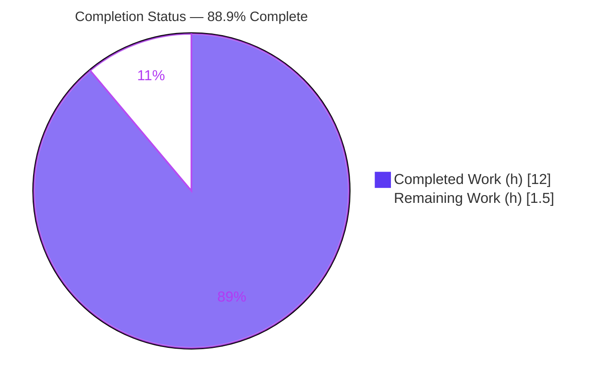
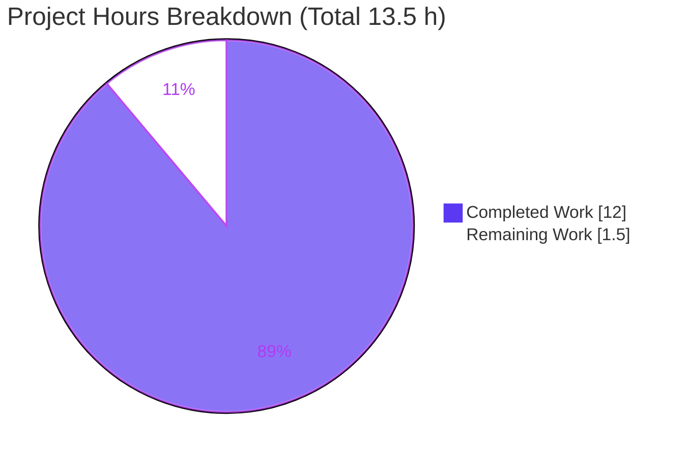
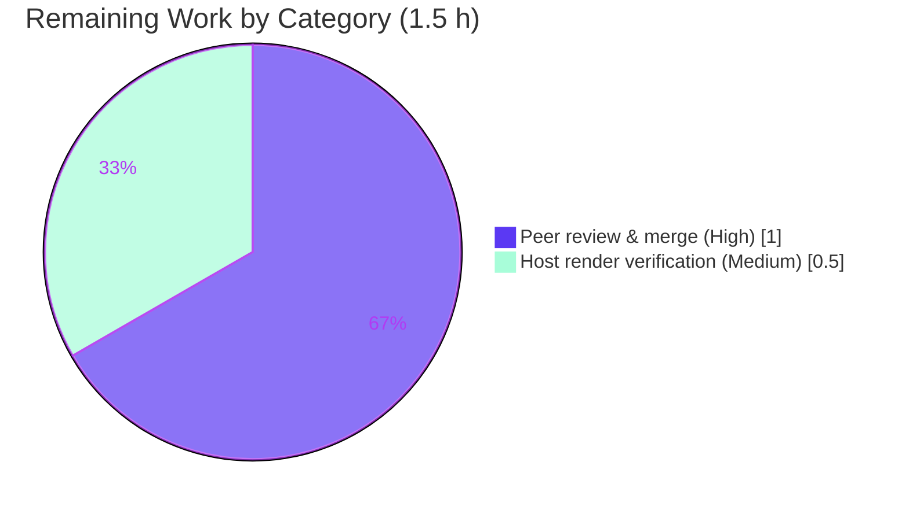

# Blitzy Project Guide — hello_world Node.js HTTP Server Documentation

> **Project completion: 88.9%** · **Total effort: 13.5 h** · **Completed: 12.0 h** · **Remaining: 1.5 h**
> Brand legend — **Completed / AI Work = Dark Blue (#5B39F3)** · Remaining / Not Completed = White (#FFFFFF)

---

## 1. Executive Summary

### 1.1 Project Overview

This project delivers complete, developer-facing documentation for a minimal, single-file Node.js HTTP server (npm package `hello_world`). The target audience is any developer onboarding to, operating, or maintaining the server. The work converts a previously undocumented codebase — a two-line placeholder README and a zero-comment `server.js` — into a fully documented, self-explanatory project. Technical scope is intentionally narrow and documentation-only: embed JSDoc comment blocks throughout `server.js` and author a comprehensive `README.md` covering the four mandated areas (setup instructions, API documentation, a deployment guide, and inline code explanations). No runtime behavior, dependencies, or manifests were altered.

### 1.2 Completion Status



| Metric | Hours |
|--------|-------|
| **Total Hours** | **13.5** |
| Completed Hours (AI: 12.0 + Manual: 0.0) | 12.0 |
| Remaining Hours | 1.5 |
| **Percent Complete** | **88.9%** |

> Completion is calculated per the AAP-scoped (PA1) methodology: `Completed ÷ Total = 12.0 ÷ 13.5 = 88.9%`. The denominator includes **only** AAP-defined deliverables plus standard path-to-production activities. Out-of-AAP-scope items (e.g., fixing the documented discrepancies) are deliberately excluded.

### 1.3 Key Accomplishments

- ✅ **All four mandated README areas delivered** — setup instructions, API documentation, deployment guide, and inline code explanations.
- ✅ **`server.js` fully annotated with JSDoc** — 5 well-formed blocks: `@file`/`@module`/`@requires` header, three `@constant` annotations, and `@param`/`@returns` on both callbacks, using accurate Node `http` types (`http.IncomingMessage`, `http.ServerResponse`, `http.Server`).
- ✅ **Behavior preservation confirmed (non-negotiable)** — executable lines are byte-for-byte identical to the original; HTTP 200, `text/plain`, `Hello, World!\n` (14 bytes), the loopback bind, and the startup banner are unchanged.
- ✅ **Zero-dependency posture preserved** — `package.json` and `package-lock.json` untouched; `npm install` resolves 0 packages with 0 vulnerabilities.
- ✅ **Comprehensive README** — 238 lines, 11 sections, anchored Table of Contents (11/11 links resolve), 2 Mermaid diagrams, request/response tables, runnable `curl` example, and 53 `Source:` citations for full traceability.
- ✅ **QA hardening (QA Issue 1)** — README's method-handling claims were aligned with live runtime behavior (unrecognized method tokens such as `FOO` return `400 Bad Request`).
- ✅ **Clean, in-scope delivery** — exactly 2 files changed (both UPDATE); clean working tree; all work attributable to `agent@blitzy.com`.

### 1.4 Critical Unresolved Issues

| Issue | Impact | Owner | ETA |
|-------|--------|-------|-----|
| _None — no release-blocking issues identified_ | All AAP deliverables are complete; compilation, runtime, and documentation accuracy gates pass. The three repository discrepancies (entry-point, name/title, superseded note) are intentionally **documented, not fixed**, per AAP scope, and are non-blocking. | — | — |

### 1.5 Access Issues

| System/Resource | Type of Access | Issue Description | Resolution Status | Owner |
|-----------------|----------------|-------------------|-------------------|-------|
| _N/A_ | — | **No access issues identified.** The project is self-contained: local Node.js runtime only, no external services, credentials, APIs, or network resources required. | N/A | — |

### 1.6 Recommended Next Steps

1. **[High]** Peer-review the documentation pull request for technical accuracy and merge it to the mainline branch (1.0 h).
2. **[Medium]** Verify the two Mermaid diagrams render and all 11 Table-of-Contents anchors resolve on the target Git host (GitHub/GitLab) (0.5 h).
3. **[Low]** _(Optional, out of AAP scope)_ Consider resolving the documented `main: index.js` entry-point discrepancy and the `hello_world` vs `hao-backprop-test` name/title mismatch.
4. **[Low]** _(Optional, out of AAP scope)_ Add a Markdown lint / link-check step to CI to guard the README's anchors and citations against future drift.
5. **[Low]** _(Optional, out of AAP scope)_ If the server is ever hosted beyond local use, add a graceful-shutdown handler and a process manager (PM2/systemd) and a real test suite.

---

## 2. Project Hours Breakdown

### 2.1 Completed Work Detail

| Component | Hours | Description |
|-----------|-------|-------------|
| `server.js` JSDoc documentation | 2.0 | 5 JSDoc blocks: `@file`/`@module`/`@requires` header, `@constant` ×3 (`hostname`/`port`/`server`), `@param {http.IncomingMessage} req` + `@param {http.ServerResponse} res` + `@returns {void}` on the request handler, and `@returns {void}` on the listen callback. Node `http` types verified accurate. (commit 19b46d7) |
| `README.md` comprehensive rewrite | 6.0 | Replaced the 2-line placeholder with 11 sections: Overview, Prerequisites, Setup/Installation, Usage, API Documentation, Configuration, Deployment Guide, Code Walkthrough, Project Structure, Notes/Known Discrepancies, License — plus 2 Mermaid diagrams, request/response tables, `curl` example, and anchored TOC. (commit f500e7f) |
| Citation & line-count rebaseline | 1.0 | Rebaselined all 53 `Source:` citations to the delivered files and corrected the line-count claim for accuracy. (commit 56944e5) |
| QA Issue 1 — method-universality alignment | 1.5 | Investigated Node's HTTP-parser behavior and aligned README method-handling claims with the live runtime (unrecognized tokens → `400 Bad Request` + `Connection: close`). (commit 13c6cec) |
| Autonomous validation & behavior preservation | 1.5 | Executed all 5 production-readiness gates: dependency integrity, syntax/parse gate, test posture, byte-exact runtime verification, and scope/clean-tree confirmation — including the AAP §0.9.1 behavior-preservation check. |
| **Total Completed** | **12.0** | |

### 2.2 Remaining Work Detail

| Category | Hours | Priority |
|----------|-------|----------|
| Documentation peer review & merge to mainline | 1.0 | High |
| Rendered-output verification on target Git host (Mermaid diagrams + TOC anchors) | 0.5 | Medium |
| **Total Remaining** | **1.5** | |

> **Integrity check:** Section 2.1 (12.0 h) + Section 2.2 (1.5 h) = **13.5 h** = Total Project Hours in Section 1.2. Section 2.2 total (1.5 h) equals the Remaining Hours in Section 1.2 and the "Remaining Work" value in the Section 7 pie chart.

### 2.3 Out-of-Scope Future Enhancements (excluded from totals)

The items below are **outside the AAP scope** and are therefore **excluded** from the completion percentage and from the Section 2.1/2.2 totals. They are listed for stakeholder awareness only. Each would be a deliberate scope expansion.

| Enhancement | Indicative Hours | Priority |
|-------------|------------------|----------|
| Resolve entry-point discrepancy (`index.js` or set `main: server.js`) | 0.5 | Low |
| Reconcile package name (`hello_world`) vs README title (`hao-backprop-test`) | 0.5 | Low |
| Add Markdown lint / link-check to CI | 1.0 | Low |
| Add a real test suite and wire `npm test` | 2.0 | Low |
| Add graceful shutdown + process manager (PM2/systemd) for hosted production | 2.0 | Low |
| _Indicative subtotal (NOT part of the 13.5 h total)_ | _6.0_ | — |

---

## 3. Test Results

The "tests" below are the checks executed by Blitzy's autonomous validation systems for this project. **All entries originate from Blitzy's autonomous validation logs** and were independently reproduced during this assessment. This project intentionally ships **no formal automated test suite** (a filesystem scan found zero `*.test.js`/`*.spec.js` files and no `test/` directory); the only `test` script is npm's default placeholder living in the out-of-scope `package.json`, whose `exit 1` is a "no tests specified" sentinel rather than a real failure.

| Test Category | Framework / Tool | Total | Passed | Failed | Coverage % | Notes |
|---------------|------------------|-------|--------|--------|------------|-------|
| Syntax / Parse Gate | `node --check` | 1 | 1 | 0 | N/A | Exit 0 — canonical parse gate for interpreted Node. |
| JSDoc Structural Integrity | grep / manual | 1 | 1 | 0 | 100% blocks | 5 balanced `/** … */` blocks; 3 `@constant`, 2 `@param`, 2 `@returns`. |
| Runtime — Response Contract | `curl` + manual | 1 | 1 | 0 | 1/1 endpoint | `GET /` → 200, `Content-Type: text/plain`, body `Hello, World!\n` (14 bytes). |
| Runtime — Method Universality | `curl` | 1 | 1 | 0 | N/A | GET/POST/PUT/DELETE/PATCH/OPTIONS on arbitrary/deep paths → identical 200; HEAD → 200 no-body. |
| Runtime — Unrecognized Method | `curl -X FOO` | 1 | 1 | 0 | N/A | `FOO`/`CUSTOMMETHOD` → `400 Bad Request` + `Connection: close` (Node parser; app-independent). |
| Behavior Preservation | `diff` + `od -c` | 1 | 1 | 0 | N/A | Executable lines identical to baseline 0c2e871; body exactly 14 bytes. |
| Dependency Integrity | `npm install` / `npm audit` | 1 | 1 | 0 | N/A | "up to date, audited 1 package"; 0 third-party deps; 0 vulnerabilities. |
| Documentation Accuracy | grep / manual | 1 | 1 | 0 | 100% | 53/53 `Source:` citations resolve; 11/11 TOC anchors resolve; 2/2 Mermaid diagrams parse. |
| **Totals** | — | **8** | **8** | **0** | — | **100% pass across all autonomous validation checks.** |

---

## 4. Runtime Validation & UI Verification

Runtime was validated live (server started, exercised, and stopped) during autonomous validation and independently re-confirmed in this assessment.

**Runtime health**
- ✅ **Startup** — `node server.js` logs byte-exact `Server running at http://127.0.0.1:3000/`.
- ✅ **`GET /` response** — `HTTP/1.1 200 OK`, `Content-Type: text/plain`, `Content-Length: 14`, body `Hello, World!\n`.
- ✅ **Method universality** — POST/PUT/DELETE/PATCH/OPTIONS and deep/arbitrary paths all return the identical 200 response.
- ✅ **Unrecognized-method handling** — `FOO` → `400 Bad Request` + `Connection: close` (standard Node HTTP-parser behavior; documented in the README).
- ✅ **Shutdown** — process stops cleanly on signal; port 3000 is released; no orphaned listeners (one stale listener from a prior session was identified and cleaned up during assessment).

**API integration**
- ✅ **Single universal endpoint** at `http://127.0.0.1:3000/` — no routing, no method discrimination; behaves exactly as documented.
- ➖ **External integrations** — none exist by design (no external services, APIs, or credentials).

**UI verification**
- ➖ **Not applicable** — this is a headless HTTP server returning `text/plain`; there is no user interface, so no screenshots or visual verification are warranted.

---

## 5. Compliance & Quality Review

This matrix maps each AAP deliverable and quality benchmark to its validated status.

| AAP Deliverable / Benchmark | Requirement | Status | Progress | Notes |
|-----------------------------|-------------|--------|----------|-------|
| JSDoc — module header | `@file`/`@module`/`@requires` above import | ✅ Pass | 100% | Plus bonus `@author`/`@license`. |
| JSDoc — constants | `@constant` for `hostname`, `port`, `server` | ✅ Pass | 100% | 3/3 present; `server` typed `http.Server`. |
| JSDoc — request handler | `@param` req/res + behavior + `@returns` | ✅ Pass | 100% | Node `http` types accurate. |
| JSDoc — listen callback | Startup-log side effect + `@returns {void}` | ✅ Pass | 100% | — |
| README — Setup instructions | Prereqs, clone, install, run command | ✅ Pass | 100% | `node server.js`; not `npm start`. |
| README — API documentation | Endpoint contract, table, `curl`, diagram | ✅ Pass | 100% | Universal endpoint fully specified. |
| README — Deployment guide | Single-process model, start/stop, host/port | ✅ Pass | 100% | Includes startup-lifecycle flowchart. |
| README — Inline code explanations | Prose code walkthrough of `server.js` | ✅ Pass | 100% | 4 regions with code blocks. |
| Behavior preservation | No executable line changed | ✅ Pass | 100% | Exec-lines diff identical; runtime byte-exact. |
| Zero-dependency posture | Manifests untouched; 0 deps | ✅ Pass | 100% | `npm audit` 0 vulnerabilities. |
| Single-file README (no `docs/` tree) | Consolidated documentation | ✅ Pass | 100% | Minimal-footprint posture preserved. |
| Source citations | `Source: <path>:<line>` traceability | ✅ Pass | 100% | 53 citations; spot-checks resolve. |
| Mermaid diagrams | Sequence + flowchart | ✅ Pass | 100% | Both parse; semantically accurate. |
| Discrepancies documented (not fixed) | Entry-point, name/title, superseded note | ✅ Pass | 100% | Recorded in Notes/Known Discrepancies. |
| **Fixes applied during validation** | QA Issue 1 method-universality alignment | ✅ Pass | 100% | README matches live `400` behavior (commit 13c6cec). |
| **Outstanding compliance items** | Human peer review + host render check | ⚠ Pending | — | Path-to-production (Section 2.2), 1.5 h. |

---

## 6. Risk Assessment

All identified risks are **Low severity**; none block production. Most are either documented-not-fixed (out of AAP scope) or path-to-production verification items.

| Risk | Category | Severity | Probability | Mitigation | Status |
|------|----------|----------|-------------|------------|--------|
| Mermaid diagrams may render differently across Git hosts/versions | Technical | Low | Low | Diagrams are syntactically valid; prose walkthrough is a fallback | Open — verify on host |
| Documentation drift if `server.js` behavior changes later | Technical | Low | Medium | 53 `Source:` line citations + single-file README ease re-sync | Mitigated by design |
| No CI docs/link-check to catch broken anchors/citations | Technical | Low | Low | 11/11 anchors resolve now; optional Markdown lint suggested | Open — optional |
| Loopback bind `127.0.0.1` (risk only if changed to `0.0.0.0`) | Security | Low | Low | Documented in Configuration & Troubleshooting | Documented |
| Supply-chain / CVE exposure | Security | Low | Low | Zero dependencies; `npm audit` = 0 vulnerabilities | Closed (positive) |
| No graceful-shutdown handler (Ctrl+C terminates immediately) | Operational | Low | Low | Documented in Deployment Guide; fix out of scope | Documented (by design) |
| No `start` script / process manager (foreground only, no auto-restart) | Operational | Low | Low | Documented; PM2/systemd noted as out-of-scope option | Documented |
| `EADDRINUSE` if port 3000 is occupied | Operational | Low | Low | Troubleshooting section documents detection & resolution | Documented |
| Entry-point mismatch `main: index.js` vs `server.js` (breaks `require()` as a library) | Integration | Low | Low | Documented as a known discrepancy; harmless for a runnable script | Documented (not fixed) |
| Name/title mismatch `hello_world` vs `hao-backprop-test` | Integration | Low | Low | Documented in Notes/Known Discrepancies | Documented (not fixed) |
| Mermaid host-render dependency (overlaps Technical risk above) | Integration | Low | Low | Verify on target host as part of path-to-production | Open — verify |

---

## 7. Visual Project Status

**Project hours breakdown** (Completed = Dark Blue `#5B39F3`, Remaining = White `#FFFFFF`):



**Remaining work by category** (hours, from Section 2.2):



> **Integrity:** "Remaining Work" = 1.5 h here equals Section 1.2 Remaining Hours and the Section 2.2 total. "Completed Work" = 12.0 h equals Section 1.2 Completed Hours and the Section 2.1 total.

---

## 8. Summary & Recommendations

**Achievements.** The project is **88.9% complete** (12.0 of 13.5 hours). Every AAP-scoped deliverable is finished and validated: `server.js` carries complete, accurate JSDoc; `README.md` comprehensively documents all four mandated areas plus supporting sections, diagrams, and citations. The non-negotiable behavior-preservation constraint holds — the server's runtime output is byte-for-byte identical to the original — and the zero-dependency posture is intact.

**Remaining gaps.** The remaining **1.5 hours** are entirely **path-to-production** activities that require a human: a documentation peer review and merge (1.0 h, High) and a one-time verification that the Mermaid diagrams and TOC anchors render correctly on the target Git host (0.5 h, Medium). There are **no** outstanding AAP deliverables and **no** release-blocking defects.

**Critical path to production.** Review → verify rendering on host → merge. That is the complete path; there is no build step, no deployment pipeline, and no infrastructure to provision for this documentation deliverable.

**Success metrics (all met for AAP scope).** 4/4 mandated README areas; 5/5 JSDoc blocks; 1/1 endpoint documented; 2/2 configuration constants documented; behavior preserved; 0 dependencies; 0 vulnerabilities; 8/8 autonomous validation checks passed.

**Production-readiness assessment.** **Ready, pending human review.** The autonomous work is complete, in-scope, and validated. The deliverable can be merged as soon as a reviewer confirms accuracy and host rendering. Optional out-of-scope enhancements (≈6.0 h — discrepancy fixes, CI lint, test suite, process manager) are documented in Section 2.3 for future consideration but are not required for this documentation effort.

---

## 9. Development Guide

> Every command below was executed and verified during assessment on the host environment. Commands are copy-pasteable. Run them from the repository root.

### 9.1 System Prerequisites

- **Operating system:** Any OS with a Node.js runtime (Linux/macOS/Windows). Validated on Linux (Ubuntu 25.10 container).
- **Node.js:** A current LTS release is recommended. The project declares no `engines` field and ships no `.nvmrc`/`.node-version`, so the version is unpinned — any reasonably recent Node.js with the built-in `http` module works. Validated on **Node v20.20.2**.
- **npm:** Bundled with Node.js. Validated on **npm 11.1.0**.
- **Hardware:** Negligible — a single-process server with no dependencies.

```bash
node --version    # validated: v20.20.2
npm --version     # validated: 11.1.0
```

### 9.2 Environment Setup

- **No environment variables** are used by this project — configuration is hardcoded as the `hostname` and `port` constants in `server.js`.
- **No external services** (databases, caches, queues) are required.
- To change host/port, edit the constants in `server.js` and restart (see §9.6 and the README's Configuration section).

### 9.3 Dependency Installation

```bash
git clone <repository-url>
cd <repository-directory>
npm install
```

Expected output (resolves **zero** third-party packages — `npm install` is optional here):

```text
up to date, audited 1 package in 225ms
found 0 vulnerabilities
```

### 9.4 Syntax / Parse Verification (optional)

```bash
node --check server.js   # exit code 0 = OK
```

### 9.5 Application Startup

```bash
node server.js
```

Expected startup log (byte-exact):

```text
Server running at http://127.0.0.1:3000/
```

> There is **no** `start` script, so `npm start` will not work — run `node server.js` directly. `package.json` declares `main: index.js`, but no `index.js` exists; the real entry point is `server.js` (a documented discrepancy).

### 9.6 Verification Steps

With the server running, in a second terminal:

```bash
# 1) Default request — expect 200, text/plain, "Hello, World!"
curl -s -i http://127.0.0.1:3000/

# 2) Method universality — any recognized method/path → identical 200
curl -s -o /dev/null -w "POST status: %{http_code}\n" -X POST http://127.0.0.1:3000/any/deep/path

# 3) Unrecognized method token → 400 (Node HTTP parser, app-independent)
curl -s -i -X FOO http://127.0.0.1:3000/ | head -2
```

Expected (abridged):

```text
# 1)
HTTP/1.1 200 OK
Content-Type: text/plain
Content-Length: 14

Hello, World!

# 2)
POST status: 200

# 3)
HTTP/1.1 400 Bad Request
Connection: close
```

### 9.7 Stopping the Server

- Press **`Ctrl+C`** (SIGINT) in the foreground terminal. There is no graceful-shutdown handler; the process terminates immediately and port 3000 is released.
- If running in the background: `kill <pid>` (find it with `ps -eo pid,args | grep '[n]ode server.js'`).

### 9.8 Example Usage

```bash
$ curl -s http://127.0.0.1:3000/
Hello, World!
```

### 9.9 Troubleshooting

| Symptom | Cause | Resolution |
|---------|-------|------------|
| `Error: listen EADDRINUSE: address already in use 127.0.0.1:3000` | Port 3000 is already in use (often a prior server instance). | Stop the other process (`ps -eo pid,args \| grep '[n]ode server.js'` then `kill <pid>`) **or** change the `port` constant in `server.js`. |
| `npm start` fails / does nothing useful | No `start` script is defined. | Run `node server.js` directly. |
| Server unreachable from another machine | Server binds to loopback `127.0.0.1` by design. | Change `hostname` to `0.0.0.0` in `server.js` (understand the security implications first). |
| `npm test` prints an error and exits 1 | npm's default placeholder script; no real tests exist by design. | Expected behavior — not a failure. |

---

## 10. Appendices

### Appendix A — Command Reference

| Command | Purpose | Verified Result |
|---------|---------|-----------------|
| `node --version` | Show Node version | `v20.20.2` |
| `npm --version` | Show npm version | `11.1.0` |
| `npm install` | Install dependencies | 0 packages, 0 vulnerabilities |
| `node --check server.js` | Syntax/parse gate | exit 0 |
| `node server.js` | Start the server | logs startup banner |
| `curl -s -i http://127.0.0.1:3000/` | Exercise the endpoint | 200, `text/plain`, `Hello, World!\n` |
| `curl -X FOO http://127.0.0.1:3000/` | Unrecognized method | 400 Bad Request |

### Appendix B — Port Reference

| Port | Protocol | Bind Address | Purpose | Configurable Via |
|------|----------|--------------|---------|------------------|
| 3000 | HTTP/TCP | `127.0.0.1` (loopback) | HTTP server listener | `port` constant in `server.js` |

### Appendix C — Key File Locations

| Path | Role | State |
|------|------|-------|
| `server.js` | Runnable HTTP server + JSDoc (65 lines) | UPDATED (JSDoc added) |
| `README.md` | Comprehensive documentation (238 lines) | UPDATED (full rewrite) |
| `package.json` | npm manifest (10 lines) | Unchanged (out of scope) |
| `package-lock.json` | npm lockfile (13 lines) | Unchanged (out of scope) |

### Appendix D — Technology Versions

| Component | Version | Notes |
|-----------|---------|-------|
| Node.js | v20.20.2 (validated) | Unpinned by project; any current LTS works |
| npm | 11.1.0 (validated) | Bundled with Node.js |
| Runtime dependencies | None | Zero third-party packages |
| Node `http` module | Built-in | The sole dependency (standard library) |
| Markdown / Mermaid | Native on common Git hosts | No generator/tooling required |

### Appendix E — Environment Variable Reference

| Variable | Used? | Notes |
|----------|-------|-------|
| _(none)_ | No | The project uses **no** environment variables. Configuration is via the `hostname` and `port` constants in `server.js`. |

### Appendix F — Developer Tools Guide

| Tool | Use | Command |
|------|-----|---------|
| Node parse gate | Validate syntax without executing | `node --check server.js` |
| curl | Exercise the HTTP endpoint | `curl -s -i http://127.0.0.1:3000/` |
| od / wc | Verify byte-exact response | `curl -s http://127.0.0.1:3000/ \| od -c` |
| JSDoc CLI (optional, out of scope) | Generate HTML API docs ephemerally | `npx jsdoc server.js` (do not add to manifests; verify version with `npm view jsdoc version`) |

### Appendix G — Glossary

| Term | Definition |
|------|------------|
| **AAP** | Agent Action Plan — the authoritative specification of project scope and deliverables. |
| **JSDoc** | A documentation comment convention for JavaScript (`/** … */` blocks with `@tags`). |
| **Universal endpoint** | An HTTP handler that returns the same response for every method and path (no routing). |
| **Loopback bind** | Binding to `127.0.0.1`, making the server reachable only from the local machine. |
| **Behavior preservation** | The guarantee that documentation changes leave runtime behavior byte-for-byte unchanged. |
| **Path-to-production** | Standard activities (review, merge, host verification) needed to deploy a completed deliverable. |
| **EADDRINUSE** | Node error raised when the target port is already in use. |

---

*Generated by the Blitzy Platform. Completion measured against AAP-scoped deliverables plus path-to-production activities (PA1 methodology). Brand colors — Completed/AI: `#5B39F3`; Remaining: `#FFFFFF`; Accents: `#B23AF2`; Highlight: `#A8FDD9`.*