# Technical Specification

# 1. Introduction

## **1.1 EXECUTIVE SUMMARY**

### **1.1.1 Project Overview**

The `hao-backprop-test` repository is a deliberately minimal Node.js application that exists for a single stated purpose: to serve as a fixed test artifact for "backprop integration." The repository's `README.md` declares this purpose verbatim ("test project for backprop integration. Do not touch!"), and the codebase intentionally embodies this purpose through extreme simplicity — exactly four files at the repository root, zero subdirectories of source code, zero runtime or development dependencies, and approximately 913 total bytes of combined source.

The implementation consists of a single executable script, `server.js`, which constructs an HTTP server using only the Node.js built-in `http` core module. The server binds to `127.0.0.1:3000` and responds to every incoming request with the static plain-text body `Hello, World!\n`. There is no routing, no middleware, no persistence, no authentication, and no application logic beyond this single fixed response.

### 1.1.2 Core Business Problem

The problem this repository addresses is operational rather than commercial. It provides a known-good, stable, dependency-free baseline application against which an external system referenced in `README.md` as "backprop" can be exercised. By keeping the implementation surface essentially zero, the project minimizes the number of variables that could interfere with the integrating system's behavior, making it a useful diagnostic harness and a reproducible reference specimen.

This repository does not itself implement any "backprop" functionality. The term "backprop" appears exactly once across the entire codebase — in `README.md` — and is not otherwise defined, imported, configured, or coded against. The integration occurs externally against this repository's running HTTP surface.

### 1.1.3 Key Stakeholders and Users

The repository identifies stakeholders implicitly through metadata and prose. There are no end-user features, accounts, or interfaces.

| Stakeholder | Role | Evidence in Repository |
| --- | --- | --- |
| hxu | Author / maintainer | author field in package.json |
| External "backprop" integrators | Primary consumers of the test harness | Purpose statement in README.md |
| External contributors / readers | Explicitly directed not to modify | "Do not touch!" directive in README.md |

### 1.1.4 Expected Business Impact and Value Proposition

The value proposition is determinism. Because the application has no dependencies, no configuration surface, no conditional branching, and no observable state, its behavior is fully predictable across executions and environments. This deterministic posture supports three concrete uses:

- A regression-detection baseline for an external tooling chain
- A minimum-viable Node.js artifact for verifying integration plumbing end-to-end
- A control specimen against which more complex applications can be compared

Conventional product-level business metrics (revenue, market share, user adoption, retention) are not applicable to this artifact and are intentionally absent from its scope.

## 1.2 SYSTEM OVERVIEW

### 1.2.1 Project Context

#### Business Context and Positioning

The project is positioned as a test fixture rather than as a product. It is not designed for end-user consumption, production deployment, or competitive differentiation. The naming pattern (`hao-backprop-test`) and the README's explicit framing of the project as a "test project" together indicate that this repository is a tool used by — and only by — an integration workflow targeting an external system referred to as "backprop."

A naming discrepancy exists between the human-facing repository identifier and the npm manifest identifier. Both names refer to the same artifact and are documented here to support unambiguous reference in downstream documentation:

| Identifier Source | Value |
| --- | --- |
| README.md title | hao-backprop-test |
| package.json name field | hello_world |
| package-lock.json root name field | hello_world |

#### Current System Limitations

There is no prior or parallel system that this repository replaces; the repository constitutes the system in its entirety. The observable limitations below are inherent to the deliberate design choice of minimalism rather than legacy technical debt:

- No HTTPS/TLS termination (the `http` core module, not `https`, is used)
- No request routing or HTTP method discrimination (every request returns the same response)
- No error handling beyond Node.js runtime defaults
- No graceful shutdown logic
- No external network accessibility (loopback binding to `127.0.0.1`)
- No persistent state or data layer of any kind

#### Integration with Existing Enterprise Landscape

The repository declares no integrations and exposes no enterprise integration surfaces:

- No environment configuration files (no `.env`, no `config/`)
- No SDK or API client dependencies
- No database connectors, queue clients, or message-bus integrations
- No service-discovery or telemetry registrations
- No "backprop"-specific code, configuration, or dependency anywhere in the source tree

The integration with the external "backprop" platform is performed against this repository from the outside; no internal integration code is required to be present, and none is.

### 1.2.2 High-Level Description

#### Primary System Capabilities

| Capability | Implementation Location |
| --- | --- |
| Single-endpoint HTTP server | server.js — http.createServer callback |
| Static plain-text response payload | server.js — res.end('Hello, World!\n') |
| Startup log message to stdout | server.js — console.log inside listen callback |
| npm package metadata declaration | package.json |
| Lockfile validating zero dependencies | package-lock.json |

The server returns HTTP status `200` and `Content-Type: text/plain` for every incoming request regardless of method, path, headers, or body content.

#### Major System Components

The system is intentionally non-decomposed and consists of a single executable component. The complete runtime topology is:

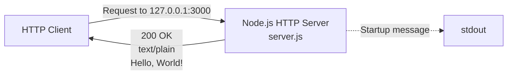

There are no internal modules, no service layers, no separate worker processes, and no auxiliary components.

#### Core Technical Approach

| Aspect | Choice |
| --- | --- |
| Runtime | Node.js (no engines field; any version implicitly accepted) |
| Module system | CommonJS (require) |
| HTTP layer | Node.js built-in http module |
| Web framework | None |
| Third-party dependencies | None (runtime and development both empty) |
| Configuration | Hardcoded constants (host 127.0.0.1, port 3000) |

This selection prioritizes minimal surface area and behavioral determinism over flexibility, feature richness, or production readiness.

### 1.2.3 Success Criteria

#### Measurable Objectives

| Objective | Verification Method |
| --- | --- |
| Server starts without error on node server.js | Console emits Server running at http://127.0.0.1:3000/ |
| Server responds 200 OK to any HTTP request on port 3000 | HTTP client probe against the loopback endpoint |
| Response body is byte-identical to Hello, World!\n | Byte-level comparison of response payload |
| No dependencies are introduced into the project | package.json dependencies field remains absent/empty |

#### Critical Success Factors

- **Stability of behavior:** The server's output must remain identical across executions. This is enforced structurally by the absence of state, conditionals, and external inputs.
- **Preservation of file inventory:** The "Do not touch!" instruction in `README.md` codifies that the file set and contents are expected to remain stable.
- **Zero-dependency posture:** Introducing any external package would defeat the deterministic-baseline value of the artifact.
- **Singular execution model:** The application must continue to be runnable via a single `node server.js` invocation with no preparatory steps.

#### Key Performance Indicators (KPIs)

Traditional product KPIs (DAU/MAU, conversion, retention, latency SLOs) do not apply because there are no end users and no production deployment. The applicable indicators are binary acceptance checks rather than ranged metrics:

| KPI | Target |
| --- | --- |
| Cold-start success rate | 100% |
| Response correctness (byte-exact match) | 100% |
| Declared dependency count | 0 |
| Repository file-count drift from baseline | 0 |

## 1.3 SCOPE

### 1.3.1 In-Scope Elements

#### Core Features and Functionalities

| Feature | Source of Truth |
| --- | --- |
| HTTP server bound to 127.0.0.1:3000 | server.js — hostname, port, server.listen |
| Static Hello, World!\n response body | server.js — res.end(...) |
| HTTP status code 200 for every request | server.js — res.statusCode = 200 |
| text/plain content type header | server.js — res.setHeader(...) |
| Startup log message to stdout | server.js — console.log inside listen callback |
| npm package metadata (name, version, license) | package.json |
| Lockfile asserting zero dependencies | package-lock.json |
| Human-facing purpose statement and restriction | README.md |

#### Primary User Workflows

A single workflow exists, from operator-initiated startup through unconditional request handling:

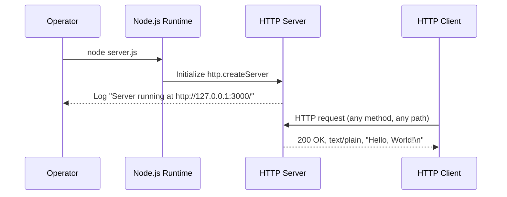

#### Essential Integrations

The only integration relevant to this artifact is the implicit one between this repository (as a running process) and an external "backprop" platform that exercises it. The integration is performed entirely from outside the repository; no code within this repository implements, references, or depends on backprop-specific functionality.

#### Key Technical Requirements

- A Node.js runtime must be available on the host to execute `server.js`.
- TCP port `3000` on the loopback interface must be available for binding.
- No build, install, transpile, or compile step is required; the project runs directly from cloned source.

### 1.3.2 Implementation Boundaries

#### System Boundaries

The system boundary is the single OS process started by `node server.js`. Anything outside that process — including the host operating system, the network stack, and any external "backprop" tooling — lies outside this system's boundary and is treated as external context.

#### User Groups Covered

No user group is targeted in a product sense. The repository implicitly acknowledges:

- The author (`hxu`) declared in `package.json`
- Operators of the external "backprop" integration who exercise the running server
- Readers and contributors who are explicitly directed by `README.md` not to modify the project

There are no authenticated users, no role definitions, no permissions model, and no UI affordances for any user group.

#### Geographic and Market Coverage

Not applicable. The application binds exclusively to `127.0.0.1`, rendering it unreachable from any network beyond the host on which it is run. There is no geographic, regional, locale, or market dimension to the system.

#### Data Domains Included

None. The application persists no data, accepts no inputs that influence its behavior, declares no schemas, and emits a single fixed ASCII byte sequence as its only output payload. There is no data domain to model.

### 1.3.3 Out-of-Scope Elements

#### Explicitly Excluded Capabilities

The following capabilities are confirmed absent through exhaustive file-level inspection of the repository:

| Excluded Capability | Evidence of Absence |
| --- | --- |
| Authentication / authorization | No auth code in server.js; no auth packages in lockfile |
| Persistence layer | No database client; no file I/O beyond stdout |
| Routing / multiple endpoints | Single unconditional handler in server.js |
| Request parsing / input validation | The req object is never read |
| External API integrations | No SDK or HTTP client dependencies declared |
| HTTPS / TLS termination | Server uses http, not https |
| Multi-environment configuration | No .env, no config/, no process.env reads |
| Clustering / process management | No cluster import; no PM2 or systemd config |
| Metrics, tracing, structured logging | Only a single console.log call exists |
| Internationalization | Response is a fixed ASCII string |
| Frontend / UI assets | No HTML, CSS, or client-side JavaScript |
| Automated test suite | test npm script is the default placeholder error |
| Linting / formatting / type checking | No .eslintrc, .prettierrc, or TypeScript config |
| CI/CD pipelines | No .github/, .gitlab-ci.yml, or equivalent |
| Containerization | No Dockerfile or docker-compose.yml |
| Build / bundling | No build scripts; project runs as source |
| Source-control hygiene tooling | No .gitignore file present |

#### Future Phase Considerations

The repository contains no roadmap, no TODOs, no issue-tracker references, and no version history beyond `1.0.0`. The "Do not touch!" instruction in `README.md` indicates that future expansion of the artifact is explicitly not anticipated within this repository. Any future phases — if they exist — are assumed to be tracked outside this codebase by the external integrating system.

#### Integration Points Not Covered

The repository does not implement, expose, or document:

- Any client SDK for the external "backprop" platform
- Any callback URL, webhook receiver, or event consumer for backprop
- Any authentication exchange (API keys, OAuth, mTLS) with backprop
- Any data export, schema declaration, or contract artifact
- Any health-check, readiness, or liveness endpoint

The integration with backprop is performed externally against the running server's HTTP surface and is not modeled inside the repository.

#### Unsupported Use Cases

| Use Case | Reason Unsupported |
| --- | --- |
| Production traffic serving | Loopback-only binding; no hardening or scaling |
| Multi-tenant or multi-user scenarios | No identity model; no isolation primitives |
| Dynamic content generation | Response is a fixed string literal |
| API consumers expecting JSON | Content-Type is text/plain; body is non-JSON |
| Long-running stateful workflows | Process is fully stateless |
| Use as an importable npm module | main: index.js points to a non-existent file |
| Invocation via npm start | No start script is defined in package.json |
| Use under strict license-compliance review | License declared as MIT in package.json but no LICENSE file is present |

### 1.3.4 References

#### Files Examined

- `server.js` — Source of all runtime behavior: HTTP server creation, host and port binding, static response composition, startup log emission.
- `package.json` — Source of project metadata: name (`hello_world`), version (`1.0.0`), description, author (`hxu`), declared MIT license, `main` field (`index.js`), `test` script placeholder, and confirmation of zero declared dependencies.
- `package-lock.json` — Confirms `lockfileVersion: 3` and the absence of any transitive third-party packages; lockfile root name (`hello_world`) is consistent with `package.json`.
- `README.md` — Provides the canonical repository name (`hao-backprop-test`) and the sole declarative purpose statement: "test project for backprop integration. Do not touch!"

#### Folders Examined

- Repository root (`/`) — Confirmed to contain exactly the four files above and no subdirectories of source code.

# 2. Product Requirements

## 2.1 FEATURE CATALOG

### 2.1.1 Catalog Overview and Scoping Principles

The `hao-backprop-test` repository implements an intentionally minimal feature set. The catalog below enumerates **eight discrete, testable features** derived exclusively from the four files present at the repository root (`server.js`, `package.json`, `package-lock.json`, `README.md`). Each feature is grounded in specific, citable evidence from those files. Capabilities explicitly excluded by Tech Spec §1.3.3 (authentication, persistence, routing, HTTPS, multi-environment configuration, testing, CI/CD, containerization, etc.) are intentionally **not** represented as features.

All eight features are assigned **Status: Completed**, since the artifact is finished and `README.md` explicitly prohibits modification ("Do not touch!"). Priority levels reflect the criticality articulated in Tech Spec §1.2.3 (Measurable Objectives and Critical Success Factors).

| Feature ID | Feature Name | Category | Priority |
|---|---|---|---|
| F-001 | HTTP Server Initialization & Loopback Binding | Runtime / Network | Critical |
| F-002 | Static Hello World Response Body | Runtime / Response | Critical |
| F-003 | HTTP 200 OK Status Code | Runtime / Response | Critical |
| F-004 | `text/plain` Content-Type Header | Runtime / Response | Medium |
| F-005 | Startup Confirmation Log Message | Operational / Observability | Medium |
| F-006 | npm Package Identity Declaration | Metadata / Packaging | Low |
| F-007 | Zero-Dependency Posture | Configuration / Quality | Critical |
| F-008 | Purpose Statement and Restriction Directive | Documentation | Low |

---

### 2.1.2 F-001: HTTP Server Initialization and Loopback Binding

#### 2.1.2.1 Feature Metadata

| Attribute | Value |
|---|---|
| Unique ID | F-001 |
| Feature Name | HTTP Server Initialization and Loopback Binding |
| Feature Category | Runtime / Network |
| Priority Level | Critical |
| Status | Completed |

#### 2.1.2.2 Description

- **Overview:** The feature creates a single HTTP server using the Node.js built-in `http` core module and binds it to TCP port `3000` on the loopback interface `127.0.0.1`. The server is instantiated via `http.createServer` and activated via `server.listen(port, hostname, callback)` in `server.js`.
- **Business Value:** Provides the running HTTP surface against which the external "backprop" platform performs its integration exercises. Without this feature, no other feature can be observed.
- **User Benefits:** Not applicable in a product sense — there are no end users. The operational benefit is a single-process, deterministic, dependency-free HTTP listener that operators of the external "backprop" tooling can exercise.
- **Technical Context:** Uses CommonJS (`require('http')`) and the Node.js core API only. No web framework (Express, Koa, Fastify, etc.) is involved. Hostname and port are declared as hardcoded `const` literals.

#### 2.1.2.3 Dependencies

- **Prerequisite Features:** None — F-001 is the foundation upon which F-002, F-003, F-004, and F-005 depend.
- **System Dependencies:** A Node.js runtime that supports `http.createServer` and ES2015 template literals; an available TCP port `3000` on the loopback interface.
- **External Dependencies:** None. The Node.js `http` module is built-in (not a third-party package).
- **Integration Requirements:** External "backprop" tooling must be capable of issuing HTTP requests to `http://127.0.0.1:3000/`. No internal integration code resides in this repository.

---

### 2.1.3 F-002: Static Hello World Response Body

#### 2.1.3.1 Feature Metadata

| Attribute | Value |
|---|---|
| Unique ID | F-002 |
| Feature Name | Static "Hello, World!\n" Response Body |
| Feature Category | Runtime / Response |
| Priority Level | Critical |
| Status | Completed |

#### 2.1.3.2 Description

- **Overview:** Every HTTP response emitted by the server carries the exact ASCII byte sequence `Hello, World!\n` (14 bytes including the trailing newline) as its body, regardless of request method, path, headers, or body content. The literal is provided as the argument to `res.end('Hello, World!\n')` in `server.js`.
- **Business Value:** Constitutes the canonical observable output that the "backprop" integration validates against. Tech Spec §1.2.3 names byte-exact response correctness as a 100%-target KPI.
- **User Benefits:** Not applicable. The benefit accrues to integration tooling that asserts deterministic output.
- **Technical Context:** The response is a literal string passed to `res.end()`; no string formatting, templating, file read, or dynamic computation is involved.

#### 2.1.3.3 Dependencies

- **Prerequisite Features:** F-001 (server must be running to emit responses).
- **System Dependencies:** None beyond F-001's.
- **External Dependencies:** None.
- **Integration Requirements:** Integrating tooling must compare response bodies at the byte level (per Tech Spec §1.2.3 verification method).

---

### 2.1.4 F-003: HTTP 200 OK Status Code

#### 2.1.4.1 Feature Metadata

| Attribute | Value |
|---|---|
| Unique ID | F-003 |
| Feature Name | HTTP 200 OK Status Code for All Requests |
| Feature Category | Runtime / Response |
| Priority Level | Critical |
| Status | Completed |

#### 2.1.4.2 Description

- **Overview:** The server sets `res.statusCode = 200` unconditionally inside the single request handler in `server.js`. Every response carries status code 200 regardless of the inbound request's method, path, headers, or payload.
- **Business Value:** Provides a deterministic success signal that external integration tooling can rely on without parsing the response body. The Tech Spec §1.2.3 verification method explicitly relies on this for liveness probing.
- **User Benefits:** Not applicable.
- **Technical Context:** Status code is set via the `res.statusCode` property assignment (not `res.writeHead`), occurring before the headers and body are written.

#### 2.1.4.3 Dependencies

- **Prerequisite Features:** F-001.
- **System Dependencies:** None beyond F-001's.
- **External Dependencies:** None.
- **Integration Requirements:** None.

---

### 2.1.5 F-004: text/plain Content-Type Header

#### 2.1.5.1 Feature Metadata

| Attribute | Value |
|---|---|
| Unique ID | F-004 |
| Feature Name | `text/plain` Content-Type Response Header |
| Feature Category | Runtime / Response |
| Priority Level | Medium |
| Status | Completed |

#### 2.1.5.2 Description

- **Overview:** The server invokes `res.setHeader('Content-Type', 'text/plain')` inside the request handler so that every response declares its body as plain text. This is consistent with the non-JSON, non-HTML nature of the body literal.
- **Business Value:** Allows HTTP clients to render or persist the response correctly without guesswork. The Tech Spec §1.3.3 explicitly identifies "API consumers expecting JSON" as an unsupported use case precisely because the Content-Type is `text/plain`.
- **User Benefits:** Not applicable.
- **Technical Context:** Header is set via `res.setHeader` before `res.end` is called; no charset parameter is appended (the header value is the bare `text/plain`).

#### 2.1.5.3 Dependencies

- **Prerequisite Features:** F-001.
- **System Dependencies:** None beyond F-001's.
- **External Dependencies:** None.
- **Integration Requirements:** None.

---

### 2.1.6 F-005: Startup Confirmation Log Message

#### 2.1.6.1 Feature Metadata

| Attribute | Value |
|---|---|
| Unique ID | F-005 |
| Feature Name | Startup Confirmation Log Message |
| Feature Category | Operational / Observability |
| Priority Level | Medium |
| Status | Completed |

#### 2.1.6.2 Description

- **Overview:** After the server successfully binds, exactly one log line is emitted to stdout via the callback supplied to `server.listen`. The emitted string is the template literal `Server running at http://${hostname}:${port}/`, which evaluates to `Server running at http://127.0.0.1:3000/`.
- **Business Value:** Serves as the externally observable success signal that the cold-start procedure completed (a 100%-target KPI per Tech Spec §1.2.3). Without this line, operators would need to probe the port to verify readiness.
- **User Benefits:** Operators of the "backprop" integration receive immediate visual confirmation of readiness.
- **Technical Context:** Uses `console.log` with an ES2015 template literal; no structured logging framework, no log levels, no rotation, no formatting.

#### 2.1.6.3 Dependencies

- **Prerequisite Features:** F-001 (the log fires from inside the `listen` callback).
- **System Dependencies:** A reachable stdout stream.
- **External Dependencies:** None.
- **Integration Requirements:** Integrating tooling may capture stdout and match against the literal startup string.

---

### 2.1.7 F-006: npm Package Identity Declaration

#### 2.1.7.1 Feature Metadata

| Attribute | Value |
|---|---|
| Unique ID | F-006 |
| Feature Name | npm Package Identity Declaration |
| Feature Category | Metadata / Packaging |
| Priority Level | Low |
| Status | Completed |

#### 2.1.7.2 Description

- **Overview:** `package.json` declares package identity fields recognized by npm-compatible tooling: `name` (`hello_world`), `version` (`1.0.0`), `description` (`Hello world in Node.js`), `main` (`index.js`), `author` (`hxu`), `license` (`MIT`), and a single `test` script set to the npm-default placeholder error.
- **Business Value:** Allows the artifact to be recognized by npm-compatible tooling as a well-formed Node.js project, even though no `npm install` step is required (since there are no dependencies).
- **User Benefits:** Not applicable.
- **Technical Context:** The `main` field points to a non-existent file (`index.js`); the actual executable is `server.js`. Tech Spec §1.3.3 explicitly identifies "Use as an importable npm module" as an unsupported use case for this reason.

#### 2.1.7.3 Dependencies

- **Prerequisite Features:** None (declarative metadata only).
- **System Dependencies:** None at runtime; npm tooling required only for inspection.
- **External Dependencies:** None.
- **Integration Requirements:** None.

---

### 2.1.8 F-007: Zero-Dependency Posture

#### 2.1.8.1 Feature Metadata

| Attribute | Value |
|---|---|
| Unique ID | F-007 |
| Feature Name | Zero Runtime and Development Dependency Posture |
| Feature Category | Configuration / Quality |
| Priority Level | Critical |
| Status | Completed |

#### 2.1.8.2 Description

- **Overview:** Neither `package.json` nor `package-lock.json` declares any third-party dependencies. `package.json` contains no `dependencies` key and no `devDependencies` key. `package-lock.json` declares `lockfileVersion: 3` and contains only a single root-package entry with no transitive packages.
- **Business Value:** This is the load-bearing characteristic of the entire artifact. Tech Spec §1.2.3 identifies it as a Critical Success Factor: "Introducing any external package would defeat the deterministic-baseline value of the artifact." The declared dependency count is a 100%-target KPI (target value: 0).
- **User Benefits:** Eliminates supply-chain risk, install-step variability, and version-drift potential — all of which would compromise the artifact's role as a deterministic baseline.
- **Technical Context:** All HTTP functionality is provided by the Node.js built-in `http` core module; no external packages are required.

#### 2.1.8.3 Dependencies

- **Prerequisite Features:** None (declarative posture).
- **System Dependencies:** None.
- **External Dependencies:** None — this feature is defined by their absence.
- **Integration Requirements:** Tooling auditing the lockfile must accept `lockfileVersion: 3`.

---

### 2.1.9 F-008: Purpose Statement and Restriction Directive

#### 2.1.9.1 Feature Metadata

| Attribute | Value |
|---|---|
| Unique ID | F-008 |
| Feature Name | Purpose Statement and "Do Not Modify" Restriction |
| Feature Category | Documentation |
| Priority Level | Low |
| Status | Completed |

#### 2.1.9.2 Description

- **Overview:** `README.md` consists of two lines: a level-1 heading `# hao-backprop-test` and a single declarative sentence `test project for backprop integration. Do not touch!`. These two lines together name the project, state its purpose, and prohibit its modification.
- **Business Value:** Codifies the "Preservation of file inventory" Critical Success Factor named in Tech Spec §1.2.3. The directive establishes the social contract that consumers of this artifact should not alter the file set or contents.
- **User Benefits:** Provides immediate orientation to any reader encountering the repository.
- **Technical Context:** Plain Markdown; no front-matter, no diagrams, no link targets, no embedded code. The README is the sole source within the repository of the human-facing project name `hao-backprop-test` (which differs from the `package.json` `name` field `hello_world`).

#### 2.1.9.3 Dependencies

- **Prerequisite Features:** None.
- **System Dependencies:** None.
- **External Dependencies:** None.
- **Integration Requirements:** None.

---

## 2.2 FUNCTIONAL REQUIREMENTS TABLES

Each feature is expanded into one or more discrete, testable requirements with unique IDs of the form `F-XXX-RQ-YYY`. Acceptance criteria are derived from the Measurable Objectives table in Tech Spec §1.2.3 wherever applicable.

### 2.2.1 F-001 — HTTP Server Initialization and Loopback Binding

#### 2.2.1.1 Requirement Details

| Requirement ID | Description | Priority | Complexity |
|---|---|---|---|
| F-001-RQ-001 | Server must bind to hostname `127.0.0.1` (loopback) | Must-Have | Low |
| F-001-RQ-002 | Server must listen on TCP port `3000` | Must-Have | Low |
| F-001-RQ-003 | Server must be constructed using the Node.js built-in `http` module (no third-party framework) | Must-Have | Low |
| F-001-RQ-004 | Server must accept TCP connections successfully after `listen` completes | Must-Have | Low |

#### 2.2.1.2 Acceptance Criteria

| Requirement ID | Acceptance Criterion |
|---|---|
| F-001-RQ-001 | Inspection of `server.js` confirms `const hostname = '127.0.0.1'`; runtime probe from a non-loopback interface fails |
| F-001-RQ-002 | Inspection of `server.js` confirms `const port = 3000`; TCP connection to `127.0.0.1:3000` succeeds after startup |
| F-001-RQ-003 | Inspection of `server.js` confirms `const http = require('http')` and absence of any web-framework imports |
| F-001-RQ-004 | Cold-start success rate equals 100% (per Tech Spec §1.2.3 KPI) |

#### 2.2.1.3 Technical Specifications

| Attribute | Value |
|---|---|
| Input Parameters | None at startup (hostname and port are hardcoded constants) |
| Output / Response | A listening TCP socket on `127.0.0.1:3000` plus a startup log line (see F-005) |
| Performance Criteria | Cold-start succeeds in a single invocation of `node server.js` with no preparatory steps |
| Data Requirements | None — server holds no state |

#### 2.2.1.4 Validation Rules

| Rule Category | Rule |
|---|---|
| Business Rule | The server must run as a single OS process started by `node server.js`; no orchestrator, supervisor, or wrapper is permitted |
| Data Validation | Not applicable — no input is consumed at startup |
| Security Requirement | Binding must be loopback-only so that the server is unreachable from any network beyond the host |
| Compliance Requirement | None |

---

### 2.2.2 F-002 — Static Hello World Response Body

#### 2.2.2.1 Requirement Details

| Requirement ID | Description | Priority | Complexity |
|---|---|---|---|
| F-002-RQ-001 | Response body must be byte-identical to the ASCII sequence `Hello, World!\n` | Must-Have | Low |
| F-002-RQ-002 | Response body must be returned regardless of request method, path, headers, or body | Must-Have | Low |
| F-002-RQ-003 | Response body must be emitted via `res.end()` so the response terminates after the literal | Must-Have | Low |

#### 2.2.2.2 Acceptance Criteria

| Requirement ID | Acceptance Criterion |
|---|---|
| F-002-RQ-001 | Byte-level comparison of the response payload against `Hello, World!\n` (14 bytes including the trailing LF) returns equality (per Tech Spec §1.2.3 verification method) |
| F-002-RQ-002 | Probes using `GET /`, `GET /any/path`, `POST /`, `PUT /`, etc. all return the same body |
| F-002-RQ-003 | Response is observed to be complete and the connection terminates after the literal is delivered |

#### 2.2.2.3 Technical Specifications

| Attribute | Value |
|---|---|
| Input Parameters | The HTTP `req` object is provided but is never read |
| Output / Response | A 14-byte response body: `Hello, World!\n` |
| Performance Criteria | Response correctness (byte-exact match) equals 100% (per Tech Spec §1.2.3 KPI) |
| Data Requirements | None — body is a hardcoded string literal |

#### 2.2.2.4 Validation Rules

| Rule Category | Rule |
|---|---|
| Business Rule | The response body must remain a fixed string literal; dynamic content generation is explicitly unsupported (Tech Spec §1.3.3) |
| Data Validation | Body content is constant — no validation against user input is required because no user input is consumed |
| Security Requirement | Response must not echo any request-derived data; the absence of `req` reads eliminates reflective injection vectors |
| Compliance Requirement | None |

---

### 2.2.3 F-003 — HTTP 200 OK Status Code

#### 2.2.3.1 Requirement Details

| Requirement ID | Description | Priority | Complexity |
|---|---|---|---|
| F-003-RQ-001 | Server must set HTTP status code `200` on every response | Must-Have | Low |
| F-003-RQ-002 | Status code must be set unconditionally (no method/path/header-based discrimination) | Must-Have | Low |

#### 2.2.3.2 Acceptance Criteria

| Requirement ID | Acceptance Criterion |
|---|---|
| F-003-RQ-001 | HTTP client probe against `http://127.0.0.1:3000/` returns status line `200 OK` (per Tech Spec §1.2.3 verification method) |
| F-003-RQ-002 | Probes with arbitrary methods (`GET`, `POST`, `PUT`, `DELETE`, `PATCH`, `OPTIONS`, `HEAD`) and arbitrary paths all return status code 200 |

#### 2.2.3.3 Technical Specifications

| Attribute | Value |
|---|---|
| Input Parameters | None consumed |
| Output / Response | HTTP status line with code `200` |
| Performance Criteria | Status code correctness equals 100% for all probes |
| Data Requirements | None |

#### 2.2.3.4 Validation Rules

| Rule Category | Rule |
|---|---|
| Business Rule | Status code must be set via `res.statusCode` assignment before headers/body are written |
| Data Validation | Not applicable |
| Security Requirement | The server must not leak internal error details via alternative status codes; uniform 200 responses preclude information disclosure through status |
| Compliance Requirement | None |

---

### 2.2.4 F-004 — text/plain Content-Type Header

#### 2.2.4.1 Requirement Details

| Requirement ID | Description | Priority | Complexity |
|---|---|---|---|
| F-004-RQ-001 | Server must set the `Content-Type` response header to `text/plain` on every response | Should-Have | Low |
| F-004-RQ-002 | Header must be set before the response body is written | Should-Have | Low |

#### 2.2.4.2 Acceptance Criteria

| Requirement ID | Acceptance Criterion |
|---|---|
| F-004-RQ-001 | HTTP HEAD or GET request returns a `Content-Type: text/plain` header |
| F-004-RQ-002 | Inspection of `server.js` confirms `res.setHeader(...)` precedes `res.end(...)` in the handler |

#### 2.2.4.3 Technical Specifications

| Attribute | Value |
|---|---|
| Input Parameters | None consumed |
| Output / Response | Response header line `Content-Type: text/plain` |
| Performance Criteria | Header presence equals 100% across all probes |
| Data Requirements | None |

#### 2.2.4.4 Validation Rules

| Rule Category | Rule |
|---|---|
| Business Rule | Content-Type value must be `text/plain` exactly (no charset parameter, no alternative MIME type) |
| Data Validation | Not applicable |
| Security Requirement | Declaration of an accurate Content-Type prevents MIME-sniffing ambiguities |
| Compliance Requirement | None |

---

### 2.2.5 F-005 — Startup Confirmation Log Message

#### 2.2.5.1 Requirement Details

| Requirement ID | Description | Priority | Complexity |
|---|---|---|---|
| F-005-RQ-001 | Server must emit a startup log line to stdout after successful bind | Should-Have | Low |
| F-005-RQ-002 | Log line must read `Server running at http://127.0.0.1:3000/` | Should-Have | Low |
| F-005-RQ-003 | Log line must be emitted exactly once per process lifetime | Should-Have | Low |

#### 2.2.5.2 Acceptance Criteria

| Requirement ID | Acceptance Criterion |
|---|---|
| F-005-RQ-001 | Capture of stdout from `node server.js` contains the startup line (per Tech Spec §1.2.3 verification method) |
| F-005-RQ-002 | The captured line is byte-identical to `Server running at http://127.0.0.1:3000/` followed by a newline emitted by `console.log` |
| F-005-RQ-003 | Multiple captures across the process lifetime do not contain duplicate startup lines |

#### 2.2.5.3 Technical Specifications

| Attribute | Value |
|---|---|
| Input Parameters | None |
| Output / Response | A single line emitted on stdout from inside the `server.listen` callback |
| Performance Criteria | Log line must appear within the same `listen` callback turn as the bind completion |
| Data Requirements | None — message text is templated from the hardcoded `hostname` and `port` constants |

#### 2.2.5.4 Validation Rules

| Rule Category | Rule |
|---|---|
| Business Rule | The log message must be the only stdout output of normal operation; no per-request logging is permitted |
| Data Validation | Template substitutions use only the hardcoded constants and produce a constant string |
| Security Requirement | The log must not include secrets, request data, or internal state |
| Compliance Requirement | None |

---

### 2.2.6 F-006 — npm Package Identity Declaration

#### 2.2.6.1 Requirement Details

| Requirement ID | Description | Priority | Complexity |
|---|---|---|---|
| F-006-RQ-001 | `package.json` must declare `name`, `version`, and `license` fields | Should-Have | Low |
| F-006-RQ-002 | `package.json` must declare `author` and `description` fields | Could-Have | Low |
| F-006-RQ-003 | `package.json` must declare a `scripts.test` entry (npm-default placeholder is acceptable) | Could-Have | Low |
| F-006-RQ-004 | `package.json` must remain syntactically valid JSON parseable by `npm` | Must-Have | Low |

#### 2.2.6.2 Acceptance Criteria

| Requirement ID | Acceptance Criterion |
|---|---|
| F-006-RQ-001 | Inspection confirms `name: hello_world`, `version: 1.0.0`, `license: MIT` |
| F-006-RQ-002 | Inspection confirms `author: hxu`, `description: Hello world in Node.js` |
| F-006-RQ-003 | Inspection confirms `scripts.test` equals `echo "Error: no test specified" && exit 1` |
| F-006-RQ-004 | `npm install` (with no dependencies present) completes without error |

#### 2.2.6.3 Technical Specifications

| Attribute | Value |
|---|---|
| Input Parameters | Not applicable (declarative metadata) |
| Output / Response | npm-compatible manifest |
| Performance Criteria | Not applicable |
| Data Requirements | Field values must be plain strings; no nested objects beyond `scripts` |

#### 2.2.6.4 Validation Rules

| Rule Category | Rule |
|---|---|
| Business Rule | Metadata must not declare runtime or development dependencies (defers to F-007) |
| Data Validation | JSON must validate against npm's manifest schema for the present fields |
| Security Requirement | No secrets, tokens, or registry credentials may be embedded in the manifest |
| Compliance Requirement | Declared `license` field is `MIT` (note: no `LICENSE` file is present in the repository, per Tech Spec §1.3.3 unsupported use case for strict license-compliance review) |

---

### 2.2.7 F-007 — Zero-Dependency Posture

#### 2.2.7.1 Requirement Details

| Requirement ID | Description | Priority | Complexity |
|---|---|---|---|
| F-007-RQ-001 | `package.json` must contain no `dependencies` key (or an empty object) | Must-Have | Low |
| F-007-RQ-002 | `package.json` must contain no `devDependencies` key (or an empty object) | Must-Have | Low |
| F-007-RQ-003 | `package-lock.json` must contain no transitive packages beyond the root entry | Must-Have | Low |
| F-007-RQ-004 | Source code must not `require` any module other than Node.js built-ins | Must-Have | Low |

#### 2.2.7.2 Acceptance Criteria

| Requirement ID | Acceptance Criterion |
|---|---|
| F-007-RQ-001 | Inspection of `package.json` confirms absence of a `dependencies` key (per Tech Spec §1.2.3 verification method) |
| F-007-RQ-002 | Inspection of `package.json` confirms absence of a `devDependencies` key |
| F-007-RQ-003 | Inspection of `package-lock.json` confirms `packages` object contains only the root (`""`) entry |
| F-007-RQ-004 | Static analysis of `server.js` confirms the only `require` call targets `http` (a Node.js built-in) |

#### 2.2.7.3 Technical Specifications

| Attribute | Value |
|---|---|
| Input Parameters | Not applicable (posture verification) |
| Output / Response | Declared dependency count equals 0 (per Tech Spec §1.2.3 KPI target) |
| Performance Criteria | Not applicable |
| Data Requirements | `lockfileVersion: 3` in `package-lock.json` |

#### 2.2.7.4 Validation Rules

| Rule Category | Rule |
|---|---|
| Business Rule | Introducing any third-party package would defeat the deterministic-baseline value (Tech Spec §1.2.3 Critical Success Factor) |
| Data Validation | Both manifest and lockfile must remain JSON-valid with the zero-dependency invariant preserved |
| Security Requirement | Zero dependencies eliminates supply-chain attack surface entirely |
| Compliance Requirement | None |

---

### 2.2.8 F-008 — Purpose Statement and Restriction Directive

#### 2.2.8.1 Requirement Details

| Requirement ID | Description | Priority | Complexity |
|---|---|---|---|
| F-008-RQ-001 | `README.md` must declare the human-facing project name `hao-backprop-test` | Should-Have | Low |
| F-008-RQ-002 | `README.md` must include the purpose statement `test project for backprop integration` | Should-Have | Low |
| F-008-RQ-003 | `README.md` must include the modification-prohibition directive `Do not touch!` | Should-Have | Low |

#### 2.2.8.2 Acceptance Criteria

| Requirement ID | Acceptance Criterion |
|---|---|
| F-008-RQ-001 | The first line of `README.md` is `# hao-backprop-test` |
| F-008-RQ-002 | The second line of `README.md` contains the substring `test project for backprop integration` |
| F-008-RQ-003 | The second line of `README.md` contains the substring `Do not touch!` |

#### 2.2.8.3 Technical Specifications

| Attribute | Value |
|---|---|
| Input Parameters | Not applicable |
| Output / Response | Human-readable Markdown document |
| Performance Criteria | Not applicable |
| Data Requirements | Two lines of Markdown content |

#### 2.2.8.4 Validation Rules

| Rule Category | Rule |
|---|---|
| Business Rule | Repository file inventory must remain at exactly four files per the "Do not touch!" directive (Tech Spec §1.2.3 Critical Success Factor: Preservation of file inventory; KPI: Repository file-count drift from baseline = 0) |
| Data Validation | Markdown syntax must remain valid |
| Security Requirement | None |
| Compliance Requirement | None |

---

## 2.3 FEATURE RELATIONSHIPS

### 2.3.1 Feature Dependencies Map

The runtime features F-002 through F-005 all depend transitively on F-001 (HTTP server initialization), since none can be observed unless the server is running. F-006, F-007, and F-008 are declarative/static and have no runtime dependency on F-001. The following diagram captures the dependency relationships:

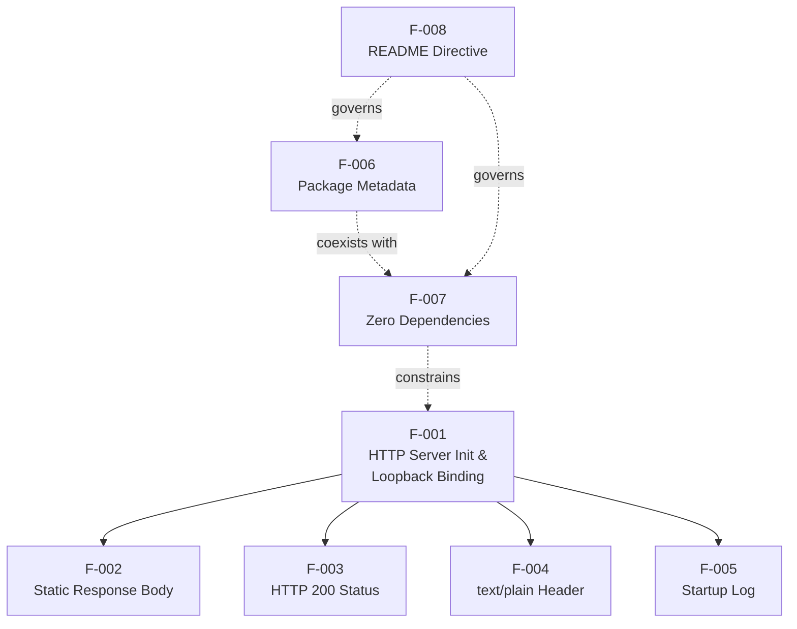

Key observations from the dependency map:

- **F-001 is the runtime root.** Removing F-001 makes F-002–F-005 unobservable.
- **F-007 acts as a structural constraint on F-001.** The zero-dependency posture forces F-001 to use Node.js built-in `http` rather than a third-party framework.
- **F-008 is a meta-feature.** The "Do not touch!" directive applies to all source files and therefore implicitly governs F-006 and F-007 by codifying that they must not change.

### 2.3.2 Integration Points

| Integration Point | Direction | Counterparty | Mechanism |
|---|---|---|---|
| HTTP request/response surface | Inbound | External "backprop" platform | TCP/HTTP on `127.0.0.1:3000` |
| Process invocation | Inbound | Local operator shell | `node server.js` command |
| Startup log capture | Outbound | Local operator shell / log collector | stdout stream |
| npm manifest inspection | Inbound | npm-compatible tooling | File system read of `package.json` |

The HTTP request/response surface is the only integration point that involves external code execution. All other integration points are inspection-only.

### 2.3.3 Shared Components and Common Services

There are no shared components within this repository. The system consists of:

- A single executable file (`server.js`) containing a single function expression (the `http.createServer` callback)
- Two declarative JSON files (`package.json`, `package-lock.json`)
- A single documentation file (`README.md`)

No internal modules, utility libraries, configuration loaders, middleware layers, or service abstractions exist. Per Tech Spec §1.2.2, "The system is intentionally non-decomposed and consists of a single executable component."

### 2.3.4 Cross-Feature Component Matrix

| Feature | Source File | Lines of Code Touched | Shared With |
|---|---|---|---|
| F-001 | `server.js` | Lines 1, 3–4, 6, 12–14 | F-002, F-003, F-004, F-005 |
| F-002 | `server.js` | Line 9 | F-001 |
| F-003 | `server.js` | Line 7 | F-001 |
| F-004 | `server.js` | Line 8 | F-001 |
| F-005 | `server.js` | Line 13 | F-001 |
| F-006 | `package.json` | Lines 2–10 | F-007 |
| F-007 | `package.json`, `package-lock.json` | Absence of dependency keys | F-006 |
| F-008 | `README.md` | Lines 1–2 | All (governs file inventory) |

---

## 2.4 IMPLEMENTATION CONSIDERATIONS

### 2.4.1 Technical Constraints

| Feature | Constraint |
|---|---|
| F-001 | Hostname (`127.0.0.1`) and port (`3000`) are hardcoded `const` literals; no `process.env` override mechanism exists |
| F-001 | CommonJS module system only (`require`), not ESM `import` |
| F-001 | No `engines` field in `package.json`; any Node.js version supporting `http.createServer` and template literals is implicitly acceptable |
| F-002 | Response body is a string literal; no dynamic content generation is permitted |
| F-003 | Status code is set via property assignment (`res.statusCode = 200`), not via `res.writeHead` |
| F-004 | Content-Type value is the bare `text/plain` with no charset parameter |
| F-005 | Logging is via `console.log` only; no structured-logging framework |
| F-006 | `main` field declares `index.js`, but no such file exists — the package cannot be `require()`'d as a library |
| F-007 | The constraint is structural: any dependency introduction is a constraint violation |
| F-008 | The "Do not touch!" directive operates as a social-contract constraint, not a technical enforcement |

### 2.4.2 Performance Requirements

Per Tech Spec §1.2.3, traditional product KPIs (DAU/MAU, conversion, retention, latency SLOs) are not applicable because there are no end users and no production deployment. The applicable indicators are binary acceptance checks rather than ranged metrics:

| KPI | Target | Applicable Features |
|---|---|---|
| Cold-start success rate | 100% | F-001, F-005 |
| Response correctness (byte-exact match) | 100% | F-002, F-003, F-004 |
| Declared dependency count | 0 | F-007 |
| Repository file-count drift from baseline | 0 | F-008 |

No latency targets, throughput targets, or concurrency targets are specified or implied by the codebase.

### 2.4.3 Scalability Considerations

| Dimension | Consideration |
|---|---|
| Process model | Single Node.js event loop handles all requests; no `cluster`, no worker threads, no PM2/systemd configuration |
| Horizontal scaling | Theoretically trivial because the server is stateless, but explicitly out of scope per Tech Spec §1.3.3 |
| Vertical scaling | Not addressed; the artifact is a test fixture, not a production workload |
| Concurrency limits | Bounded only by Node.js default event-loop and OS socket-backlog defaults |
| Connection persistence | HTTP keep-alive behavior follows Node.js `http` module defaults |

Per Tech Spec §1.3.3, "Production traffic serving" is explicitly enumerated as an unsupported use case (reason: "Loopback-only binding; no hardening or scaling").

### 2.4.4 Security Implications

| Feature | Security Posture |
|---|---|
| F-001 | Loopback-only binding (`127.0.0.1`) makes the server unreachable from any network beyond the host, dramatically reducing exposure |
| F-001 | Uses `http` (not `https`); no TLS termination — acceptable only because of loopback binding |
| F-002 | Body is a fixed literal with no request-derived data, eliminating reflection-based injection vectors |
| F-003 | Uniform 200 response prevents information disclosure through status code differentiation |
| F-004 | Explicit Content-Type prevents MIME-sniffing ambiguities |
| F-005 | Log message contains no secrets, request data, or internal state |
| F-006 | No registry tokens, no API keys, no auth material in the manifest |
| F-007 | Zero dependencies eliminates the entire supply-chain attack surface |
| Request handling | The `req` object is never read — no input is parsed, no headers consulted, no body deserialized |

Per Tech Spec §1.3.3, authentication, authorization, request parsing, and input validation are all explicitly out of scope. This stance is acceptable in context because the artifact is bound to loopback and intentionally exposes no sensitive functionality.

### 2.4.5 Maintenance Requirements

| Aspect | Position |
|---|---|
| Modification policy | `README.md` explicitly prohibits changes via "Do not touch!" |
| Build / install / transpile | None required; project runs directly from cloned source (Tech Spec §1.3.1) |
| Test suite | The `test` npm script is the default placeholder error; no automated tests exist (Tech Spec §1.3.3) |
| Linting / formatting / type checking | No `.eslintrc`, `.prettierrc`, or TypeScript configuration present (Tech Spec §1.3.3) |
| CI/CD | No `.github/`, `.gitlab-ci.yml`, or equivalent pipeline configuration (Tech Spec §1.3.3) |
| Source-control hygiene | No `.gitignore` file present (Tech Spec §1.3.3) |
| Dependency upgrades | Not applicable — there are no dependencies to upgrade |
| License compliance | License declared as `MIT` in `package.json`; no `LICENSE` file is present, which is flagged in Tech Spec §1.3.3 as a use-case constraint for strict compliance review |
| Versioning | Repository has no version history beyond `1.0.0`; no roadmap, no TODOs, no issue-tracker references (Tech Spec §1.3.3) |

The maintenance posture is intentional: the artifact's value derives from invariance over time, and any maintenance activity beyond preserving the current state risks compromising its role as a deterministic baseline.

---

## 2.5 TRACEABILITY MATRIX

### 2.5.1 Feature-to-Evidence Traceability

| Feature ID | Source File | Specific Location |
|---|---|---|
| F-001 | `server.js` | Lines 1, 3–4, 6, 12–14 (`require('http')`, hostname constant, port constant, `createServer`, `listen`) |
| F-002 | `server.js` | Line 9 (`res.end('Hello, World!\n')`) |
| F-003 | `server.js` | Line 7 (`res.statusCode = 200`) |
| F-004 | `server.js` | Line 8 (`res.setHeader('Content-Type', 'text/plain')`) |
| F-005 | `server.js` | Line 13 (`console.log` inside `listen` callback) |
| F-006 | `package.json` | Lines 2–5, 9–10 (name, version, description, main, author, license) |
| F-007 | `package.json`, `package-lock.json` | Absence of `dependencies`/`devDependencies` in manifest; root-only `packages` block in lockfile |
| F-008 | `README.md` | Lines 1–2 (heading and directive) |

### 2.5.2 Requirement-to-Acceptance-Criterion Traceability

| Requirement ID | Tech Spec §1.2.3 Objective / KPI Reference |
|---|---|
| F-001-RQ-001 through F-001-RQ-004 | "Server starts without error on `node server.js`" objective; Cold-start success rate KPI (target 100%) |
| F-002-RQ-001 through F-002-RQ-003 | "Response body is byte-identical to `Hello, World!\n`" objective; Response correctness KPI (target 100%) |
| F-003-RQ-001 through F-003-RQ-002 | "Server responds 200 OK to any HTTP request on port 3000" objective |
| F-004-RQ-001 through F-004-RQ-002 | (No explicit Measurable Objective; supported by Tech Spec §1.3.1 in-scope feature listing) |
| F-005-RQ-001 through F-005-RQ-003 | "Server starts without error" verification method: "Console emits `Server running at http://127.0.0.1:3000/`" |
| F-006-RQ-001 through F-006-RQ-004 | (No explicit Measurable Objective; supported by Tech Spec §1.2.2 primary capabilities table) |
| F-007-RQ-001 through F-007-RQ-004 | "No dependencies are introduced into the project" objective; Declared dependency count KPI (target 0); Zero-dependency posture Critical Success Factor |
| F-008-RQ-001 through F-008-RQ-003 | Preservation of file inventory Critical Success Factor; Repository file-count drift KPI (target 0) |

### 2.5.3 Feature-to-Process-Flow Reference

The single primary user workflow is documented in Tech Spec §1.3.1 "Primary User Workflows" as a sequence diagram covering Operator → Node.js Runtime → HTTP Server → HTTP Client interactions. The mapping of features to that flow is:

| Workflow Step | Features Exercised |
|---|---|
| `node server.js` invocation by Operator | F-001, F-007 |
| `http.createServer` initialization | F-001 |
| Bind completion and startup log emission | F-001, F-005 |
| HTTP request from Client (any method, any path) | F-001 |
| `200 OK`, `text/plain`, `Hello, World!\n` response | F-002, F-003, F-004 |

---

## 2.6 ASSUMPTIONS AND CONSTRAINTS

### 2.6.1 Assumptions

| ID | Assumption | Source |
|---|---|---|
| A-001 | A Node.js runtime is available on the host that supports `http.createServer` and ES2015 template literals | Tech Spec §1.3.1 Key Technical Requirements |
| A-002 | TCP port `3000` on `127.0.0.1` is free at startup time | Tech Spec §1.3.1 Key Technical Requirements |
| A-003 | The external "backprop" platform performs all integration against the running HTTP surface from outside the repository | Tech Spec §1.1.2, §1.2.1, §1.3.1 |
| A-004 | Operators will invoke the server via direct `node server.js` rather than `npm start` (no `start` script exists) | `package.json` `scripts` block; Tech Spec §1.3.3 unsupported use cases |
| A-005 | Operators will not attempt to `require()` this package as a library (the `main` field's `index.js` target does not exist) | `package.json` `main` field; Tech Spec §1.3.3 unsupported use cases |

### 2.6.2 Constraints

| ID | Constraint | Source |
|---|---|---|
| C-001 | The repository must contain exactly four files: `server.js`, `package.json`, `package-lock.json`, `README.md` | "Do not touch!" directive; Tech Spec §1.2.3 Critical Success Factor (Preservation of file inventory) |
| C-002 | The system must declare zero runtime and development dependencies | Tech Spec §1.2.3 Critical Success Factor (Zero-dependency posture) |
| C-003 | The server must bind only to the loopback interface (`127.0.0.1`), not `0.0.0.0` or any external interface | `server.js` `hostname` constant; Tech Spec §1.3.2 Geographic and Market Coverage |
| C-004 | The application must run as a single OS process with no clustering, worker threads, or supervisor | Tech Spec §1.2.1, §1.3.2 System Boundaries |
| C-005 | The response body must remain a fixed string literal; dynamic content is unsupported | Tech Spec §1.3.3 Unsupported Use Cases |
| C-006 | The system must run directly from cloned source without any build, install, transpile, or compile step | Tech Spec §1.3.1 Key Technical Requirements |

### 2.6.3 Identified Discrepancies

The repository contains the following documented discrepancies that consumers of this specification should be aware of:

| ID | Discrepancy | Impact |
|---|---|---|
| D-001 | `package.json` declares `name: hello_world` while `README.md` titles the project `hao-backprop-test` | Naming reference must be unambiguous in downstream documentation; both names refer to the same artifact (Tech Spec §1.2.1) |
| D-002 | `package.json` declares `main: index.js`, but no `index.js` file exists | Package cannot be `require()`'d as a library; only direct invocation via `node server.js` is supported (Tech Spec §1.3.3) |
| D-003 | `package.json` declares `license: MIT`, but no `LICENSE` file is present in the repository | Use under strict license-compliance review is an unsupported use case (Tech Spec §1.3.3) |
| D-004 | `package.json` defines no `start` script; only the default placeholder `test` script | Invocation via `npm start` is unsupported (Tech Spec §1.3.3) |
| D-005 | `package.json` declares no `engines` field | Any Node.js version supporting the required APIs is implicitly accepted; no version pinning is enforced (Tech Spec §1.2.2) |
| D-006 | The term "backprop" appears exactly once in the repository — in `README.md` — and is not referenced by any code, configuration, or dependency | The "backprop" integration occurs entirely externally; no in-repo integration code exists (Tech Spec §1.1.2) |

### 2.6.4 Version Tracking

| Requirement Version Aspect | Value |
|---|---|
| Repository version (per `package.json`) | `1.0.0` |
| Lockfile version (per `package-lock.json`) | `lockfileVersion: 3` |
| Requirements baseline established | Captured from the current `1.0.0` state of the repository |
| Anticipated future versions | None — Tech Spec §1.3.3 confirms "no roadmap, no TODOs, no issue-tracker references, and no version history beyond `1.0.0`" |

---

## 2.7 REFERENCES

### 2.7.1 Files Examined

- `server.js` — Source of all runtime behavior; provides evidence for features F-001 (server creation and binding, lines 1, 3–4, 6, 12–14), F-002 (response body, line 9), F-003 (status code, line 7), F-004 (Content-Type header, line 8), and F-005 (startup log, line 13).
- `package.json` — Source of package metadata; provides evidence for feature F-006 (lines 2–5, 9–10) and feature F-007 (absence of `dependencies` and `devDependencies` keys).
- `package-lock.json` — Source confirming zero transitive dependencies; provides supporting evidence for feature F-007 (root-only `packages` block, `lockfileVersion: 3`).
- `README.md` — Source of the human-facing project name, purpose statement, and modification-prohibition directive; provides evidence for feature F-008 (lines 1–2).

### 2.7.2 Folders Examined

- Repository root (`/`) — Confirmed to contain exactly the four files listed above and no subdirectories of source code. The file inventory is invariant per the "Do not touch!" directive.

### 2.7.3 Technical Specification Sections Cross-Referenced

- **§1.1 Executive Summary** — Project overview, business problem framing, stakeholder roles, value proposition (determinism), and the note that "backprop" appears only in `README.md`.
- **§1.2 System Overview** — Project context, naming-discrepancy table, system limitations, primary capabilities table, runtime topology diagram, technical-approach table, measurable objectives, critical success factors, and KPIs that ground the priority levels and acceptance criteria in this section.
- **§1.3 Scope** — In-scope features (cross-referenced as the foundation for the F-001–F-008 catalog), primary user workflow sequence diagram (referenced in §2.5.3), key technical requirements (referenced as assumptions A-001 and A-002), system boundaries, user groups, explicitly excluded capabilities (used to delimit what is intentionally absent from the feature catalog), and unsupported use cases (referenced as discrepancies D-002 through D-004).

# 3. Technology Stack

## 3.1 TECHNOLOGY STACK OVERVIEW

### 3.1.1 Stack Philosophy and Design Intent

The `hao-backprop-test` repository implements an **intentionally minimal technology stack** designed around a single load-bearing constraint: the **Zero-Dependency Posture** (Feature F-007, Critical priority). The Technical Specification §1.2.3 elevates this posture to a Critical Success Factor, stating that "Introducing any external package would defeat the deterministic-baseline value of the artifact." Consequently, the technology stack consists exclusively of:

- The **Node.js runtime** (any version that supports the required built-in APIs)
- The **Node.js built-in `http` core module** (not a third-party package)
- **CommonJS** as the module system
- **JSON** for declarative package metadata
- **Markdown** for human-facing documentation

No web framework, database driver, configuration library, logging framework, authentication provider, build tool, transpiler, bundler, linter, formatter, type checker, test runner, container runtime, orchestrator, infrastructure-as-code tool, or CI/CD pipeline is present in or referenced by the repository.

### 3.1.2 Default Technology Stack Applicability

The project context provided a default technology stack (AWS, Docker, Terraform, GitHub Actions, Python, Flask, Auth0, MongoDB, Langchain, React, TypeScript, TailwindCSS, React-Native, Swift, Kotlin, Objective-C, ElectronJS). The following matrix documents the applicability of each default-stack element to this specific repository, based on exhaustive file-level inspection:

| Default Stack Category | Default Item | Status in Repository | Rationale |
|---|---|---|---|
| Cloud Platform | AWS | **Not used** | No cloud SDKs, no cloud configuration files; loopback-only binding precludes cloud deployment |
| Containerization | Docker | **Not used** | Tech Spec §1.3.3: "No `Dockerfile` or `docker-compose.yml`" |
| Infrastructure as Code | Terraform | **Not used** | No `.tf` files; no infrastructure to provision |
| CI/CD | GitHub Actions | **Not used** | Tech Spec §1.3.3: "No `.github/`" |
| Backend Language | Python | **Not used** | No `.py`, `requirements.txt`, `setup.py`, `pyproject.toml`, or `Pipfile` exists |
| Backend Framework | Flask | **Not applicable** | Python framework; no Python source present |
| Authentication | Auth0 | **Not used** | Tech Spec §1.3.3: "Authentication / authorization — No auth code in `server.js`; no auth packages in lockfile" |
| Database | MongoDB | **Not used** | Tech Spec §1.3.3: "Persistence layer — No database client" |
| AI Framework | Langchain | **Not used** | No AI/ML functionality in scope |
| Frontend (Web) | React + TypeScript | **Not used** | Tech Spec §1.3.3: "No HTML, CSS, or client-side JavaScript" |
| CSS Framework | TailwindCSS | **Not used** | No frontend assets exist |
| Mobile/Cross-platform | React-Native + TypeScript | **Not used** | No mobile application code |
| iOS Native | Swift | **Not used** | No native source files |
| Android Native | Kotlin | **Not used** | No native source files |
| MacOS Native | Objective-C | **Not used** | No native source files |
| Desktop | ElectronJS | **Not used** | No desktop application code |

The default stack is comprehensively non-applicable to this artifact. The actual technology stack is documented in the subsections that follow.

### 3.1.3 Technology Stack Composition Diagram

The following diagram illustrates the complete runtime and tooling composition of the repository:

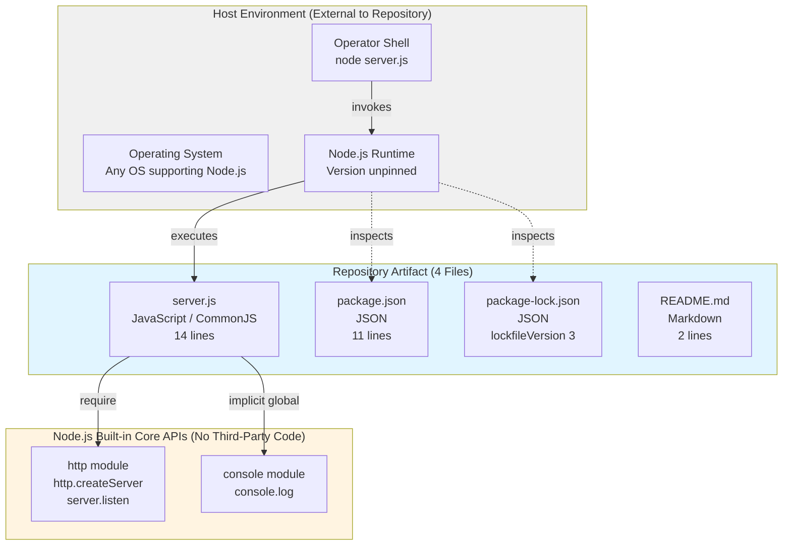

---

## 3.2 PROGRAMMING LANGUAGES

### 3.2.1 Languages by Component

| Language | File(s) | Role | Evidence |
|---|---|---|---|
| **JavaScript** (ECMAScript) | `server.js` | All runtime logic (HTTP server, request handling, startup logging) | Uses `require('http')` (CommonJS), `const` declarations, arrow function `(req, res) => { ... }`, and ES2015 template literal `` `Server running at http://${hostname}:${port}/` `` |
| **JSON** | `package.json`, `package-lock.json` | Declarative package manifest and lockfile (not executed) | `package.json` 11 lines; `package-lock.json` 13 lines with `lockfileVersion: 3` |
| **Markdown** | `README.md` | Human-facing documentation | Two lines: a `#` heading and a single declarative sentence |

### 3.2.2 Primary Runtime Language: JavaScript

#### 3.2.2.1 Language Variant and Module System

The runtime language is **JavaScript (ECMAScript)** executed under the Node.js runtime. Two language characteristics are structurally fixed:

- **Module System: CommonJS only.** The single `require('http')` import in `server.js` line 1 establishes CommonJS as the module loading mechanism. Per Tech Spec §2.4.1, this is an explicit constraint: "CommonJS module system only (`require`), not ESM `import`."
- **Language Features Used:** ES2015 (ES6) features including `const` declarations, arrow functions, and template literals. Tech Spec §2.1.2.3 identifies the minimum runtime requirement as "A Node.js runtime that supports `http.createServer` and ES2015 template literals."

#### 3.2.2.2 Language Version Pinning

The `package.json` declares **no `engines` field**. Per Tech Spec §2.6.3 (Discrepancy D-005), this means "any Node.js version supporting the required APIs is implicitly accepted; no version pinning is enforced." Operators must independently provide a compatible Node.js installation; the repository does not enforce or recommend a specific major version.

#### 3.2.2.3 Selection Criteria and Justification

The choice of JavaScript on Node.js is dictated entirely by the **F-007 Zero-Dependency Posture** and by Tech Spec §1.3.1's requirement that the project "runs directly from cloned source." Node.js was selected because:

1. Its **built-in `http` core module** allows construction of a complete HTTP server without any third-party dependency, directly satisfying F-007.
2. Its **single-file executable model** (no build, no transpile, no install) satisfies Constraint C-006: "The system must run directly from cloned source without any build, install, transpile, or compile step."
3. Its **CommonJS module system** is the default for `.js` files without an `"type": "module"` declaration in `package.json`, requiring no opt-in configuration.

### 3.2.3 Declarative Languages

#### 3.2.3.1 JSON for Package Manifests

JSON is used for the two npm-managed manifest files. The `package.json` declares package identity (`name: hello_world`, `version: 1.0.0`, `description: "Hello world in Node.js"`, `main: index.js`, `author: hxu`, `license: MIT`) and a placeholder `test` script. The `package-lock.json` declares `lockfileVersion: 3` and contains only the root entry in its `packages` object, with no transitive packages — providing cryptographic-style proof of the zero-dependency posture.

#### 3.2.3.2 Markdown for Documentation

`README.md` consists of exactly two lines of plain Markdown: a level-1 heading (`# hao-backprop-test`) and a single declarative sentence stating the project's purpose and a "Do not touch!" restriction. No front-matter, embedded code blocks, link targets, or diagrams are present.

### 3.2.4 Languages Explicitly Not Used

The following languages are confirmed absent from the repository:

| Language | Evidence of Absence |
|---|---|
| **TypeScript** | Tech Spec §1.3.3: "No `.eslintrc`, `.prettierrc`, or TypeScript config"; no `.ts` files exist |
| **Python** | No `.py` files; no `requirements.txt`, `setup.py`, `pyproject.toml`, or `Pipfile` |
| **Swift / Kotlin / Objective-C** | No native mobile/desktop source files of any kind |
| **HTML / CSS** | Tech Spec §1.3.3: "Frontend / UI assets — No HTML, CSS, or client-side JavaScript" |
| **Shell scripts / Dockerfile / YAML** | No `.sh`, `Dockerfile`, `.yml`, or `.yaml` files |

---

## 3.3 FRAMEWORKS & LIBRARIES

### 3.3.1 Web Framework: None

Per Tech Spec §1.2.2 Core Technical Approach, the **Web framework value is explicitly "None"**. The Tech Spec §2.1.2.2 further clarifies: "No web framework (Express, Koa, Fastify, etc.) is involved."

All HTTP functionality is provided by the **Node.js built-in `http` core module**, which is part of the Node.js standard library and is **not a third-party package**. The module exposes the APIs used in `server.js`:

| API | Usage Location in `server.js` | Purpose |
|---|---|---|
| `http.createServer(callback)` | Line 6 | Constructs the HTTP server instance with a single request handler |
| `server.listen(port, hostname, callback)` | Line 12 | Binds the server to TCP port `3000` on `127.0.0.1` and emits the startup log on success |
| `res.statusCode` (property) | Line 7 | Sets the response status to `200` (per F-003) |
| `res.setHeader(name, value)` | Line 8 | Sets the `Content-Type: text/plain` response header (per F-004) |
| `res.end(body)` | Line 9 | Writes the static `Hello, World!\n` body and terminates the response (per F-002) |

### 3.3.2 Libraries and Frameworks Explicitly Not Used

The following framework and library categories are confirmed absent based on the Tech Spec §1.3.3 and the zero-dependency lockfile:

| Category | Excluded Items | Reason for Absence |
|---|---|---|
| HTTP frameworks | Express, Koa, Fastify, Hapi, NestJS, Restify | F-007 Zero-Dependency Posture; built-in `http` module suffices |
| Frontend frameworks | React, Vue, Angular, Svelte | No UI is in scope (Tech Spec §1.3.3) |
| CSS frameworks | TailwindCSS, Bootstrap, Bulma | No frontend assets present |
| State management | Redux, MobX, Zustand | No frontend; server is stateless |
| ORM / database clients | Mongoose, Sequelize, Prisma, TypeORM, Knex | No persistence layer (Tech Spec §1.3.3) |
| Authentication libraries | Passport, jsonwebtoken, Auth0 SDKs | No auth scope (Tech Spec §1.3.3) |
| Logging libraries | Winston, Bunyan, Pino | Only `console.log` is used (F-005, Tech Spec §2.4.1) |
| Configuration libraries | dotenv, config, convict | Hardcoded constants only; no `process.env` reads |
| Validation libraries | Joi, Yup, Zod, ajv | `req` is never read; no input validation |
| Testing frameworks | Jest, Mocha, Vitest, Tap | `test` script is the npm-default placeholder error |
| Build tools / bundlers | Webpack, esbuild, Rollup, Vite, Parcel | No build step required (C-006) |
| Transpilers | Babel, tsc, SWC | No source transformation required |
| AI / ML frameworks | Langchain, TensorFlow.js, OpenAI SDK | No AI functionality in scope |

### 3.3.3 Framework Absence: Architectural Justification

Per Tech Spec §2.3.1 Feature Dependencies Map: "**F-007 acts as a structural constraint on F-001.** The zero-dependency posture forces F-001 to use Node.js built-in `http` rather than a third-party framework." The absence of frameworks is not an oversight but a structural design choice that delivers:

1. **Supply-chain security** (Tech Spec §2.4.4): "Zero dependencies eliminates the entire supply-chain attack surface."
2. **Behavioral determinism** (Tech Spec §1.2.3): The server's output must remain identical across executions, which is "enforced structurally by the absence of state, conditionals, and external inputs."
3. **Install-free execution** (Tech Spec §1.3.1): The project runs directly from cloned source with no `npm install` required.
4. **Compatibility durability**: Without third-party packages, the artifact's compatibility surface is bounded by Node.js core APIs only, which evolve under semver guarantees.

---

## 3.4 OPEN SOURCE DEPENDENCIES

### 3.4.1 Runtime Dependencies

**Count: Zero.**

The `package.json` manifest contains **no `dependencies` key**. There are no third-party runtime packages declared, fetched, or required by `server.js`. The only module imported by the application — Node.js's `http` core module — ships with the Node.js runtime itself and is not a third-party dependency.

### 3.4.2 Development Dependencies

**Count: Zero.**

The `package.json` manifest contains **no `devDependencies` key**, no `peerDependencies` key, and no `optionalDependencies` key. There are no linters, formatters, type checkers, test frameworks, build tools, or bundlers declared.

### 3.4.3 Lockfile State and Verification

The `package-lock.json` file (`lockfileVersion: 3`, npm 7+ format) serves as a cryptographic-style attestation of the zero-dependency posture. Its `packages` object contains exactly one entry — the empty-string key `""` representing the root project — with no transitive packages declared. This lockfile state is structurally equivalent to a signed assertion that the dependency graph is empty.

Per Tech Spec §2.1.8.2 (F-007 Description): "`package-lock.json` declares `lockfileVersion: 3` and contains only a single root-package entry with no transitive packages."

### 3.4.4 Package Registry Configuration

| Aspect | Value |
|---|---|
| Registry referenced | **npm public registry** (`https://registry.npmjs.org/`), implied by the npm lockfile format |
| Packages actually fetched | **Zero** — no dependencies are declared, so no fetch operation is required |
| Private registry configuration | None — no `.npmrc` file present |
| Registry authentication | None — no auth tokens or credentials in manifest |

Per Tech Spec §2.4.5 Maintenance Requirements: "Dependency upgrades — Not applicable — there are no dependencies to upgrade."

### 3.4.5 Dependency Status Summary

| Dependency Slot | Declared | Resolved | Count |
|---|---|---|---|
| `dependencies` | Absent | N/A | 0 |
| `devDependencies` | Absent | N/A | 0 |
| `peerDependencies` | Absent | N/A | 0 |
| `optionalDependencies` | Absent | N/A | 0 |
| Transitive packages (lockfile) | N/A | None | 0 |

---

## 3.5 THIRD-PARTY SERVICES

### 3.5.1 External Services Integrated: None

Per Tech Spec §1.2.1 "Integration with Existing Enterprise Landscape": "The repository declares no integrations and exposes no enterprise integration surfaces." The following table enumerates every category of third-party service typically present in a backend application, along with its absence evidence:

| Service Category | Status | Evidence |
|---|---|---|
| External APIs (REST/GraphQL/gRPC) | **None** | Tech Spec §1.3.3: "External API integrations — No SDK or HTTP client dependencies declared" |
| Authentication providers (Auth0, Okta, Cognito) | **None** | Tech Spec §1.3.3: "Authentication / authorization — No auth code in `server.js`; no auth packages in lockfile" |
| Cloud platform services (AWS, GCP, Azure) | **None** | No cloud SDK packages; no cloud configuration files; loopback-only binding |
| Monitoring / APM tools (Datadog, New Relic, Sentry) | **None** | Tech Spec §1.2.1: "No service-discovery or telemetry registrations" |
| Logging aggregators (Splunk, ELK, Loggly) | **None** | Only `console.log` writes to stdout (F-005) |
| Message queues / event buses (Kafka, RabbitMQ, SQS) | **None** | Tech Spec §1.2.1: "No database connectors, queue clients, or message-bus integrations" |
| Email / notification services (SendGrid, Twilio) | **None** | No SDKs; no notification logic |
| Payment processors (Stripe, PayPal) | **None** | No SDKs; no transactional logic |
| Feature flag services (LaunchDarkly, Split) | **None** | No configuration system |
| Secrets managers (Vault, AWS Secrets Manager) | **None** | No secrets to manage |
| CDN / asset hosts | **None** | No static assets to serve |
| Webhook receivers / callback endpoints | **None** | Tech Spec §1.3.3: No such endpoints implemented |
| Health-check / readiness probes | **None** | Tech Spec §1.3.3: No such endpoints implemented |

### 3.5.2 The "backprop" External Counterparty

The repository's name (`hao-backprop-test`) and `README.md` reference a system named **"backprop"**, but per Tech Spec §2.6.3 (Discrepancy D-006): "The term 'backprop' appears exactly once in the repository — in `README.md` — and is not referenced by any code, configuration, or dependency. The 'backprop' integration occurs entirely externally; no in-repo integration code exists."

Per Tech Spec §1.3.3 "Integration Points Not Covered":

- No client SDK for the external "backprop" platform exists in the repository
- No callback URL, webhook receiver, or event consumer for backprop is implemented
- No authentication exchange (API keys, OAuth, mTLS) with backprop is configured
- No data export, schema declaration, or contract artifact is present
- No health-check, readiness, or liveness endpoint is defined

The "backprop" platform is therefore a **counterparty**, not a "third-party service" in the integration sense — it consumes this repository's HTTP surface from the outside.

### 3.5.3 Integration Surface Catalog

Per Tech Spec §2.3.2, the only integration surfaces are:

| Integration Point | Direction | Counterparty | Mechanism | Authentication |
|---|---|---|---|---|
| HTTP request/response surface | Inbound | External "backprop" platform | TCP/HTTP on `127.0.0.1:3000` | None (loopback-only) |
| Process invocation | Inbound | Local operator shell | `node server.js` command | None (OS-level) |
| Startup log capture | Outbound | Local shell / log collector | stdout stream | None |
| npm manifest inspection | Inbound | npm-compatible tooling | File system read of `package.json` | None |

All integration points are either inspection-only or loopback-bound; none traverse a public network or require credentials.

---

## 3.6 DATABASES & STORAGE

### 3.6.1 Primary Database: None

Per Tech Spec §1.3.2 "Data Domains Included": "**None. The application persists no data, accepts no inputs that influence its behavior, declares no schemas, and emits a single fixed ASCII byte sequence as its only output payload. There is no data domain to model.**"

The following table enumerates the absence of every category of data store:

| Storage Category | Status | Evidence |
|---|---|---|
| Relational databases (PostgreSQL, MySQL, MariaDB, SQLite) | **None** | No drivers in lockfile; no schema files |
| Document databases (MongoDB, CouchDB) | **None** | No `mongodb` or related package in lockfile |
| Key-value stores (Redis, Memcached) | **None** | No client packages; no cache layer |
| Search engines (Elasticsearch, Solr, OpenSearch) | **None** | No client packages |
| Time-series databases (InfluxDB, TimescaleDB) | **None** | No client packages |
| Graph databases (Neo4j, ArangoDB) | **None** | No client packages |
| Embedded databases (SQLite, LevelDB) | **None** | No native bindings; no `.db` files |
| Object storage (S3, GCS, Azure Blob) | **None** | No SDK; loopback-only architecture |
| Block / file storage | **None** | Tech Spec §1.3.3: "no file I/O beyond stdout" |

### 3.6.2 Data Persistence Strategy

**Strategy: Stateless — No Persistence.**

Per Tech Spec §2.4.3 Scalability Considerations and §1.3.3 Unsupported Use Cases, the application is **fully stateless**. There is no:

- In-memory cache (no caching code; every response constructed from the same string literal)
- Session store (no authentication, no sessions)
- Local file persistence (no `fs` module usage; the only I/O is `console.log` to stdout)
- Inter-request state (each request handler invocation is independent and emits the same fixed response)

Tech Spec §1.3.3 explicitly identifies "Long-running stateful workflows" as an unsupported use case with the reason: "Process is fully stateless."

### 3.6.3 Caching Solutions: None

No caching layer of any kind is present. Per Tech Spec §1.2.1, the application has "no persistent state or data layer of any kind." The fixed-response design makes caching unnecessary: every response is the byte sequence `Hello, World!\n` and is generated from a single string literal in `server.js` line 9.

### 3.6.4 Configuration Storage

| Configuration Element | Storage Mechanism | Override Mechanism |
|---|---|---|
| `hostname` (`127.0.0.1`) | Hardcoded `const` literal in `server.js` line 3 | **None** — no `process.env` reads |
| `port` (`3000`) | Hardcoded `const` literal in `server.js` line 4 | **None** — same |
| Response status (`200`) | Hardcoded in handler (line 7) | None |
| Content-Type (`text/plain`) | Hardcoded in handler (line 8) | None |
| Response body (`Hello, World!\n`) | Hardcoded in handler (line 9) | None |

Per Tech Spec §2.4.1: "Hostname (`127.0.0.1`) and port (`3000`) are hardcoded `const` literals; no `process.env` override mechanism exists." Per Tech Spec §1.3.3: "Multi-environment configuration — No `.env`, no `config/`, no `process.env` reads."

---

## 3.7 DEVELOPMENT & DEPLOYMENT

### 3.7.1 Development Tools

#### 3.7.1.1 Code Quality Tooling

| Tool Category | Tool | Status | Evidence |
|---|---|---|---|
| Linter | ESLint | **None** | Tech Spec §1.3.3 / §2.4.5: "No `.eslintrc`" |
| Formatter | Prettier | **None** | Tech Spec §1.3.3 / §2.4.5: "No `.prettierrc`" |
| Type checker | TypeScript (`tsc`) | **None** | Tech Spec §1.3.3 / §2.4.5: "No TypeScript config" |
| Spell checker | — | **None** | No configuration files |
| Pre-commit hooks | Husky, lint-staged | **None** | No `.husky/` directory; no `lint-staged` config |

#### 3.7.1.2 Testing Tooling

| Tool Category | Tool | Status | Evidence |
|---|---|---|---|
| Test runner | Jest / Mocha / Vitest / Tap | **None** | Tech Spec §2.4.5: "no automated tests exist" |
| `test` npm script | (npm default placeholder) | **Placeholder only** | `package.json` `scripts.test` = `echo "Error: no test specified" && exit 1` |
| Coverage tooling | Istanbul / nyc / c8 | **None** | No coverage configuration |
| End-to-end testing | Playwright / Cypress | **None** | No E2E configuration |

Per Tech Spec §2.4.5: "The `test` npm script is the default placeholder error; no automated tests exist."

#### 3.7.1.3 Version Control

| Aspect | Value | Evidence |
|---|---|---|
| Version control system | **Git** | `.git/` directory present in repository |
| `.gitignore` file | **Absent** | Tech Spec §1.3.3 / §2.4.5: "No `.gitignore` file present" |
| `.gitattributes` file | Absent | Not present |
| Git hooks | None configured | Only Git's default hook samples present |

### 3.7.2 Build System

#### 3.7.2.1 Build Step Requirements

Per Tech Spec §1.3.1 Key Technical Requirements: "**No build, install, transpile, or compile step is required; the project runs directly from cloned source.**" This is reinforced by Constraint C-006 (Tech Spec §2.6.2).

| Build Element | Status |
|---|---|
| Build step | **Not required** |
| Bundler (Webpack, esbuild, Rollup, Vite) | None |
| Transpiler (Babel, tsc, SWC) | None |
| Task runner (Make, Gulp, Grunt) | None — no `Makefile`, `Gulpfile`, `Gruntfile` |
| Asset pipeline | None — no static assets |

#### 3.7.2.2 Package Scripts

The `package.json` `scripts` block contains exactly one entry:

| Script | Value | Functional? |
|---|---|---|
| `test` | `echo "Error: no test specified" && exit 1` | No — npm-default placeholder error |
| `start` | **Not defined** | Per Tech Spec §2.6.3 Discrepancy D-004: "`package.json` defines no `start` script; only the default placeholder `test` script. Invocation via `npm start` is unsupported." |
| `build` | Not defined | No build process exists |

#### 3.7.2.3 Execution Model

The artifact is invoked directly via the Node.js binary:

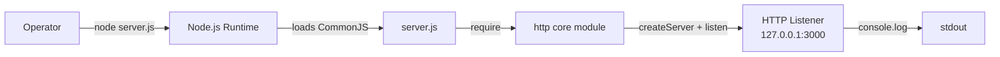

Per Tech Spec §2.6.1 Assumption A-004: "Operators will invoke the server via direct `node server.js` rather than `npm start` (no `start` script exists)."

### 3.7.3 Containerization

**Status: Not used.**

Per Tech Spec §1.3.3: "Containerization — No `Dockerfile` or `docker-compose.yml`."

| Containerization Tool | Status |
|---|---|
| Docker (`Dockerfile`) | **None** |
| docker-compose (`docker-compose.yml`) | **None** |
| Podman | None |
| Kubernetes manifests (`.yaml`/`.yml`) | None — no YAML files in repository |
| Helm charts | None |
| OCI image registry | None |

The loopback-only architecture (Constraint C-003) and single-process model (Constraint C-004) make containerization architecturally unnecessary for the artifact's intended role as a deterministic test fixture.

### 3.7.4 Infrastructure as Code

**Status: Not used.**

| IaC Tool | Status |
|---|---|
| Terraform (`.tf` files) | **None** |
| AWS CloudFormation | None |
| Pulumi | None |
| AWS CDK / Cloud Development Kit | None |
| Ansible | None |
| Chef / Puppet / Salt | None |

The loopback-bound process model has no infrastructure to provision; IaC is architecturally not applicable.

### 3.7.5 CI/CD

**Status: Not used.**

Per Tech Spec §1.3.3: "CI/CD pipelines — No `.github/`, `.gitlab-ci.yml`, or equivalent." Per Tech Spec §2.4.5: "CI/CD — No `.github/`, `.gitlab-ci.yml`, or equivalent pipeline configuration."

| CI/CD Platform | Status |
|---|---|
| GitHub Actions | **None** — no `.github/workflows/` directory |
| GitLab CI | **None** — no `.gitlab-ci.yml` |
| CircleCI | None — no `.circleci/config.yml` |
| Travis CI | None — no `.travis.yml` |
| Jenkins | None — no `Jenkinsfile` |
| Azure Pipelines | None — no `azure-pipelines.yml` |

The "Do not touch!" directive (F-008) combined with the absence of dependencies and tests makes a CI/CD pipeline architecturally unnecessary — there is nothing to build, no tests to run, and no automated deployment target.

### 3.7.6 Process Management and Orchestration

**Status: Not used.**

Per Tech Spec §1.3.3: "Clustering / process management — No `cluster` import; no PM2 or systemd config." Per Tech Spec §2.4.3 Scalability Considerations: "Single Node.js event loop handles all requests; no `cluster`, no worker threads, no PM2/systemd configuration."

| Process Manager | Status |
|---|---|
| PM2 | **None** |
| systemd unit files | **None** |
| Node.js `cluster` module | **Not used** |
| Worker threads (`worker_threads`) | **Not used** |
| Supervisord | None |

The application runs as a single OS process for the duration of its lifetime (Constraint C-004).

### 3.7.7 Deployment Model

Per Tech Spec §1.3.2 System Boundaries: "The system boundary is the single OS process started by `node server.js`." Per Tech Spec §1.3.3 Unsupported Use Cases, "Production traffic serving" is explicitly identified as unsupported with the reason "Loopback-only binding; no hardening or scaling."

| Deployment Aspect | Value |
|---|---|
| Deployment target | Operator's local host (developer workstation, test VM, or sandbox) |
| Network exposure | Loopback only (`127.0.0.1`) — unreachable from any network beyond the host |
| Process supervision | None — process lifetime tied to operator shell |
| Restart policy | None — operator must re-invoke `node server.js` |
| Production readiness | **Not production-ready by design** (Tech Spec §1.3.3) |

---

## 3.8 CONFIGURATION CONSTANTS AND COMPATIBILITY

### 3.8.1 Hardcoded Configuration Constants

The complete set of configurable values in the entire system, all declared as hardcoded `const` literals in `server.js`:

| Constant | Value | Location | Override Mechanism |
|---|---|---|---|
| `hostname` | `'127.0.0.1'` | `server.js` line 3 | **None** (Tech Spec §2.4.1) |
| `port` | `3000` | `server.js` line 4 | **None** (same) |
| Response status code | `200` | `server.js` line 7 | None |
| Response Content-Type | `'text/plain'` | `server.js` line 8 | None |
| Response body | `'Hello, World!\n'` | `server.js` line 9 | None |

### 3.8.2 Runtime Compatibility Matrix

| Component | Minimum Requirement | Pinned? | Source |
|---|---|---|---|
| Node.js | Any version supporting `http.createServer` and ES2015 template literals | **No** (no `engines` field) | Tech Spec §2.6.1 A-001 |
| npm (for lockfile read) | npm 7+ (supports `lockfileVersion: 3`) | No | `package-lock.json` line 4 |
| Operating system | Any OS where Node.js runs and TCP port 3000 on loopback is bindable | No | Tech Spec §2.6.1 A-002 |
| TCP port | Port `3000` must be free on `127.0.0.1` at startup | Yes (hardcoded) | `server.js` line 4 |
| Stdout stream | Must be reachable for startup log emission | Implicit | Tech Spec §2.1.6.3 |

### 3.8.3 Package Metadata Discrepancies

Per Tech Spec §2.6.3, the following metadata discrepancies in `package.json` are documented:

| ID | Discrepancy | Stack Impact |
|---|---|---|
| D-001 | `name: hello_world` vs. repository name `hao-backprop-test` | Naming ambiguity in tooling that uses package name |
| D-002 | `main: index.js` declared but file does not exist | Package cannot be `require()`d as a library |
| D-003 | `license: MIT` declared but no `LICENSE` file present | Use under strict license-compliance review is unsupported |
| D-004 | No `start` script | `npm start` invocation is unsupported |
| D-005 | No `engines` field | No Node.js version pinning enforced |

---

## 3.9 TECHNOLOGY STACK SECURITY POSTURE

### 3.9.1 Security Implications by Stack Element

Per Tech Spec §2.4.4, the technology choices have the following security implications:

| Stack Element | Security Posture |
|---|---|
| HTTP (not HTTPS) | Acceptable only because of loopback binding; no TLS termination is required |
| Loopback-only binding (`127.0.0.1`) | Server unreachable from any network beyond the host, dramatically reducing exposure |
| Zero dependencies (F-007) | Eliminates the entire supply-chain attack surface |
| No request reads (`req` never used) | No input parsing, no headers consulted, no body deserialized — eliminates injection vectors |
| No authentication | Explicitly out of scope; acceptable due to loopback binding |
| Fixed response literal | No request-derived data echo — no reflection-based injection |
| No registry tokens or auth material in manifests | No secrets exposed in `package.json` or `package-lock.json` |
| No structured logging | Log message contains no secrets, request data, or internal state |

### 3.9.2 Supply-Chain Risk Profile

| Risk Vector | Mitigation in This Stack |
|---|---|
| Malicious npm package (typosquatting, dependency confusion) | **Eliminated** — zero declared dependencies |
| Transitive vulnerability propagation | **Eliminated** — empty `packages` object in lockfile |
| Outdated dependency drift | **Eliminated** — no dependencies to drift |
| Registry compromise | **Not applicable** — no fetch operations performed |
| Lockfile tampering | Minimized — lockfile asserts an empty graph that is trivially auditable |

The zero-dependency posture (F-007) is explicitly identified by Tech Spec §2.4.4 as the load-bearing security control for this artifact.

---

## 3.10 TECHNOLOGY STACK SUMMARY MATRIX

The following consolidated matrix presents the complete technology stack at a glance:

| Layer | Technology | Version | Source | Justification |
|---|---|---|---|---|
| Runtime | Node.js | Unpinned (no `engines` field) | Host-provided | Built-in `http` module enables zero-dependency HTTP server |
| Module system | CommonJS | N/A | `server.js` `require('http')` | Default for `.js` without `"type": "module"`; satisfies Tech Spec §2.4.1 |
| HTTP layer | Node.js `http` core module | Bundled with Node.js | `server.js` line 1 | F-007 Zero-Dependency Posture |
| Language | JavaScript (ES2015+) | N/A | `server.js` | Template literals, `const`, arrow functions used |
| Package format | npm | `lockfileVersion: 3` | `package.json`, `package-lock.json` | Standard Node.js packaging |
| Documentation | Markdown | N/A | `README.md` | Standard repository documentation |
| Dependencies (runtime) | **None** | N/A | `package.json` (no `dependencies` key) | F-007 Critical Success Factor |
| Dependencies (dev) | **None** | N/A | `package.json` (no `devDependencies` key) | F-007 Critical Success Factor |
| Database | **None** | N/A | Tech Spec §1.3.2 | Stateless application |
| Cache | **None** | N/A | Tech Spec §1.2.1 | Stateless application |
| Cloud platform | **None** | N/A | Tech Spec §1.2.1 | Loopback-only architecture |
| Containerization | **None** | N/A | Tech Spec §1.3.3 | Runs from cloned source |
| CI/CD | **None** | N/A | Tech Spec §1.3.3 | No build, no tests, no deploy target |
| IaC | **None** | N/A | No `.tf`/`.yml` files | No infrastructure to provision |
| Auth provider | **None** | N/A | Tech Spec §1.3.3 | No authentication scope |

---

## 3.11 REFERENCES

### 3.11.1 Repository Files Examined

- `server.js` — Sole runtime executable. Provided evidence for: CommonJS `require('http')` import (line 1), hardcoded `hostname` (`127.0.0.1`, line 3) and `port` (`3000`, line 4), `http.createServer` callback (lines 6–10), `res.statusCode = 200` (line 7), `res.setHeader('Content-Type', 'text/plain')` (line 8), `res.end('Hello, World!\n')` (line 9), and `server.listen` with `console.log` startup callback (lines 12–14). Confirmed: zero third-party imports.
- `package.json` — Package manifest (11 lines). Provided evidence for: `name: hello_world`, `version: 1.0.0`, `description: "Hello world in Node.js"`, `main: index.js`, `scripts.test` placeholder, `author: hxu`, `license: MIT`. Confirmed absence of `dependencies`, `devDependencies`, `engines`, and `start` script.
- `package-lock.json` — Lockfile (13 lines). Provided evidence for: `lockfileVersion: 3`, single root entry in `packages` object, zero transitive packages.
- `README.md` — Documentation (2 lines). Provided evidence for: project name `hao-backprop-test`, purpose statement, and "Do not touch!" restriction directive.

### 3.11.2 Repository Folders Examined

- Repository root (`/`) — Confirmed via direct file listing to contain exactly the four files above and no subdirectories of source code (per Tech Spec §1.3.4).

### 3.11.3 Technical Specification Sections Cross-Referenced

- §1.2 SYSTEM OVERVIEW — Core Technical Approach table (runtime, module system, HTTP layer, framework, dependencies, configuration); naming discrepancies; integration absence catalog
- §1.3 SCOPE — In-scope elements; explicitly excluded capabilities table; unsupported use cases; integration points not covered
- §2.1 FEATURE CATALOG — F-001 (HTTP Server Initialization), F-005 (Startup Log), F-006 (Package Metadata), F-007 (Zero-Dependency Posture — Critical), F-008 (README Directive)
- §2.3 FEATURE RELATIONSHIPS — Feature Dependencies Map showing F-007 constrains F-001; Integration Points table
- §2.4 IMPLEMENTATION CONSIDERATIONS — Technical Constraints table; Security Implications by feature; Maintenance Requirements (linting, testing, CI/CD, dependency upgrades, license compliance)
- §2.6 ASSUMPTIONS AND CONSTRAINTS — A-001 through A-005 (assumptions); C-001 through C-006 (constraints); D-001 through D-006 (discrepancies); Version Tracking

# 4. Process Flowchart

## 4.1 INTRODUCTION AND SCOPE OF FLOWCHARTING

### 4.1.1 Documentation Strategy for a Minimal System

This section documents every process flow, decision point, state transition, integration path, and error trajectory that exists in the `hao-backprop-test` repository. The artifact under documentation is deliberately minimal — its entire executable surface comprises 14 lines of JavaScript in `server.js` — and the diagrams below faithfully reflect that scale rather than fabricate complexity that does not exist in code.

Where conventional Process Flowchart concerns (multi-step business processes, branching decision logic, transaction boundaries, retry strategies, batch sequences, state machines with mutable state) **do not apply**, this section documents their **deliberate absence** and links each absence to the governing requirement or constraint elsewhere in this specification. This approach ensures the section remains a definitive reference: a reader can rely on the diagrams herein to enumerate the totality of process behavior in the system, with no hidden workflow elsewhere in the codebase.

### 4.1.2 Workflow Inventory

The complete set of process flows present in the system is enumerated below. Each is fully documented in the subsections of §4.2 and §4.3.

| Workflow ID | Workflow Name | Trigger | Scope |
|---|---|---|---|
| W-1 | Server Startup | Operator runs `node server.js` | Module load → bind → startup log → idle |
| W-2 | Request Handling | Inbound TCP/HTTP connection on `127.0.0.1:3000` | Handler entry → response composition → exit |
| W-3 | External "backprop" Integration | External tooling exercises the running server | HTTP probe against the in-scope surface |
| W-4 | Process Termination | OS signal or unhandled error | Runtime-driven exit (no application logic) |

No other workflows exist. There are no scheduled jobs, no batch processes, no message-queue consumers, no webhook receivers, no asynchronous worker pipelines, and no internal background tasks beyond Node.js's own event loop maintenance.

### 4.1.3 Diagram Notation Conventions

The diagrams that follow adhere to the following conventions to maintain consistency with the rest of this specification (and with the existing diagrams in §1.2.2 and §1.3.1):

- **Rounded rectangles `([...])`** denote start/end terminators
- **Rectangles `[...]`** denote process steps and synchronous operations
- **Diamonds `{...}`** denote decision points (rare — the system contains essentially none in application code)
- **Dashed arrows `-.->`** denote out-of-band emissions (e.g., stdout)
- **Solid arrows `-->`** denote control flow or message flow
- **Subgraph blocks** denote system boundaries or swim lanes
- **Sequence-diagram lifelines** represent OS processes or runtime components, not class instances
- **State-diagram nodes** represent process lifecycle states, not application data states (none exist)

---

## 4.2 SYSTEM WORKFLOWS — CORE BUSINESS PROCESSES

### 4.2.1 High-Level System Workflow

The diagram below presents the entire end-to-end behavior of the system from operator invocation through arbitrary HTTP request handling. It composes Workflows W-1 and W-2 (defined in §4.1.2) into a single reference flow that reflects the literal control flow encoded in `server.js`.

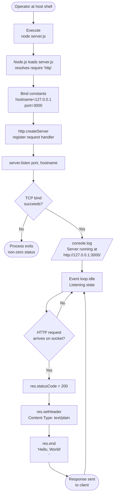

Two structural facts about this diagram bear emphasis because they distinguish this system from typical Node.js applications:

1. **The only decision diamond in application code is implicit and resides in the Node.js runtime**, not in `server.js`. The bind-success diamond reflects Node's internal socket lifecycle (per §4.4.2); the handler itself has zero branches.
2. **No state mutates between iterations of the request loop.** The arrow returning from `Sent` to `Idle` represents only the event-loop returning to wait for the next connection; no counters, caches, sessions, or accumulators are updated. This is a direct consequence of requirement F-002-RQ-002 (handler responds identically regardless of method, path, headers, or body).

### 4.2.2 Server Startup Workflow (W-1)

#### 4.2.2.1 Detailed Startup Flow

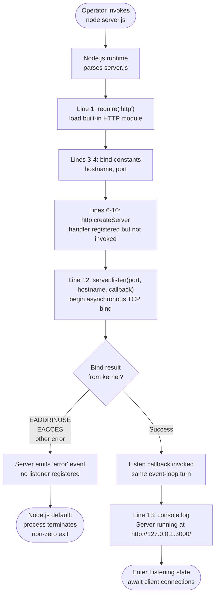

#### 4.2.2.2 Steps and Requirement Traceability

| Step | Line in `server.js` | Governing Requirement |
|---|---|---|
| Resolve `http` module | 1 | F-001-RQ-003 (must use Node.js built-in `http`) |
| Bind constants | 3–4 | Hardcoded — no runtime override possible (per §3.8) |
| Create server with handler | 6–10 | F-001-RQ-003 |
| Begin TCP bind | 12 | F-001-RQ-001 (loopback), F-001-RQ-002 (port 3000) |
| Emit startup log | 13 | F-005-RQ-001, F-005-RQ-002, F-005-RQ-003 |
| Enter Listening | (runtime) | F-001-RQ-004 |

#### 4.2.2.3 Timing Constraint

Per F-005-RQ-003 and §2.2.5.3, the startup log line **must appear within the same `listen` callback turn as the bind completion**. This is the **only timing constraint defined anywhere in the specification**; no latency targets, throughput targets, or concurrency targets apply to any other step (see §4.7).

#### 4.2.2.4 Validation and Business Rules at Each Step

| Step | Validation Rule | Source |
|---|---|---|
| Process invocation | Must be a single `node server.js` command; no orchestrator/supervisor/wrapper is permitted | F-001 §2.2.1.4 Business Rule |
| Bind | Must be loopback-only (`127.0.0.1`); the server must be unreachable from any external network interface | F-001 §2.2.1.4 Security Requirement |
| Startup log | Must be the **only** stdout output during normal operation; no per-request logging is permitted | F-005 §2.2.5.4 Business Rule |
| Startup log | Must not include secrets, request data, or internal state | F-005 §2.2.5.4 Security Requirement |

No data validation, authorization checkpoints, or regulatory compliance checks are exercised during startup (none are defined for this system — see §4.4.4).

### 4.2.3 Request Handling Workflow (W-2)

#### 4.2.3.1 Detailed Request Handling Flow

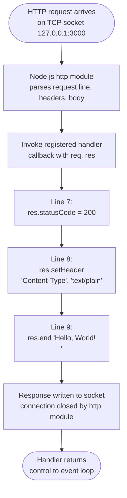

#### 4.2.3.2 Critical Architectural Property: No Decision Points

The diagram contains **zero decision diamonds**. This is not an oversight but a documented invariant of the system:

- **F-002-RQ-002** requires the response body to be returned regardless of request method, path, headers, or body. The handler never reads `req`, eliminating any basis for branching.
- **F-003-RQ-002** requires the status code to be set unconditionally with no method/path/header-based discrimination.
- **§1.3.3** explicitly excludes routing, request parsing, and input validation from scope.

The handler therefore implements the simplest possible HTTP response path in Node.js: three sequential, unconditional statements. Probes using `GET /`, `GET /any/path`, `POST /`, `PUT /`, `DELETE /`, `PATCH /`, `OPTIONS /`, or `HEAD /` all traverse the same five nodes of the diagram above.

#### 4.2.3.3 Steps and Requirement Traceability

| Step | Line in `server.js` | Governing Requirement |
|---|---|---|
| Set status to 200 | 7 | F-003-RQ-001, F-003-RQ-002 |
| Set Content-Type header | 8 | F-004-RQ-001, F-004-RQ-002 |
| Write body and end | 9 | F-002-RQ-001, F-002-RQ-002, F-002-RQ-003 |

#### 4.2.3.4 Validation and Business Rules at Each Step

| Step | Validation Rule | Source |
|---|---|---|
| Status assignment | Status code must be set via `res.statusCode` assignment (not `res.writeHead`) before headers/body are written | F-003 §2.2.3.4 Business Rule |
| Header assignment | Content-Type value must be exactly `text/plain` (no charset parameter; no alternative MIME type) | F-004 §2.2.4.4 Business Rule |
| Header ordering | `res.setHeader(...)` must precede `res.end(...)` in the handler | F-004-RQ-002 |
| Body emission | Body must be byte-identical to the 14-byte ASCII sequence `Hello, World!\n` | F-002-RQ-001 |
| Body emission | Body must be returned regardless of method/path/headers/body | F-002-RQ-002 |
| Body emission | Body must be emitted via `res.end()` so the response terminates after the literal | F-002-RQ-003 |
| Response invariance | Response must not echo any request-derived data; the absence of `req` reads eliminates reflective injection vectors | F-002 §2.2.2.4 Security Requirement |
| Status invariance | The server must not leak internal error details via alternative status codes; uniform 200 responses preclude information disclosure through status | F-003 §2.2.3.4 Security Requirement |

#### 4.2.3.5 Timing and SLA Posture

No latency or throughput SLA applies to request handling. Per §1.2.3 and §2.4.2, the only response-related KPI is binary: **response correctness (byte-exact match) equals 100%**. Detailed treatment appears in §4.7.

### 4.2.4 External "backprop" Integration Workflow (W-3) — Black Box

The "backprop" integration is performed **entirely from outside this repository**. Per §1.2.1 and §1.3.3, no integration code, client SDK, webhook receiver, callback URL, health-check endpoint, or authentication exchange exists in the source tree. The workflow as exercised from this repository's vantage point is therefore identical to Workflow W-2 (Request Handling): backprop tooling appears to the system as an indistinguishable HTTP client.

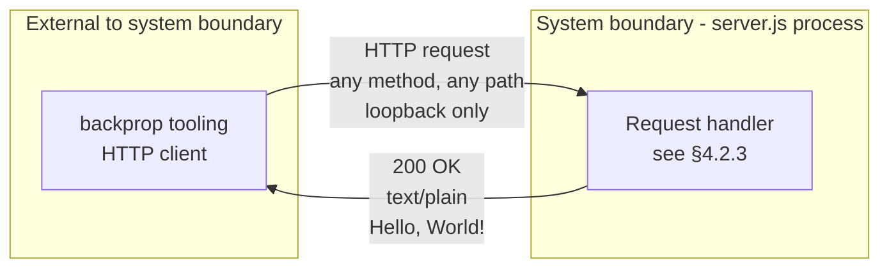

The internals of backprop's workflow (request scheduling, payload composition, response verification, retry behavior, error handling) are **out of scope** for this specification and cannot be documented from this repository's evidence. Only the contract surface visible to backprop is documented — and that contract is exhaustively covered by §4.2.3 above.

### 4.2.5 Process Termination Workflow (W-4)

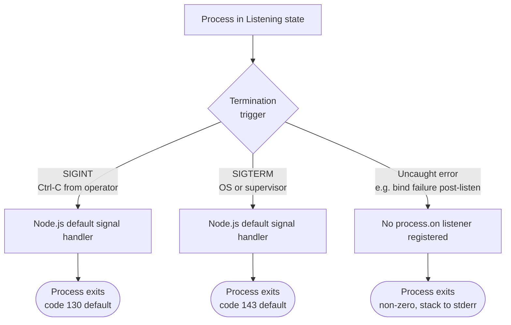

**Absence of graceful-shutdown logic** is explicit (§1.2.1, §1.3.3): the application registers no `SIGINT`/`SIGTERM` listeners and performs no draining, flushing, or cleanup. There are no transactions to commit, no caches to flush, no connections to close gracefully, and no in-flight requests to complete (request handling is synchronous and bounded by `res.end`).

---

## 4.3 INTEGRATION WORKFLOWS

### 4.3.1 Integration Points Overview

Four integration points exist between this system and its environment. They are catalogued in §2.3.2 of this specification and reproduced here with their workflow direction and processing semantics.

| # | Integration Point | Direction | Counterparty | Mechanism | Workflow |
|---|---|---|---|---|---|
| I-1 | HTTP request/response surface | Inbound | External "backprop" tooling | TCP/HTTP on `127.0.0.1:3000` | W-2 / W-3 |
| I-2 | Process invocation | Inbound | Local operator shell | `node server.js` command | W-1 |
| I-3 | Startup log capture | Outbound | Operator shell / log collector | stdout stream | W-1 (Step 6) |
| I-4 | npm manifest inspection | Inbound | npm-compatible tooling | File-system read of `package.json` | (none — inspection only) |

Of these, **only I-1 involves runtime code execution by external callers**. I-2 is a one-time process bootstrap, I-3 is a one-time emission, and I-4 is a passive declarative artifact (no code path exercises it at runtime).

### 4.3.2 HTTP Request/Response Sequence Diagram

This sequence diagram extends the high-level sequence from §1.3.1 with the lifecycle annotations relevant to the Process Flowchart audience. It is the canonical sequence diagram for the integration between the running server process and any HTTP client (including the external "backprop" tooling).

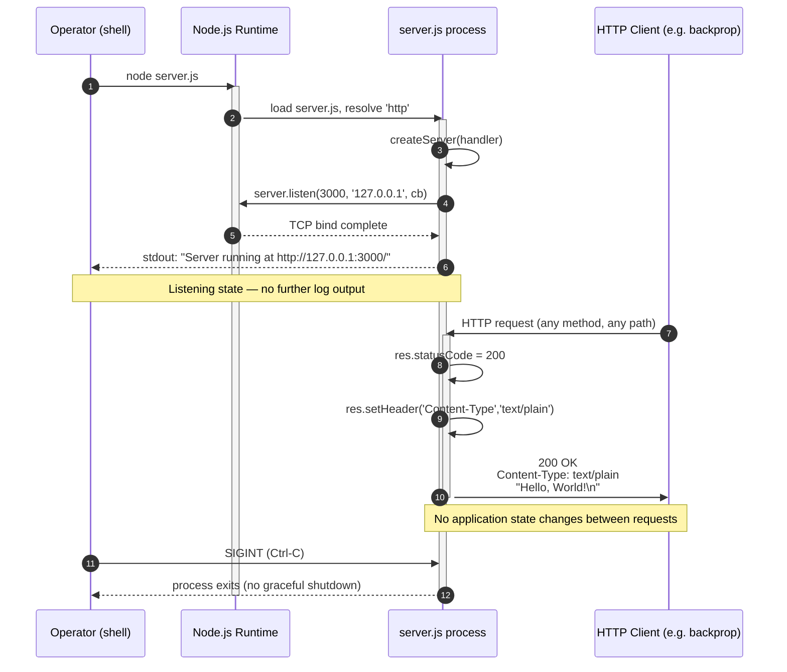

**Key sequencing facts:**

- The startup log (frame 6 above) is emitted **once per process lifetime** (F-005-RQ-003) and arrives in the same event-loop tick as `bind complete` (F-005-RQ-001, §2.2.5.3).
- Frames 8–10 represent the three sequential statements of the handler — no asynchronous waits, no I/O between them.
- Frame 11 represents response delivery; the connection close is performed by the Node.js `http` module after `res.end` returns.
- There is no inter-request state, no session establishment, and no handshake beyond the standard TCP/HTTP protocol layers handled inside the Node.js runtime.

### 4.3.3 Data Flow Between Systems

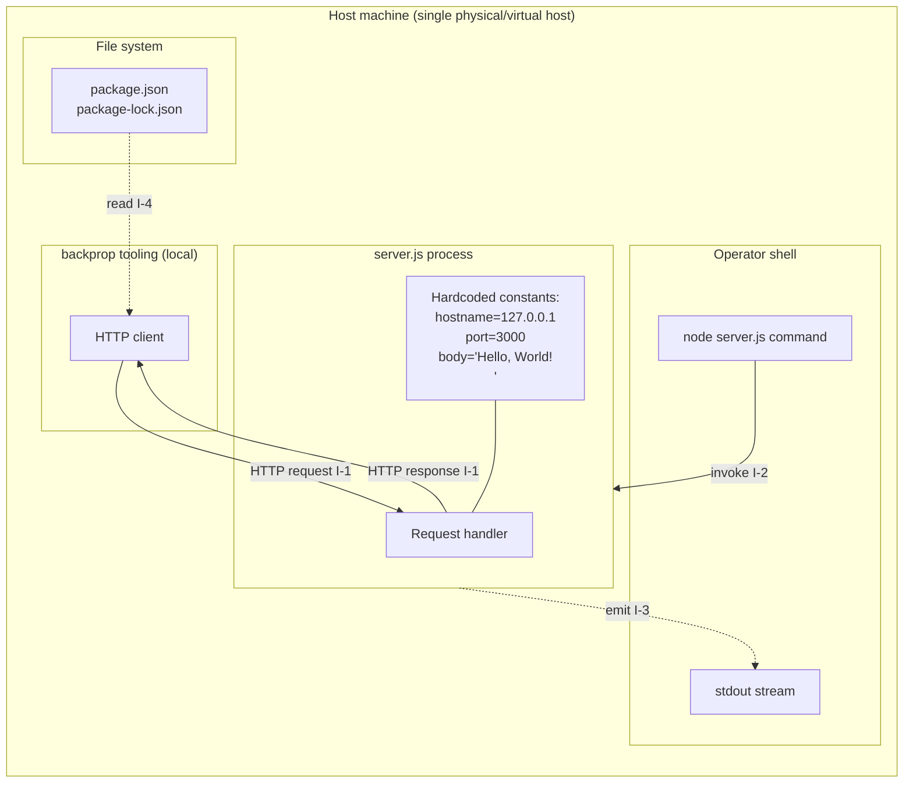

**Data flow observations:**

- **All data flowing out of the system is constant**: the startup log line (templated from `hostname` and `port`, both constants) and the response body (literal string). The system produces zero variable output.
- **All data flowing into the system is discarded**: the `req` object is provided to the handler but is never read (§2.2.2.3). No request data influences any output.
- **No data crosses the host boundary**: loopback binding (`127.0.0.1`) ensures every byte stays on the local host, per F-001 §2.2.1.4 Security Requirement.
- **No data is persisted**: there is no database, no file write, no cache. The only persistent artifact is the source code itself, which is the input to the process, not its output.

### 4.3.4 Event Processing Flows

The system processes exactly two kinds of events:

1. **TCP `connection` events** — handled internally by the Node.js `http` module; no application code participates.
2. **HTTP `request` events** — dispatched to the registered handler in `server.js`, which executes the unconditional response sequence shown in §4.2.3.

There are **no message queues, no event buses, no publish/subscribe topics, no streaming pipelines, no webhooks**, and no event consumers other than the in-process HTTP handler. The "event processing flow" reduces to the request handling flow already documented in §4.2.3.1.

### 4.3.5 Batch Processing Sequences

**None.** No scheduler (cron, `node-cron`, `agenda`, `bull`, etc.) is declared in the dependency graph (F-007 prohibits any such declaration). No batch job, no scheduled task, no periodic timer, and no cursor-driven iteration exists in the source. The system performs no batch work of any kind.

### 4.3.6 Integration Patterns That Are Explicitly Absent

Per §1.3.3 of this specification, the following integration patterns are confirmed absent from the codebase. They are listed here because flowcharts for them would otherwise be expected in a typical Process Flowchart section, and a reader needs unambiguous confirmation that no such flow exists:

| Absent Integration Pattern | Confirmation |
|---|---|
| Client SDK calls to "backprop" | No SDK dependency declared (F-007-RQ-001) |
| Callback URL / webhook receiver | No additional endpoints (F-002-RQ-002 single response surface) |
| Authentication exchange (API keys, OAuth, mTLS) | No auth code; no `req` reads |
| Database queries / transactions | No DB client; no persistence layer (§1.3.3) |
| Message-queue producers/consumers | No queue client declared |
| Service-discovery registration / heartbeat | No registry client declared |
| Health-check / readiness / liveness endpoint | Single unconditional handler returns 200 for all paths |
| Metrics/tracing emission to APM backend | No telemetry library declared (§1.3.3) |
| Caching layer interactions | No cache client declared (§1.2.1) |
| HTTPS/TLS termination | `http` module used, not `https` (§1.2.1) |

---

## 4.4 VALIDATION RULES AND DECISION POINTS

### 4.4.1 Application-Level Decision Points: None

A central architectural fact of this system is that **`server.js` contains zero conditional statements** (no `if`, no `switch`, no `try`/`catch`, no ternary expressions, no logical short-circuits used for control flow, no `await`, no `Promise` chains). Consequently, the application code contains **no decision diamonds** that the flowchart designer can draw.

This is not a documentation gap; it is the literal control-flow graph of the source:

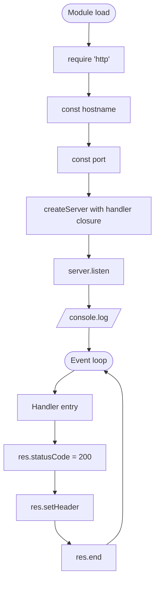

Every node above is unconditional. Every edge above is unconditional. This is the entirety of application control flow.

### 4.4.2 Runtime-Level Decision Points

Decisions do occur, but they reside in the Node.js runtime (outside application code) and at the protocol layer. They appear in the flowcharts of §4.2 as diamonds for completeness:

| Decision Point | Owner | Outcome — True Branch | Outcome — False Branch |
|---|---|---|---|
| TCP `bind` succeeds? | Node.js `net` / OS kernel | Continue to listen callback (F-001-RQ-004) | Emit `error` event → no listener → process exit (§4.6.2) |
| HTTP request parse succeeds? | Node.js `http` module | Invoke registered handler | Default 4xx response by `http` module; no application involvement |
| OS delivers SIGINT/SIGTERM? | OS / Node.js default | Process terminates | (Continue) |

The application participates in **none** of these decisions. There is no opportunity for application logic to intervene because no listeners are registered (see §4.6).

### 4.4.3 Business Rules Indexed by Workflow Step

The validation rules below are **architectural invariants** of the artifact rather than runtime checks. They are documented as the project's business rules in §2.2 and reproduced here with explicit pointers from each workflow step to the rule that governs it.

| Workflow | Step | Business Rule | Source |
|---|---|---|---|
| W-1 | Process invocation | Single OS process started by `node server.js`; no orchestrator permitted | F-001 §2.2.1.4 |
| W-1 | Bind | Loopback-only (`127.0.0.1`); unreachable from external networks | F-001 §2.2.1.4 |
| W-1 | Startup log | Only stdout output of normal operation; no per-request logging | F-005 §2.2.5.4 |
| W-1 | Startup log | Must not include secrets, request data, or internal state | F-005 §2.2.5.4 |
| W-2 | Status | Set via `res.statusCode` assignment before headers/body are written | F-003 §2.2.3.4 |
| W-2 | Status | Uniform 200 across all probes; no information disclosure via alternative codes | F-003 §2.2.3.4 |
| W-2 | Header | Content-Type exactly `text/plain` (no charset; no alternative MIME) | F-004 §2.2.4.4 |
| W-2 | Body | Fixed string literal; dynamic content generation unsupported | F-002 §2.2.2.4 |
| W-2 | Body | No echo of request-derived data; no reflective injection vectors | F-002 §2.2.2.4 |
| All | Dependencies | Introducing any third-party package would violate the deterministic-baseline value | F-007 §2.2.7.4 |
| All | File inventory | Repository file count must remain at exactly four files | F-008 §2.2.8.4 |

### 4.4.4 Authorization Checkpoints and Regulatory Compliance Checks

**None exist.** Per §1.3.3, the system intentionally implements no authentication, no authorization, no identity model, no roles, no permissions, no audit logging, no GDPR/HIPAA/PCI/SOX/SOC2 controls, and no regulatory compliance hooks of any kind.

The architectural rationale is documented in §1.2.1: the loopback-only binding (F-001-RQ-001) renders the server unreachable from any external network, which is the system's sole "security control" and replaces all conventional authorization checkpoints. Any authorization decision affecting access to this service is delegated to:

- The host operating system's process-isolation primitives
- The host kernel's loopback-interface enforcement
- Any process-launching access control on the host

This delegation is not a flowchart element within the application; it is a property of the deployment surface.

### 4.4.5 Data Validation Requirements

**None exist at runtime.** The handler never reads `req`, so there is no input to validate. The startup-time constants (hostname, port) are hardcoded literals known to be syntactically valid; no runtime check confirms their validity (Node.js itself rejects invalid bind targets at the kernel/socket layer, per §4.4.2).

Declarative validation — the JSON syntax validity of `package.json` (F-006-RQ-004) and `package-lock.json` (F-007-RQ-003) — is performed by npm tooling at install/inspect time, not by the running server, and therefore does not appear in any runtime workflow.

---

## 4.5 STATE MANAGEMENT

### 4.5.1 Process Lifecycle State Diagram

The system has a single state machine: the OS process lifecycle. It is owned and driven by the Node.js runtime; the application contributes no state of its own.

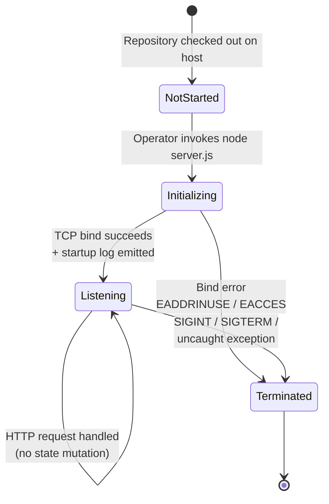

#### 4.5.1.1 State Definitions

| State | Definition | Observable Indicator |
|---|---|---|
| `NotStarted` | Source tree exists on disk; no process running | No PID; no listener on `127.0.0.1:3000` |
| `Initializing` | Module loaded; `listen` called; bind in progress | Process exists; port not yet bound |
| `Listening` | TCP socket bound; handler ready | Port 3000 accepts connections; startup log already emitted |
| `Terminated` | Process exited (cleanly or via crash) | No PID; exit code captured by parent |

#### 4.5.1.2 Transition Triggers

| From → To | Trigger | Application Code Involved |
|---|---|---|
| NotStarted → Initializing | `node server.js` invocation | Lines 1–11 of `server.js` |
| Initializing → Listening | Successful TCP bind callback | Line 12 callback (logging only) |
| Initializing → Terminated | Bind failure (no listener) | None (Node.js default) |
| Listening → Listening | Request handled (self-loop) | Lines 7–9 (no state mutation) |
| Listening → Terminated | Signal or uncaught exception | None (Node.js default) |

### 4.5.2 Absence of Application State

There is **no application state** to diagram:

- No mutable variables are declared in `server.js` (all bindings are `const`).
- No external state stores (database, file, cache) are referenced.
- The handler closure captures only the constants `hostname` and `port` (and these only via the startup-log template, not the handler itself).
- The `req` object is never read, so no per-request state is derived.
- No counters, sessions, tokens, or accumulators are maintained between requests.

The `Listening → Listening` self-loop in the state diagram intentionally carries no state mutation: per F-002-RQ-002, every request returns the identical response, which is only possible because no inter-request state exists.

### 4.5.3 Data Persistence Points

**None.** The system performs no `fs.writeFile`, no database insert/update, no cache `set`, no message-queue publish, and no journaling. Per §1.2.1 and §1.3.3, no persistent state or data layer of any kind exists.

The only file-system reads at runtime are those performed by the Node.js loader (resolving `server.js` itself and the built-in `http` module); these are bootstrap-time only and do not constitute application persistence.

### 4.5.4 Caching Requirements

**None.** No caching layer exists. The static response body (`Hello, World!\n`) is already a string literal in the source code; there is no upstream source to cache, no computation to memoize, and no remote service to short-circuit. Per §1.3.3, caching is out of scope.

### 4.5.5 Transaction Boundaries

**None.** Transactions imply persistence and isolation primitives, both of which are absent (§4.5.3). The handler's three statements (`statusCode`, `setHeader`, `end`) execute synchronously in a single event-loop turn; their atomicity is provided by the JavaScript single-threaded execution model, not by an application-level transaction manager. If the process is killed mid-handler (e.g., SIGKILL between lines 7 and 9), no rollback is needed because no durable side effects have been produced.

---

## 4.6 ERROR HANDLING FLOWS

### 4.6.1 Error Handling Strategy: Total Delegation to the Node.js Runtime

The application's error-handling strategy is to **register no error handlers and rely on Node.js runtime defaults**. This is a deliberate design choice (§1.2.1: "No error handling beyond Node.js runtime defaults") rather than an oversight, and the Process Flowchart must document the corresponding flows accurately.

`server.js` contains:

- **No** `try`/`catch` blocks
- **No** `.on('error', ...)` listener on the `server` object
- **No** `.on('error', ...)` listener on the response stream
- **No** `process.on('uncaughtException', ...)` listener
- **No** `process.on('unhandledRejection', ...)` listener
- **No** `process.on('SIGINT'|'SIGTERM', ...)` listener for graceful shutdown
- **No** retry, fallback, backoff, or circuit-breaker logic

Every error path therefore terminates either in a default response emitted by the Node.js `http` module or in process termination. The diagrams below enumerate these paths exhaustively.

### 4.6.2 Composite Error-Handling Flowchart

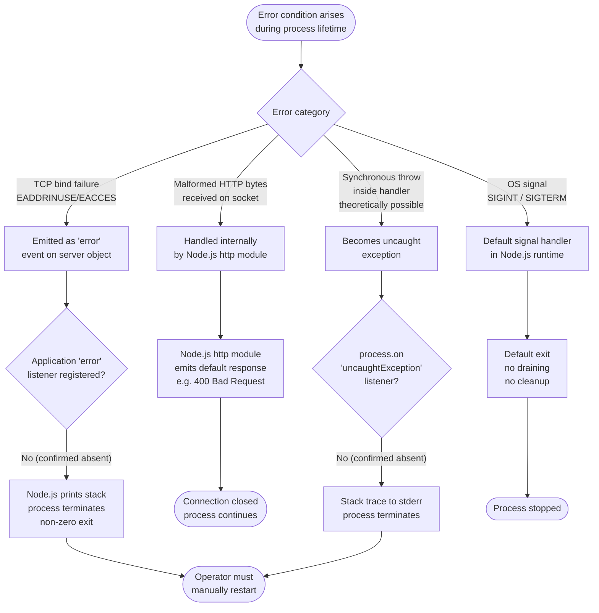

### 4.6.3 Startup Error Paths

The startup workflow (W-1) can fail at exactly one application-visible juncture: the TCP bind. The expected failure modes and their flows are:

| Failure Mode | OS Error | Flow |
|---|---|---|
| Port already in use | `EADDRINUSE` | Server emits `error` → no listener → Node.js prints diagnostic → process exits non-zero |
| Insufficient privileges (rare on loopback at port 3000) | `EACCES` | Same path as above |
| Loopback interface unavailable (rare) | `EADDRNOTAVAIL` | Same path as above |
| Resource exhaustion | `ENFILE` / `EMFILE` | Same path as above |

In every case, the flow is identical from the application's perspective: emit error → no listener → terminate. There is **no fallback port**, **no alternate hostname**, **no retry with backoff**, and **no diagnostic remediation** in the application code.

### 4.6.4 Request-Time Error Paths

Request-time errors are exceedingly rare in this implementation because the handler does not read `req` and performs only three synchronous, non-throwing operations on `res`. The theoretical failure modes are:

| Failure Mode | Handler Behavior | Net Effect |
|---|---|---|
| Client disconnects before `res.end` completes | `res.end` resolves silently or emits `error` on response stream | No listener → uncaught error possible; in practice Node.js handles this benignly |
| Malformed HTTP bytes from client | Handler never invoked; Node.js `http` module emits default error response | 4xx response by Node; process continues |
| Out-of-memory while writing 14-byte body | Process aborts | Process terminates |

The handler itself cannot throw under any input because no input is read. This is one of the architectural advantages of the deliberate `req`-avoidance pattern documented in §2.2.2.4.

### 4.6.5 Recovery Procedures, Retry Mechanisms, Fallback Processes, Error Notification Flows

| Mechanism | Present? | Notes |
|---|---|---|
| Application-level retry of failed binds | **No** | No loop, no backoff, no jitter logic |
| Fallback to alternate port/hostname | **No** | Constants are hardcoded; no environment override |
| Fallback to in-memory degraded mode | **No** | No degraded mode defined |
| Error notification to operator (email/SMS/pager) | **No** | No notification client declared |
| Error notification to monitoring system | **No** | No telemetry library declared (§1.3.3) |
| Structured error logging | **No** | Only `console.log` is used, and only once at startup (§2.2.5.4) |
| Automated process restart | **External only** | If desired, must be supplied by an external process supervisor — but per F-001 §2.2.1.4 Business Rule, no orchestrator/supervisor is permitted, so manual restart is the only sanctioned recovery |
| Dead-letter queues / poison-message handling | **N/A** | No message queues exist |
| Compensation transactions | **N/A** | No transactions exist |

**The sanctioned recovery procedure is**: operator observes the absence of the startup log, diagnoses the cause externally (e.g., `lsof -i :3000`), addresses it externally, and re-invokes `node server.js`. This procedure is entirely outside the system boundary.

---

## 4.7 TIMING AND SLA CONSIDERATIONS

### 4.7.1 The System's Binary Acceptance Model

Per §1.2.3 and §2.4.2, this system does not adopt ranged performance metrics (latency p50/p95/p99, throughput RPS, error rate budgets). It adopts **binary acceptance indicators** that either evaluate to 100% / 0 or constitute a failure:

| KPI | Target | Workflow Reference |
|---|---|---|
| Cold-start success rate | 100% | W-1 (§4.2.2) |
| Response correctness (byte-exact match) | 100% | W-2 (§4.2.3) |
| Declared dependency count | 0 | (declarative, not workflow) |
| Repository file-count drift from baseline | 0 | (declarative, not workflow) |

These KPIs do not impose flowchart-visible timing constraints other than the one identified in §4.2.2.3.

### 4.7.2 The Sole Timing Constraint

The only timing constraint defined anywhere in this specification is in §2.2.5.3 / F-005-RQ-003: the **startup log line must appear within the same `listen` callback turn as the bind completion**. This is structurally guaranteed by the source code (the `console.log` statement is the literal contents of the `listen` callback) rather than enforced by a runtime check.

### 4.7.3 Absent Timing Constraints

The following timing constraints, which would typically appear in a Process Flowchart, are **not specified** for this system and have no associated workflow gates:

- No request-handling latency target (no p50/p95/p99 latency SLO)
- No throughput target (no requests-per-second floor or ceiling)
- No concurrency target (no minimum or maximum simultaneous connections)
- No startup-time SLA (cold-start must succeed, but no time bound is imposed)
- No shutdown-time SLA (no graceful shutdown path; process termination is immediate)
- No availability target (no 99.9% / 99.99% uptime requirement)
- No deadline propagation, timeout cascade, or retry budget

These absences are properties of the system's intentional minimalism (§1.2.3, §2.4.1) and the loopback-only, single-tester operating model. They are not gaps to be filled but invariants to be honored.

---

## 4.8 SWIM-LANE PROCESS VIEW

### 4.8.1 Actors and Lanes

The swim-lane view below partitions the end-to-end flow across the four meaningful actors:

- **Operator** — human running commands at the host shell
- **Node.js Runtime** — the OS-resident `node` binary that hosts the JavaScript code
- **server.js Process** — the application code itself (the only in-repository contribution)
- **HTTP Client (backprop)** — external party exercising the running server

### 4.8.2 Cross-Lane Sequence

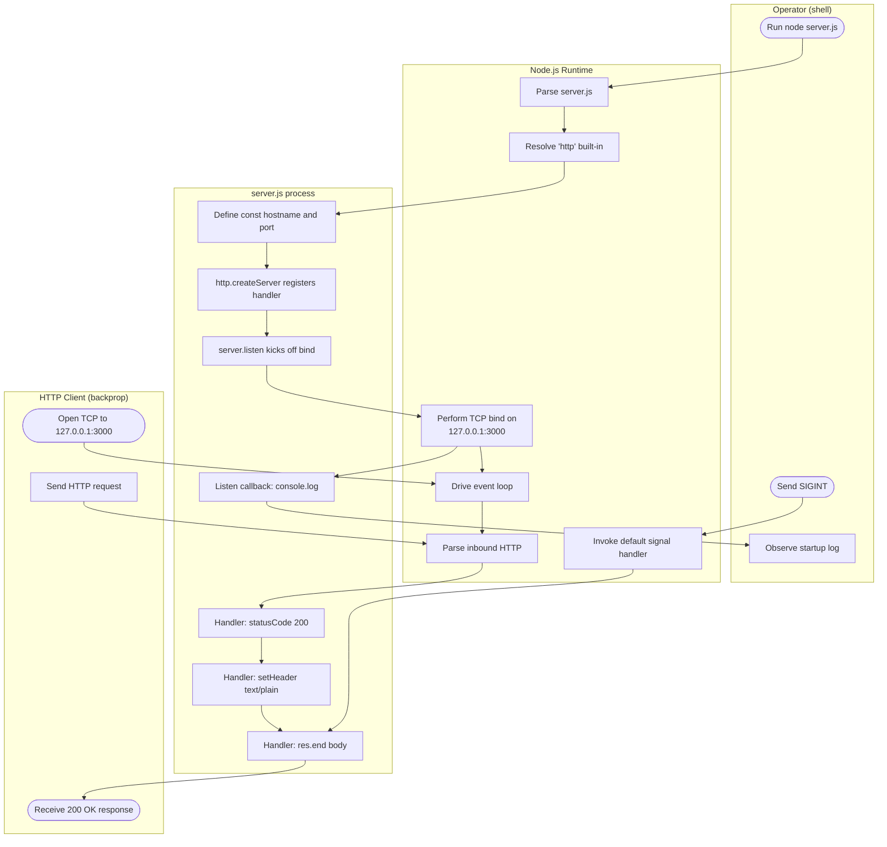

**Lane-crossing observations:**

- The Operator's lane interacts with the Application lane **only indirectly**, always mediated by the Runtime.
- The Application lane (`server.js process`) contributes only **seven steps total** across both workflows (W-1 and W-2): three at startup (define constants, create server, listen) and one at log emission, then three in every request (status, header, end).
- The Client lane interacts with the Application lane **only via the Runtime's HTTP parser**; no direct application-to-client step exists outside the handler's three operations.
- The Runtime's `Drive event loop` step is the join point for all post-startup activity: requests arrive there and are dispatched to the handler from there.

### 4.8.3 System Boundary

The system boundary (per §1.3.2) coincides exactly with the `server.js process` lane. Everything outside that lane — Operator, Runtime internals, Client — lies outside the system boundary and is treated as external context. The Runtime lane is depicted because it is where most of the actual execution happens (HTTP parsing, socket management, signal handling), but no in-repository code resides there.

---

## 4.9 SUMMARY OF FLOWCHART INVARIANTS

For ease of audit, the table below summarizes the invariants that the diagrams in this section collectively assert. Each invariant is traceable to one or more requirements documented elsewhere in this specification.

| Invariant | Diagram(s) | Source |
|---|---|---|
| Application code contains zero decision diamonds | §4.2.3.1, §4.4.1 | F-002-RQ-002, F-003-RQ-002, §1.3.3 |
| Single linear startup path with one runtime-level decision (bind success) | §4.2.1, §4.2.2.1 | F-001-RQ-001 through F-001-RQ-004 |
| Single linear request path with no decisions | §4.2.3.1 | F-002, F-003, F-004 |
| Application has no error listeners; all errors delegate to Node.js defaults | §4.6.2 | §1.2.1 |
| Application has no state; lifecycle has three states owned by the runtime | §4.5.1 | §1.2.1, §1.2.3 |
| No retries, fallbacks, notifications, or recovery procedures | §4.6.5 | §1.2.1, §1.3.3 |
| No persistence, caching, or transaction boundaries | §4.5.3, §4.5.4, §4.5.5 | §1.2.1, §1.3.3 |
| No authorization checkpoints or compliance checks; loopback binding substitutes | §4.4.4 | F-001-RQ-001, §1.3.3 |
| No timing SLAs beyond the startup-log-in-same-tick constraint | §4.7.2, §4.7.3 | F-005-RQ-003, §2.4.2 |
| External backprop integration uses only the HTTP surface; internals are out of scope | §4.2.4, §4.3.2 | §1.2.1, §1.3.3 |

---

## 4.10 REFERENCES

### 4.10.1 Files Examined for This Section

- `server.js` — Sole source of application logic; provided the complete control-flow graph (W-1 startup, W-2 request handling), the confirmation of zero decision points in application code, the absence of error listeners, and the constants captured by the handler closure. Specific lines cited: 1 (`require('http')`), 3–4 (`hostname`, `port` constants), 6–10 (handler), 7 (`res.statusCode`), 8 (`res.setHeader`), 9 (`res.end`), 12 (`server.listen`), 13 (`console.log`).
- `package.json` — Declarative metadata; confirmed absence of `start` script (no orchestrator entry point), absence of `dependencies` / `devDependencies` (zero-dependency posture relevant to integration patterns).
- `package-lock.json` — Confirmed `lockfileVersion: 3` and root-only `packages` block; supports the integration-pattern-absence table in §4.3.6.
- `README.md` — Confirmed the canonical project name `hao-backprop-test` and the "Do not touch!" directive that fixes the repository file inventory at four files (relevant to W-1 invocation premise).

### 4.10.2 Folders Examined for This Section

- Repository root (`/`) — Confirmed to contain exactly the four files above and no subdirectories of source code, eliminating the possibility of hidden modules, alternate handlers, helper utilities, configuration files, scheduled jobs, or webhook receivers that would contribute additional workflows or decision points to the diagrams.

### 4.10.3 Technical Specification Sections Referenced

- §1.1 EXECUTIVE SUMMARY — System scale and stakeholder context underpinning the binary KPI model in §4.7
- §1.2 SYSTEM OVERVIEW — Topology diagram, primary capabilities table, architectural limitations (no HTTPS, no routing, no graceful shutdown, no error handling) cited throughout §4.2, §4.5, §4.6
- §1.3 SCOPE — Primary user workflow sequence diagram extended in §4.3.2; out-of-scope enumeration cited in §4.3.6, §4.4.4, §4.5
- §2.1 FEATURE CATALOG — Features F-001 through F-008 referenced throughout requirement traceability
- §2.2 FUNCTIONAL REQUIREMENTS TABLES — Requirements F-001-RQ-001 through F-008-RQ-003 cited as governing rules in §4.2.2.4, §4.2.3.4, §4.4.3
- §2.3 FEATURE RELATIONSHIPS — Integration points (I-1 through I-4) catalog reproduced in §4.3.1
- §2.4 IMPLEMENTATION CONSIDERATIONS — Binary acceptance model and minimalism rationale cited in §4.7
- §2.5 TRACEABILITY MATRIX — Feature-to-source-line mapping consumed for §4.2.2.2 and §4.2.3.3
- §2.6 ASSUMPTIONS AND CONSTRAINTS — Single-process and loopback constraints cited in §4.4.3
- §3.8 CONFIGURATION CONSTANTS AND COMPATIBILITY — Confirmed absence of runtime configuration override, supporting §4.2.2 and §4.6.3
- §3.9 TECHNOLOGY STACK SECURITY POSTURE — Loopback-binding-as-security-control rationale cited in §4.4.4

# 5. System Architecture

## 5.1 HIGH-LEVEL ARCHITECTURE

### 5.1.1 System Overview

#### 5.1.1.1 Architectural Style and Rationale

The `hao-backprop-test` repository implements a **monolithic, single-file, single-process HTTP server** built exclusively on Node.js built-in primitives. This style is best characterized as *"minimalist monolith"* — the entire runtime surface consists of a 14-line `server.js` module that delegates all transport-layer concerns to the Node.js core `http` module. The system is intentionally non-decomposed and consists of a single executable component; there are no internal modules, no service layers, no separate worker processes, and no auxiliary components.

The choice of architectural style is not incidental — it is the *defining* architectural decision. Per `1.2 SYSTEM OVERVIEW`, this selection prioritizes minimal surface area and behavioral determinism over flexibility, feature richness, or production readiness. The repository functions as a **test fixture** — a fixed reference artifact against which an external "backprop" integration workflow can exercise its tooling. Every architectural decision in the system flows from a single load-bearing principle: maximize determinism by minimizing surface area.

#### 5.1.1.2 Key Architectural Principles

The system is governed by eight interlocking architectural principles:

- **Zero-Dependency Posture (F-007):** All HTTP functionality is provided by the Node.js built-in `http` module. No third-party runtime or development dependencies are declared. This eliminates the entire supply-chain attack surface and ensures the artifact is reproducible from cloned source with no install step.
- **Stateless Request Handling:** The application maintains no mutable variables; all bindings in `server.js` are declared with `const`. Every request is handled in complete isolation from every other request.
- **Loopback-Only Network Boundary (C-003):** The server binds exclusively to `127.0.0.1`, making it unreachable from any network beyond the host. This binding substitutes for the entire conventional security stack (TLS, authentication, authorization, rate limiting).
- **Single-Process Model (C-004):** The system runs as exactly one OS process. There is no clustering, no worker threads, no supervisor, and no orchestrator.
- **Hardcoded Configuration:** Host and port are declared as `const` literals (`127.0.0.1` and `3000`). The system reads no environment variables, consults no `.env` file, and contains no `config/` folder.
- **No Application-Level Decision Points:** The `server.js` source contains zero conditional statements — no `if`, no `switch`, no `try`/`catch`, no ternaries. The control flow is purely linear.
- **Fixed-Response Invariance:** Every HTTP request returns byte-identical output (`200 OK` with `Content-Type: text/plain` and body `Hello, World!\n`) regardless of method, path, headers, or body.
- **No-Build, Run-From-Source (C-006):** The system runs directly from cloned source via `node server.js` with no install, build, transpile, or compile step.

#### 5.1.1.3 System Boundaries and Major Interfaces

The system boundary is defined as **the single OS process started by `node server.js`**. Everything outside that process — the operator's shell, the kernel's loopback interface, any external "backprop" tooling — is considered an external counterparty.

The system exposes exactly four integration interfaces, of which only one carries runtime traffic:

| Interface ID | Direction | Counterparty | Mechanism |
|---|---|---|---|
| I-1 (HTTP request/response) | Inbound | External "backprop" tooling | TCP/HTTP on `127.0.0.1:3000` |
| I-2 (Process invocation) | Inbound | Local operator shell | `node server.js` OS exec |
| I-3 (Startup log) | Outbound | Operator shell / log capture | stdout text stream |
| I-4 (Manifest inspection) | Inbound | npm-compatible tooling | File-system read of `package.json` |

Only interface **I-1** invokes application code at runtime. The other three are bootstrap, observation, or static inspection paths.

### 5.1.2 Core Components

The repository contains exactly four files. One is executable; three are declarative or documentary. The table below enumerates them as architectural components:

| Component Name | Primary Responsibility | Key Dependencies | Critical Considerations |
|---|---|---|---|
| `server.js` (HTTP listener) | Bind TCP socket on `127.0.0.1:3000`; handle every HTTP request with fixed `200 OK` / `text/plain` / `Hello, World!\n` response; emit single startup log to stdout | Node.js runtime; built-in `http` module; `console` global | Single-process, fully stateless; no graceful shutdown; no error handlers; constants hardcoded |
| `package.json` (manifest) | Declare package identity (`name=hello_world`, `version=1.0.0`, `main=index.js`, `license=MIT`, `author=hxu`) and a placeholder `test` script | npm tooling | `main` points to non-existent `index.js` (D-002); no `start` script (D-004); no `engines` field (D-005); no `dependencies` keys |
| `package-lock.json` (lockfile) | Cryptographically attest that the dependency graph is empty (`lockfileVersion: 3`; only root entry `""` in `packages`) | npm 7+ | Auditable proof of F-007 Zero-Dependency Posture |
| `README.md` (documentation) | State purpose ("test project for backprop integration") and modification prohibition ("Do not touch!") | None at runtime | Sole source of human-facing repository name `hao-backprop-test` (differs from package name `hello_world` per D-001) |

### 5.1.3 Data Flow Description

#### 5.1.3.1 Primary Data Flows

The data-flow profile of the system is exceptionally narrow and is best understood through three observations:

**All data flowing out of the system is constant.** The two outbound emissions — the startup log line and every response body — are derived from string literals in `server.js`. The startup log is rendered from the hardcoded `hostname` and `port` constants via an ES2015 template literal; the response body is the literal `'Hello, World!\n'`. The system produces zero variable output.

**All data flowing into the system at the HTTP boundary is discarded.** The request object `req` is provided to the handler callback by Node.js but is never read. No HTTP method, no URL path, no header, no query string, and no body content influences any subsequent operation. This is an architecturally significant property: it eliminates injection vectors, eliminates branching, and renders the handler theoretically incapable of throwing under any input.

**No data crosses the host boundary.** The loopback binding (`127.0.0.1`) ensures every byte transmitted in either direction stays within the host's kernel networking stack. No packets traverse a physical or virtual network interface.

#### 5.1.3.2 Integration Patterns and Protocols

| Pattern | Realization in This System |
|---|---|
| Request-response over HTTP/1.x | Single inbound interaction pattern; synchronous; loopback only |
| One-shot stdout emission | Single startup log line per process lifetime |
| File-system metadata read | Passive npm inspection of `package.json` and `package-lock.json` |

The system implements no message queues, no event buses, no pub/sub, no streaming pipelines, no webhooks, and no asynchronous fan-out.

#### 5.1.3.3 Data Transformation Points

**None.** The handler performs three sequential, unconditional statements: assigning `res.statusCode = 200`, calling `res.setHeader('Content-Type', 'text/plain')`, and calling `res.end('Hello, World!\n')`. There is no parsing, no serialization, no encoding/decoding step beyond what the Node.js `http` module performs internally on the byte stream.

#### 5.1.3.4 Data Stores and Caches

**None.** Per `4.5 STATE MANAGEMENT`, the system performs no `fs.writeFile`, no database insert/update, no cache `set`, no message-queue publish, and no journaling. No persistent state or data layer of any kind exists. No caching layer exists either; the static response body is already a string literal in the source code, so there is nothing upstream to cache, no computation to memoize, and no remote service to short-circuit.

### 5.1.4 External Integration Points

| System Name | Integration Type | Data Exchange Pattern | Protocol/Format |
|---|---|---|---|
| External "backprop" tooling | Inbound HTTP (loopback) | Synchronous request-response; any method/path returns identical `200 OK` body | HTTP/1.x over TCP on `127.0.0.1:3000` |
| Local operator shell | Inbound process invocation | One-time bootstrap via `node server.js` | OS process exec |
| Local operator shell / log capture | Outbound log emission | One emission per process lifetime | stdout text stream |
| npm-compatible tooling | Inbound file inspection | Passive read of declarative JSON | File-system read of `package.json` / `package-lock.json` |

**SLA Requirements:** The system uses **binary acceptance indicators** rather than ranged metrics. The applicable targets are 100% cold-start success rate, 100% response correctness (byte-exact match), 0 declared dependencies, and 0 repository file-count drift from baseline. The sole timing constraint is requirement F-005-RQ-003 — the startup log must appear within the same `listen` callback turn as bind completion. **No latency, throughput, availability, or concurrency SLAs are defined.**

---

## 5.2 COMPONENT DETAILS

### 5.2.1 `server.js` — HTTP Listener Component

#### 5.2.1.1 Purpose and Responsibilities

The `server.js` module is the sole executable component of the system. It is responsible for:

- Binding a TCP socket to `127.0.0.1:3000`
- Accepting HTTP requests via a single `http.createServer` callback
- Returning an unconditional response of status `200`, `Content-Type: text/plain`, and body `Hello, World!\n`
- Emitting a single startup log line to stdout after successful bind

#### 5.2.1.2 Technologies and Frameworks

| Aspect | Selection |
|---|---|
| Runtime | Node.js (version unpinned; no `engines` field per D-005) |
| Module system | CommonJS (`require('http')`) |
| HTTP layer | Node.js built-in `http` core module |
| Language | JavaScript ES2015+ (uses `const`, arrow functions, template literals) |
| Web framework | **None** (no Express, Koa, Fastify, NestJS, or equivalent) |

#### 5.2.1.3 Key Interfaces and APIs

The component uses six API surfaces drawn from Node.js core; nothing external is consumed:

| API | Purpose |
|---|---|
| `http.createServer(callback)` | Constructs the HTTP server with a single request handler |
| `server.listen(port, hostname, callback)` | Binds to TCP `127.0.0.1:3000` and fires the startup-log callback on success |
| `res.statusCode = 200` | Sets response status via direct property assignment (not `res.writeHead`) |
| `res.setHeader('Content-Type', 'text/plain')` | Sets MIME type with no charset suffix |
| `res.end('Hello, World!\n')` | Writes the response body and terminates the response |
| `console.log(...)` | Emits the startup log (the only stdout output during normal operation) |

#### 5.2.1.4 Data Persistence Requirements

**None.** The component is fully stateless. The handler closure does not capture or maintain any mutable state between requests.

#### 5.2.1.5 Scaling Considerations

The component runs on a single Node.js event loop, with no `cluster` module use, no worker threads, and no external process supervisor (PM2, systemd, etc.). Horizontal scaling is theoretically trivial because the component is stateless, but it is explicitly out of scope per the system's role as a test fixture. Capacity is bounded only by Node.js default event-loop characteristics and OS socket-backlog defaults. No autoscaling policies, throughput targets, or concurrency limits are defined.

### 5.2.2 `package.json` — Package Manifest

#### 5.2.2.1 Purpose

`package.json` provides declarative metadata for npm tooling. It does not influence runtime behavior because the server is invoked directly via `node server.js` rather than through any npm script.

#### 5.2.2.2 Field Inventory

| Field | Value | Notes |
|---|---|---|
| `name` | `hello_world` | Differs from repository name `hao-backprop-test` (D-001) |
| `version` | `1.0.0` | Baseline |
| `description` | `Hello world in Node.js` | — |
| `main` | `index.js` | File does not exist in repository (D-002) |
| `scripts.test` | `echo "Error: no test specified" && exit 1` | Placeholder; no real test suite exists |
| `author` | `hxu` | — |
| `license` | `MIT` | No `LICENSE` file present in repository (D-003) |

Absent keys are themselves architecturally significant: there is no `dependencies` block, no `devDependencies` block, no `engines` field (D-005), and no `start` script (D-004).

### 5.2.3 `package-lock.json` — Dependency Attestation

#### 5.2.3.1 Purpose

`package-lock.json` functions as a cryptographic-style attestation that the dependency graph is empty. Its content is the load-bearing evidence for the F-007 Zero-Dependency Posture.

#### 5.2.3.2 Structure

The lockfile declares `lockfileVersion: 3` and a `packages` object containing only the root entry (the empty-string key `""`) with no `node_modules/...` entries. This proves there are zero transitive packages installed or expected. Any future addition would mutate this file, making the zero-dependency property auditable through file-diff alone.

### 5.2.4 `README.md` — Documentation Component

The `README.md` file is two lines long. It contains the human-facing repository name `hao-backprop-test`, declares the project's purpose ("test project for backprop integration"), and includes the modification-prohibition directive "Do not touch!". The "Do not touch!" instruction is treated as an architectural constraint: it codifies that the file set and contents are expected to remain stable across the artifact's lifetime.

### 5.2.5 Component Interaction Diagram

The complete runtime topology of the system is captured by the following diagram. There are no internal sub-components to expand:

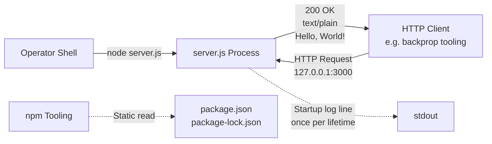

Solid arrows represent runtime data flow; dotted arrows represent observability or bootstrap-time interactions.

### 5.2.6 Process Lifecycle State Diagram

The system has a single state machine: the OS process lifecycle. It is owned and driven by the Node.js runtime; the application contributes no state of its own.


The four states are defined as follows:

| State | Definition | Observable Indicator |
|---|---|---|
| `NotStarted` | Source tree exists on disk; no process running | No PID; no listener on `127.0.0.1:3000` |
| `Initializing` | Module loaded; `listen` called; bind in progress | Process exists; port not yet bound |
| `Listening` | TCP socket bound; handler ready | Port 3000 accepts connections; startup log already emitted |
| `Terminated` | Process exited cleanly or via crash | No PID; exit code captured by parent shell |

The `Listening → Listening` self-loop carries **no** state mutation: per F-002-RQ-002, every request returns the identical response, which is only possible because no inter-request state exists.

### 5.2.7 HTTP Request Flow Sequence Diagram

The end-to-end flow from process invocation through request servicing to termination is captured by the following sequence diagram:

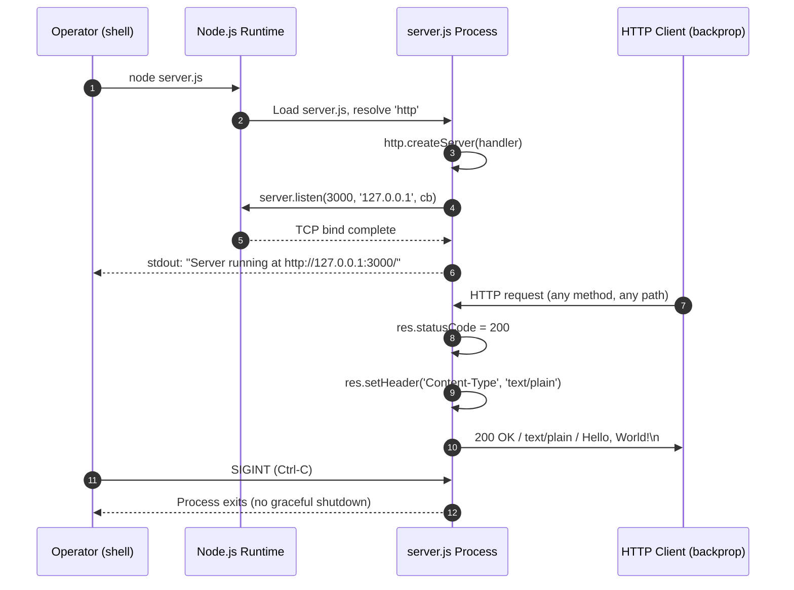

Note that the request-handling segment (between the operator's startup and termination) is fully repeatable and stateless: any number of requests may pass through without altering subsequent behavior.

### 5.2.8 Application Control Flow Diagram

The complete application control flow consists of exactly two linear paths, neither of which contains any decision diamond:

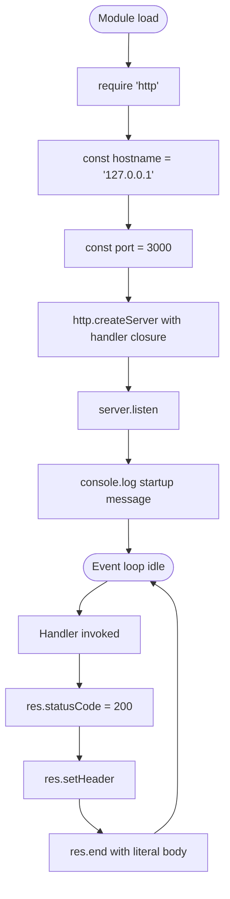

Every node above is unconditional, and every edge above is unconditional. This is the entirety of application control flow.

---

## 5.3 TECHNICAL DECISIONS

### 5.3.1 Architecture Style Decisions and Tradeoffs

| Decision | Choice | Tradeoff / Rationale |
|---|---|---|
| Overall style | Monolithic single-file | Maximizes determinism; minimizes surface area; appropriate for a test-fixture role |
| Web framework | **None** — built-in `http` only | Eliminates supply-chain risk; enforces F-007 Zero-Dependency Posture |
| Module system | CommonJS only (`require`) | Default for `.js` files; no opt-in configuration |
| Concurrency model | Single Node.js event loop | No clustering, no workers; simplicity over scale in loopback-only context |
| Configuration | Hardcoded `const` literals | No `process.env` reads, no `.env`; locks behavior to source code for determinism |
| Network exposure | Loopback only (`127.0.0.1`) | Eliminates external attack surface; substitutes for the entire auth/TLS layer |

The decision to use the built-in `http` module rather than a framework such as Express, Koa, or Fastify is the most consequential architectural choice. It is justified not by performance but by **supply-chain auditability**: with zero declared dependencies and an empty lockfile, the artifact's entire behavior is determined by code visible in the repository plus the Node.js runtime — no transitive packages exist that could drift, deprecate, or be compromised.

### 5.3.2 Communication Pattern Choices

The system uses exactly one inter-process communication pattern: **synchronous request-response over HTTP** on the loopback interface. The following patterns are deliberately excluded:

- Message queues (no RabbitMQ, Kafka, SQS, etc.)
- Event buses (no internal pub/sub)
- Streaming pipelines (no gRPC streams, no WebSockets, no SSE)
- Webhooks (no outbound HTTP)
- Asynchronous fan-out (no background jobs)
- Inter-service RPC (no internal services to call)

A single one-time outbound emission to `stdout` (the startup log) accompanies process initialization. This is the only non-HTTP communication primitive in the system.

### 5.3.3 Data Storage Solution Rationale

**Decision: No data persistence.** The application is fully stateless. No in-memory cache, no session store, no file persistence, and no inter-request state exists.

The rationale is twofold. First, the fixed-response design makes any persistence layer unnecessary because every response is byte-identical regardless of history. Second, the absence of persistence collapses an entire class of architectural concerns (transactions, isolation levels, ACID guarantees, schema migrations, backup procedures), which would be paradoxical for a 14-line test fixture.

### 5.3.4 Caching Strategy Justification

**Decision: No caching layer.** The static response body (`Hello, World!\n`) is already a string literal embedded in the source code. There is no upstream source to cache, no computation to memoize, and no remote service whose latency might justify a short-circuit. Adding any cache — even an in-process one — would increase complexity without providing any benefit, because every cache hit would return the same bytes the cache miss would have returned.

### 5.3.5 Security Mechanism Selection

The security posture is governed by a single load-bearing control — **loopback-only binding** — and a single load-bearing property — **zero dependencies**. The full posture is summarized below:

| Security Concern | Mechanism |
|---|---|
| Transport encryption | None (HTTP used, not HTTPS); acceptable only because of loopback binding |
| Network exposure | Bound to `127.0.0.1`; unreachable from any network beyond the host |
| Supply-chain attack | Eliminated by zero declared dependencies and empty `packages` object in lockfile |
| Input injection | Eliminated because `req` is never read — no parsing, no header consultation, no body deserialization |
| Authentication | None; explicit architectural choice — loopback substitutes |
| Authorization | Delegated to the host OS's process-isolation primitives and the kernel's loopback enforcement |
| Reflection attacks | Eliminated by fixed response literal — no request-derived data is echoed |
| Secret exposure | None — `package.json` and `package-lock.json` contain no registry tokens or auth material |

Any authorization decision affecting access to this service is delegated entirely to the host operating system's process-isolation primitives, the host kernel's loopback-interface enforcement, and any process-launching access control on the host. This delegation is not a flowchart element within the application; it is a property of the deployment surface.

### 5.3.6 Decision Tree for Framework Selection

The reasoning that led to the "no framework, built-in `http`" decision can be reconstructed as the following decision tree:

```mermaid
flowchart TD
    Start([Choose HTTP layer]) --> Q1{Is the artifact<br/>a test fixture<br/>or a product?}
    Q1 -->|Product| Conv[Use Express/Koa/Fastify<br/>per organizational standards]
    Q1 -->|Test fixture| Q2{Is behavioral determinism<br/>required across executions?}
    Q2 -->|No| Conv
    Q2 -->|Yes| Q3{Are external dependencies<br/>acceptable?}
    Q3 -->|Yes| Conv
    Q3 -->|No| Q4{Is loopback-only<br/>network exposure sufficient?}
    Q4 -->|No| TLS[Add HTTPS/TLS layer<br/>and authentication]
    Q4 -->|Yes| Selected[Node.js built-in http<br/>Loopback bind<br/>Stateless handler<br/>Single file]
```

The system traversed the right-most path in every diamond, terminating at the `Selected` configuration.

### 5.3.7 Architecture Decision Records

The following ADRs document the architecturally consequential decisions in a structured form. Each ADR is recorded against its load-bearing requirement or constraint:

| ADR | Decision | Driver | Consequence |
|---|---|---|---|
| ADR-001 | Use Node.js built-in `http` module; no web framework | F-007 Zero-Dependency Posture | All routing, middleware, and request parsing must be done manually or omitted; omitted in this case |
| ADR-002 | Bind to `127.0.0.1` only, never to `0.0.0.0` | C-003 Loopback-Only Constraint | Server is unreachable from external networks; eliminates need for TLS and authentication |
| ADR-003 | Single OS process; no clustering | C-004 Single-Process Constraint | No CPU-bound scaling possible without external supervisor; out of scope |
| ADR-004 | Hardcode `hostname` and `port` as `const` literals | Determinism over flexibility | No environment-based reconfiguration possible; behavior is fixed by source |
| ADR-005 | Register no error handlers; delegate to Node.js defaults | Minimalism over recoverability | Any unhandled error terminates the process; manual restart is the only sanctioned recovery |
| ADR-006 | Return identical fixed response for every request | F-002 Fixed Response Invariance | No routing, no method discrimination, no input parsing required |
| ADR-007 | Emit exactly one startup log line; no per-request logs | F-005 Startup Logging | Production-grade observability is impossible without modification, which is prohibited by README |
| ADR-008 | Run from cloned source with no install step | C-006 No-Build Constraint | Lockfile must remain empty; `npm install` is a no-op |

---

## 5.4 CROSS-CUTTING CONCERNS

### 5.4.1 Monitoring and Observability Approach

The observability surface is **deliberately minimal — a single startup log line and nothing else**.

| Capability | Status |
|---|---|
| APM (Datadog, New Relic, Sentry) | Absent |
| Metrics emission (Prometheus, StatsD, OpenTelemetry) | Absent |
| Health-check / readiness / liveness endpoints | Absent |
| Structured logging libraries (Winston, Bunyan, Pino) | Absent |
| Distributed tracing (Jaeger, Zipkin, OpenTelemetry) | Absent |
| Per-request access logging | **Prohibited** by F-005 business rule |

The single observable signal is the line `Server running at http://127.0.0.1:3000/` emitted to stdout once per process lifetime. This line is **the only normal-operation stdout output**; per F-005, no per-request logging is permitted, and the log content rule requires that the line not include secrets, request data, or internal state.

The absence of observability tooling is treated as an architectural feature, not a gap: introducing any monitoring library would require a dependency, which would violate F-007.

### 5.4.2 Logging and Tracing Strategy

| Dimension | Realization |
|---|---|
| Library | None — `console.log` only |
| Log levels | None |
| Format | Plain text via ES2015 template literal |
| Rotation | None |
| Distributed tracing | None |
| Correlation IDs | None |
| Per-request logs | Prohibited |
| Log destination | stdout only (no file, no syslog, no remote sink) |

Operators relying on log capture must redirect stdout themselves (e.g., `node server.js > server.log`); the application itself performs no log routing.

### 5.4.3 Error Handling Patterns

The error-handling strategy is **total delegation to the Node.js runtime defaults**. This is a deliberate design choice and is documented in `4.6 ERROR HANDLING FLOWS`. The `server.js` file contains no `try`/`catch` blocks, no `.on('error', ...)` listener on the server or response stream, no `process.on('uncaughtException')` or `process.on('unhandledRejection')` listener, no `SIGINT`/`SIGTERM` listener for graceful shutdown, and no retry, fallback, backoff, or circuit-breaker logic.

The expected error paths are enumerated below, all of which terminate either in a Node.js default response or in process termination:

| Failure Mode | OS Error | Flow |
|---|---|---|
| Port already in use | `EADDRINUSE` | Server emits `error` → no listener → diagnostic to stderr → process exits non-zero |
| Insufficient privileges | `EACCES` | Same path as above |
| Loopback interface unavailable | `EADDRNOTAVAIL` | Same path as above |
| Resource exhaustion | `ENFILE` / `EMFILE` | Same path as above |
| Malformed HTTP bytes from client | (handled by `http` module) | Default 4xx response emitted by Node.js; process continues |
| Synchronous throw in handler | (theoretical only — `req` is never read) | Becomes uncaught exception → stack to stderr → process terminates |

The sanctioned recovery procedure for any terminal failure is: **the operator observes the absence of the startup log, diagnoses the cause externally (e.g., `lsof -i :3000`), addresses it externally, and re-invokes `node server.js`**. This procedure is entirely outside the system boundary.

### 5.4.4 Authentication and Authorization Framework

**Status: None — explicit architectural choice.**

The system intentionally implements no authentication, no authorization, no identity model, no roles, no permissions, no audit logging, and no GDPR/HIPAA/PCI/SOX/SOC2 compliance hooks of any kind. The loopback-only binding (F-001-RQ-001) is the system's **sole "security control"** and replaces all conventional authorization checkpoints.

The reasoning is that loopback binding makes the server unreachable from any network beyond the host. Any caller capable of reaching `127.0.0.1:3000` must already have local process execution rights on the host, at which point host-level OS access control is the appropriate authorization mechanism — not application-level checks.

### 5.4.5 Performance Requirements and SLAs

The system uses a **binary acceptance model rather than ranged metrics**. The applicable indicators are:

| KPI | Target |
|---|---|
| Cold-start success rate | 100% |
| Response correctness (byte-exact match) | 100% |
| Declared dependency count | 0 |
| Repository file-count drift from baseline | 0 |

The **sole timing constraint** is requirement F-005-RQ-003: the startup log line must appear within the same `listen` callback turn as bind completion. This is structurally guaranteed by the source code structure (`console.log` is the body of the `listen` callback).

The following SLAs are explicitly **not specified** and intentionally absent:

- No request latency target (no p50/p95/p99)
- No throughput target (no RPS)
- No concurrency target
- No startup-time or shutdown-time SLA
- No availability target (no 99.9% / 99.99%)
- No deadline propagation, timeout cascade, or retry budget

### 5.4.6 Disaster Recovery Procedures

**Status: None — manual recovery only.**

Automated process restart, if desired, must be supplied by an external process supervisor — but per the F-001 business rule, no orchestrator or supervisor is permitted, so manual restart is the only sanctioned recovery. The full disaster-recovery profile is therefore:

| Mechanism | Status |
|---|---|
| Application-level retry of failed binds | None — no loop, no backoff, no jitter |
| Fallback to alternate port or hostname | None — constants are hardcoded |
| Fallback to in-memory degraded mode | None — no degraded mode defined |
| Error notification (email, SMS, pager) | None — no notification client declared |
| Error notification to monitoring system | None — no telemetry library declared |
| Structured error logging | None — only `console.log` at startup |
| Automated process restart | External only; not permitted internally |
| Dead-letter queues / poison-message handling | Not applicable — no message queues |
| Compensation transactions | Not applicable — no transactions |

### 5.4.7 Error Handling Flow Diagram

The complete error-handling topology of the system is captured below. Every path terminates either in a Node.js default response (request continues; process continues) or in process termination (manual operator restart required):

```mermaid
flowchart TD
    Start([Error condition arises<br/>during process lifetime]) --> Type{Error category}

    Type -->|TCP bind failure<br/>EADDRINUSE/EACCES| Bind[Emitted as 'error'<br/>event on server object]
    Type -->|Malformed HTTP bytes<br/>received on socket| Parse[Handled internally<br/>by Node.js http module]
    Type -->|Synchronous throw<br/>inside handler<br/>theoretically possible| Throw[Becomes uncaught<br/>exception]
    Type -->|OS signal<br/>SIGINT / SIGTERM| Signal[Default signal handler<br/>in Node.js runtime]

    Bind --> BindCheck{Application 'error'<br/>listener registered?}
    BindCheck -->|No - confirmed absent| BindFail[Node.js prints stack<br/>process terminates<br/>non-zero exit]

    Parse --> ParseResp[Node.js http module<br/>emits default response<br/>e.g. 400 Bad Request]
    ParseResp --> ParseEnd([Connection closed<br/>process continues])

    Throw --> ThrowCheck{process.on<br/>uncaughtException<br/>listener?}
    ThrowCheck -->|No - confirmed absent| ThrowFail[Stack trace to stderr<br/>process terminates]

    Signal --> SigExit[Default exit<br/>no draining<br/>no cleanup]

    BindFail --> Manual([Operator must<br/>manually restart])
    ThrowFail --> Manual
    SigExit --> Stopped([Process stopped])
```

---

## 5.5 ARCHITECTURAL INVARIANTS AND ASSUMPTIONS

### 5.5.1 Invariants the Architecture Preserves

The architecture preserves the following ten invariants, each of which is traceable to a specific requirement or constraint in earlier sections of the technical specification:

1. Application code contains **zero decision diamonds** (no `if`, no `switch`, no `try`/`catch`, no ternaries).
2. Startup follows a single linear path with one runtime-level decision (bind success or failure).
3. Request handling follows a single linear path with no decisions.
4. The application has **no error listeners**; all errors delegate to Node.js defaults.
5. The application has **no state**; the process lifecycle has three states (`Initializing`, `Listening`, `Terminated`) owned entirely by the runtime.
6. No retries, fallbacks, notifications, or recovery procedures exist within the system boundary.
7. No persistence, caching, or transaction boundaries exist.
8. No authorization checkpoints or compliance checks exist; loopback binding substitutes.
9. No timing SLAs exist beyond the startup-log-in-same-tick constraint.
10. The external "backprop" integration uses only the HTTP surface; the application's internals are out of scope for the integration counterparty.

### 5.5.2 Assumptions Underpinning the Architecture

| ID | Assumption |
|---|---|
| A-001 | A Node.js runtime supporting `http.createServer` and ES2015 template literals is available |
| A-002 | TCP port 3000 on `127.0.0.1` is free at startup |
| A-003 | The external "backprop" platform performs all integration against the running HTTP surface from outside the repository |
| A-004 | Operators invoke via `node server.js` (not `npm start` — no script defined per D-004) |
| A-005 | Operators do not `require()` this package as a library (`main: index.js` is non-existent per D-002) |

### 5.5.3 Constraints the Architecture Enforces

| ID | Constraint |
|---|---|
| C-001 | Repository must contain exactly four files |
| C-002 | Zero runtime and development dependencies |
| C-003 | Bind only to loopback (`127.0.0.1`), not `0.0.0.0` or external interfaces |
| C-004 | Single OS process — no clustering, workers, or supervisor |
| C-005 | Response body must remain a fixed string literal |
| C-006 | Must run directly from cloned source without build, install, transpile, or compile step |

### 5.5.4 Architectural Elements Deliberately Absent

The following table enumerates conventional architectural elements that are **deliberately absent** from this system. Documenting these absences is critical for accuracy because absence — rather than presence — is the system's defining architectural characteristic:

| Conventional Element | Status |
|---|---|
| Web framework (Express, Koa, Fastify, NestJS) | None |
| Database / persistence layer | None |
| Caching layer (Redis, Memcached) | None |
| Authentication / authorization | None |
| HTTPS / TLS termination | None (uses `http`, not `https`) |
| Routing / multiple endpoints | None (single unconditional handler) |
| Request parsing / input validation | None (`req` never read) |
| External API integrations | None |
| Message queues / event buses | None |
| Metrics / tracing / APM tooling | None |
| Structured logging | None (only one `console.log`) |
| Multi-environment configuration | None (no `.env`, no `process.env` reads) |
| Clustering / process management | None (no `cluster`, no PM2) |
| Internationalization | None (fixed ASCII) |
| Frontend / UI assets | None |
| Automated test suite | None (placeholder npm script only) |
| Linting / formatting / type checking | None |
| CI/CD pipelines | None |
| Containerization (Docker) | None |
| Infrastructure as Code (Terraform, etc.) | None |
| Build / bundling | None |
| Health-check / liveness / readiness endpoint | None |
| Graceful shutdown logic | None |
| Source-control hygiene (`.gitignore`) | None |

---

## 5.6 References

#### Files Examined

- `server.js` — Sole executable component; 14-line HTTP server implementation containing all runtime behavior (require statement, hardcoded constants, `http.createServer` callback with three response-shaping statements, `server.listen` call with `console.log` callback)
- `package.json` — Package manifest declaring identity (`name: hello_world`, `version: 1.0.0`, `main: index.js`, `license: MIT`, `author: hxu`) and confirming the absence of `dependencies`, `devDependencies`, `engines`, and `start` script keys
- `package-lock.json` — Lockfile with `lockfileVersion: 3` and an empty `packages` graph (only the root entry `""`) — the cryptographic-style attestation of zero dependencies (F-007)
- `README.md` — Two-line documentation file providing the human-facing repository name `hao-backprop-test`, the purpose statement, and the "Do not touch!" directive

#### Folders Explored

- Repository root (`/`) — Confirmed exactly four top-level files and zero subfolders; the flat structure is itself a documented architectural property

#### Technical Specification Sections Referenced

- `1.2 SYSTEM OVERVIEW` — Business context, primary system capabilities, success criteria, and KPIs underpinning the architecture style choice
- `1.3 SCOPE` — In-scope features and exhaustive list of out-of-scope conventional capabilities
- `2.1 FEATURE CATALOG` — Features F-001 through F-008 including F-007 Zero-Dependency Posture
- `2.3 FEATURE RELATIONSHIPS` — Feature dependency map and integration points catalog
- `2.4 IMPLEMENTATION CONSIDERATIONS` — Technical constraints, scalability stance, security implications per feature
- `2.6 ASSUMPTIONS AND CONSTRAINTS` — A-001 through A-005 assumptions, C-001 through C-006 constraints, D-001 through D-005 discrepancies
- `3.1 TECHNOLOGY STACK OVERVIEW` — Stack philosophy and default-stack non-applicability matrix
- `3.3 FRAMEWORKS & LIBRARIES` — Confirmed absence of web frameworks; rationale for built-in `http` only
- `3.4 OPEN SOURCE DEPENDENCIES` — Zero runtime, dev, peer, and optional dependencies verified
- `3.6 DATABASES & STORAGE` — Stateless strategy; no caching; no persistence
- `3.9 TECHNOLOGY STACK SECURITY POSTURE` — Security implications by stack element; supply-chain risk profile
- `4.3 INTEGRATION WORKFLOWS` — Integration points table, sequence diagram, and explicit absence list of integration patterns
- `4.4 VALIDATION RULES AND DECISION POINTS` — Application-level decision points (none) and runtime-level decisions
- `4.5 STATE MANAGEMENT` — Process lifecycle state diagram, absence of application state, no persistence/caching/transactions
- `4.6 ERROR HANDLING FLOWS` — Total delegation to Node.js runtime defaults; composite error-handling flowchart
- `4.7 TIMING AND SLA CONSIDERATIONS` — Binary acceptance model and sole timing constraint
- `4.9 SUMMARY OF FLOWCHART INVARIANTS` — Ten invariants the architecture preserves

# 6. SYSTEM COMPONENTS DESIGN

## 6.1 Core Services Architecture

### 6.1.1 Applicability Assessment

**Core Services Architecture is not applicable for this system.**

The `hao-backprop-test` repository implements a deliberately non-decomposed, single-file, single-process HTTP server whose entire runtime surface consists of the 14-line `server.js` module. There are no services, no microservices, no distributed components, no inter-service boundaries, no internal modules, no separate worker processes, and no auxiliary components (per §5.1.1.1 and §1.2.2). Every concept addressed in the Core Services Architecture template — service decomposition, service discovery, load balancing, circuit breaking, auto-scaling, failover, disaster recovery — is either explicitly absent from the codebase or structurally prohibited by the system's architectural constraints.

This section documents the rationale for the "not applicable" determination, provides per-topic assessment tables that map each Core Services Architecture concern to its evidence of non-applicability, and includes the topology, resilience, and lifecycle diagrams that represent the system's actual (non-distributed) architecture.

#### 6.1.1.1 Architectural Rationale for Non-Applicability

Five mutually reinforcing properties make a service-oriented architecture structurally impossible for this artifact:

| Property | Description | Source Reference |
|---|---|---|
| Monolithic single-file design | The entire runtime is a 14-line `server.js`; no internal modules, service layers, or auxiliary components exist | §5.1.1.1, §1.2.2 |
| Test-fixture positioning | The system is a fixed reference artifact for an external "backprop" tooling workflow, not a product for end-user consumption or production deployment | §1.2.1, §1.3.3 |
| Zero-Dependency Posture (F-007) | No third-party runtime or development dependencies are permitted; introducing any service-mesh, RPC, registry, or orchestration library would violate F-007 | §5.1.1.2, §3.1 |
| Single-process model (C-004) | Exactly one OS process; no clustering, no worker threads, no supervisor, no orchestrator | §5.1.1.2, §2.6.2 |
| Loopback-only network boundary (C-003) | Server binds exclusively to `127.0.0.1`; it is unreachable from any network beyond the host, so service discovery and inter-service routing have no target audience | §5.1.1.2, §2.6.2 |

#### 6.1.1.2 Constraints That Structurally Prohibit Service Architecture

Six architectural constraints, sourced from §2.6.2, make service decomposition not merely undesirable but mechanically impossible without violating the specification:

| Constraint ID | Constraint | Impact on Service Architecture |
|---|---|---|
| C-001 | Repository must contain exactly four files (`server.js`, `package.json`, `package-lock.json`, `README.md`) | No additional service files, configuration loaders, or registry definitions may be added |
| C-002 | Zero runtime and development dependencies | No service framework, message broker client, RPC library, or service-mesh sidecar may be installed |
| C-003 | Bind only to `127.0.0.1` (loopback) | No external service can discover or route to this endpoint |
| C-004 | Single OS process; no clustering, worker threads, or supervisor | No load-balanced pool of replicas; no horizontal scaling primitive |
| C-005 | Response body must remain a fixed string literal | No routing, no method/path discrimination, no per-service response differentiation |
| C-006 | Run directly from cloned source with no build/install step | No deployment automation, no container build, no service-deployment pipeline |

#### 6.1.1.3 Complete System Topology (Single Component)

The diagram below — reproduced from §5.2.5 — captures the **entirety** of the system's runtime topology. There are no internal sub-components to expand, no service-to-service edges to draw, and no out-of-process collaborators to depict:

```mermaid
graph LR
    Operator[Operator Shell] -->|node server.js| Process[server.js Process<br/>Single OS Process]
    Client[HTTP Client<br/>e.g. backprop tooling] -->|HTTP Request<br/>127.0.0.1:3000| Process
    Process -->|200 OK<br/>text/plain<br/>Hello, World!| Client
    Process -.->|Startup log line<br/>once per lifetime| Stdout[stdout]
    NpmTool[npm Tooling] -.->|Static read| Manifest[package.json<br/>package-lock.json]
```

Solid arrows represent runtime data flow; dotted arrows represent observability or bootstrap-time interactions. The system has exactly **one** runtime component (`server.js`), exactly **one** inbound runtime interface (HTTP on `127.0.0.1:3000`), and exactly **one** outbound runtime signal (the startup log).

---

### 6.1.2 Service Components Assessment

Each conventional Service Components topic from the template is evaluated below against the actual codebase. All items resolve to "Not Applicable" with documented evidence.

#### 6.1.2.1 Service Boundaries and Inter-Service Communication

| Topic | Status | Evidence |
|---|---|---|
| Service boundaries and responsibilities | Not Applicable | Only one component (`server.js`) exists; no internal boundaries (§5.1.1.1, §1.2.2) |
| Inter-service communication patterns | Not Applicable | No internal services to communicate; no RPC, queues, pub/sub, webhooks, or event buses are implemented (§5.1.3.2) |
| Synchronous request/response between services | Not Applicable | The only request/response path is between external HTTP client and the single process |
| Asynchronous messaging | Not Applicable | No message queues, no event buses, no streaming pipelines exist (§5.1.3.2) |

The sole communication pattern in the system is a single inbound HTTP/1.x request-response cycle over loopback. There are no producers, consumers, brokers, topics, queues, channels, or streams.

#### 6.1.2.2 Service Discovery and Load Balancing

| Topic | Status | Evidence |
|---|---|---|
| Service discovery mechanism | Not Applicable | Hostname and port are hardcoded as `const` literals in `server.js` (`hostname = '127.0.0.1'`, `port = 3000`); no registry, no DNS-SRV, no environment lookup |
| Service registry | Not Applicable | C-002 forbids dependencies; no registry client (Consul, etcd, Eureka) is present |
| Load balancing strategy | Not Applicable | C-004 mandates a single process; there is no pool of replicas to balance across |
| Reverse proxy / ingress | Not Applicable | Loopback binding (C-003) makes ingress unreachable; no Nginx, HAProxy, or Envoy configuration exists |

Because the endpoint is hardcoded and the process is singular, the concept of "discovering" or "balancing" between instances has no referent in this system.

#### 6.1.2.3 Circuit Breakers, Retries, and Fallbacks

| Topic | Status | Evidence |
|---|---|---|
| Circuit breaker pattern | Not Applicable | No outbound dependencies to protect; no breaker library (e.g., Opossum, Hystrix) is permitted under C-002 |
| Retry mechanism | Not Applicable | `server.js` contains no retry loop, no backoff, and no jitter logic (§5.4.3) |
| Fallback mechanism | Not Applicable | No fallback port, no alternate hostname, no degraded-mode response defined (§5.4.6) |
| Timeout / deadline propagation | Not Applicable | No timeout cascade, no deadline propagation, no retry budget (§5.4.5) |

The total absence of these resilience primitives is itself a documented architectural choice: per §5.4.3, error handling is governed by "total delegation to the Node.js runtime defaults." Adding any of these mechanisms would require code changes that violate C-001, and library-based implementations would violate C-002.

---

### 6.1.3 Scalability Design Assessment

The system's scalability characteristics are bounded entirely by the Node.js default event-loop behavior and OS socket-backlog defaults (per §5.2.1.5). No application-level scaling primitives exist.

#### 6.1.3.1 Horizontal and Vertical Scaling

| Topic | Status | Evidence |
|---|---|---|
| Horizontal scaling approach | Not Applicable | C-004 mandates a single OS process; horizontal replication is "explicitly out of scope per the system's role as a test fixture" (§5.2.1.5) |
| Vertical scaling approach | Not Applicable | No resource-tuning hooks; no `--max-old-space-size`, no thread-pool sizing, no V8 flags are prescribed |
| Stateless property (enabling scaling) | Present but unused | The component is stateless (all bindings are `const`), so theoretically replicable — but the constraint set forbids actually doing so |
| Container/pod replication | Not Applicable | No containerization (Docker, OCI) exists; C-006 forbids build steps |

The stateless property is documented (§5.1.1.2 "Stateless Request Handling") but exists for behavioral determinism, not for scaling. The architecture deliberately leaves the scalability lever unused.

#### 6.1.3.2 Auto-Scaling Triggers and Resource Allocation

| Topic | Status | Evidence |
|---|---|---|
| Auto-scaling triggers and rules | Not Applicable | "No autoscaling policies, throughput targets, or concurrency limits are defined" (§5.2.1.5) |
| Resource allocation strategy | Not Applicable | Single Node.js event loop; OS-default socket backlog; no CPU/memory quotas, requests, or limits declared |
| Concurrency target | Not Applicable | "No concurrency target" is specified (§5.4.5) |
| Scaling metrics (CPU, memory, RPS, latency) | Not Applicable | No metrics emission exists (§5.4.1); no APM, no Prometheus, no StatsD, no OpenTelemetry instrumentation |

#### 6.1.3.3 Performance Optimization and Capacity Planning

| Topic | Status | Evidence |
|---|---|---|
| Performance optimization techniques | Not Applicable | The response body is a string literal; there is no computation to optimize, no caching layer, no memoization (§5.1.3.4) |
| Caching strategy | Not Applicable | "No caching layer exists. The static response body is already a string literal in the source code" (§5.1.3.4) |
| Capacity planning guidelines | Not Applicable | No latency target (no p50/p95/p99), no throughput target (no RPS), no concurrency target, no availability target (§5.4.5) |
| Performance SLAs / SLOs | Not Applicable | Binary acceptance model only: 100% cold-start success and 100% response correctness; no ranged metrics (§5.4.5) |

#### 6.1.3.4 Scalability Architecture Diagram

The diagram below illustrates the **bounded single-process model** that defines the system's scalability ceiling. It contrasts the system's actual single-instance topology with the conventional service-architecture elements that are deliberately absent:

```mermaid
flowchart TB
    subgraph ActualTopology[Actual Topology<br/>Constrained by C-003 and C-004]
        Loopback[Loopback Interface<br/>127.0.0.1:3000]
        SingleProc[Single Node.js Process<br/>Event Loop<br/>OS-default socket backlog]
        Loopback --> SingleProc
    end

    subgraph DeliberatelyAbsent[Deliberately Absent Scaling Elements]
        LB[Load Balancer<br/>Forbidden by C-004]
        Cluster[Process Cluster / PM2<br/>Forbidden by C-004]
        Workers[Worker Threads<br/>Forbidden by C-004]
        Replicas[Container Replicas<br/>Forbidden by C-006]
        AutoScale[Auto-Scaling Policies<br/>None defined]
        Cache[Caching Layer<br/>Not applicable]
    end

    SingleProc -.->|Cannot escalate to| LB
    SingleProc -.->|Cannot escalate to| Cluster
    SingleProc -.->|Cannot escalate to| Workers
    SingleProc -.->|Cannot escalate to| Replicas
    SingleProc -.->|No trigger exists for| AutoScale
    SingleProc -.->|No need for| Cache
```

The diagram is deliberately one-sided: the solid edges show the only topology that exists, while the dotted edges enumerate the scaling primitives that the system's constraints exclude.

---

### 6.1.4 Resilience Patterns Assessment

The system's resilience model is **total delegation to the Node.js runtime defaults plus manual operator recovery** (per §5.4.3 and §5.4.6). No application-level resilience mechanisms are implemented.

#### 6.1.4.1 Fault Tolerance Mechanisms

| Topic | Status | Evidence |
|---|---|---|
| `try`/`catch` blocks | Absent | `server.js` contains zero conditional or exception-handling statements (§5.1.1.2) |
| Server `error` event listener | Absent | No `server.on('error', ...)` registration (§5.4.3) |
| `process.on('uncaughtException')` | Absent | No global exception handler (§5.4.3) |
| `process.on('unhandledRejection')` | Absent | No Promise rejection handler (§5.4.3) |
| Graceful shutdown (`SIGINT`/`SIGTERM`) | Absent | No signal listeners; default Node.js signal handling terminates the process without draining (§5.4.3) |
| Bulkhead isolation | Not Applicable | No internal compartments to isolate |

All recoverable error paths terminate either in a Node.js default response (for protocol-level errors handled internally by the `http` module) or in process termination (for bind failures and uncaught exceptions).

#### 6.1.4.2 Disaster Recovery and Failover

| Topic | Status | Evidence |
|---|---|---|
| Disaster recovery procedures | Manual only | "Manual recovery only... operator observes the absence of the startup log, diagnoses the cause externally, and re-invokes `node server.js`" (§5.4.6) |
| Application-level retry of failed binds | Absent | "No loop, no backoff, no jitter" (§5.4.6) |
| Failover to alternate port or hostname | Absent | "No fallback to alternate port or hostname — constants are hardcoded" (§5.4.6) |
| Failover to in-memory degraded mode | Absent | "No fallback to in-memory degraded mode — no degraded mode defined" (§5.4.6) |
| Automated process restart | External only | Forbidden internally by C-004; any restart must come from an external operator action |
| Error notification (email/SMS/pager/telemetry) | Absent | No notification client and no telemetry library are declared (§5.4.6) |

#### 6.1.4.3 Data Redundancy and Service Degradation

| Topic | Status | Evidence |
|---|---|---|
| Data redundancy approach | Not Applicable | No data persistence of any kind — no `fs.writeFile`, no database, no cache `set`, no journaling (§5.1.3.4) |
| In-memory cache or session store | Absent | "No in-memory cache, no session store, no file persistence, and no inter-request state" (§5.1.3.4) |
| Database replication / multi-region | Not Applicable | No database exists; nothing to replicate |
| Service degradation policies | Absent | No degraded mode is defined (§5.4.6) |
| Dead-letter queues / poison-message handling | Not Applicable | No message queues exist (§5.4.6) |
| Compensation transactions | Not Applicable | No transactional boundaries exist (§5.4.6) |

#### 6.1.4.4 Resilience Topology — Total Runtime Delegation

The diagram below — reproduced from §5.4.7 — captures the complete error-handling and resilience topology. Every path terminates either in a default Node.js response (request continues; process continues) or in process termination requiring manual operator restart:

```mermaid
flowchart TD
    Start([Error condition arises<br/>during process lifetime]) --> Type{Error category}

    Type -->|TCP bind failure<br/>EADDRINUSE/EACCES| Bind[Emitted as 'error'<br/>event on server object]
    Type -->|Malformed HTTP bytes<br/>received on socket| Parse[Handled internally<br/>by Node.js http module]
    Type -->|Synchronous throw<br/>inside handler<br/>theoretically possible| Throw[Becomes uncaught<br/>exception]
    Type -->|OS signal<br/>SIGINT / SIGTERM| Signal[Default signal handler<br/>in Node.js runtime]

    Bind --> BindCheck{Application 'error'<br/>listener registered?}
    BindCheck -->|No - confirmed absent| BindFail[Node.js prints stack<br/>process terminates<br/>non-zero exit]

    Parse --> ParseResp[Node.js http module<br/>emits default response<br/>e.g. 400 Bad Request]
    ParseResp --> ParseEnd([Connection closed<br/>process continues])

    Throw --> ThrowCheck{process.on<br/>uncaughtException<br/>listener?}
    ThrowCheck -->|No - confirmed absent| ThrowFail[Stack trace to stderr<br/>process terminates]

    Signal --> SigExit[Default exit<br/>no draining<br/>no cleanup]

    BindFail --> Manual([Operator must<br/>manually restart])
    ThrowFail --> Manual
    SigExit --> Stopped([Process stopped])
```

The two decision diamonds (`BindCheck` and `ThrowCheck`) are present only to make the absence of application-level handlers visually explicit. In runtime execution, both resolve unconditionally to "No" because no such listeners are registered anywhere in `server.js`.

---

### 6.1.5 Process Lifecycle in Lieu of Service Lifecycle

Because the system has no service abstractions, there is no conventional service lifecycle (no `init` / `register` / `health-check` / `drain` / `deregister` phases). The closest analogue is the **OS process lifecycle**, reproduced from §5.2.6:

```mermaid
stateDiagram-v2
    [*] --> NotStarted: Repository checked out on host
    NotStarted --> Initializing: Operator invokes node server.js
    Initializing --> Listening: TCP bind succeeds<br/>+ startup log emitted
    Initializing --> Terminated: Bind error<br/>EADDRINUSE / EACCES
    Listening --> Listening: HTTP request handled<br/>(no state mutation)
    Listening --> Terminated: SIGINT / SIGTERM /<br/>uncaught exception
    Terminated --> [*]
```

The `Listening → Listening` self-loop carries no state mutation: every request returns the identical response, which is possible only because no inter-request state exists. The lifecycle has exactly four states; conventional service-architecture states such as "Draining," "Standby," "Quarantined," or "Health-Check-Failing" have no counterpart in this system.

---

### 6.1.6 Cross-References and Conditions for Re-Evaluation

#### 6.1.6.1 Cross-References

Readers requiring deeper context on the determinations in this section should consult:

| Topic | Section |
|---|---|
| Architectural style and principles | §5.1 High-Level Architecture |
| Single-component decomposition | §5.2 Component Details |
| Architecture Decision Records (ADR-001 through ADR-008) | §5.3 Technical Decisions |
| Monitoring, logging, error handling, performance, disaster recovery | §5.4 Cross-Cutting Concerns |
| Architectural invariants and deliberately absent elements | §5.5 Architectural Invariants and Assumptions |
| Architectural constraints C-001 through C-006 | §2.6 Assumptions and Constraints |
| State management (no state) | §4.5 State Management |
| Error handling flows | §4.6 Error Handling Flows |
| Timing and SLA model (binary acceptance) | §4.7 Timing and SLA Considerations |
| Third-party services (none) | §3.5 Third-Party Services |

#### 6.1.6.2 Conditions That Would Trigger a Re-Evaluation

This section would need to be rewritten — with substantive Core Services Architecture content — only if **all** of the following constraint changes were ratified:

| Trigger | Affected Constraint | Required Change |
|---|---|---|
| File inventory expanded beyond four files | C-001 | Repository would need additional source files to host service definitions |
| Runtime or dev dependencies introduced | C-002 | A service framework, registry client, or orchestration library would need to be installed |
| Binding extended to non-loopback interfaces | C-003 | The endpoint would need to be reachable from a network for service discovery to be meaningful |
| Multi-process / clustered operation permitted | C-004 | A pool of replicas would need to exist for load balancing or failover to be applicable |
| Build/install step permitted | C-006 | A deployment pipeline would need to exist for service orchestration |

Until **all** of these constraints are simultaneously relaxed, Core Services Architecture remains not applicable, and this section's "not applicable" determination remains authoritative.

---

### 6.1.7 References

#### 6.1.7.1 Repository Files Examined

- `server.js` — Sole executable component (14 lines); confirms single-process, single-handler, stateless, hardcoded-endpoint architecture; absence of any service abstractions, error listeners, cluster usage, or scaling primitives
- `package.json` — Package manifest; confirms zero runtime/dev dependencies, no `engines` field, no `start` script, no clustering tooling
- `package-lock.json` — Dependency attestation (`lockfileVersion: 3`, root-only `packages` entry); auditable proof of zero-dependency posture
- `README.md` — Two-line documentation file; declares test-fixture purpose and "Do not touch!" stability directive

#### 6.1.7.2 Repository Folders Examined

- Repository root (`/`) — Confirmed to contain exactly the four files above and no subdirectories of source code

#### 6.1.7.3 Technical Specification Sections Referenced

- §1.2 System Overview — Test-fixture positioning; non-decomposed single component
- §1.3 Scope — Production traffic serving listed as unsupported use case
- §2.3 Feature Relationships — Confirms no shared components within the repository
- §2.4 Implementation Considerations — Scalability declared out of scope
- §2.6 Assumptions and Constraints — Constraints C-001 through C-006 documented
- §3.1 Technology Stack Overview — Zero-dependency posture
- §3.5 Third-Party Services — All third-party service categories confirmed absent
- §4.3 Integration Workflows — Only four integration interfaces, of which one is runtime
- §4.5 State Management — No application state, persistence, or caching
- §4.6 Error Handling Flows — Total delegation to Node.js runtime defaults
- §4.7 Timing and SLA Considerations — Binary acceptance model; no latency/throughput SLAs
- §5.1 High-Level Architecture — Architectural style, principles, system boundaries
- §5.2 Component Details — Canonical single-component topology and lifecycle diagrams
- §5.3 Technical Decisions — ADR-001 through ADR-008 (rationale for service-architecture exclusions)
- §5.4 Cross-Cutting Concerns — Resilience, observability, and disaster recovery posture
- §5.5 Architectural Invariants and Assumptions — Enumerated list of deliberately absent elements

## 6.2 Database Design

### 6.2.1 Applicability Assessment

**Database Design is not applicable to this system.**

The `hao-backprop-test` repository implements a deliberately stateless, single-file, single-process HTTP server whose entire runtime surface consists of the 14-line `server.js` module. It declares no database, no embedded data store, no on-disk persistence, no in-memory cache, no session store, no message queue, and no schema of any kind. Per §1.3.2 *Data Domains Included*, "the application persists no data, accepts no inputs that influence its behavior, declares no schemas, and emits a single fixed ASCII byte sequence as its only output payload. There is no data domain to model."

This section documents the rationale for the "not applicable" determination, provides per-topic assessment tables that map every Database Design concern from the section prompt — Schema Design, Data Management, Compliance Considerations, and Performance Optimization — to its evidence of non-applicability, and includes a single Mermaid diagram that contrasts the system's actual loopback-only runtime topology with the persistence primitives that are deliberately absent.

#### 6.2.1.1 Architectural Rationale for Non-Applicability

Five mutually reinforcing properties make a database subsystem structurally impossible for this artifact:

| Property | Description | Source Reference |
|---|---|---|
| No database client in dependency graph | `package-lock.json` (`lockfileVersion: 3`) contains a root-only `packages` entry; no `pg`, `mysql`, `mongodb`, `redis`, `sqlite3`, or equivalent driver is present | §3.6.1, §6.1.7.1 |
| No filesystem persistence in source code | `server.js` does not `require('fs')`; the only runtime I/O beyond the HTTP response is a single `console.log` to stdout | §4.5.3, §3.6.2 |
| No data domain to model | "There is no data domain to model" — no entities, no inputs that influence behavior, no schemas | §1.3.2 |
| Fixed-string response design | The response body is the string literal `Hello, World!\n` at `server.js` line 9; there is no computed, retrieved, or stored data | §2.6.2 (C-005), §3.6.4 |
| Test-fixture positioning | The system is a fixed reference artifact for an external "backprop" tooling workflow, not a product that owns or processes business data | §1.2.1, §1.3.3 |

#### 6.2.1.2 Constraints That Structurally Prohibit Database Introduction

Four architectural constraints from §2.6.2 make schema introduction not merely undesirable but mechanically impossible without violating the specification:

| Constraint ID | Constraint | Impact on Database Design |
|---|---|---|
| C-001 | Repository must contain exactly four files (`server.js`, `package.json`, `package-lock.json`, `README.md`) | No migration files, schema definitions, seed data, or model classes may be added |
| C-002 | Zero runtime and development dependencies | No database driver, ORM (Sequelize, Prisma, TypeORM, Mongoose), or migration tool (Knex, Flyway, Liquibase) may be installed |
| C-005 | Response body must remain a fixed string literal | No dynamic, retrieved, or computed data exists that would require modeling |
| C-006 | Run directly from cloned source with no build/install step | No migration runner, no build-time schema generation, no data-loading pipeline may execute |

#### 6.2.1.3 Storage-Category Audit

Per §3.6.1, every conventional storage category has been verified absent through file-level inspection and lockfile audit:

| Storage Category | Status |
|---|---|
| Relational databases (PostgreSQL, MySQL, MariaDB, SQLite) | None — no drivers in lockfile; no schema files |
| Document databases (MongoDB, CouchDB) | None — no `mongodb` or related package in lockfile |
| Key-value stores (Redis, Memcached) | None — no client packages; no cache layer |
| Search engines (Elasticsearch, Solr, OpenSearch) | None — no client packages |
| Time-series databases (InfluxDB, TimescaleDB) | None — no client packages |
| Graph databases (Neo4j, ArangoDB) | None — no client packages |
| Embedded databases (SQLite, LevelDB) | None — no native bindings; no `.db` files |
| Object storage (S3, GCS, Azure Blob) | None — no SDK; loopback-only architecture |
| Block / file storage | None — no `fs` module usage; no file I/O beyond stdout |

---

### 6.2.2 Schema Design Assessment

Every Schema Design topic enumerated in the section prompt resolves to "Not Applicable," with documented evidence drawn from the technical specification.

#### 6.2.2.1 Entity Relationships and Data Models

| Topic | Status | Evidence |
|---|---|---|
| Entity relationships | Not Applicable | No entities exist; per §1.3.2, "There is no data domain to model" |
| Data models and structures | Not Applicable | The response body is a string literal (`Hello, World!\n`) at `server.js` line 9; no model classes, no DTOs, no schemas are declared |
| Entity-Relationship Diagram (ERD) | Not Applicable | An ERD requires at least one entity; the system has zero entities to depict |
| Field-level constraints (NOT NULL, UNIQUE, CHECK, FK) | Not Applicable | No tables, collections, or documents exist for constraints to apply to |

Because no schema is declared anywhere in the repository (verified by absence of `*.sql`, `*.prisma`, `schema*`, and `model*` files), the conventional ERD subsection of this template would have no nodes, no relationships, and no cardinality markers to draw.

#### 6.2.2.2 Indexing Strategy

| Topic | Status | Evidence |
|---|---|---|
| Primary key indexes | Not Applicable | No tables exist; no rows to index |
| Secondary (non-clustered) indexes | Not Applicable | No query workload exists; no fields to index |
| Composite indexes | Not Applicable | No multi-column query patterns to optimize |
| Full-text or specialized indexes (GIN, GiST, spatial) | Not Applicable | No search workload, no spatial data, no JSON workload exists |

#### 6.2.2.3 Partitioning Approach

| Topic | Status | Evidence |
|---|---|---|
| Horizontal partitioning (sharding) | Not Applicable | No data to partition; no shard key, no shard topology |
| Vertical partitioning | Not Applicable | No tables to split across columns |
| Range/list/hash partitioning | Not Applicable | No tables, no rows, no partitioning function applies |
| Multi-tenant partitioning | Not Applicable | Per §1.3.3, "Multi-tenant or multi-user scenarios" are an unsupported use case |

#### 6.2.2.4 Replication Configuration

| Topic | Status | Evidence |
|---|---|---|
| Primary-replica replication | Not Applicable | Per §6.1.4.3, "No database exists; nothing to replicate" |
| Multi-primary / multi-master replication | Not Applicable | C-004 mandates a single OS process; no replica topology can exist |
| Synchronous vs. asynchronous replication | Not Applicable | No replication channel exists |
| Read-replica routing | Not Applicable | No database connections; no reads to route |

#### 6.2.2.5 Backup Architecture

| Topic | Status | Evidence |
|---|---|---|
| Full backups | Not Applicable | No persistent state to back up (§4.5.3) |
| Incremental / differential backups | Not Applicable | No baseline state from which to derive deltas |
| Point-in-time recovery (PITR) | Not Applicable | No write-ahead log, no transaction log, no journaling (§4.5.3) |
| Backup storage location | Not Applicable | No backup artifact is produced; no offsite or geo-redundant storage configured |

---

### 6.2.3 Data Management Assessment

Every Data Management topic enumerated in the section prompt resolves to "Not Applicable."

#### 6.2.3.1 Migration Procedures

| Topic | Status | Evidence |
|---|---|---|
| Schema migration tooling | Not Applicable | C-002 forbids dependencies; no migration tool (Knex, Prisma Migrate, Flyway, Liquibase, Alembic) is permitted |
| Migration file directory | Not Applicable | C-001 forbids additional files; no `migrations/`, `db/`, `prisma/`, or `schemas/` directories exist |
| Migration runner (CLI or build step) | Not Applicable | C-006 forbids build/install steps; no migration runner can execute |
| Rollback procedures | Not Applicable | No forward migrations exist, so no rollback target is meaningful |

#### 6.2.3.2 Versioning Strategy

| Topic | Status | Evidence |
|---|---|---|
| Schema version tracking (e.g., `schema_migrations` table) | Not Applicable | No schema exists; no version metadata is recorded |
| Data model versioning (V1, V2, V3 records) | Not Applicable | No data model is declared anywhere in the repository |
| API/contract versioning tied to schema | Not Applicable | No API contract; the response body is a fixed string literal (C-005) |
| Lockfile-attested data version | Not Applicable | `package-lock.json` (`lockfileVersion: 3`) attests zero packages; no data-versioning library is present |

#### 6.2.3.3 Archival Policies

| Topic | Status | Evidence |
|---|---|---|
| Cold-storage archival | Not Applicable | No hot data exists; no cold-storage target is configured |
| Time-based archival (e.g., after 90 days) | Not Applicable | No records exist that age over time |
| Tombstoning / soft delete | Not Applicable | No write operations occur; no records to mark deleted |
| Archival destination (S3 Glacier, tape, etc.) | Not Applicable | No SDK or driver to write to any archival target |

#### 6.2.3.4 Data Storage and Retrieval Mechanisms

| Topic | Status | Evidence |
|---|---|---|
| Storage mechanism | Hardcoded string literal | The response body `Hello, World!\n` is declared inline at `server.js` line 9 (`res.end('Hello, World!\n')`); no external storage is read |
| Retrieval mechanism | Inline closure capture | The handler closure emits the string directly; no `SELECT`, `find`, `GET`, or `read` operation is performed |
| Read-after-write consistency | Not Applicable | No writes occur, so no consistency model applies |
| ETL or batch loading | Not Applicable | No source datasets, no loaders, no scheduled jobs are present |

The complete data-retrieval mechanism is the line `res.end('Hello, World!\n')` in `server.js`. There is no intermediate data layer.

#### 6.2.3.5 Caching Policies

| Topic | Status | Evidence |
|---|---|---|
| Application-level cache (LRU, in-memory map) | Not Applicable | Per §4.5.4, "No caching layer exists" |
| Distributed cache (Redis, Memcached) | Not Applicable | No client packages; per §3.6.3, "No caching layer of any kind is present" |
| HTTP response caching (Cache-Control, ETag) | Not Applicable | Handler sets only `Content-Type`; no caching headers are emitted |
| CDN / edge caching | Not Applicable | Loopback binding (C-003) renders the endpoint unreachable from any CDN |

Per §3.6.3, "the fixed-response design makes caching unnecessary: every response is the byte sequence `Hello, World!\n` and is generated from a single string literal in `server.js` line 9."

---

### 6.2.4 Compliance Considerations Assessment

Every Compliance Considerations topic enumerated in the section prompt resolves to "Not Applicable."

#### 6.2.4.1 Data Retention Rules

| Topic | Status | Evidence |
|---|---|---|
| Retention period (e.g., 7 years for financial, 30 days for logs) | Not Applicable | No data is retained; the system stores nothing |
| Deletion on retention expiry | Not Applicable | No records to delete; no retention clock to maintain |
| Regulatory retention obligations (GDPR, HIPAA, SOX) | Not Applicable | No personal, health, or financial data is collected or stored |
| Legal hold / litigation hold | Not Applicable | No data to hold; no record-management substrate |

#### 6.2.4.2 Backup and Fault Tolerance Policies

| Topic | Status | Evidence |
|---|---|---|
| Recovery Point Objective (RPO) | Not Applicable | No data store to protect; no transactions to lose |
| Recovery Time Objective (RTO) | Manual / external | Per §6.1.4.2, recovery is "manual only" — operator re-invokes `node server.js`; no data restoration step exists |
| Cross-region backup replication | Not Applicable | No backup artifact; no replication channel |
| Disaster recovery runbook | Manual restart only | Operator observes absence of startup log and re-invokes the process; no data-recovery steps required because no data exists |

#### 6.2.4.3 Privacy Controls

| Topic | Status | Evidence |
|---|---|---|
| Personally Identifiable Information (PII) handling | Not Applicable | The `req` object is never read (§4.5.2); no PII is captured, stored, or transmitted |
| Encryption at rest | Not Applicable | No data at rest; nothing to encrypt |
| Encryption in transit | Not Applicable | Server uses `http`, not `https` (§1.3.3); loopback binding (C-003) keeps traffic on the host |
| Right-to-erasure / data subject requests | Not Applicable | No subject records exist to erase |

#### 6.2.4.4 Audit Mechanisms

| Topic | Status | Evidence |
|---|---|---|
| Database-level audit logging | Not Applicable | No database; no audit log table |
| Application-level audit trail | Not Applicable | No data-mutation operations occur; only one `console.log` (startup) exists |
| Change Data Capture (CDC) | Not Applicable | No data changes; no CDC stream |
| Per-request access logging | Absent by design | Only the startup log is emitted; per-request logging is not implemented (consistent with §3.6 and §4.5) |

#### 6.2.4.5 Access Controls

| Topic | Status | Evidence |
|---|---|---|
| Database user roles and grants | Not Applicable | No database; no role-based access control surface |
| Row-level security / column-level security | Not Applicable | No tables, no rows, no columns |
| Application-level authentication / authorization | Absent | Per §5.5.4, authentication/authorization is "None" |
| Network-level access control | Loopback binding (C-003) | Server binds exclusively to `127.0.0.1`; the operating system's loopback boundary is the sole access control |

Per §5.5.1, invariant #8 of the architecture states: "No authorization checkpoints or compliance checks exist; loopback binding substitutes."

---

### 6.2.5 Performance Optimization Assessment

Every Performance Optimization topic enumerated in the section prompt resolves to "Not Applicable."

#### 6.2.5.1 Query Optimization Patterns

| Topic | Status | Evidence |
|---|---|---|
| Query plan analysis (EXPLAIN, EXPLAIN ANALYZE) | Not Applicable | No queries exist to analyze |
| Index hinting | Not Applicable | No indexes to hint |
| Materialized views | Not Applicable | No source tables to materialize |
| N+1 query mitigation | Not Applicable | No iterative query patterns occur |

#### 6.2.5.2 Caching Strategy

| Topic | Status | Evidence |
|---|---|---|
| Cache-aside, write-through, write-behind | Not Applicable | No backing store to cache against; per §4.5.4, "No caching layer exists" |
| Cache invalidation strategy (TTL, event-driven) | Not Applicable | No cache; no invalidation surface |
| Cache warm-up procedure | Not Applicable | No cache to populate |
| Hot-key detection / mitigation | Not Applicable | No cache; no key namespace |

#### 6.2.5.3 Connection Pooling

| Topic | Status | Evidence |
|---|---|---|
| Database connection pool | Not Applicable | No database; no client to pool |
| Pool size / min / max settings | Not Applicable | No pool exists |
| Connection lifetime / idle timeout | Not Applicable | The only persistent socket is the HTTP listener bound to `127.0.0.1:3000` |
| Outbound HTTP connection pooling | Not Applicable | No outbound HTTP traffic; no `http.Agent` configuration exists |

#### 6.2.5.4 Read/Write Splitting

| Topic | Status | Evidence |
|---|---|---|
| Read-replica routing | Not Applicable | No database; no replicas |
| Write-primary identification | Not Applicable | No write path exists |
| Eventual-consistency reads | Not Applicable | No replication lag because no replication exists |
| Read/write split middleware | Not Applicable | C-002 forbids the dependencies that would provide it |

#### 6.2.5.5 Batch Processing Approach

| Topic | Status | Evidence |
|---|---|---|
| Bulk insert / COPY / BulkWrite | Not Applicable | No insert operations occur |
| Batched updates via job runner | Not Applicable | No job runner is installed (C-002); no batch jobs are defined |
| Scheduled batch windows | Not Applicable | No cron, no scheduler, no `node-cron` package |
| Stream/queue-based batching | Not Applicable | Per §5.5.4, "Message queues / event buses" are "None" |

---

### 6.2.6 Diagrams Reflecting Database Absence

The section prompt requires three diagrams: a database schema diagram, a data flow diagram, and a replication architecture diagram. Because **no schema, no replicated component, and no data flow beyond the static HTTP response** exists in this system, none of those diagrams can be drawn with real content. In keeping with the documentation pattern established by §6.1.3.4 *Scalability Architecture Diagram*, this section provides a single Mermaid diagram that contrasts the **actual data-handling topology** (entirely composed of in-process literals) with the **persistence primitives that are deliberately absent**.

#### 6.2.6.1 Combined Data-Handling Topology and Absent-Persistence Diagram

```mermaid
flowchart TB
    subgraph ActualDataTopology[Actual Data-Handling Topology<br/>Single Process, Zero Persistence]
        Client[HTTP Client<br/>e.g. backprop tooling]
        Handler[server.js Request Handler<br/>Lines 6 to 10]
        Literal[String Literal<br/>'Hello, World!\n'<br/>server.js Line 9]
        Stdout[stdout<br/>Startup Log Only]
        Client -->|HTTP Request<br/>127.0.0.1:3000| Handler
        Handler -->|Inline read of literal| Literal
        Literal -->|res.end body| Handler
        Handler -->|200 OK text/plain| Client
        Handler -.->|console.log at startup only| Stdout
    end

    subgraph AbsentPersistence[Deliberately Absent Persistence Primitives]
        RDB[Relational Database<br/>Forbidden by C-002]
        Doc[Document Store<br/>Forbidden by C-002]
        KV[Key-Value Cache<br/>Forbidden by C-002]
        FS[Filesystem Persistence<br/>No fs module imported]
        Replica[Read Replicas<br/>Forbidden by C-004]
        Backup[Backup Target<br/>No data to back up]
        Migration[Migration Runner<br/>Forbidden by C-006]
        Audit[Audit Log Store<br/>No data operations]
    end

    Handler -.->|No driver in lockfile| RDB
    Handler -.->|No driver in lockfile| Doc
    Handler -.->|No client in lockfile| KV
    Handler -.->|No fs require call| FS
    Handler -.->|No process to replicate to| Replica
    Handler -.->|No state to capture| Backup
    Handler -.->|No build step permitted| Migration
    Handler -.->|No mutation to audit| Audit
```

Solid arrows in the upper subgraph represent the **complete data flow** of the system: a request arrives, the handler reads the inline string literal, the response is emitted, and a single startup log line is written to stdout. Dotted arrows in the lower subgraph enumerate the persistence primitives that the system's constraints (C-001 through C-006) structurally exclude. The diagram is deliberately one-sided: the solid edges show the only data path that exists, while the dotted edges document the universe of database concerns that have no referent in this system.

#### 6.2.6.2 Why a Conventional ERD Is Omitted

A conventional Entity-Relationship Diagram (ERD) requires:

| ERD Element | Required Source | Status in This System |
|---|---|---|
| Entities (boxes) | At least one persisted record type | None — no records of any kind exist |
| Attributes (rows within boxes) | Field definitions on entities | None — no fields to enumerate |
| Relationships (edges) | At least two entities to relate | None — zero entities means no pairs |
| Cardinality markers (1:1, 1:N, N:M) | Edge endpoints | None — no edges exist |

With zero values in every required input, an ERD would be an empty rectangle and is therefore omitted.

#### 6.2.6.3 Why a Conventional Replication Architecture Diagram Is Omitted

A replication architecture diagram requires at least one source node (primary) and at least one target node (replica) with a replication channel between them. Per C-004 (single OS process) and §6.1.4.3 ("No database exists; nothing to replicate"), neither node nor channel can exist. The diagram is therefore omitted; the lower subgraph of §6.2.6.1 captures this absence explicitly.

---

### 6.2.7 Indexes and Constraints Inventory

The section prompt requires documentation of "all indexes and constraints." Because no schema exists, both inventories are empty by construction. The tables below are provided for completeness and traceability.

#### 6.2.7.1 Index Inventory

| Index Name | Table / Collection | Index Type | Status |
|---|---|---|---|
| *(none)* | *(no tables exist)* | *(N/A)* | No indexes are declared anywhere in the repository |

#### 6.2.7.2 Database Constraint Inventory

| Constraint Name | Constraint Type | Target | Status |
|---|---|---|---|
| *(none)* | *(N/A)* | *(no schema exists)* | No NOT NULL, UNIQUE, CHECK, PRIMARY KEY, or FOREIGN KEY constraints are declared |

#### 6.2.7.3 Architectural Constraints Relevant to Database Design

For completeness, the following architectural constraints from §2.6.2 — though not database constraints in the schema sense — collectively enforce the absence of any database substrate:

| Constraint ID | Constraint | Enforcement Mechanism |
|---|---|---|
| C-001 | Exactly four files at repository root | "Do not touch!" directive in `README.md`; auditable file inventory |
| C-002 | Zero runtime and dev dependencies | `package.json` has no `dependencies` or `devDependencies` field; `package-lock.json` `packages` map is root-only |
| C-005 | Response body must remain a fixed string literal | Inline `res.end('Hello, World!\n')` at `server.js` line 9 |
| C-006 | No build, install, transpile, or compile step | Project runs directly via `node server.js` |

---

### 6.2.8 Cross-References and Conditions for Re-Evaluation

#### 6.2.8.1 Cross-References

Readers requiring deeper context on the determinations in this section should consult:

| Topic | Section |
|---|---|
| Storage-category audit and Primary Database determination | §3.6 Databases & Storage |
| Configuration storage (hardcoded constants) | §3.6.4 Configuration Storage |
| Absence of application state | §4.5.2 Absence of Application State |
| Data persistence points (none) | §4.5.3 Data Persistence Points |
| Caching requirements (none) | §4.5.4 Caching Requirements |
| Transaction boundaries (none) | §4.5.5 Transaction Boundaries |
| Single-component topology and stateless invariant | §5.1, §5.2, §5.5 |
| Deliberately absent elements (database, cache) | §5.5.4 Architectural Elements Deliberately Absent |
| Architectural invariants (no persistence, caching, or transactions) | §5.5.1 (invariant #7) |
| Data redundancy and replication (not applicable) | §6.1.4.3 Data Redundancy and Service Degradation |
| Architectural constraints C-001 through C-006 | §2.6.2 Constraints |
| Data domain scoping (none) | §1.3.2 Data Domains Included |

#### 6.2.8.2 Conditions That Would Trigger a Re-Evaluation

This section would need to be rewritten — with substantive Database Design content (real ERDs, real index lists, real replication topology) — only if **all** of the following constraint changes were ratified:

| Trigger | Affected Constraint | Required Change |
|---|---|---|
| File inventory expanded beyond four files | C-001 | Repository would need additional files for schema definitions, migrations, or models |
| Runtime or dev dependencies introduced | C-002 | A database driver, ORM, or migration tool would need to be installed and lockfile-attested |
| Response body permitted to be dynamic | C-005 | A data domain would need to exist whose retrieval drives the response |
| Build/install step permitted | C-006 | A migration runner or schema-loading pipeline would need to execute before serving |

Until **all four** of these constraints are simultaneously relaxed, Database Design remains not applicable, and this section's "not applicable" determination remains authoritative.

---

### 6.2.9 References

#### 6.2.9.1 Repository Files Examined

- `server.js` — Sole executable component (14 lines); confirms no `require('fs')`, no database drivers, no state mutation, no persistence calls; only the built-in `http` module is imported; response body is a string literal at line 9
- `package.json` — Package manifest; confirms no `dependencies`, no `devDependencies`, no database client, no ORM, no migration tooling
- `package-lock.json` — Dependency attestation (`lockfileVersion: 3`); root-only `packages` entry confirms zero database client packages anywhere in the dependency graph
- `README.md` — Two-line documentation file; declares test-fixture purpose and "Do not touch!" stability directive

#### 6.2.9.2 Repository Folders Examined

- Repository root (`/`) — Confirmed to contain exactly the four files above and no subdirectories. No `migrations/`, `db/`, `data/`, `schemas/`, `models/`, or `prisma/` directories exist
- Verification searches for `*.sql`, `*.db`, `*.sqlite*`, `*.mdb`, `schema*`, `migration*`, `*.prisma`: zero matches

#### 6.2.9.3 Technical Specification Sections Referenced

- §1.2 System Overview — Test-fixture positioning; "no persistent state or data layer of any kind"
- §1.3 Scope — §1.3.2 "Data Domains Included: None"; §1.3.3 confirms persistence layer is explicitly excluded
- §2.4 Implementation Considerations — Scalability declared out of scope; stateless property documented
- §2.6 Assumptions and Constraints — Constraints C-001 through C-006 governing repository structure and dependency posture
- §3.6 Databases & Storage — Primary reference: "Primary Database: None"; full storage-category absence table; "Stateless — No Persistence" strategy; "No caching layer of any kind is present"
- §4.5 State Management — "Absence of Application State"; "Data Persistence Points: None"; "Caching Requirements: None"; "Transaction Boundaries: None"
- §5.4 Cross-Cutting Concerns — Manual-only disaster recovery; no data redundancy
- §5.5 Architectural Invariants and Assumptions — Invariant #7 ("No persistence, caching, or transaction boundaries exist"); "Database / persistence layer: None" and "Caching layer: None" in deliberately absent elements table
- §6.1 Core Services Architecture — §6.1.4.3 "No database exists; nothing to replicate"; established template pattern for "not applicable" sections used here

## 6.3 Integration Architecture

### 6.3.1 Applicability Assessment

**Integration Architecture is not applicable for this system.**

The `hao-backprop-test` repository implements a deliberately non-integrating, single-file, single-process HTTP server whose entire runtime surface consists of the 14-line `server.js` module. It declares no API gateway, no message bus, no event stream, no queue, no third-party SDK, no authentication provider integration, no legacy-system bridge, no webhook receiver, and no service-contract artifact. Per §1.2.1, "the repository declares no integrations and exposes no enterprise integration surfaces," and per §3.5.1 every category of third-party service typically present in a backend application has been verified absent through file-level inspection and lockfile audit.

This section documents the rationale for the "not applicable" determination, provides per-topic assessment tables that map every Integration Architecture concern from the section prompt — API Design, Message Processing, and External Systems — to its evidence of non-applicability, and includes the diagrams that contrast the system's lone loopback-only HTTP interaction with the integration primitives that are deliberately absent.

The determination here is consistent with — and reinforces — the analogous determinations made in §6.1 (Core Services Architecture not applicable) and §6.2 (Database Design not applicable). All three sections are evidence-bound by the same architectural constraints (C-001 through C-006) and the same Zero-Dependency Posture (F-007).

#### 6.3.1.1 Architectural Rationale for Non-Applicability

Five mutually reinforcing properties make an integration subsystem structurally impossible for this artifact:

| Property | Description | Source Reference |
|---|---|---|
| No third-party services consumed | All 13 categories of third-party services (external APIs, auth providers, cloud platforms, monitoring tools, log aggregators, message queues, email/notification, payments, feature flags, secrets managers, CDNs, webhook receivers, health-check probes) are confirmed absent | §3.5.1 |
| No client SDK or HTTP client in dependency graph | `package-lock.json` (`lockfileVersion: 3`) contains a root-only `packages` entry; no `axios`, `node-fetch`, `got`, `superagent`, or equivalent client is present; no AWS/GCP/Azure SDKs are present | §3.5.1, §3.3 |
| No web framework or middleware substrate | `server.js` uses the Node.js built-in `http` module only; no Express, Koa, Fastify, NestJS, or routing/middleware layer is present | ADR-001, §3.3, §5.3.1 |
| "backprop" counterparty is external-only | The term "backprop" appears exactly once in the repository — in `README.md` — and is not referenced by any code, configuration, or dependency; per D-006 the integration occurs entirely externally | §3.5.2, §2.6.3 |
| Test-fixture positioning | The system is a fixed reference artifact for an external "backprop" tooling workflow, not a product that integrates with or orchestrates external services | §1.2.1, §1.3.3 |

#### 6.3.1.2 Constraints That Structurally Prohibit Integration Architecture

Six architectural constraints from §2.6.2 make the introduction of any integration substrate not merely undesirable but mechanically impossible without violating the specification:

| Constraint ID | Constraint | Impact on Integration Architecture |
|---|---|---|
| C-001 | Repository must contain exactly four files (`server.js`, `package.json`, `package-lock.json`, `README.md`) | No additional integration configuration files, SDK wrappers, gateway definitions, or OpenAPI/AsyncAPI artifacts may be added |
| C-002 | Zero runtime and development dependencies | No HTTP client (axios, node-fetch), no SDK, no queue client (Kafka, RabbitMQ, SQS), no auth library (Passport, JWT), no API gateway library, no rate-limiting middleware may be installed |
| C-003 | Bind only to `127.0.0.1` (loopback) | No external service can reach the endpoint; no integration gateway, mesh sidecar, or reverse proxy can target it from any network beyond the host |
| C-004 | Single OS process; no clustering, worker threads, or supervisor | No sidecar pattern, no integration broker process, no proxy or adapter process is possible |
| C-005 | Response body must remain a fixed string literal | No request-derived response, so no integration logic, no content negotiation, and no contract-driven serialization can execute |
| C-006 | Run directly from cloned source with no build/install step | No build-time SDK generation, no contract-first codegen (OpenAPI/gRPC stubs), no infrastructure provisioning may run |

#### 6.3.1.3 Catalogue of the Four Integration Surfaces

Per §4.3.1, the system has exactly four integration surfaces. Only one (I-1) involves runtime code execution by external callers; the remaining three are bootstrap, observability, or inspection-only. None require authentication, none traverse a public network, and none implement any conventional integration architecture concern.

| # | Integration Point | Direction | Counterparty |
|---|---|---|---|
| I-1 | HTTP request/response surface on `127.0.0.1:3000` | Inbound | External "backprop" tooling (local) |
| I-2 | Process invocation via `node server.js` | Inbound | Local operator shell |
| I-3 | Startup log emission to stdout (one line per process lifetime) | Outbound | Local operator shell / log collector |
| I-4 | Static inspection of `package.json` | Inbound | npm-compatible tooling |

Per §3.5.3, "all integration points are either inspection-only or loopback-bound; none traverse a public network or require credentials." Per architectural invariant #10 from §5.5.1, "the external 'backprop' integration uses only the HTTP surface; the application's internals are out of scope for the integration counterparty." The counterparty consumes the system's HTTP surface from the outside; no in-repo integration code exists.

---

### 6.3.2 API Design Assessment

Every API Design topic enumerated in the section prompt resolves to "Not Applicable" or to a degenerate single-handler form that cannot meaningfully be described as an API design. Documented evidence is drawn directly from the technical specification and from `server.js`.

#### 6.3.2.1 Protocol Specifications

| Topic | Status | Evidence |
|---|---|---|
| Protocol selected | HTTP/1.x on TCP, loopback only | `server.js` requires Node.js built-in `http` module (not `https`); binds to `127.0.0.1:3000` |
| Transport security (TLS) | None | Per §5.3.5, "Transport encryption: None (HTTP used, not HTTPS); acceptable only because of loopback binding"; ADR-002 codifies the loopback substitution |
| Alternative protocols (GraphQL, gRPC, WebSocket, SSE) | Not Applicable | Per §5.3.2, "Streaming pipelines (no gRPC streams, no WebSockets, no SSE)" are deliberately excluded |
| REST conventions / resource model | Not Applicable | No routing, no method discrimination, no path discrimination — a single unconditional handler returns the same response for every request (ADR-006) |

The "protocol surface" of this system is the HTTP/1.x dialect implemented by the Node.js `http` core module, restricted to whatever requests the loopback interface delivers. No application-level protocol design exists.

#### 6.3.2.2 Authentication Methods

| Topic | Status | Evidence |
|---|---|---|
| Authentication mechanism | None — explicit architectural choice | Per §5.4.4, "Status: None — explicit architectural choice"; loopback binding (C-003) substitutes for the entire auth layer |
| API keys / Bearer tokens / OAuth 2.0 / OIDC | None | No auth code in `server.js`; no auth packages in lockfile (per §3.5.1, "Authentication providers: None") |
| Mutual TLS (mTLS) | Not Applicable | Server uses `http` not `https`; no certificate store, no truststore configuration |
| Header / credential inspection | Not Applicable | The `req` object is never read; no `req.headers`, `req.url`, or `req.method` access occurs anywhere in `server.js` |

Per §5.3.5, authorization decisions are "delegated entirely to the host operating system's process-isolation primitives, the host kernel's loopback-interface enforcement, and any process-launching access control on the host." No application-level authentication checkpoint exists.

#### 6.3.2.3 Authorization Framework

| Topic | Status | Evidence |
|---|---|---|
| Role-based access control (RBAC) | None | No role model, no user identity, no permissions framework declared anywhere in the repository |
| Attribute-based access control (ABAC) | None | No attribute store, no policy engine (OPA, Casbin), no policy files |
| Scope or claim verification | None | No JWT verification, no scope inspection — the `req` object is never read |
| Authorization middleware | Not Applicable | No framework exists in which to install middleware (no Express, Koa, Fastify per ADR-001) |

Per architectural invariant #8 from §5.5.1, "No authorization checkpoints or compliance checks exist; loopback binding substitutes." Per §5.4.4, "the loopback-only binding is the system's sole 'security control' and replaces all conventional authorization checkpoints."

#### 6.3.2.4 Rate Limiting Strategy

| Topic | Status | Evidence |
|---|---|---|
| Application-level rate limiter | None | No rate-limiting code exists in `server.js`; no per-IP/per-token/per-user counter is maintained |
| Rate-limiting middleware (e.g., `express-rate-limit`) | Not Applicable | C-002 forbids dependencies; no framework exists in which to install middleware |
| Distributed rate-limiting (Redis-backed) | Not Applicable | No Redis client, no cache layer (per §6.2.3.5, "No caching layer exists"); no shared counter substrate |
| Backpressure or quota signaling | None | The handler always returns 200 OK with the same body; no 429 Too Many Requests path exists |

The system's effective concurrency ceiling is whatever the Node.js default event loop and OS-default socket backlog provide (per §6.1.3.2). Per §5.4.5, "no concurrency target" and "no throughput target (no RPS)" are specified.

#### 6.3.2.5 Versioning Approach

| Topic | Status | Evidence |
|---|---|---|
| URI versioning (`/v1/`, `/v2/`) | Not Applicable | No routing exists; a single unconditional handler responds to every path identically (ADR-006) |
| Header-based versioning (`Accept`, custom header) | Not Applicable | The `req` object is never read; no header inspection occurs |
| Content negotiation | None | The handler sets `Content-Type: text/plain` unconditionally; no `Accept` parsing, no MIME negotiation |
| API contract version metadata | None | No OpenAPI/Swagger document, no `version` field in any contract artifact (none exist); `package.json` declares `version: 1.0.0` but this is package metadata, not API contract metadata |

The behavioral contract of the HTTP surface is fixed by constraint C-005 (response body is a string literal) — any change would violate the constraint set. There is no version-evolution lifecycle to design.

#### 6.3.2.6 Documentation Standards

| Topic | Status | Evidence |
|---|---|---|
| OpenAPI / Swagger specification | None | No `openapi.yaml`, `swagger.json`, or equivalent file exists; per C-001 no additional files may be added |
| AsyncAPI specification | None | No asynchronous interfaces exist; no event-driven contract to document |
| gRPC `.proto` files / Protobuf schemas | None | No gRPC interface; no `.proto` files |
| Inline API documentation (JSDoc, TSDoc) | None | `server.js` contains no doc comments; the entire 14-line file has no JSDoc annotations |

The complete external documentation of the system's HTTP behavior is contained in `README.md` (two lines) plus this technical specification. The response payload (`Hello, World!\n`) is itself the contract.

---

### 6.3.3 Message Processing Assessment

Every Message Processing topic enumerated in the section prompt resolves to "Not Applicable." The system processes exactly two kinds of events (per §4.3.4), both handled internally by the Node.js `http` core module: TCP `connection` events and HTTP `request` events. Neither involves application-level message processing in any conventional sense.

#### 6.3.3.1 Event Processing Patterns

| Topic | Status | Evidence |
|---|---|---|
| Event-driven architecture | Limited — runtime delegation only | Per §4.3.4, only two event types exist: TCP `connection` (handled by `http` module, no app code participates) and HTTP `request` (dispatched to the unconditional handler) |
| Internal pub/sub | None | Per §5.3.2, "Event buses (no internal pub/sub)" are deliberately excluded |
| Domain events / CQRS | Not Applicable | No domain model exists; per §6.2.2.1 "no entities exist" |
| Event sourcing | Not Applicable | No event store, no append-only log; no `fs` module imported (per §6.2.1.1) |

The "event processing flow" reduces entirely to the request handling flow already documented in §4.2.3.1 — a single unconditional sequence of three response-setup statements with no asynchronous waits and no I/O between them.

#### 6.3.3.2 Message Queue Architecture

| Topic | Status | Evidence |
|---|---|---|
| Message broker (Kafka, RabbitMQ, ActiveMQ, NATS) | None | Per §3.5.1, "Message queues / event buses: None"; no broker client in lockfile |
| Cloud-managed queues (SQS, Pub/Sub, Service Bus) | None | Per §3.5.1, no cloud SDK packages of any kind are present |
| In-process queue (Bull, BullMQ, Agenda) | None | Per §4.3.5, no scheduler or job queue is declared in the dependency graph |
| Dead-letter queue (DLQ) handling | Not Applicable | Per §5.4.6, "Dead-letter queues / poison-message handling: Not applicable — no message queues" |

#### 6.3.3.3 Stream Processing Design

| Topic | Status | Evidence |
|---|---|---|
| Stream platforms (Kafka Streams, Kinesis, Pulsar) | None | Per §5.3.2, "Streaming pipelines (no gRPC streams, no WebSockets, no SSE)" are deliberately excluded |
| WebSocket / Server-Sent Events | None | Per §5.5.4 "Routing / multiple endpoints: None" and per §5.3.2 SSE is explicitly excluded |
| gRPC streaming (server-streaming, bidirectional) | None | No gRPC dependency; no `.proto` files |
| Reactive streams (RxJS, ReactiveX) | None | No reactive library in lockfile; the handler is purely synchronous |

#### 6.3.3.4 Batch Processing Flows

| Topic | Status | Evidence |
|---|---|---|
| Scheduled batch jobs | None | Per §4.3.5, "No scheduler (cron, node-cron, agenda, bull, etc.) is declared in the dependency graph" |
| Bulk ingestion / ETL pipeline | None | Per §6.2.3.4, "ETL or batch loading: Not Applicable" — no source datasets, no loaders, no scheduled jobs are present |
| Batch windows / off-hours processing | Not Applicable | No persistence layer to populate (per §6.2.3.1); no schedule to define |
| Cursor-driven iteration | Not Applicable | No data set to iterate over; no cursor model exists |

#### 6.3.3.5 Error Handling Strategy

| Topic | Status | Evidence |
|---|---|---|
| Application-level retries / backoff | None | Per §5.4.3, `server.js` "contains no `try`/`catch` blocks, no `.on('error', ...)` listener on the server or response stream, no `process.on('uncaughtException')` or `process.on('unhandledRejection')` listener" |
| Circuit breaker pattern | Not Applicable | Per §6.1.2.3, "No outbound dependencies to protect"; no breaker library (e.g., Opossum, Hystrix) is permitted under C-002 |
| Compensation / saga transactions | Not Applicable | Per §5.4.6, "Compensation transactions: Not applicable — no transactions" |
| Poison-message quarantine | Not Applicable | No messages, no consumer; no quarantine substrate |

Per §5.4.3, the error-handling strategy is "total delegation to the Node.js runtime defaults." Per §6.1.4.4, every runtime error path terminates either in a default Node.js response (request continues; process continues) or in process termination (manual operator restart required).

---

### 6.3.4 External Systems Assessment

Every External Systems topic enumerated in the section prompt resolves to "Not Applicable."

#### 6.3.4.1 Third-Party Integration Patterns

Per §3.5.1, **all 13 categories of third-party services typically present in a backend application have been verified absent** through file-level inspection and lockfile audit:

| Service Category | Status |
|---|---|
| External APIs (REST/GraphQL/gRPC) | None — no SDK or HTTP client dependencies declared |
| Authentication providers (Auth0, Okta, Cognito) | None — no auth code in `server.js`; no auth packages in lockfile |
| Cloud platform services (AWS, GCP, Azure) | None — no cloud SDK packages; no cloud configuration files |
| Monitoring / APM tools (Datadog, New Relic, Sentry) | None — no service-discovery or telemetry registrations |
| Logging aggregators (Splunk, ELK, Loggly) | None — only `console.log` writes to stdout (F-005) |
| Message queues / event buses (Kafka, RabbitMQ, SQS) | None — no queue client declared |
| Email / notification services (SendGrid, Twilio) | None — no SDKs; no notification logic |
| Payment processors (Stripe, PayPal) | None — no SDKs; no transactional logic |
| Feature flag services (LaunchDarkly, Split) | None — no configuration system |
| Secrets managers (Vault, AWS Secrets Manager) | None — no secrets to manage |
| CDN / asset hosts | None — no static assets to serve |
| Webhook receivers / callback endpoints | None — no such endpoints implemented |
| Health-check / readiness probes | None — no such endpoints implemented |

Conventional third-party integration patterns — circuit breakers, retries with backoff, contract testing, API key rotation, OAuth token refresh, webhook signature verification — have no referent in this system because no third-party services are consumed.

#### 6.3.4.2 Legacy System Interfaces

| Topic | Status | Evidence |
|---|---|---|
| Legacy mainframe / SOAP / EJB connectors | None | Per §1.2.1, "There is no prior or parallel system that this repository replaces"; no SOAP client, no JMS bridge, no FTP/SFTP gateway |
| Anti-corruption layer | Not Applicable | No upstream domain model to translate from; no downstream domain model to translate to |
| Strangler-fig migration pattern | Not Applicable | No legacy system being migrated; this is a fresh test fixture, not a replacement |
| ETL bridges to legacy data stores | None | No legacy data sources; no data ingestion code |

The system is a greenfield test artifact with no migration trajectory. Per §1.3.3 it has "no roadmap, no TODOs, no issue-tracker references, and no version history beyond `1.0.0`."

#### 6.3.4.3 API Gateway Configuration

| Topic | Status | Evidence |
|---|---|---|
| API gateway product (Nginx, HAProxy, Envoy, Kong, AWS API Gateway, Traefik) | None | No configuration files for any gateway exist in the repository; per C-001 no such files may be added |
| Ingress controller / service mesh sidecar | None | Loopback binding (C-003) makes ingress unreachable from any network beyond the host; no Istio/Linkerd/Consul Connect sidecar exists |
| Request transformation / payload mapping | Not Applicable | The `req` object is never read; no transformation is possible |
| Cross-cutting policies (CORS, throttling, IP allow-list) | Not Applicable | No middleware substrate (per §6.3.2.4 rate-limiting analysis); no CORS headers set; loopback binding is the implicit allow-list |

Per §6.1.2.2, "Loopback binding (C-003) makes ingress unreachable; no Nginx, HAProxy, or Envoy configuration exists." The host kernel's loopback enforcement is the system's sole network-level access control.

#### 6.3.4.4 External Service Contracts

| Topic | Status | Evidence |
|---|---|---|
| Service Level Agreements (SLAs) with external providers | None | Per §3.5.1, no external providers are consumed; no SLA to govern |
| API contracts (OpenAPI, AsyncAPI, GraphQL SDL, gRPC `.proto`) | None | Per §1.3.3 "Integration Points Not Covered": "No data export, schema declaration, or contract artifact" |
| Consumer-driven contract tests (Pact, Spring Cloud Contract) | None | No test suite of any kind (per §5.5.4 "Automated test suite: None"); no Pact broker |
| Data exchange formats (Avro, Protobuf, JSON Schema) | None | The single output payload is the literal byte sequence `Hello, World!\n` with `Content-Type: text/plain`; no schema artifact exists |

The "contract" with the external "backprop" counterparty is implicit: the counterparty observes the running HTTP surface and derives whatever it needs externally. Per architectural invariant #10 (§5.5.1), "the external 'backprop' integration uses only the HTTP surface; the application's internals are out of scope for the integration counterparty."

---

### 6.3.5 Diagrams Reflecting Integration Absence

The section prompt requires three diagram types: an integration flow diagram, an API architecture diagram, and a message flow diagram. Because the system has exactly one runtime integration surface (I-1, a loopback-only HTTP request/response cycle) and no message-processing substrate of any kind, the three required diagrams are realized below as:

1. A canonical **integration flow sequence diagram** showing the sole HTTP request/response interaction (adapted from §4.3.2).
2. A combined **API architecture diagram** that contrasts the actual single-surface topology with the universe of integration primitives that are deliberately absent (following the documentation pattern established by §6.1.3.4 and §6.2.6.1).
3. A **message flow diagram** depicting the only message paths that exist (process invocation, startup log, HTTP request, HTTP response) alongside the messaging primitives explicitly excluded by the constraint set.

#### 6.3.5.1 Integration Flow — Sole Inbound HTTP Sequence

The diagram below is the canonical sequence diagram for the only runtime integration path in the system: the HTTP request/response cycle between the running `server.js` process and any HTTP client (including the external "backprop" tooling). It is adapted verbatim from §4.3.2 because no alternative integration flow exists.

```mermaid
sequenceDiagram
    autonumber
    participant Op as Operator (shell)
    participant Node as Node.js Runtime
    participant Srv as server.js process
    participant Cli as HTTP Client (e.g. backprop)

    Op->>Node: node server.js
    activate Node
    Node->>Srv: load server.js, resolve 'http'
    activate Srv
    Srv->>Srv: createServer(handler)
    Srv->>Node: server.listen(3000, '127.0.0.1', cb)
    Node-->>Srv: TCP bind complete
    Srv-->>Op: stdout: "Server running at http://127.0.0.1:3000/"

    Note over Op,Srv: Listening state - no further log output

    Cli->>Srv: HTTP request (any method, any path)
    activate Srv
    Srv->>Srv: res.statusCode = 200
    Srv->>Srv: res.setHeader('Content-Type','text/plain')
    Srv->>Cli: 200 OK / text/plain / "Hello, World!"
    deactivate Srv

    Note over Cli,Srv: No authentication, no session, no state change

    Op->>Srv: SIGINT (Ctrl-C)
    Srv-->>Op: process exits (no graceful shutdown)
    deactivate Srv
    deactivate Node
```

Key sequencing facts (per §4.3.2): the startup log is emitted exactly once per process lifetime in the same event-loop tick as `bind complete`; frames 8–10 represent the three sequential statements of the handler with no asynchronous waits between them; there is no inter-request state, no session establishment, and no handshake beyond the standard TCP/HTTP protocol layers handled inside the Node.js runtime.

#### 6.3.5.2 Combined API Architecture Diagram — Actual Surface Versus Deliberately Absent Primitives

The diagram below contrasts the **single actual API surface** (a loopback-only HTTP endpoint) with the **API architecture primitives that are deliberately absent**. Solid edges represent the only runtime interaction that exists; dotted edges enumerate the conventional integration components that the system's constraints (C-001 through C-006) structurally exclude.

```mermaid
flowchart TB
    subgraph ActualSurface[Actual API Surface - Single Loopback Endpoint]
        ClientNode[HTTP Client<br/>e.g. backprop tooling<br/>local host only]
        Handler[server.js Request Handler<br/>Unconditional 200 OK<br/>Content-Type text/plain]
        Literal[Response Body Literal<br/>Hello, World!]
        ClientNode -->|HTTP/1.x request<br/>any method, any path| Handler
        Handler -->|res.end body| Literal
        Literal -->|inline string| Handler
        Handler -->|200 OK response| ClientNode
    end

    subgraph AbsentAPIPrimitives[Deliberately Absent API Architecture Primitives]
        Gateway[API Gateway<br/>Nginx / HAProxy / Envoy / Kong<br/>Forbidden by C-002 and C-003]
        Auth[Auth Provider<br/>OAuth / OIDC / Auth0 / Okta<br/>Forbidden by C-002]
        TLS[HTTPS / TLS Termination<br/>http module used, not https]
        Rate[Rate Limiter<br/>express-rate-limit / Redis<br/>Forbidden by C-002]
        OpenAPI[OpenAPI / Swagger Spec<br/>Forbidden by C-001]
        Routes[Routing / Multiple Endpoints<br/>Single unconditional handler]
        SDK[Third-Party SDKs<br/>AWS / Stripe / SendGrid / Twilio<br/>Forbidden by C-002]
        Mesh[Service Mesh Sidecar<br/>Istio / Linkerd<br/>Forbidden by C-004]
    end

    Handler -.->|No gateway in path| Gateway
    Handler -.->|No auth code| Auth
    Handler -.->|No TLS layer| TLS
    Handler -.->|No throttling| Rate
    Handler -.->|No contract artifact| OpenAPI
    Handler -.->|No method/path discrimination| Routes
    Handler -.->|No outbound HTTP| SDK
    Handler -.->|Single process only| Mesh
```

The diagram is deliberately one-sided: the solid edges show the only API surface that exists (a single inbound HTTP endpoint backed by an inline string literal), while the dotted edges document the universe of API architecture concerns that the system's constraint set structurally excludes.

#### 6.3.5.3 Message Flow Diagram — All Runtime Messages and Absent Messaging Primitives

The diagram below depicts every runtime message path in the system (process invocation, startup log emission, inbound HTTP request, outbound HTTP response) alongside the messaging primitives that are deliberately excluded by §5.3.2 and §5.5.4.

```mermaid
flowchart LR
    subgraph ActualMessages[Actual Runtime Message Paths]
        Shell[Operator Shell]
        Process[server.js Process<br/>Single OS Process]
        Stdout[stdout Stream]
        BPClient[backprop HTTP Client<br/>local only]
        Shell -->|I-2: node server.js<br/>one-shot invocation| Process
        Process -.->|I-3: startup log<br/>one line per lifetime| Stdout
        BPClient -->|I-1: HTTP request<br/>synchronous| Process
        Process -->|I-1: HTTP response<br/>fixed body| BPClient
    end

    subgraph AbsentMessaging[Deliberately Absent Messaging Primitives]
        Broker[Message Broker<br/>Kafka / RabbitMQ / NATS<br/>Forbidden by C-002]
        CloudQ[Cloud Queue<br/>SQS / Pub-Sub / Service Bus<br/>Forbidden by C-002]
        Stream[Stream Processor<br/>Kafka Streams / Kinesis<br/>Forbidden by C-002]
        WS[WebSocket / SSE<br/>Excluded per §5.3.2]
        Webhook[Webhook Receiver<br/>Single response surface only]
        Cron[Scheduler / Batch Job<br/>cron / node-cron / agenda<br/>Forbidden by F-007]
        DLQ[Dead-Letter Queue<br/>No queues to feed it]
        Trace[Distributed Tracing Emit<br/>OpenTelemetry / Jaeger<br/>Forbidden by C-002]
    end

    Process -.->|No producer code| Broker
    Process -.->|No SDK| CloudQ
    Process -.->|Synchronous handler only| Stream
    Process -.->|No upgrade handling| WS
    Process -.->|No additional endpoints| Webhook
    Process -.->|No timers / schedulers| Cron
    Process -.->|No queues exist| DLQ
    Process -.->|No telemetry library| Trace
```

The upper subgraph captures **every message path that exists**: a one-shot operator invocation (I-2), a one-shot stdout emission (I-3), and a request/response pair on I-1. The lower subgraph enumerates the messaging primitives that the system's constraints structurally exclude.

#### 6.3.5.4 Why a Conventional Integration Topology Diagram Is Omitted

A conventional integration topology diagram requires at least two systems exchanging structured data over a defined contract. Per §3.5.1, no third-party services are consumed by this system; per §3.5.2 the "backprop" counterparty is external-only and "consumes this repository's HTTP surface from the outside"; per §1.2.1 "the repository declares no integrations and exposes no enterprise integration surfaces." A multi-system integration topology diagram would therefore consist of a single node (the `server.js` process) and an explanatory legend documenting the absences. The §6.3.5.2 diagram above subsumes that representation explicitly.

---

### 6.3.6 External Dependencies Inventory

The section prompt requires that all external dependencies be documented. Because the system declares **zero external dependencies** (per F-007 Zero-Dependency Posture and per the lockfile audit in §3.5.1), the inventory below is empty by construction, but is provided in tabular form for completeness and auditable traceability.

#### 6.3.6.1 Runtime Third-Party Service Dependencies

| Dependency | Purpose | Status |
|---|---|---|
| *(none)* | *(no runtime third-party services are consumed)* | All 13 categories in §3.5.1 confirmed absent |

#### 6.3.6.2 SDK / Client Library Dependencies

| SDK / Client | Vendor | Status |
|---|---|---|
| *(none)* | *(no SDKs declared)* | `package.json` declares no `dependencies` field; `package-lock.json` `packages` map is root-only |

#### 6.3.6.3 Counterparty (Not a Dependency, but a Consumer)

| Counterparty | Direction | Mechanism |
|---|---|---|
| External "backprop" tooling (local) | Inbound only — consumes I-1 | TCP/HTTP on `127.0.0.1:3000`; the integration occurs entirely externally per D-006 |

The "backprop" counterparty is **not** a dependency of this system: this system depends on nothing from "backprop," and "backprop" merely reads the running HTTP surface. Per §3.5.2, "the 'backprop' platform is therefore a counterparty, not a 'third-party service' in the integration sense — it consumes this repository's HTTP surface from the outside."

---

### 6.3.7 Cross-References and Conditions for Re-Evaluation

#### 6.3.7.1 Cross-References

Readers requiring deeper context on the determinations in this section should consult:

| Topic | Section |
|---|---|
| System Overview — Integration with Existing Enterprise Landscape | §1.2 System Overview |
| Integration Points Not Covered (no SDK, webhook, auth, contracts, health checks) | §1.3.3 Scope — Out of Scope |
| Integration Points table (I-1 through I-4) | §2.3 Feature Relationships |
| Architectural constraints C-001 through C-006 | §2.6.2 Constraints |
| The "backprop" counterparty (D-006) | §2.6.3 Identified Discrepancies |
| Third-Party Services audit (all 13 categories absent) | §3.5 Third-Party Services |
| Communication Pattern Choices (synchronous request/response only) | §5.3.2 |
| Architecture Decision Records (ADR-001 through ADR-008) | §5.3.7 |
| Authentication and Authorization Framework (none — explicit choice) | §5.4.4 |
| Error Handling Patterns (total delegation to runtime) | §5.4.3 |
| Architectural Invariants (especially #6, #8, #10) | §5.5.1 |
| Architectural Elements Deliberately Absent | §5.5.4 |
| HTTP Request/Response Sequence Diagram | §4.3.2 |
| Data Flow Between Systems | §4.3.3 |
| Event Processing Flows (two event types, both delegated to runtime) | §4.3.4 |
| Batch Processing Sequences (none) | §4.3.5 |
| Integration Patterns That Are Explicitly Absent | §4.3.6 |
| Core Services Architecture (not applicable — established template) | §6.1 |
| Database Design (not applicable — refined template) | §6.2 |

#### 6.3.7.2 Conditions That Would Trigger a Re-Evaluation

This section would need to be rewritten — with substantive Integration Architecture content (real API design, real message-processing topology, real third-party service contracts) — only if **all** of the following constraint changes were ratified:

| Trigger | Affected Constraint | Required Change |
|---|---|---|
| File inventory expanded beyond four files | C-001 | Repository would need additional files for OpenAPI/AsyncAPI specs, SDK wrappers, gateway configs, or integration tests |
| Runtime or dev dependencies introduced | C-002 | An HTTP client, SDK, queue client, auth library, or API gateway dependency would need to be installed and lockfile-attested |
| Binding extended to non-loopback interfaces | C-003 | The endpoint would need to be reachable from a network for external integration to be meaningful; HTTPS/TLS would become mandatory |
| Multi-process operation permitted | C-004 | A pool of replicas or a sidecar/broker process would need to exist for gateway, mesh, or message-bus integration to be applicable |
| Response body permitted to be dynamic | C-005 | A data domain or external service call would need to drive the response, enabling real API contracts |
| Build/install step permitted | C-006 | A contract codegen pipeline (OpenAPI → server stubs, gRPC → language bindings) would need to execute |

Until **all six** of these constraints are simultaneously relaxed, Integration Architecture remains not applicable, and this section's "not applicable" determination remains authoritative.

---

### 6.3.8 References

#### 6.3.8.1 Repository Files Examined

- `server.js` — Sole executable component (14 lines); confirms use of Node.js built-in `http` module only (no `https`, no framework), binding to `127.0.0.1:3000` (C-003), absence of any `req` reads (no input parsing), absence of all error listeners, absence of any outbound HTTP/SDK call, and a single fixed string-literal response body
- `package.json` — Package manifest (11 lines); confirms no `dependencies`, no `devDependencies`, no SDK or HTTP client, no auth library, no gateway/middleware library, no `start` script, no `engines` field
- `package-lock.json` — Dependency attestation (`lockfileVersion: 3`); root-only `packages` entry cryptographically attests the absence of every third-party integration library
- `README.md` — Two-line documentation file; declares the test-fixture purpose, names "backprop" exactly once, and prohibits modification ("Do not touch!")

#### 6.3.8.2 Repository Folders Examined

- Repository root (`/`) — Confirmed to contain exactly the four files above and no subdirectories. Verified absence of `node_modules/`, `src/`, `config/`, `routes/`, `controllers/`, `middleware/`, `clients/`, `sdk/`, `gateway/`, `contracts/`, `proto/`, `openapi/`, `swagger/`, `.github/`, and any environment-configuration directories

#### 6.3.8.3 Technical Specification Sections Referenced

- §1.2 System Overview — "The repository declares no integrations and exposes no enterprise integration surfaces"; counterparty positioning of "backprop"
- §1.3 Scope — §1.3.3 "Integration Points Not Covered"; lists every absent integration class
- §2.3 Feature Relationships — Canonical four-row Integration Points table (I-1 through I-4)
- §2.6 Assumptions and Constraints — Constraints C-001 through C-006; Discrepancy D-006 ("backprop" appears only once)
- §3.3 Frameworks & Libraries — Confirms no web framework, no HTTP client, no auth libraries
- §3.5 Third-Party Services — Critical evidence: all 13 third-party service categories confirmed absent; counterparty vs. third-party distinction; integration surface catalog
- §4.3 Integration Workflows — Full inventory of four integration surfaces; HTTP request/response sequence diagram; data flow diagram; event processing flows; explicitly-absent integration patterns table
- §4.7 Timing and SLA Considerations — Binary acceptance model; no API SLAs/SLOs defined
- §5.1 High-Level Architecture — Loopback-only network boundary
- §5.3 Technical Decisions — ADR-001 (no framework), ADR-002 (loopback only), ADR-006 (fixed response); Communication Pattern Choices section explicitly lists excluded patterns (queues, event buses, streaming, webhooks, RPC)
- §5.4 Cross-Cutting Concerns — §5.4.3 error-handling delegation; §5.4.4 authentication/authorization status: "None — explicit architectural choice"
- §5.5 Architectural Invariants and Assumptions — Invariants #6, #8, and #10; full "Deliberately Absent" elements table
- §6.1 Core Services Architecture — Established documentation pattern for "Not Applicable" sections
- §6.2 Database Design — Refined per-topic-table pattern with combined topology/absent-primitive diagrams

## 6.4 Security Architecture

### 6.4.1 Applicability Assessment

**Detailed Security Architecture is not applicable for this system.**

The `hao-backprop-test` repository implements a deliberately minimal, single-file, single-process HTTP server whose entire runtime surface consists of the 14-line `server.js` module. Per §5.4.4, "the system intentionally implements no authentication, no authorization, no identity model, no roles, no permissions, no audit logging, and no GDPR/HIPAA/PCI/SOX/SOC2 compliance hooks of any kind." Per architectural invariant #8 from §5.5.1, "No authorization checkpoints or compliance checks exist; loopback binding substitutes." The conventional Authentication Framework, Authorization System, and Data Protection concerns enumerated in the section prompt have no in-repository referent — every artifact they would govern is structurally absent.

This determination is **consistent with and reinforces** the analogous determinations made in §6.1 (Core Services Architecture not applicable), §6.2 (Database Design not applicable), and §6.3 (Integration Architecture not applicable). All four sections are evidence-bound by the same architectural constraints (C-001 through C-006), the same Zero-Dependency Posture (F-007), and the same loopback-only network boundary (ADR-002). This section documents the rationale for the "not applicable" determination, enumerates the standard security practices that are nevertheless followed implicitly, provides per-topic assessment tables for every concern from the section prompt, and includes the three required diagrams (authentication flow, authorization flow, security zone).

#### 6.4.1.1 Architectural Rationale for Non-Applicability

Six mutually reinforcing properties make a detailed security architecture structurally impossible for this artifact:

| Property | Description | Source Reference |
|---|---|---|
| Loopback-only network boundary | Server binds exclusively to `127.0.0.1`; unreachable from any network beyond the host, eliminating the threat model that conventional security architecture addresses | C-003, ADR-002, §5.3.5 |
| Zero-dependency supply chain | No runtime or dev dependencies; no auth library (Passport, JWT), no crypto library, no security middleware may be installed | F-007, C-002, §3.9.2 |
| No request input is read | The `req` object is never read in `server.js`; no parsing, no headers consulted, no body deserialized — eliminates all input-driven attack vectors | §2.4.4, §3.9.1, §5.3.5 |
| Fixed-string response | Response body is the literal `Hello, World!\n`; no request-derived data is echoed — eliminates reflection-based injection vectors | F-002, ADR-006, §5.3.5 |
| No data domain, no persistence | Per §1.3.2, "There is no data domain to model"; no database, no cache, no session store, no secrets to protect | §1.3.2, §6.2.4.3 |
| Test-fixture positioning | The system is a fixed reference artifact for an external "backprop" tooling workflow, not a product subject to production threat scenarios | §1.2.1, §1.3.3 |

#### 6.4.1.2 Constraints That Structurally Prohibit Security Architecture

Six architectural constraints from §2.6.2 make the introduction of any security subsystem not merely undesirable but mechanically impossible without violating the specification:

| Constraint ID | Constraint | Impact on Security Architecture |
|---|---|---|
| C-001 | Repository must contain exactly four files (`server.js`, `package.json`, `package-lock.json`, `README.md`) | No additional security configuration files, policy definitions, certificate files, key files, or `.env` files may be added |
| C-002 | Zero runtime and development dependencies | No authentication library (Passport, JWT, OAuth client), no encryption library, no security middleware, no rate-limiting library may be installed |
| C-003 | Bind only to `127.0.0.1` (loopback) | Server unreachable from any network beyond the host; eliminates the need for TLS, authentication, rate limiting, and conventional network-perimeter controls |
| C-004 | Single OS process; no clustering, worker threads, or supervisor | No security sidecar (Istio, Linkerd), no auth proxy, no mTLS terminator process, no out-of-process secret manager |
| C-005 | Response body must remain a fixed string literal | No request-derived response, so no security context to enforce; no per-user, per-role, or per-permission response differentiation |
| C-006 | Run directly from cloned source with no build/install step | No security scanning, no SAST/DAST, no certificate provisioning, no key generation pipeline may execute |

#### 6.4.1.3 Load-Bearing Security Controls

Per §5.3.5, the system's security posture is governed by exactly two load-bearing controls. All conventional security architecture concerns — authentication, authorization, encryption, access control — are either delegated to these two controls or eliminated entirely by the system's design.

| Control | Mechanism | Scope of Substitution |
|---|---|---|
| Loopback-only binding | TCP listener bound exclusively to `127.0.0.1:3000` (hardcoded `const` in `server.js`) | Substitutes for the entire network-perimeter, transport-encryption (TLS), and authentication layers |
| Zero-dependency posture | `package.json` declares no `dependencies` or `devDependencies`; `package-lock.json` (`lockfileVersion: 3`) contains a root-only `packages` entry | Eliminates the entire supply-chain attack surface (typosquatting, dependency confusion, transitive vulnerability propagation) |

Per §3.9.2, the zero-dependency posture is "explicitly identified by Tech Spec §2.4.4 as the load-bearing security control for this artifact." Per §5.4.4, "The loopback-only binding (F-001-RQ-001) is the system's **sole 'security control'** and replaces all conventional authorization checkpoints."

---

### 6.4.2 Authentication Framework Assessment

Every Authentication Framework topic enumerated in the section prompt resolves to "Not Applicable" or "None — explicit architectural choice," with documented evidence drawn from the technical specification and from `server.js`.

#### 6.4.2.1 Identity Management

| Topic | Status | Evidence |
|---|---|---|
| User identity model | None | Per §5.4.4, "no identity model, no roles, no permissions" |
| Account directory (LDAP, AD, IAM) | None | No directory client in lockfile; no auth code in `server.js` |
| User provisioning / lifecycle | Not Applicable | No user records exist; no provisioning surface |
| Identity providers (Auth0, Okta, Cognito, Keycloak) | None | Per §3.5.1, "Authentication providers (Auth0, Okta, Cognito): None — no auth code in `server.js`; no auth packages in lockfile" |

#### 6.4.2.2 Multi-Factor Authentication

| Topic | Status | Evidence |
|---|---|---|
| MFA enrollment workflow | Not Applicable | No user model exists to enroll |
| TOTP / HOTP support | None | No MFA libraries (`speakeasy`, `otplib`) in lockfile; C-002 forbids dependencies |
| WebAuthn / FIDO2 / hardware tokens | None | No `@simplewebauthn/server` or equivalent in lockfile |
| SMS / push-notification factors | None | Per §3.5.1, "Email / notification services (SendGrid, Twilio): None" |

#### 6.4.2.3 Session Management

| Topic | Status | Evidence |
|---|---|---|
| Session store (in-memory, Redis, JWT) | None | Per §5.1.3.4, "No in-memory cache, no session store, no file persistence, and no inter-request state" |
| Session cookies (Set-Cookie, SameSite, HttpOnly, Secure) | None | The handler sets only `Content-Type`; no `Set-Cookie` headers are emitted |
| Session expiration / idle timeout | Not Applicable | No sessions exist to expire |
| CSRF token issuance and verification | Not Applicable | No state-changing operations; no form submission surface |

#### 6.4.2.4 Token Handling

| Topic | Status | Evidence |
|---|---|---|
| JWT issuance and verification | None | No JWT library in lockfile; the `req` object is never read, so no `Authorization` header is inspected |
| API key parsing and validation | None | No key store, no parser; `req.headers` is never accessed |
| OAuth 2.0 / OIDC token flows | None | No OAuth client, no token endpoint, no redirect handler exists |
| Token rotation / refresh-token lifecycle | Not Applicable | No tokens issued; no rotation surface |

#### 6.4.2.5 Password Policies

| Topic | Status | Evidence |
|---|---|---|
| Password storage (bcrypt, argon2, scrypt) | Not Applicable | No user model, no password field, no hashing code |
| Password complexity rules | Not Applicable | No registration or password-change endpoint |
| Password rotation / expiry | Not Applicable | No password store to rotate |
| Account lockout / brute-force throttling | None | No login endpoint; loopback binding (C-003) eliminates remote brute-force surface |

#### 6.4.2.6 Authentication Flow Diagram

A conventional authentication flow diagram requires at least one credential-bearing actor, a credential-verification step, and a session/token-issuance step. Because all three are absent, the diagram below depicts the **actual request path** (no authentication step exists in any branch) alongside the **deliberately absent authentication primitives** the system's constraints structurally exclude. The pattern follows the documentation convention established in §6.3.5.2.

```mermaid
flowchart TB
    subgraph ActualAuthFlow[Actual Request Flow - No Authentication Step]
        ClientNode[HTTP Client<br/>local host only<br/>e.g. backprop tooling]
        Listener[TCP Listener<br/>127.0.0.1:3000<br/>loopback only]
        Handler[server.js Request Handler<br/>Lines 6-10]
        Response[Unconditional 200 OK<br/>Content-Type text/plain<br/>Body Hello, World]
        ClientNode -->|HTTP/1.x request<br/>any method, any path| Listener
        Listener -->|req delivered<br/>req object never read| Handler
        Handler -->|res.statusCode = 200<br/>res.setHeader<br/>res.end| Response
        Response -->|HTTP response| ClientNode
    end

    subgraph AbsentAuthPrimitives[Deliberately Absent Authentication Primitives]
        IdP[Identity Provider<br/>Auth0 / Okta / Cognito<br/>Forbidden by C-002]
        Creds[Credential Verification<br/>Password / Cert / Token<br/>No code path exists]
        MFA[Multi-Factor Step<br/>TOTP / WebAuthn / SMS<br/>Forbidden by C-002]
        Session[Session Store<br/>Cookie / Redis / JWT<br/>Forbidden by C-002]
        TokenIssue[Token Issuance<br/>JWT / OAuth Access Token<br/>No issuer endpoint]
        Refresh[Refresh Token Lifecycle<br/>No rotation surface]
    end

    Handler -.->|No upstream IdP call| IdP
    Handler -.->|req.headers never read| Creds
    Handler -.->|No second factor| MFA
    Handler -.->|No Set-Cookie header| Session
    Handler -.->|No token endpoint| TokenIssue
    Handler -.->|No tokens to refresh| Refresh
```

Solid edges represent the complete authentication-relevant request path: an HTTP request arrives on the loopback listener, is dispatched to the unconditional handler, and triggers an immediate 200 OK response without any credential check. Dotted edges enumerate the authentication primitives the system's constraint set structurally excludes. Per §6.3.2.2, "no `req.headers`, `req.url`, or `req.method` access occurs anywhere in `server.js`," so no point in the flow has any opportunity to inspect a credential.

---

### 6.4.3 Authorization System Assessment

Every Authorization System topic enumerated in the section prompt resolves to "None — explicit architectural choice" or "Not Applicable." The architectural invariant #8 from §5.5.1 — "No authorization checkpoints or compliance checks exist; loopback binding substitutes" — governs all entries in this subsection.

#### 6.4.3.1 Role-Based Access Control

| Topic | Status | Evidence |
|---|---|---|
| Role model (admin, user, guest, etc.) | None | Per §5.4.4, "no roles, no permissions" |
| Role assignment surface | Not Applicable | No user model exists to assign roles to |
| Role hierarchy / inheritance | Not Applicable | No roles to organize hierarchically |
| Role-bearing claims in tokens | Not Applicable | No tokens issued; no claims surface |

#### 6.4.3.2 Permission Management

| Topic | Status | Evidence |
|---|---|---|
| Permission catalog | None | No permission definitions anywhere in the repository |
| Permission-to-action mapping | Not Applicable | The single action (return 200 OK) is unconditional |
| Dynamic permission evaluation | Not Applicable | No policy engine; no evaluation surface |
| Policy file (OPA Rego, Casbin, JSON) | None | C-001 forbids additional files; no policy directory exists |

#### 6.4.3.3 Resource Authorization

| Topic | Status | Evidence |
|---|---|---|
| Protected resources (URIs, records, files) | None | No routing; the single unconditional handler responds identically to every path (ADR-006) |
| Ownership / tenancy model | None | Per §1.3.3, "Multi-tenant or multi-user scenarios" are an unsupported use case |
| Object-level / row-level access control | Not Applicable | Per §6.2.4.5, "No database; no role-based access control surface" |
| Scope-based authorization | None | No scopes defined; no scope inspection in handler |

#### 6.4.3.4 Policy Enforcement Points

| Topic | Status | Evidence |
|---|---|---|
| Application-level authorization middleware | Not Applicable | No framework exists in which to install middleware (per ADR-001, "no Express/Koa/Fastify") |
| API gateway-level policy enforcement | Not Applicable | Per §6.3.4.3, "No configuration files for any gateway exist in the repository" |
| Service mesh authorization (Istio, Linkerd) | Not Applicable | Single-process model (C-004) prohibits sidecar pattern |
| Network-level access control | Loopback binding (C-003) | Per §6.2.4.5, "Server binds exclusively to `127.0.0.1`; the operating system's loopback boundary is the sole access control" |

Per §6.3.2.3, authorization decisions are "delegated entirely to the host operating system's process-isolation primitives, the host kernel's loopback-interface enforcement, and any process-launching access control on the host." There is no application-level enforcement point.

#### 6.4.3.5 Audit Logging

| Topic | Status | Evidence |
|---|---|---|
| Per-request access log | Absent by design | Per §5.4.1, "Per-request access logging: **Prohibited** by F-005 business rule" |
| Privileged-action audit trail | Not Applicable | No privileged actions; no role distinction to audit |
| Authentication-event log | Not Applicable | No authentication events occur |
| Audit log retention / immutability | Not Applicable | Only one `console.log` (startup) is emitted; no audit substrate exists |

Per §6.2.4.4, "Application-level audit trail: Not Applicable — No data-mutation operations occur; only one `console.log` (startup) exists." The single startup log line `Server running at http://127.0.0.1:3000/` is the only stdout output of normal operation; per F-005, the log content must not include secrets, request data, or internal state.

#### 6.4.3.6 Authorization Flow Diagram

A conventional authorization flow diagram contains decision diamonds at policy enforcement points. Because `server.js` contains zero conditional statements (per §4.4.1), no authorization decision diamond can be drawn. The diagram below depicts the **actual request handling control flow** as a single unconditional path through the handler, alongside the **deliberately absent authorization checkpoints** the system's constraints structurally exclude.

```mermaid
flowchart TB
    subgraph ActualAuthzFlow[Actual Request Handling - Zero Authorization Checkpoints]
        Req([HTTP Request Arrives<br/>on 127.0.0.1:3000])
        Net{{Network Boundary<br/>Loopback Interface<br/>OS Kernel Enforced}}
        H1[res.statusCode = 200<br/>Unconditional]
        H2[res.setHeader Content-Type text/plain<br/>Unconditional]
        H3[res.end Hello, World<br/>Unconditional]
        Resp([200 OK Response<br/>Identical for every request])

        Req --> Net
        Net -->|Loopback only<br/>External traffic dropped by kernel| H1
        H1 --> H2
        H2 --> H3
        H3 --> Resp
    end

    subgraph AbsentAuthzCheckpoints[Deliberately Absent Authorization Checkpoints]
        Authn[Authentication Decision<br/>Is caller identified?<br/>No code path exists]
        Role[Role Lookup<br/>What roles does caller hold?<br/>No role model]
        Perm[Permission Check<br/>Does role grant access?<br/>No permission catalog]
        Resource[Resource Authorization<br/>Is caller authorized for this URI?<br/>Single handler, no routing]
        Scope[Scope / Claim Verification<br/>JWT scope inspection<br/>req object never read]
        Audit[Audit Log Write<br/>Per-access record<br/>Prohibited by F-005]
    end

    H1 -.->|No identity to check| Authn
    H1 -.->|No role model| Role
    H1 -.->|No permission catalog| Perm
    H1 -.->|No routing exists| Resource
    H1 -.->|No header inspection| Scope
    H3 -.->|F-005 prohibits per-request logs| Audit
```

The upper subgraph captures the complete control flow of authorization-relevant logic in the system: a request crosses the OS-enforced loopback boundary, then flows through three unconditional handler statements with no decision diamonds, terminating in a 200 OK response. The lower subgraph enumerates the conventional authorization checkpoints that the system's constraint set structurally excludes. Per §4.4.4, "None exist. The architectural rationale is documented in §1.2.1: the loopback-only binding (F-001-RQ-001) renders the server unreachable from any external network, which is the system's sole 'security control' and replaces all conventional authorization checkpoints."

---

### 6.4.4 Data Protection Assessment

Every Data Protection topic enumerated in the section prompt resolves to "Not Applicable" because there is no data to protect, no key material to manage, and no PII flowing through the system.

#### 6.4.4.1 Encryption Standards

| Topic | Status | Evidence |
|---|---|---|
| Cryptographic primitives (AES, ChaCha20, RSA, ECDSA) | None | `server.js` does not `require('crypto')`; no cryptographic operations occur |
| Hashing functions (SHA-256, bcrypt, Argon2) | None | No password storage; no integrity verification code |
| FIPS / NIST compliance posture | Not Applicable | No cryptographic primitives are used; no compliance posture to claim |
| TLS cipher suite selection | Not Applicable | Server uses `http`, not `https`; no TLS layer exists |

#### 6.4.4.2 Key Management

| Topic | Status | Evidence |
|---|---|---|
| Key storage location (KMS, HSM, file, env var) | None | No keys to store; per §6.2.4.3, "No data at rest; nothing to encrypt" |
| Key rotation policy | Not Applicable | No keys exist to rotate |
| Secret managers (Vault, AWS Secrets Manager) | None | Per §3.5.1, "Secrets managers (Vault, AWS Secrets Manager): None — no secrets to manage" |
| Environment-based credentials (`.env` files) | None | Per §5.3.1, "no `process.env` reads, no `.env`"; per §5.5.4, "Multi-environment configuration: None" |

Per §3.9.1, the manifests themselves contain no key material: "no registry tokens, no API keys, no auth material in the manifest." The `package-lock.json` (`lockfileVersion: 3`) has a root-only `packages` entry that auditable proves the absence of every credential-bearing package.

#### 6.4.4.3 Data Masking Rules

| Topic | Status | Evidence |
|---|---|---|
| PII detection / classification | Not Applicable | Per §6.2.4.3, "The `req` object is never read; no PII is captured, stored, or transmitted" |
| Field-level masking (credit card, SSN, email) | Not Applicable | No fields exist to mask |
| Log redaction policy | Not Applicable | Per §5.4.1, the single startup log line "must not include secrets, request data, or internal state" |
| Tokenization / pseudonymization | Not Applicable | No data to tokenize |

#### 6.4.4.4 Secure Communication

| Topic | Status | Evidence |
|---|---|---|
| HTTPS / TLS termination | None | Per §5.3.5, "Transport encryption: None (HTTP used, not HTTPS); acceptable only because of loopback binding" |
| Mutual TLS (mTLS) | None | Per §6.3.2.2, "Server uses `http` not `https`; no certificate store, no truststore configuration" |
| Certificate management (lifecycle, rotation, OCSP) | Not Applicable | No certificates issued or consumed |
| Network segmentation | Loopback binding (C-003) | Server bound exclusively to `127.0.0.1`; effectively segmented from every network beyond the host |

Per ADR-002, the decision to bind to `127.0.0.1` only "eliminates need for TLS and authentication." Per §6.2.4.3, "Encryption in transit: Not Applicable — Server uses `http`, not `https` (§1.3.3); loopback binding (C-003) keeps traffic on the host."

#### 6.4.4.5 Compliance Controls

| Topic | Status | Evidence |
|---|---|---|
| GDPR controls (right to erasure, data minimization, lawful basis) | None | Per §5.4.4, "no GDPR/HIPAA/PCI/SOX/SOC2 compliance hooks of any kind" |
| HIPAA controls (PHI handling, BAA, access audit) | None | Per §4.4.4, "no GDPR/HIPAA/PCI/SOX/SOC2 controls" |
| PCI-DSS controls (card data scope, key custodianship) | None | No payment data flows; no cardholder data environment |
| SOX / SOC2 controls (change management, segregation of duties) | None | No data-mutation operations; no audit trail substrate exists |

---

### 6.4.5 Security Zone Diagram and Trust Boundaries

#### 6.4.5.1 Security Zone Diagram

The diagram below depicts the system's security zones and trust boundaries. The host operating system provides the entire trust envelope; within it, the kernel-enforced loopback interface is the only network-level access control; inside the loopback boundary, the single Node.js process executes without any internal trust subdivision.

```mermaid
flowchart TB
    subgraph ExternalZone[External Network Zone - Untrusted]
        RemoteClient[Remote HTTP Client<br/>Any IP other than 127.0.0.1]
    end

    subgraph HostBoundary[Host OS Trust Boundary - Process-Isolation Domain]
        subgraph KernelControl[OS Kernel - Loopback Enforcement Layer]
            Loopback[Loopback Interface<br/>127.0.0.1<br/>Sole Network ACL]
        end

        subgraph LocalZone[Local Host Zone - Implicit Trust]
            LocalShell[Operator Shell<br/>Process launcher]
            LocalClient[Local HTTP Client<br/>e.g. backprop tooling]
        end

        subgraph ProcessZone[Application Process Zone - Single Node.js Process]
            NodeRuntime[Node.js Runtime<br/>http core module<br/>OS Default Error Handling]
            Handler[server.js Handler<br/>Stateless, Input-Blind<br/>Fixed Response Literal]
            Stdout[stdout Stream<br/>Single Startup Log Line]
        end
    end

    RemoteClient -.->|Kernel drops external traffic<br/>Bind is 127.0.0.1 only| Loopback
    LocalShell -->|node server.js<br/>OS process-launch ACL| NodeRuntime
    LocalClient -->|HTTP request<br/>127.0.0.1:3000| Loopback
    Loopback -->|Request delivered| NodeRuntime
    NodeRuntime -->|Dispatch| Handler
    Handler -->|Unconditional 200 OK| Loopback
    Loopback -->|Response| LocalClient
    NodeRuntime -.->|Startup log only| Stdout
```

The diagram identifies three nested zones:

1. **External Network Zone (Untrusted):** Any caller from a non-loopback IP. Per the loopback binding constraint (C-003), all such traffic is dropped by the OS kernel before reaching the application — the kernel itself enforces the zone boundary.
2. **Host OS Trust Boundary (Process-Isolation Domain):** The entire trust envelope of the system. Per §6.3.2.3, authorization decisions are "delegated entirely to the host operating system's process-isolation primitives, the host kernel's loopback-interface enforcement, and any process-launching access control on the host."
3. **Application Process Zone:** The single Node.js process. Per §6.1.1.1, "exactly one OS process" exists; there is no internal trust subdivision because the handler is stateless, never reads input, and returns an identical fixed response for every request.

#### 6.4.5.2 Trust Boundary Analysis

| Boundary | Enforcer | Mechanism | Failure Mode |
|---|---|---|---|
| External-to-loopback boundary | OS kernel | TCP socket bind restricted to `127.0.0.1`; kernel drops packets from non-loopback sources | If C-003 were violated (bind to `0.0.0.0`), this boundary would disappear and the application would have no compensating control |
| Local-to-process boundary | OS process model | Process-launching ACL (file-execution permission on the host) | Any local user with execute permission on `node` and read permission on `server.js` can launch the process |
| Process-to-handler boundary | Node.js runtime | `http.createServer` dispatch | Per §4.4.2, the application participates in no protocol-level decisions; all decisions reside in the Node.js runtime |
| Handler-to-response boundary | Source code (C-005) | Fixed string literal at `server.js` line 9; no input read | Per §2.4.4, "Body is a fixed literal with no request-derived data, eliminating reflection-based injection vectors" |

The trust boundary analysis confirms that **the only meaningful security boundary in this system is the OS-enforced loopback interface**. All other boundaries are either delegated to the OS, the Node.js runtime, or trivialized by the fixed-response design.

---

### 6.4.6 Standard Security Practices Followed

Per the section prompt's fallback instruction — "explain which standard security practices will be followed instead" — the table below enumerates the implicit and inherited security controls the system relies on, even though no detailed security architecture exists in code. Each entry maps to a specific architectural decision, requirement, or constraint that enforces the practice.

#### 6.4.6.1 Implicit and Inherited Security Controls

| Standard Practice | Implementation in This System | Source Reference |
|---|---|---|
| Network isolation | Loopback-only binding (`127.0.0.1`); unreachable from any network beyond the host | C-003, ADR-002, §5.3.5 |
| Supply-chain integrity | Zero declared dependencies; auditable empty `packages` map in `package-lock.json` (`lockfileVersion: 3`) | F-007, §3.9.2 |
| Input attack surface elimination | The `req` object is never read; no parsing, no header inspection, no body deserialization | §3.9.1, §5.3.5 |
| Information disclosure prevention | Uniform 200 OK status for every request; fixed response body with no request-derived data | F-002, F-003, §2.4.4 |
| Secret management hygiene | No registry tokens, API keys, or auth material in `package.json` or `package-lock.json`; no `.env` file; no `process.env` reads | §3.9.1, §5.3.1 |
| Log content sanitization | Single startup log line; per F-005, must not include secrets, request data, or internal state | F-005, §5.4.1 |
| Process isolation | Single OS process relying on host OS process-isolation primitives | C-004, §5.3.5 |
| MIME-sniffing prevention | Explicit `Content-Type: text/plain` header on every response | F-004, §2.4.4 |
| Reflection-vector elimination | Fixed response literal; no echo of request-derived data | F-002, ADR-006 |
| Default-deny network posture | OS kernel drops all non-loopback traffic before it reaches the application | C-003, §6.3.4.3 |

#### 6.4.6.2 Delegated Security Boundaries

Per §5.3.5, authorization decisions affecting this service are delegated to three layers entirely outside the application:

| Delegated Layer | Responsibility | Why This Delegation Is Acceptable |
|---|---|---|
| Host operating system process-isolation primitives | Prevents unauthorized processes from interacting with the Node.js process at the OS level | Per ADR-002, loopback binding makes this the natural enforcement layer; the application cannot be reached except by processes already authorized to run on the host |
| Host kernel loopback-interface enforcement | Drops all incoming traffic from non-`127.0.0.1` sources before it reaches the application listener | The Linux/macOS/Windows TCP stack enforces source-address checks on loopback-bound sockets at the kernel level; this is auditable, well-tested, and not bypassable from the application layer |
| Process-launching access control on the host | Restricts who can execute `node server.js` (filesystem read permission on `server.js`, execute permission on `node`) | The system explicitly assumes (A-004) that "Operators invoke via `node server.js`"; the host's standard access-control mechanisms govern this surface |

Per §5.3.5, "This delegation is not a flowchart element within the application; it is a property of the deployment surface." Per architectural invariant #8 from §5.5.1, "loopback binding substitutes" for all conventional authorization checkpoints.

---

### 6.4.7 Security Control Matrix

The matrix below maps every conventional security control category to its implementation status, the responsible enforcer, and the architectural source that governs the determination. The matrix is intentionally exhaustive to provide auditable traceability for security reviewers.

#### 6.4.7.1 Network and Transport Controls

| Control Category | Status | Enforcer |
|---|---|---|
| Network perimeter (firewall, NACL, security group) | Implicit — loopback binding | OS kernel |
| Transport encryption (TLS, mTLS) | Not implemented — unnecessary under loopback binding | N/A (deliberate absence) |
| IP allow-list / deny-list | Implicit — only `127.0.0.1` source IPs reach the listener | OS kernel |
| Rate limiting / throttling | None — per §6.3.2.4, "no rate-limiting code exists" | N/A |

#### 6.4.7.2 Identity and Access Controls

| Control Category | Status | Enforcer |
|---|---|---|
| Authentication | None — explicit architectural choice per §5.4.4 | N/A (loopback substitutes) |
| Authorization | None — explicit architectural choice per §5.4.4 | Host OS process-isolation |
| Session management | None — per §5.1.3.4, "no inter-request state" | N/A |
| Privileged-access management | None — no privilege model | Host OS user model |

#### 6.4.7.3 Data Protection Controls

| Control Category | Status | Enforcer |
|---|---|---|
| Encryption at rest | Not Applicable — per §6.2.4.3, "No data at rest" | N/A |
| Encryption in transit | Not Applicable — per §6.2.4.3, "loopback binding keeps traffic on the host" | OS kernel (transport stays on-host) |
| Key management | Not Applicable — no keys to manage | N/A |
| Data classification / masking | Not Applicable — no data flows through the system | N/A |

#### 6.4.7.4 Application Security Controls

| Control Category | Status | Enforcer |
|---|---|---|
| Input validation | Not Applicable — per §4.4.5, "The handler never reads `req`, so there is no input to validate" | N/A (eliminated by design) |
| Output encoding | Implicit — fixed string literal; no dynamic output | Source code (C-005) |
| CSRF / SSRF / XSS / SQLi protection | Not Applicable — no state changes, no outbound calls, no dynamic content, no database | N/A (eliminated by design) |
| Dependency vulnerability scanning | Not Applicable — zero dependencies; per §3.9.2, "Eliminated" | F-007 (zero-dependency posture) |

#### 6.4.7.5 Observability and Audit Controls

| Control Category | Status | Enforcer |
|---|---|---|
| Per-request access logging | Prohibited by F-005 business rule | N/A |
| Audit trail | None — per §6.2.4.4, "no data-mutation operations occur" | N/A |
| Security event monitoring (SIEM) | None — no telemetry library declared (per §5.4.6) | N/A |
| Intrusion detection | None — no IDS, no anomaly detection | Host OS (external responsibility) |

---

### 6.4.8 Compliance Requirements Assessment

The section prompt requires that compliance requirements be documented. The table below enumerates every regulatory framework typically applicable to backend systems, its applicability to this artifact, and the evidence supporting the determination.

#### 6.4.8.1 Regulatory Framework Applicability

| Framework | Applicability | Rationale |
|---|---|---|
| GDPR (General Data Protection Regulation) | Not Applicable | Per §6.2.4.3, "No personal, health, or financial data is collected or stored"; the `req` object is never read |
| HIPAA (Health Insurance Portability and Accountability Act) | Not Applicable | No PHI handling; no healthcare data flows; no Business Associate Agreement context |
| PCI-DSS (Payment Card Industry Data Security Standard) | Not Applicable | Per §3.5.1, "Payment processors (Stripe, PayPal): None"; no cardholder data environment |
| SOX (Sarbanes-Oxley Act) | Not Applicable | No financial data; no audit trail substrate; no change-management process inside the artifact |
| SOC 2 (Service Organization Control 2) | Not Applicable | Per §5.4.4, "no GDPR/HIPAA/PCI/SOX/SOC2 compliance hooks of any kind"; the system is a test fixture, not a service offering |
| CCPA / CPRA (California Consumer Privacy Act) | Not Applicable | No consumer personal information collected, stored, or sold |
| ISO 27001 | Not Applicable | The system is not a certifiable service; no ISMS scope |
| NIST Cybersecurity Framework | Not Applicable | No production deployment exists; no operational context to map |

#### 6.4.8.2 Data-Subject Rights Surface

| Right | Applicable? | Reason |
|---|---|---|
| Right to access | No | Per §6.2.4.3, "Personally Identifiable Information (PII) handling: Not Applicable — The `req` object is never read; no PII is captured, stored, or transmitted" |
| Right to erasure | No | Per §6.2.4.3, "No subject records exist to erase" |
| Right to rectification | No | No subject records exist to rectify |
| Right to data portability | No | No subject data is collected; no portable format to export |

#### 6.4.8.3 Compliance Audit Mechanism Inventory

| Audit Mechanism | Status | Evidence |
|---|---|---|
| Database-level audit logging | Not Applicable | Per §6.2.4.4, "No database; no audit log table" |
| Application-level audit trail | Not Applicable | Per §6.2.4.4, "no data-mutation operations occur; only one `console.log` (startup) exists" |
| Change Data Capture (CDC) | Not Applicable | Per §6.2.4.4, "No data changes; no CDC stream" |
| Per-request access logging | Absent by design | Prohibited by F-005 business rule |

---

### 6.4.9 Cross-References and Conditions for Re-Evaluation

#### 6.4.9.1 Cross-References

Readers requiring deeper context on the determinations in this section should consult:

| Topic | Section |
|---|---|
| Test-fixture positioning and out-of-scope security capabilities | §1.1, §1.2.1, §1.3.3 |
| Architectural constraints C-001 through C-006 (especially C-002, C-003) | §2.6.2 |
| Security Implications by Feature (F-001 through F-007) | §2.4.4 |
| Third-Party Services audit — Auth providers (none), Secrets managers (none) | §3.5.1 |
| Technology Stack Security Posture — most directly relevant section | §3.9 |
| Validation rules — no authorization checkpoints | §4.4.4 |
| Loopback-only network boundary | §5.1, ADR-002 |
| Security Mechanism Selection table | §5.3.5 |
| Architecture Decision Records (especially ADR-001, ADR-002, ADR-005, ADR-006, ADR-008) | §5.3.7 |
| Authentication and Authorization Framework — "Status: None — explicit architectural choice" | §5.4.4 |
| Monitoring/logging — per-request access logging prohibited | §5.4.1 |
| Architectural Invariants (especially #8) | §5.5.1 |
| Architectural Elements Deliberately Absent | §5.5.4 |
| Established "Not Applicable" documentation pattern | §6.1, §6.2, §6.3 |

#### 6.4.9.2 Conditions That Would Trigger a Re-Evaluation

This section would need to be rewritten — with substantive Security Architecture content (real authentication framework, real authorization system, real data-protection controls) — only if **all** of the following constraint changes were ratified:

| Trigger | Affected Constraint | Required Change |
|---|---|---|
| File inventory expanded beyond four files | C-001 | Repository would need additional files for security configuration, policy definitions, certificate stores, or `.env` files |
| Runtime or dev dependencies introduced | C-002 | An auth library, crypto library, security middleware, or rate-limiter library would need to be installed and lockfile-attested |
| Binding extended to non-loopback interfaces | C-003 | The endpoint would need to be reachable from a network for authentication, authorization, and TLS to be meaningful; HTTPS/TLS would become mandatory |
| Multi-process operation permitted | C-004 | A security sidecar, auth proxy, or mTLS terminator process would need to exist |
| Response body permitted to be dynamic | C-005 | A data domain or per-user response would need to exist whose protection drives authorization logic |
| Build/install step permitted | C-006 | A secret-provisioning, certificate-issuance, or security-scanning pipeline would need to execute |

Until **all six** of these constraints are simultaneously relaxed, Detailed Security Architecture remains not applicable, and this section's "not applicable" determination remains authoritative. The standard security practices documented in §6.4.6 — implicit network isolation via loopback binding, supply-chain integrity via zero dependencies, and elimination of input attack surface — remain in effect as the system's complete security posture.

---

### 6.4.10 References

#### 6.4.10.1 Repository Files Examined

- `server.js` — Sole executable component (14 lines); confirmed use of Node.js built-in `http` module only (no `https`), binding to `127.0.0.1:3000`, absence of any `req` reads (no input parsing, no header inspection, no body deserialization), absence of any `require('crypto')` or `require('fs')` calls, absence of all error listeners (no `try`/`catch`, no `process.on()`), absence of all auth code, and a single fixed string-literal response body
- `package.json` — Package manifest (11 lines); confirmed no `dependencies`, no `devDependencies`, no auth library, no SDK, no security middleware, no `engines` field, no registry tokens or auth material
- `package-lock.json` — Dependency attestation (`lockfileVersion: 3`); root-only `packages` entry cryptographically attests the absence of every third-party security, crypto, or auth library
- `README.md` — Two-line documentation file; declares the test-fixture purpose and prohibits modification ("Do not touch!")

#### 6.4.10.2 Repository Folders Examined

- Repository root (`/`) — Confirmed to contain exactly the four files above and no subdirectories of source code. Verified absence of `node_modules/`, `src/`, `config/`, `auth/`, `middleware/`, `crypto/`, `certs/`, `secrets/`, `.env*` files, `.github/`, `policies/`, `roles/`, and any other security-related configuration directories

#### 6.4.10.3 Technical Specification Sections Referenced

- §1.2 System Overview — Test-fixture positioning; "no integrations" and "no HTTPS/TLS"
- §1.3 Scope — §1.3.3 Out-of-Scope Elements explicitly lists Authentication/Authorization, HTTPS/TLS, External API Integrations as absent
- §2.4 Implementation Considerations — §2.4.4 Security Implications by Feature
- §2.6 Assumptions and Constraints — Constraints C-001 through C-006 enforcing the security posture
- §3.5 Third-Party Services — All 13 categories of third-party services confirmed absent (including authentication providers and secrets managers)
- §3.9 Technology Stack Security Posture — Security Implications by Stack Element table; Supply-Chain Risk Profile table
- §4.4 Validation Rules and Decision Points — §4.4.1 (no application-level decision points); §4.4.4 (no authorization checkpoints or regulatory compliance checks); §4.4.5 (no data validation requirements)
- §5.1 High-Level Architecture — Loopback-only binding as defining architectural principle
- §5.3 Technical Decisions — §5.3.5 Security Mechanism Selection table; ADR-001 (no framework), ADR-002 (loopback only), ADR-005 (no error handlers), ADR-006 (fixed response), ADR-008 (no install step)
- §5.4 Cross-Cutting Concerns — §5.4.1 (per-request logging prohibited); §5.4.4 ("Authentication and Authorization Framework — Status: None — explicit architectural choice")
- §5.5 Architectural Invariants and Assumptions — Invariant #8 ("No authorization checkpoints or compliance checks exist; loopback binding substitutes"); §5.5.4 Architectural Elements Deliberately Absent
- §6.1 Core Services Architecture — Established "not applicable" documentation pattern
- §6.2 Database Design — Refined "not applicable" pattern with combined diagrams; §6.2.4.3 Privacy Controls; §6.2.4.4 Audit Mechanisms; §6.2.4.5 Access Controls
- §6.3 Integration Architecture — Third refinement of "not applicable" pattern with three diagram types; §6.3.2.2 Authentication Methods; §6.3.2.3 Authorization Framework

## 6.5 Monitoring and Observability

### 6.5.1 Applicability Assessment

**Detailed Monitoring Architecture is not applicable for this system.**

The `hao-backprop-test` repository implements a deliberately minimal, single-file, single-process HTTP server whose entire runtime surface consists of the 14-line `server.js` module. Per §5.4.1, "the observability surface is deliberately minimal — a single startup log line and nothing else." Per §5.5.4, "Metrics / tracing / APM tooling: None," "Structured logging: None (only one `console.log`)," and "Health-check / liveness / readiness endpoint: None." The conventional Monitoring Infrastructure, Observability Patterns, and Incident Response concerns enumerated in the section prompt have no in-repository referent — every artifact they would govern is structurally absent.

This determination is **consistent with and reinforces** the analogous determinations made in §6.1 (Core Services Architecture not applicable), §6.2 (Database Design not applicable), §6.3 (Integration Architecture not applicable), and §6.4 (Security Architecture not applicable). All five sections are evidence-bound by the same architectural constraints (C-001 through C-006), the same Zero-Dependency Posture (F-007), and the same loopback-only network boundary (ADR-002). This section documents the rationale for the "not applicable" determination, enumerates the basic monitoring practices that are nevertheless followed implicitly, provides per-topic assessment tables for every concern from the section prompt, and includes the three required diagrams (monitoring architecture, alert flow, dashboard layout).

#### 6.5.1.1 Architectural Rationale for Non-Applicability

Six mutually reinforcing properties make a detailed monitoring architecture structurally impossible for this artifact:

| Property | Description | Source Reference |
|---|---|---|
| Single observability signal by design | The system emits exactly one stdout line per process lifetime (`Server running at http://127.0.0.1:3000/`) and is prohibited by F-005 from emitting any other normal-operation output | F-005, §5.4.1 |
| Zero-dependency supply chain | No APM client (Datadog, New Relic), no Prometheus client, no OpenTelemetry SDK, no Winston/Pino can be installed without violating F-007 | F-007, C-002, §5.4.1 |
| Loopback-only network boundary | External monitoring systems cannot scrape; no Prometheus pull, no push-gateway, no remote log shipping is reachable | C-003, ADR-002 |
| Fixed-response, request-blind handler | The handler never reads `req` and emits an identical response for every request; no error rate, no per-request status differentiation, no business-metric variation exists to measure | C-005, F-002 |
| No retry, fallback, or notification logic | Per architectural invariant #6, "No retries, fallbacks, notifications, or recovery procedures exist within the system boundary" | §5.5.1, §5.4.6 |
| Test-fixture positioning | The system is a fixed reference artifact for an external "backprop" tooling workflow; production-grade observability is explicitly outside its remit | §1.2.1, §1.3.3 |

#### 6.5.1.2 Constraints That Structurally Prohibit Monitoring Infrastructure

Six architectural constraints from §2.6.2 make the introduction of any monitoring subsystem not merely undesirable but mechanically impossible without violating the specification:

| Constraint ID | Constraint | Impact on Monitoring Infrastructure |
|---|---|---|
| C-001 | Repository must contain exactly four files (`server.js`, `package.json`, `package-lock.json`, `README.md`) | No additional dashboard JSON, alert-rule YAML, Prometheus scrape config, Grafana provisioning, or monitoring agent configuration files may be added |
| C-002 | Zero runtime and development dependencies | No Prometheus client, no StatsD client, no OpenTelemetry SDK, no Winston/Pino/Bunyan, no APM agent (Datadog, New Relic, Sentry) may be installed |
| C-003 | Bind only to `127.0.0.1` (loopback) | No external monitoring system can scrape the application; no push-gateway, no remote log forwarder, no metrics-collection backend is reachable |
| C-004 | Single OS process; no clustering, worker threads, or supervisor | No telemetry sidecar (Vector, Fluent Bit, OpenTelemetry Collector); no agent process; no log shipper subprocess may exist |
| C-005 | Response body must remain a fixed string literal | No per-request status differentiation; no error rate is computable; no business-metric variation is observable |
| C-006 | Run directly from cloned source with no build/install step | No instrumentation injection, no auto-instrumentation agent provisioning, no monitoring sidecar bootstrapping may execute |

#### 6.5.1.3 The Single Observability Signal

The entire observable surface of the system consists of one line emitted to stdout once per process lifetime. Per F-005-RQ-001/002/003, this signal is the sole observability primitive the application is permitted to produce:

| Attribute | Value |
|---|---|
| Signal content | `Server running at http://127.0.0.1:3000/` |
| Destination | stdout (no file, no syslog, no remote sink) |
| Frequency | Exactly once per process lifetime |
| Trigger | Successful TCP bind completion (emitted inside the `listen` callback) |

Per the F-005 business rule from §2.2.5.4, "The log message must be the only stdout output of normal operation; no per-request logging is permitted." Per ADR-007 from §5.3.7, "Production-grade observability is impossible without modification, which is prohibited by README." This constraint is not a deficiency to be remediated; it is an enforced invariant of the system.

---

### 6.5.2 Monitoring Infrastructure Assessment

Every Monitoring Infrastructure topic enumerated in the section prompt resolves to "Absent" or "Not Applicable," with documented evidence drawn from the technical specification and from `server.js`.

#### 6.5.2.1 Metrics Collection

| Topic | Status | Evidence |
|---|---|---|
| APM agent (Datadog, New Relic, Sentry) | Absent | Per §5.4.1, "APM (Datadog, New Relic, Sentry): Absent"; no APM SDK in lockfile |
| Prometheus client / `/metrics` endpoint | Absent | No `prom-client` in lockfile; no `/metrics` route exists (single unconditional handler) |
| StatsD / DogStatsD UDP emitter | Absent | No StatsD client in lockfile; no UDP socket opened in `server.js` |
| OpenTelemetry SDK (metrics) | Absent | Per §5.4.1, "Metrics emission (Prometheus, StatsD, OpenTelemetry): Absent" |

Per §5.5.4, "Metrics / tracing / APM tooling: None." Per §3.5.1, no third-party monitoring services are integrated. The `server.js` source imports only the Node.js built-in `http` module; no telemetry library can be added without violating C-002 and F-007.

#### 6.5.2.2 Log Aggregation

| Topic | Status | Evidence |
|---|---|---|
| Structured logging library (Winston, Bunyan, Pino) | Absent | Per §5.4.2, "Library: None — `console.log` only"; "Log levels: None"; "Format: Plain text via ES2015 template literal" |
| Log aggregator (Splunk, ELK, Loggly, Datadog Logs) | Absent | Per §3.5.1, "Logging aggregators (Splunk, ELK, Loggly): None" |
| Log shipper / forwarder (Fluentd, Vector, Filebeat) | Absent | C-004 prohibits sidecar processes; no shipper config exists |
| Log rotation / retention policy | None | Per §5.4.2, "Rotation: None"; operator-controlled redirection only |

Per §5.4.2, "Operators relying on log capture must redirect stdout themselves (e.g., `node server.js > server.log`); the application itself performs no log routing." The two stdout-class streams available to operators are:

| Stream | Content | Source |
|---|---|---|
| stdout | Single startup log line per process lifetime | F-005, §5.4.2 |
| stderr | Node.js default error output (bind failure stack traces, uncaught exception traces) | §4.6.3, §5.4.3 |

#### 6.5.2.3 Distributed Tracing

| Topic | Status | Evidence |
|---|---|---|
| OpenTelemetry tracer / span emission | Absent | Per §5.4.1, "Distributed tracing (Jaeger, Zipkin, OpenTelemetry): Absent" |
| Trace context propagation (W3C Trace-Context, B3) | Absent | Per §5.4.2, "Correlation IDs: None"; `req.headers` is never read |
| Jaeger / Zipkin / Tempo backend integration | Absent | No tracing SDK in lockfile; no exporter endpoint configured |
| Span sampling policy | Not Applicable | No spans are emitted; no sampling decision occurs |

Per §5.4.2, "Distributed tracing: None"; "Correlation IDs: None." Because the handler never reads incoming request headers, no inbound trace context can be observed or propagated, and the single-process, no-outbound-call topology eliminates any need for tracing across service boundaries.

#### 6.5.2.4 Alert Management

| Topic | Status | Evidence |
|---|---|---|
| Alert manager (Prometheus Alertmanager, PagerDuty, Opsgenie) | Absent | Per §5.4.6, "Error notification (email, SMS, pager): None — no notification client declared" |
| Alert rule definitions (PromQL, Datadog monitors, CloudWatch alarms) | None | No rule files; C-001 forbids additional files |
| Alert deduplication / silencing / grouping | Not Applicable | No alerts are emitted; no deduplication surface exists |
| Notification channels (email, SMS, Slack, webhook) | None | Per §5.4.6, "Error notification to monitoring system: None — no telemetry library declared" |

Per §5.4.6, all alert-routing primitives are absent by design. The system's sanctioned signaling mechanism on failure is exclusively the Node.js default exit-code behavior and the stderr stack trace.

#### 6.5.2.5 Dashboard Design

| Topic | Status | Evidence |
|---|---|---|
| Dashboard platform (Grafana, Datadog, Kibana) | Absent | Per §6.1.3.2 (Scalability), no dashboards exist; no dashboard provisioning files in C-001 inventory |
| Dashboard JSON / provisioning files | None | C-001 forbids additional files; no `dashboards/` directory exists |
| Service-level objective (SLO) widgets | Not Applicable | No ranged metrics exist; binary acceptance KPIs are not dashboard-renderable |
| Real-time / time-series visualization | Not Applicable | No time-series substrate exists; no Prometheus or InfluxDB integration |

Loopback-only binding (C-003) additionally makes any external dashboard tool unreachable, even if it were independently provisioned — Grafana, Datadog, or Kibana cannot scrape or query a process that emits no metrics on no exposed endpoint.

#### 6.5.2.6 Monitoring Architecture Diagram

A conventional monitoring architecture diagram contains exporters, scrapers, time-series databases, alert managers, and dashboards. The diagram below depicts the **actual observability topology** (single startup log line to stdout) alongside the **deliberately absent monitoring primitives** the system's constraints structurally exclude. The pattern follows the documentation convention established in §6.4.5.1.

```mermaid
flowchart TB
    subgraph ActualTopology[Actual Observability Topology - One Signal, One Stream]
        ProcessNode[Node.js Process<br/>server.js<br/>Single OS Process]
        ListenCb[listen callback<br/>console.log invocation<br/>fires exactly once]
        Stdout[stdout Stream<br/>Server running at http://127.0.0.1:3000/<br/>Single line per process lifetime]
        Stderr[stderr Stream<br/>Node.js default error output<br/>bind failures, uncaught exceptions]
        Operator[Operator Shell<br/>External to system boundary]
        Redirect[Optional shell redirection<br/>node server.js > server.log<br/>Operator-supplied, not app-implemented]

        ProcessNode -->|Bind succeeds| ListenCb
        ListenCb -->|Single emission| Stdout
        ProcessNode -.->|On bind failure / uncaught| Stderr
        Stdout -->|Direct attach| Operator
        Stdout -.->|Operator choice| Redirect
        Stderr -->|Direct attach| Operator
    end

    subgraph AbsentMonitoring[Deliberately Absent Monitoring Primitives]
        APM[APM Agent<br/>Datadog / New Relic / Sentry<br/>Forbidden by C-002]
        PromClient[Prometheus Client<br/>/metrics endpoint<br/>No route exists]
        StatsD[StatsD / DogStatsD Emitter<br/>UDP socket<br/>Not opened]
        OTel[OpenTelemetry SDK<br/>Metrics / Traces / Logs<br/>Forbidden by C-002]
        LogShipper[Log Shipper Sidecar<br/>Fluentd / Vector / Filebeat<br/>Forbidden by C-004]
        Aggregator[Log Aggregator<br/>Splunk / ELK / Loggly<br/>No forwarder, no endpoint]
        Tracer[Distributed Tracer<br/>Jaeger / Zipkin / Tempo<br/>No spans emitted]
        AlertMgr[Alert Manager<br/>Prometheus AM / PagerDuty / Opsgenie<br/>No alerts to route]
        Dashboard[Dashboard Platform<br/>Grafana / Datadog / Kibana<br/>No data source]
    end

    ProcessNode -.->|No APM agent installed| APM
    ProcessNode -.->|No /metrics route| PromClient
    ProcessNode -.->|No UDP socket opened| StatsD
    ProcessNode -.->|No OTel SDK imported| OTel
    Stdout -.->|No shipper subprocess| LogShipper
    LogShipper -.->|No forwarding configured| Aggregator
    ProcessNode -.->|No spans created| Tracer
    Stderr -.->|No notification client| AlertMgr
    Aggregator -.->|No data source| Dashboard
```

Solid edges represent the complete observability surface of the system: a single `console.log` invocation inside the `listen` callback writes one line to stdout, optionally redirectable by the operator via shell. Dotted edges enumerate the monitoring primitives the system's constraint set structurally excludes, each annotated with the constraint that prohibits it. Per §5.4.1, "The absence of observability tooling is treated as an architectural feature, not a gap."

---

### 6.5.3 Observability Patterns Assessment

Every Observability Patterns topic enumerated in the section prompt resolves to "Absent" or "Not Applicable." The system substitutes a **binary acceptance model** (§5.4.5) for the ranged-metric patterns conventional observability assumes.

#### 6.5.3.1 Health Checks

| Topic | Status | Evidence |
|---|---|---|
| HTTP liveness endpoint (`/healthz`, `/livez`) | Absent | Per §5.4.1, "Health-check / readiness / liveness endpoints: Absent" |
| HTTP readiness endpoint (`/readyz`) | Absent | Per §1.3.3, "No health-check, readiness, or liveness endpoint is defined" |
| Kubernetes-style probe handler | Not Applicable | C-004 prohibits the orchestration context that would invoke probes |
| Application-level deep health check (DB, downstream) | Not Applicable | No database, no downstream services; nothing to deep-check |

Per §3.5.1, "Health-check / readiness probes: None." The single unconditional handler (ADR-006) responds with `200 OK` and `Hello, World!\n` to **any** HTTP request on any path and method; this property is incidentally usable as an externally-implemented liveness probe (see §6.5.5), but no health-check route, semantic, or status-code differentiation exists inside the application.

#### 6.5.3.2 Performance Metrics

| Topic | Status | Evidence |
|---|---|---|
| Request latency histogram (p50, p95, p99) | Absent | Per §4.7.3, "No request-handling latency target (no p50/p95/p99 latency SLO)" |
| Throughput counter (requests per second) | Absent | Per §4.7.3, "No throughput target (no requests-per-second floor or ceiling)" |
| Concurrent connection gauge | Absent | Per §4.7.3, "No concurrency target (no minimum or maximum simultaneous connections)" |
| Process resource metrics (CPU, RSS, heap, GC) | Absent | No `process.memoryUsage`, no `process.cpuUsage`, no GC instrumentation in `server.js` |

Per §6.1.3.2, "No metrics emission exists; no APM, no Prometheus, no StatsD." The lone runtime decision in the system is bind success or failure, which yields a binary outcome rather than a metric value.

#### 6.5.3.3 Business Metrics

| Topic | Status | Evidence |
|---|---|---|
| Business KPI counters (orders, signups, conversions) | Not Applicable | No business domain exists in this test-fixture artifact |
| Per-route / per-feature usage metrics | Not Applicable | Single unconditional handler; no routes to differentiate |
| Custom dimension labels (tenant, customer, plan) | Not Applicable | Per §1.3.3, multi-tenant scenarios are an unsupported use case |
| Funnel / conversion metrics | Not Applicable | No funnel exists; no user journey is modeled |

The closest business-level signal the system produces is the binary "is the server reachable on `127.0.0.1:3000`?" answer — a property usable as an integration-readiness signal for the external "backprop" tooling but not a business metric in any conventional sense.

#### 6.5.3.4 SLA Monitoring

| Topic | Status | Evidence |
|---|---|---|
| Availability target (99.9% / 99.99%) | Absent | Per §4.7.3, "No availability target (no 99.9% / 99.99% uptime requirement)" |
| Latency SLO with error budget | Absent | Per §4.7.3, no latency SLO; per §5.4.5, "binary acceptance model rather than ranged metrics" |
| Error rate budget | Absent | Per §5.4.5, no error rate target; fixed-response handler produces uniform 200 OK |
| Deadline / timeout cascade | Absent | Per §4.7.3, "No deadline propagation, timeout cascade, or retry budget" |

The complete set of applicable SLA-class indicators is documented in §6.5.6 as the **binary acceptance model**. The sole timing constraint defined anywhere in the specification is F-005-RQ-003 (startup log must appear within the same `listen` callback turn), which is structurally guaranteed by source-code shape rather than runtime-enforced.

#### 6.5.3.5 Capacity Tracking

| Topic | Status | Evidence |
|---|---|---|
| Autoscaling triggers (CPU, memory, RPS) | Not Applicable | Per §6.1.3.2, "No autoscaling policies, throughput targets, or concurrency limits are defined" |
| Capacity headroom / utilization gauge | Absent | No utilization metrics emitted |
| Forecast / growth projection | Not Applicable | Test-fixture artifact; no usage projection exists |
| Resource quota / limit enforcement | Not Applicable | Per C-004, single-process model precludes container or pod quotas inside the application |

Per §6.1.3.2, the system has no capacity-tracking surface. Capacity in this context reduces to a single binary question — is the OS process running and listening? — which is the same question answered by the startup log line.

#### 6.5.3.6 Binary Acceptance KPI Matrix

The system's observability model is fully captured by the four binary KPIs below. These are the **only** indicators that constitute an observability surface for this artifact:

| KPI | Target | Observable Via |
|---|---|---|
| Cold-start success rate | 100% | Presence of `Server running at http://127.0.0.1:3000/` on stdout |
| Response correctness (byte-exact match) | 100% | Any HTTP probe returning `Hello, World!\n` with `200 OK` and `Content-Type: text/plain` |
| Declared dependency count | 0 | Static inspection of `package.json` (`dependencies`, `devDependencies` empty) and `package-lock.json` (root-only `packages` entry) |
| Repository file-count drift from baseline | 0 | Static inspection of the four-file inventory (`server.js`, `package.json`, `package-lock.json`, `README.md`) |

Per §5.4.5, "The sole timing constraint is requirement F-005-RQ-003: the startup log line must appear within the same `listen` callback turn as bind completion. This is structurally guaranteed by the source code structure."

---

### 6.5.4 Incident Response Assessment

Every Incident Response topic enumerated in the section prompt resolves to "Absent," "Manual external only," or "Not Applicable." Architectural invariant #6 from §5.5.1 — "No retries, fallbacks, notifications, or recovery procedures exist within the system boundary" — governs all entries in this subsection.

#### 6.5.4.1 Alert Routing

| Topic | Status | Evidence |
|---|---|---|
| Alert routing rules (severity → channel) | Absent | Per §5.4.6, "Error notification (email, SMS, pager): None — no notification client declared" |
| On-call rotation schedule | Not Applicable | No alerts are routed; no on-call surface exists |
| Notification channels (email, SMS, Slack, PagerDuty) | None | Per §5.4.6, "Error notification to monitoring system: None — no telemetry library declared" |
| Multi-tier routing (page → email → ticket) | Not Applicable | No alerts to tier |

Per §4.6.5, every alert-routing mechanism is marked **No** in the recovery-mechanism matrix; the closest substitute is the operator's direct attachment to the process's stdout and stderr streams.

#### 6.5.4.2 Escalation Procedures

| Topic | Status | Evidence |
|---|---|---|
| Escalation policy (L1 → L2 → L3) | Absent | No incident management system exists; no channels to escalate through |
| Severity classification (SEV-1 / SEV-2 / SEV-3) | Not Applicable | All failures collapse to the same recovery action (manual restart) |
| Response time objective per severity | Not Applicable | No SLA target exists; per §4.7.3, "No availability target" |
| Incident commander assignment | Not Applicable | Test-fixture artifact; no operational incident process applies |

Because every terminal failure mode collapses into the same operator action — observe the absence of the startup log, diagnose externally, re-invoke `node server.js` — there are no distinct severity levels, escalation paths, or response-time bands to define.

#### 6.5.4.3 Runbook (Manual External Recovery)

Per §5.4.3 and §4.6.5, the **sole sanctioned recovery procedure** is entirely external to the system boundary. The procedure below is the complete runbook for every terminal failure mode:

| Step | Operator Action | Source |
|---|---|---|
| 1. Detect | Observe absence of the startup log line `Server running at http://127.0.0.1:3000/` on stdout | F-005, §5.4.1 |
| 2. Diagnose | Inspect the host externally (e.g., `lsof -i :3000` to detect `EADDRINUSE`; check loopback interface availability; check Node.js installation) | §5.4.3, §4.6.3 |
| 3. Remediate | Address the underlying OS condition externally (kill conflicting process, restore loopback, adjust process file-limit) | §5.4.3 |
| 4. Restart | Re-invoke `node server.js` from the shell | §4.6.5, A-004 |
| 5. Verify | Confirm presence of the startup log line and verify a probe HTTP request returns the deterministic `Hello, World!\n` body with `200 OK` | F-003, §1.2.3 |

Per §4.6.5, "automated process restart, if desired, must be supplied by an external process supervisor — but per F-001 business rule, no orchestrator/supervisor is permitted, so manual restart is the only sanctioned recovery."

#### 6.5.4.4 Post-Mortem Processes

| Topic | Status | Evidence |
|---|---|---|
| Incident tracking system (Jira, PagerDuty, OpsGenie) | Not Applicable | Per §5.4.6, no notification or tracking client exists; no incident records are produced |
| Post-mortem document template | Not Applicable | No incident process generates input to a post-mortem |
| Root-cause analysis (RCA) workflow | Not Applicable | All failures resolve to the same external-diagnosis-then-restart procedure |
| Action-item tracking | Not Applicable | Per §1.3.3, "no roadmap, no TODOs, no issue-tracker references" |

#### 6.5.4.5 Improvement Tracking

| Topic | Status | Evidence |
|---|---|---|
| Issue tracker integration | Not Applicable | Per §1.3.3, "no issue-tracker references" |
| Improvement backlog | Not Applicable | Per §1.3.3, "no roadmap, no TODOs" |
| Metric-driven improvement (MTTR, MTBF reduction) | Not Applicable | No MTTR/MTBF data is collected; no telemetry substrate exists |
| Postmortem follow-up review | Not Applicable | No postmortem produces follow-up items |

Per the README "Do not touch!" directive and §1.3.3, "no version history beyond `1.0.0`" exists; the system's stability is its purpose, and improvement tracking is therefore by-design absent.

#### 6.5.4.6 Alert Flow Diagram

A conventional alert-flow diagram contains alert sources, deduplication, routing, escalation, and acknowledgment. Because all of these elements are absent, the diagram below depicts the **actual failure-detection-to-recovery flow** (manual operator observation and external remediation) alongside the **deliberately absent alert primitives** the system's constraints structurally exclude.

```mermaid
flowchart TB
    subgraph ActualFlow[Actual Failure-to-Recovery Flow - Manual, External]
        Failure([Failure Condition<br/>Bind error / Uncaught throw / Signal])
        NodeDefault[Node.js Default Handler<br/>Stack to stderr<br/>Non-zero exit code]
        ProcExit([Process Terminated<br/>No internal recovery])
        ObserverGap{Operator observes<br/>absence of startup log<br/>on stdout}
        ExtDiag[Operator diagnoses externally<br/>lsof -i :3000<br/>or equivalent]
        ExtFix[Operator remediates externally<br/>kill conflict / restore loopback]
        ManualRestart[Operator invokes<br/>node server.js again]
        VerifyLog([Startup log observed<br/>Server running at http://127.0.0.1:3000/])
        ProbeOK([HTTP probe returns<br/>200 OK + Hello, World])

        Failure --> NodeDefault
        NodeDefault --> ProcExit
        ProcExit --> ObserverGap
        ObserverGap -->|Detected| ExtDiag
        ExtDiag --> ExtFix
        ExtFix --> ManualRestart
        ManualRestart --> VerifyLog
        VerifyLog --> ProbeOK
    end

    subgraph AbsentAlerting[Deliberately Absent Alert-Routing Primitives]
        ErrListener[Application error listener<br/>server.on error / process.on uncaughtException<br/>Confirmed absent per Invariant #4]
        AlertEmit[Alert emission to monitoring backend<br/>Forbidden by C-002, no SDK]
        AlertRouter[Alert Router<br/>Prometheus Alertmanager / PagerDuty<br/>Unreachable per C-003]
        Channel[Notification Channel<br/>Email / SMS / Slack / Pager<br/>No notification client declared]
        OnCall[On-call Rotation<br/>L1 / L2 / L3 escalation<br/>Not Applicable - no alerts to route]
        Postmortem[Incident Tracker / Postmortem<br/>Jira / PagerDuty Incidents<br/>Per §1.3.3 - no tracker references]
    end

    NodeDefault -.->|No app-level listener| ErrListener
    ErrListener -.->|No emit path| AlertEmit
    AlertEmit -.->|No reachable backend| AlertRouter
    AlertRouter -.->|No channel configured| Channel
    Channel -.->|No rotation defined| OnCall
    OnCall -.->|No incident records produced| Postmortem
```

Solid edges represent the complete failure-to-recovery trajectory: failure triggers Node.js default exit, operator observes the gap (absence of expected stdout signal), diagnoses and remediates externally, restarts manually, and verifies via the two binary acceptance signals (startup log present, probe HTTP response correct). Dotted edges enumerate the alert primitives the system's constraint set structurally excludes, each annotated with the constraint or invariant that prohibits it.

---

### 6.5.5 Standard Monitoring Practices Followed

Per the section prompt's fallback instruction — "explain which basic monitoring practices will be followed instead" — the table below enumerates the implicit and inherited monitoring practices the system relies on, even though no detailed monitoring architecture exists in code. Each entry maps to a specific architectural decision, requirement, or constraint that enforces the practice.

#### 6.5.5.1 Implicit and Inherited Monitoring Practices

| Practice | Implementation in This System | Source Reference |
|---|---|---|
| Startup confirmation signal | Single `console.log` line inside `listen` callback: `Server running at http://127.0.0.1:3000/` | F-005, §5.4.1 |
| Port-based liveness probe | External operator can confirm listener via `lsof -i :3000` or a TCP connection probe to `127.0.0.1:3000` | §5.4.3 recovery procedure |
| Process exit-code signaling | Node.js default termination produces non-zero exit on bind failure (`EADDRINUSE`, `EACCES`, `EADDRNOTAVAIL`) | §4.6.3 |
| Stack-trace emission | Uncaught exceptions and bind errors print stack traces to stderr via Node.js defaults | §4.6.2, §5.4.3 |
| Log capture via shell redirection | `node server.js > server.log` — operator-supplied; not application-implemented | §5.4.2 |
| HTTP probe-based health check | Any HTTP request returns a deterministic `200 OK` with byte-exact `Hello, World!\n`; usable as an external liveness signal | F-003, §1.2.3 |
| Binary acceptance KPIs | Cold-start success (100%), response correctness (100%), dependency count (0), file-count drift (0) | §1.2.3, §2.4.2, §4.7.1 |

#### 6.5.5.2 Operator-Side Monitoring Surfaces

The system's observability is realized entirely on the operator's side of the process boundary. The four available operator surfaces are:

| Surface | What the Operator Observes | Failure Detected |
|---|---|---|
| stdout attachment | Presence or absence of the startup log line | Bind failure, premature exit, startup deadlock |
| stderr attachment | Node.js default error output and stack traces | `EADDRINUSE`, `EACCES`, uncaught exceptions |
| Process exit code | Zero (clean) vs. non-zero (failure) on process termination | Any terminal failure mode |
| External HTTP probe to `127.0.0.1:3000` | Returns `200 OK` + `Hello, World!\n` if process is healthy; refuses connection if not listening | Liveness regression, port binding regression |

Per §5.4.2, these surfaces are "operator-supplied, not application-implemented." The application contributes only the single stdout line; everything else (capturing it, monitoring it, correlating with exit codes) is the operator's responsibility outside the system boundary.

#### 6.5.5.3 Conceptual Dashboard Layout

A conventional monitoring dashboard contains time-series panels, gauges, alert lists, and SLO summaries. For this system, the only "dashboard" that can faithfully represent the available signals is a terminal-attached operator view. The conceptual layout below shows the four observable widgets and their data sources:

```mermaid
flowchart TB
    subgraph DashboardConceptual[Conceptual Dashboard Layout - Operator Terminal View]
        subgraph TopRow[Top Row - Live Signals]
            W1[Widget 1: stdout Tail<br/>Source: process stdout stream<br/>Expected: Server running at http://127.0.0.1:3000/<br/>Cardinality: 1 line per process lifetime]
            W2[Widget 2: stderr Tail<br/>Source: process stderr stream<br/>Expected: empty in normal operation<br/>Populated on bind failure or uncaught exception]
        end

        subgraph MiddleRow[Middle Row - Liveness Probe]
            W3[Widget 3: HTTP Probe Status<br/>Source: external curl/wget to 127.0.0.1:3000<br/>Expected: 200 OK + Hello, World<br/>Connection refused = liveness failure]
        end

        subgraph BottomRow[Bottom Row - Static Inventory KPIs]
            W4[Widget 4: Repository Invariants<br/>File count: 4 of 4<br/>Dependency count: 0 of 0<br/>Source: static inspection of repo<br/>Drift indicator only]
        end

        W1 -.->|Correlates with| W2
        W2 -.->|On non-empty, triggers| W3
        W3 -.->|Failure indicates| W1
        W4 -.->|Constraint compliance| W1
    end

    subgraph DashboardAbsent[Deliberately Absent Dashboard Elements]
        TimeSeries[Time-series panels<br/>Latency / Throughput / Errors<br/>No metrics emitted]
        Gauges[Resource gauges<br/>CPU / Memory / Heap / GC<br/>No process telemetry]
        AlertList[Active alerts panel<br/>Triggered alerts feed<br/>No alert manager]
        SLOPanel[SLO error budget panel<br/>Burn rate visualization<br/>No SLO defined]
        Histograms[Latency histograms<br/>p50 / p95 / p99<br/>No histogram emitter]
        Heatmaps[Request heatmaps<br/>By route / status / tenant<br/>Single route, single status, no tenants]
    end

    W1 -.->|No metrics substrate| TimeSeries
    W3 -.->|No process telemetry| Gauges
    W2 -.->|No alert manager| AlertList
    W4 -.->|No SLO defined| SLOPanel
    W3 -.->|No histogram emitter| Histograms
    W1 -.->|No dimensional data| Heatmaps
```

The upper region of the diagram depicts the four conceptual widgets an operator can realize using the system's actual observable surfaces; the lower region enumerates the conventional dashboard elements that the constraint set structurally excludes. None of the widgets in the upper region requires application-side code beyond what F-005 already mandates; all four are operator-side instrumentations of external streams and probes.

---

### 6.5.6 SLA Requirements Documentation

#### 6.5.6.1 Binary Acceptance Model (Applicable SLA)

Per §4.7.1 and §5.4.5, the system uses a binary acceptance model rather than ranged metrics. The four applicable indicators below constitute the **complete SLA surface** of this artifact:

| SLA Indicator | Target | Measurement Method |
|---|---|---|
| Cold-start success rate | 100% (binary) | Startup log line `Server running at http://127.0.0.1:3000/` appears on stdout within the same `listen` callback turn as bind completion |
| Response correctness | 100% (binary, byte-exact) | Every HTTP request returns `200 OK`, `Content-Type: text/plain`, body `Hello, World!\n` |
| Declared dependency count | 0 (exact) | `package.json` declares no `dependencies` or `devDependencies`; `package-lock.json` root-only `packages` entry |
| Repository file-count drift | 0 (exact) | Repository contains exactly `server.js`, `package.json`, `package-lock.json`, `README.md` |

#### 6.5.6.2 Sole Timing Constraint

Per §4.7.2 and F-005-RQ-003, the only timing constraint defined anywhere in this specification is:

| Timing Constraint | Definition | Enforcement Mechanism |
|---|---|---|
| Startup-log-in-same-tick | The startup log line must appear within the same `listen` callback turn as the bind completion | Structurally guaranteed by source code (`console.log` is the literal body of the `listen` callback); not enforced by runtime check |

#### 6.5.6.3 Explicit SLA Absences

The following SLA-class targets are **not specified** for this system and have no associated monitoring or workflow gates, per §4.7.3:

| SLA Class | Status | Rationale |
|---|---|---|
| Request latency target (p50 / p95 / p99) | Not specified | Binary acceptance model; per §4.7.3, "No request-handling latency target" |
| Throughput target (RPS floor or ceiling) | Not specified | Per §4.7.3, "No throughput target (no requests-per-second floor or ceiling)" |
| Concurrency target | Not specified | Per §4.7.3, "No concurrency target (no minimum or maximum simultaneous connections)" |
| Availability target (99.9% / 99.99%) | Not specified | Per §4.7.3, "No availability target (no 99.9% / 99.99% uptime requirement)" |
| Startup-time / shutdown-time SLA | Not specified | Per §4.7.3, "No startup-time SLA" and "No shutdown-time SLA" |
| Deadline / timeout / retry budget | Not specified | Per §4.7.3, "No deadline propagation, timeout cascade, or retry budget" |

Per §4.7.3, "These absences are properties of the system's intentional minimalism and the loopback-only, single-tester operating model. They are not gaps to be filled but invariants to be honored."

---

### 6.5.7 Alert Threshold Matrix

The section prompt requires an alert threshold matrix. Because the system emits no metrics and registers no alerts, the matrix below is necessarily an **applicability matrix**: every conventional alert threshold category is enumerated, its applicability is determined, and the substitute external detection surface (if any) is documented.

#### 6.5.7.1 Threshold Applicability Matrix

| Threshold Category | Applicable? | Substitute Detection Surface |
|---|---|---|
| CPU utilization > N% | Not Applicable | No process-resource telemetry emitted; host-level OS tools (`top`, `htop`) external only |
| Memory / heap utilization > N% | Not Applicable | No `process.memoryUsage` calls; host-level OS tools external only |
| Request latency p99 > N ms | Not Applicable | No latency target per §4.7.3; no histogram emitter |
| Request error rate > N% | Not Applicable | Single fixed-response handler; error rate is structurally 0% |
| Request throughput < N RPS | Not Applicable | No throughput target per §4.7.3; no RPS counter |
| Available connections < N | Not Applicable | No concurrency target per §4.7.3; no connection gauge |
| Disk utilization > N% | Not Applicable | No persistence; per §6.2.4.3, "No data at rest" |
| Process restart count > N / minute | Not Applicable | No internal restart logic; per §4.6.5, all restarts are manual external |
| Bind failure (process exits non-zero) | Detectable externally | Operator observes absence of startup log + non-zero exit code |
| Liveness probe failure (refused connection on `127.0.0.1:3000`) | Detectable externally | Operator-issued TCP/HTTP probe returns connection refused |

#### 6.5.7.2 Alert Routing Applicability Matrix

| Alert Channel | Status | Routing Path |
|---|---|---|
| Pager (PagerDuty, Opsgenie) | Not Applicable | No alert source emits to pager; no notification client declared per §5.4.6 |
| Email notification | Not Applicable | No SMTP client; per §3.5.1, "Email / notification services: None" |
| SMS notification | Not Applicable | No SMS client; per §3.5.1, "Twilio: None" |
| Slack / Microsoft Teams webhook | Not Applicable | No HTTP-out client; no webhook URL configured |
| Operator terminal attachment | Active surface | Operator monitors stdout/stderr directly; failure detected by absence of expected output |
| External monitoring system (Datadog, New Relic) | Not Applicable | No agent installed; loopback binding prevents external scrape per C-003 |

The single **active** alert-detection surface is the operator's direct attachment to the process's stdout/stderr streams and the operator's ability to issue external HTTP probes. All channels listed as "Not Applicable" are structurally excluded by the constraint set; none can be added without rewriting the system's defining constraints.

---

### 6.5.8 Cross-References and Conditions for Re-Evaluation

#### 6.5.8.1 Cross-References

Readers requiring deeper context on the determinations in this section should consult:

| Topic | Section |
|---|---|
| Test-fixture positioning; out-of-scope observability capabilities | §1.1, §1.2.1, §1.3.3 |
| Architectural constraints C-001 through C-006 | §2.6.2 |
| Feature F-005 (Startup Confirmation Log Message) requirements | §2.1.6, §2.2.5 |
| Feature F-007 (Zero-Dependency Posture) | §2.1.8 |
| Implementation Considerations — binary acceptance KPIs | §2.4.2 |
| Third-Party Services audit (monitoring / logging / health absent) | §3.5.1 |
| Integration Workflows — explicitly absent integration patterns | §4.3 |
| Error Handling Flows — total delegation to Node.js defaults | §4.6 |
| Timing and SLA Considerations — binary acceptance, sole timing constraint | §4.7 |
| High-Level Architecture — loopback binding and architectural principles | §5.1 |
| Component Details — process lifecycle states; zero decision diamonds | §5.2 |
| ADR-005 (no error handlers) and ADR-007 (one startup log, no per-request logs) | §5.3.7 |
| Cross-Cutting Concerns — **primary source for this section** | §5.4 |
| Monitoring and Observability Approach (deliberately minimal) | §5.4.1 |
| Logging and Tracing Strategy | §5.4.2 |
| Performance Requirements and SLAs | §5.4.5 |
| Disaster Recovery Procedures (manual only) | §5.4.6 |
| Architectural Invariants (especially #4, #5, #6, #9) | §5.5.1 |
| Architectural Elements Deliberately Absent | §5.5.4 |
| Established "Not Applicable" documentation pattern | §6.1, §6.2, §6.3, §6.4 |

#### 6.5.8.2 Conditions That Would Trigger Re-Evaluation

This section would need to be rewritten — with substantive Monitoring and Observability content (real metrics collection, real log aggregation, real distributed tracing, real alert routing, real dashboards) — only if **all** of the following constraint changes were ratified:

| Trigger | Affected Constraint | Required Change |
|---|---|---|
| File inventory expanded beyond four files | C-001 | Repository would need additional files for dashboard JSON, alert rule YAML, scrape configs, agent configs |
| Runtime or dev dependencies introduced | C-002 | A Prometheus client, OpenTelemetry SDK, structured logger (Winston/Pino), or APM agent would need to be installed and lockfile-attested |
| Binding extended to non-loopback interfaces | C-003 | The endpoint would need to be reachable from a monitoring system for scrape, push, or log forwarding to function |
| Multi-process operation permitted | C-004 | A telemetry sidecar (OTel Collector, Fluent Bit, Vector) or supervisor process would need to coexist |
| Build/install step permitted | C-006 | An instrumentation-injection or agent-provisioning pipeline would need to execute at install time |
| Per-request logging permitted (F-005 business rule relaxed) | F-005 | The "log message must be the only stdout output of normal operation" rule would need to be lifted to permit per-request emission |

Until **all six** of these constraints are simultaneously relaxed, Detailed Monitoring Architecture remains not applicable, and this section's "not applicable" determination remains authoritative. The basic monitoring practices documented in §6.5.5 — startup log signaling, port-based external liveness probing, process exit-code signaling, stderr stack-trace emission, operator-side shell redirection of stdout, HTTP probe-based health verification, and binary acceptance KPI inspection — remain in effect as the system's complete monitoring posture.

---

### 6.5.9 References

#### 6.5.9.1 Repository Files Examined

- `server.js` — Sole executable component (14 lines); confirmed presence of exactly one `console.log` invocation inside the `listen` callback (the F-005 startup signal), absence of any other logging calls, absence of any `require('crypto')`/`require('fs')`/`require('os')`/`require('process')` telemetry-related imports, absence of all `req` reads (no per-request data available to log), absence of all error listeners (no `try`/`catch`, no `server.on('error')`, no `process.on('uncaughtException')`, no signal handlers), and absence of all metrics-emission, tracing, and health-check code paths
- `package.json` — Package manifest (11 lines); confirmed no `dependencies`, no `devDependencies`, no APM/logging/tracing/metrics library declared, no `engines` field, no `start` script (D-004), and no monitoring-related scripts
- `package-lock.json` — Dependency attestation (`lockfileVersion: 3`); root-only `packages` entry cryptographically attests the absence of every third-party monitoring, logging, tracing, or telemetry library
- `README.md` — Two-line documentation file; declares the test-fixture purpose and prohibits modification ("Do not touch!"), which structurally forbids adding monitoring instrumentation

#### 6.5.9.2 Repository Folders Examined

- Repository root (`/`) — Confirmed to contain exactly the four files above and no subdirectories. Verified absence of `monitoring/`, `metrics/`, `telemetry/`, `logs/`, `health/`, `observability/`, `prometheus/`, `grafana/`, `dashboards/`, `alerts/`, `.github/`, and any other monitoring-related configuration directories

#### 6.5.9.3 Technical Specification Sections Referenced

- §1.2 System Overview — Test-fixture positioning; "no service-discovery or telemetry registrations"; binary acceptance KPIs
- §1.3 Scope — §1.3.3 explicitly lists "No health-check, readiness, or liveness endpoint is defined"; "Metrics, tracing, structured logging — Only a single `console.log` call exists"
- §2.1 Feature Catalog — F-005 (Startup Confirmation Log Message); F-007 (Zero-Dependency Posture)
- §2.2 Functional Requirements Tables — F-005-RQ-001/002/003; business rule prohibiting per-request logging
- §2.4 Implementation Considerations — Binary acceptance KPIs (cold-start 100%, response correctness 100%, dep count 0, file drift 0)
- §2.6 Assumptions and Constraints — Constraints C-001 through C-006 enforcing the monitoring-prohibitive posture
- §3.5 Third-Party Services — "Monitoring / APM tools (Datadog, New Relic, Sentry): None"; "Logging aggregators (Splunk, ELK, Loggly): None"; "Health-check / readiness probes: None"
- §4.3 Integration Workflows — Explicitly-absent integration patterns including "Metrics/tracing emission to APM backend"
- §4.6 Error Handling Flows — Total delegation to Node.js defaults; recovery-mechanism matrix (all No or N/A); sanctioned manual external recovery procedure
- §4.7 Timing and SLA Considerations — Binary acceptance model; sole timing constraint (startup-log-in-same-tick); explicit absences of latency/throughput/concurrency/availability/SLA targets
- §5.1 High-Level Architecture — Loopback binding; binary acceptance SLA model
- §5.2 Component Details — Process lifecycle states; zero decision diamonds in application code
- §5.3 Technical Decisions — ADR-005 (no error handlers, delegate to runtime); ADR-007 (one startup log, no per-request logs)
- §5.4 Cross-Cutting Concerns — **primary source**: §5.4.1 (Monitoring approach), §5.4.2 (Logging strategy), §5.4.5 (Performance/SLAs), §5.4.6 (Disaster recovery), §5.4.7 (Error handling flow diagram)
- §5.5 Architectural Invariants and Assumptions — Invariants #4, #5, #6, #9; §5.5.4 Architectural Elements Deliberately Absent
- §6.1 Core Services Architecture — Established "Not Applicable" pattern; §6.1.3.2 scalability assessment (no autoscaling, no throughput targets)
- §6.2 Database Design — Refined "Not Applicable" pattern with combined topology/absent-primitive diagrams
- §6.3 Integration Architecture — Third refinement with multi-diagram pattern
- §6.4 Security Architecture — Fourth refinement with security zone diagram and "Standard Security Practices Followed" subsection (template for §6.5.5)

## 6.6 Testing Strategy

### 6.6.1 Applicability Assessment

**Detailed Testing Strategy is not applicable for this system.**

The `hao-backprop-test` repository is a deliberately minimal, four-file Node.js HTTP server whose entire runtime surface consists of a 14-line `server.js` module that returns a single, hardcoded plain-text response. Per Tech Spec §3.7.1.2, the repository contains no test runner, no coverage tooling, no end-to-end testing harness, and no functional test script — only the npm-default placeholder `test` script that emits an error and exits non-zero. Introducing any of these tools would require simultaneous violation of multiple architectural constraints (C-001, C-002, C-006) and would contradict the "Do not touch!" stability directive recorded in `README.md` (F-008).

This section documents the rationale for the "not applicable" determination, evaluates each conventional Testing Strategy topic against the actual repository, formalizes the **binary acceptance verification model** that serves as the de facto "test plan," and specifies the conditions under which a real testing strategy would need to be written.

#### 6.6.1.1 Rationale for Non-Applicability

Five mutually reinforcing properties make a conventional automated test suite structurally inappropriate for this artifact:

| Property | Description | Source Reference |
|---|---|---|
| Test-fixture role | The repository itself functions as a fixed reference artifact for an external "backprop" tooling workflow; it is the system under test in someone else's experiment, not a system requiring its own tests | §1.2.1, §1.3.3 |
| Zero-dependency posture (F-007) | No runtime or development dependencies are permitted; installing Jest, Mocha, Vitest, Tap, Playwright, Cypress, Istanbul, nyc, or c8 would violate F-007 | §3.1, §1.2.3 |
| Fixed file inventory (C-001) | The repository must contain exactly four files; adding `*.test.js`, `*.spec.js`, a `test/` directory, or any framework configuration file violates C-001 | §2.6.2 |
| No build/install step (C-006) | The artifact must run directly from cloned source; `npm install` of a test framework is forbidden | §2.6.2 |
| Binary, deterministic output | The response body is a fixed string literal (`Hello, World!\n`), the endpoint is hardcoded (`127.0.0.1:3000`), and the server is stateless — there is no behavioral variability to exercise via parameterized tests | §1.2.2, §5.1.1.2 |

#### 6.6.1.2 Constraints That Structurally Prohibit a Test Suite

The architectural constraints documented in §2.6.2 make the introduction of automated tests mechanically impossible without simultaneous specification violations:

| Constraint ID | Constraint Statement | Impact on Testing |
|---|---|---|
| C-001 | Repository must contain exactly four files | No test files, fixtures, or framework configurations may be added |
| C-002 | Zero runtime and development dependencies | No test runner, assertion library, mocking library, or coverage tool may be installed |
| C-006 | Must run directly from cloned source with no build/install step | `npm install --save-dev <test-framework>` is prohibited |
| F-008 | "Do not touch!" directive prohibits modification | Even non-dependency-introducing edits to the source are barred |

Per Tech Spec §1.2.3 Critical Success Factor: introducing any external package would defeat the deterministic-baseline value of the artifact. Per Tech Spec §3.7.5: "The 'Do not touch!' directive (F-008) combined with the absence of dependencies and tests makes a CI/CD pipeline architecturally unnecessary — there is nothing to build, no tests to run, and no automated deployment target."

#### 6.6.1.3 The Placeholder `test` Script

The `package.json` `scripts` block contains exactly one entry, which is the unmodified npm-default placeholder:

| Aspect | Value |
|---|---|
| Script name | `test` |
| Script body | `echo "Error: no test specified" && exit 1` |
| Behavior on `npm test` | Prints the literal string `Error: no test specified` to stdout and exits with status code `1` |
| Functional? | No — the script is the placeholder error npm emits by default for `npm init` |

This script is included in the documentation for completeness; invoking it produces an error rather than running tests, and no documentation, README, or workflow recommends doing so.

---

### 6.6.2 Unit Testing Assessment

Each conventional Unit Testing topic is evaluated below against the actual codebase. All items resolve to "Not Applicable" with documented evidence.

#### 6.6.2.1 Testing Frameworks and Tools

Per Tech Spec §3.7.1.2, no unit-testing tools are present or permitted:

| Tool Category | Examples | Status in Repository |
|---|---|---|
| Test runner | Jest, Mocha, Vitest, Tap, AVA, Node.js built-in `node:test` | None — no configuration, no invocation |
| Assertion library | Chai, expect, should, Node.js `assert` | None used in tests (no test files exist to use them) |
| Mocking library | Sinon, ts-mockito, jest.mock, nock | None |
| Coverage tool | Istanbul, nyc, c8 | None |
| Snapshot testing | Jest snapshots, snap-shot-it | None |

Even the Node.js built-in `node:test` runner (which would not violate C-002 because it ships with the runtime) is not adopted, because adopting it would require adding test files and therefore violate C-001.

#### 6.6.2.2 Test Organization Structure

| Topic | Status | Evidence |
|---|---|---|
| `test/` directory | Not Applicable | Repository root contains exactly four files and no subdirectories of source code |
| `__tests__/` directory | Not Applicable | Absent |
| `*.test.js` or `*.spec.js` co-located files | Not Applicable | No such files exist |
| Test naming convention | Not Applicable | No tests exist to name |

The fixed four-file inventory (C-001) — `server.js`, `package.json`, `package-lock.json`, `README.md` — leaves no permitted location for test code.

#### 6.6.2.3 Mocking Strategy, Coverage, Conventions, and Test Data

| Topic | Status | Evidence |
|---|---|---|
| Mocking strategy for `http`, `console`, network | Not Applicable | No tests exist that would need to mock these collaborators |
| Code coverage target (line/branch/function/statement) | Not Applicable | No coverage tool is configured; binary KPIs replace coverage metrics (§1.2.3) |
| Test naming convention | Not Applicable | Per §6.6.2.2, no tests exist |
| Test data management | Not Applicable | The only "test data" is the static string literal `Hello, World!\n` baked into `server.js` |
| Fixtures, factories, builders | Not Applicable | No fixtures or factory code exists |

The total absence of these elements is the explicit position recorded in §3.7.1.2: "no automated tests exist."

---

### 6.6.3 Integration Testing Assessment

#### 6.6.3.1 Service Integration Test Approach

| Topic | Status | Evidence |
|---|---|---|
| Service integration tests | Not Applicable | The system has exactly one component; there are no internal services to integrate (§6.1.1.3) |
| Inter-service communication tests | Not Applicable | Per §6.1.2.1, no inter-service communication exists (no RPC, queues, pub/sub, webhooks, or event buses) |
| Contract testing (Pact, Spring Cloud Contract) | Not Applicable | No service contracts to verify; no consumer-driven contracts published |
| Integration test framework (Supertest, etc.) | Not Applicable | Forbidden by C-002 (zero dev-dependencies) |

#### 6.6.3.2 API, Database, and External Service Testing

| Topic | Status | Evidence |
|---|---|---|
| API testing strategy | De facto manual only | A `curl` probe against `http://127.0.0.1:3000/` is the only verification path (§6.6.7) |
| Database integration testing | Not Applicable | No database exists (§5.1.3.4); per §6.2 Database Design, persistence is not applicable to this system |
| External service mocking (WireMock, Mountebank, nock) | Not Applicable | The server consumes no external services; there is nothing to mock |
| OpenAPI / contract-driven tests | Not Applicable | No OpenAPI/Swagger specification is present in the repository |

#### 6.6.3.3 Test Environment Management

| Topic | Status | Evidence |
|---|---|---|
| Test environment provisioning | Not Applicable | No test environment is defined; the only runtime requirement is a Node.js binary and free TCP port 3000 on the loopback interface (§1.3.1) |
| Containerized test environments (Testcontainers) | Not Applicable | No Docker, OCI, or container tooling (§3.7.3) |
| Test database seeding | Not Applicable | No database exists to seed |
| Environment teardown | Not Applicable | The only resource to release is the bound TCP port, which is freed when the operator terminates the process |

The "environment" in which the server runs is simultaneously its development environment, production-like environment, and (in lieu of testing) verification environment. No environment separation exists.

---

### 6.6.4 End-to-End Testing Assessment

#### 6.6.4.1 E2E Test Scenarios and UI Automation

| Topic | Status | Evidence |
|---|---|---|
| E2E test scenarios | Not Applicable | No multi-step user journeys exist; every interaction is a single HTTP request returning a static body |
| UI automation framework | Not Applicable | The system has no UI — it is a single HTTP endpoint returning `text/plain` (§1.2.2) |
| Selenium / WebDriver | Not Applicable | No browser-facing surface |
| Playwright / Cypress / Puppeteer | Not Applicable | Per §3.7.1.2: "End-to-end testing | Playwright / Cypress | None" |

#### 6.6.4.2 Performance Testing Requirements

| Topic | Status | Evidence |
|---|---|---|
| Load testing (k6, JMeter, Gatling, Artillery) | Not Applicable | No throughput target (RPS) is defined (§5.4.5; §6.1.3.3) |
| Stress testing | Not Applicable | No capacity ceiling is documented; production traffic serving is an explicitly unsupported use case (§1.3.3) |
| Soak / endurance testing | Not Applicable | No availability target (e.g., 99.9%) is defined (§5.4.5) |
| Latency benchmark thresholds (p50/p95/p99) | Not Applicable | Per §5.4.5: "No request latency target (no p50/p95/p99)" |

Per §6.1.3.3, the system operates under a **binary acceptance model only**: 100% cold-start success and 100% response correctness; no ranged metrics, no SLAs, no SLOs.

#### 6.6.4.3 Cross-Browser and Cross-Platform Testing

| Topic | Status | Evidence |
|---|---|---|
| Cross-browser test matrix | Not Applicable | No browser-rendered UI exists |
| Mobile/responsive testing | Not Applicable | No UI |
| Cross-Node-version matrix testing | Not Applicable | `package.json` declares no `engines` field; any Node.js version supporting `http.createServer` and ES2015 template literals is implicitly accepted (D-005, §2.6.3) |
| Test data setup / teardown | Not Applicable | Server state is fully determined by source code; no per-test setup is meaningful |

---

### 6.6.5 Test Automation Assessment

#### 6.6.5.1 CI/CD Integration

Per Tech Spec §3.7.5, **no CI/CD platform is configured**:

| CI/CD Platform | Status |
|---|---|
| GitHub Actions | None — no `.github/workflows/` directory |
| GitLab CI | None — no `.gitlab-ci.yml` |
| CircleCI / Travis CI / Jenkins / Azure Pipelines | None — no platform-specific configuration files present |
| Pre-commit / pre-push hooks (Husky, lint-staged) | None — only Git's default sample hooks are present (§3.7.1.3) |

The reasoning is recorded verbatim in §3.7.5: "there is nothing to build, no tests to run, and no automated deployment target."

#### 6.6.5.2 Automated Test Triggers, Parallelization, and Reporting

| Topic | Status | Evidence |
|---|---|---|
| Automated test triggers (push, PR, schedule) | Not Applicable | No CI platform exists to define triggers on |
| Parallel test execution | Not Applicable | No tests exist to parallelize |
| Test reporting (JUnit XML, HTML, Allure, ReportPortal) | Not Applicable | No test output is generated other than the placeholder error |
| Coverage report publishing (Codecov, Coveralls) | Not Applicable | No coverage data is generated |

#### 6.6.5.3 Failed Test and Flaky Test Handling

| Topic | Status | Evidence |
|---|---|---|
| Failed test handling policy | Not Applicable | No real tests exist; the placeholder `test` script always exits non-zero by design |
| Flaky test detection (rerun, quarantine, mute) | Not Applicable | No tests exist to be flaky |
| Test failure notifications (Slack, email, PagerDuty) | Not Applicable | No notification client is declared (§6.1.4.2) |
| Bisecting / blame attribution | Not Applicable | No CI history exists |

---

### 6.6.6 Quality Metrics Assessment

#### 6.6.6.1 The Binary Acceptance Model (De Facto Quality Gates)

In lieu of ranged quality metrics, the system applies the binary acceptance KPIs documented in §1.2.3 and §5.4.5. These four KPIs collectively function as the system's quality gates:

| KPI | Target | Pass Criterion |
|---|---|---|
| Cold-start success rate | 100% | `node server.js` emits the startup log without error |
| Response correctness (byte-exact match) | 100% | Response body equals `Hello, World!\n` byte-for-byte |
| Declared dependency count | 0 | `package.json` `dependencies` and `devDependencies` are absent/empty |
| Repository file-count drift from baseline | 0 | Repository contains exactly the four canonical files |

Each KPI evaluates to **pass** or **fail** with no middle ground. The model is described in §1.2.3 as "binary acceptance checks rather than ranged metrics."

#### 6.6.6.2 Coverage, Performance, and Reliability Thresholds

| Metric Category | Conventional Target | Status in This System |
|---|---|---|
| Code coverage (line/branch) | e.g., 80% / 90% | Not defined — no coverage tool configured |
| Test success rate | e.g., ≥99% | Not Applicable — no tests run |
| Request latency thresholds (p50/p95/p99) | e.g., <100ms p95 | Not defined per §5.4.5 |
| Throughput threshold (RPS) | e.g., ≥1000 RPS | Not defined per §5.4.5 |
| Availability target | e.g., 99.9% | Not defined per §5.4.5 |
| Concurrency target | e.g., 500 simultaneous | Not defined per §5.4.5 |

#### 6.6.6.3 Documentation and Quality-Gate Posture

| Topic | Status |
|---|---|
| Test plan document | Not maintained — replaced by the binary acceptance KPIs in §1.2.3 |
| Test cases catalog | Not maintained — the implicit single test case is "server starts and returns `Hello, World!\n`" |
| Quality gates in PR workflow | Not Applicable — no CI/CD exists (§3.7.5) and the "Do not touch!" directive (F-008) implies no PR workflow |
| Manual sign-off | The de facto sign-off is preservation of the four-file inventory and zero-dependency posture |

---

### 6.6.7 De Facto Verification Methods

While no automated tests exist, operators and the external "backprop" tooling may exercise the running artifact using built-in OS and Node.js facilities. These methods are external to the repository — no in-repo tooling supports them — and they are documented here to make the binary acceptance KPIs (§6.6.6.1) operationally executable.

#### 6.6.7.1 Cold-Start Verification (KPI: Cold-start success rate)

| Step | Operator Action | Expected Outcome |
|---|---|---|
| 1 | Invoke `node server.js` from the repository root | Process launches without throwing |
| 2 | Observe stdout | Single line: `Server running at http://127.0.0.1:3000/` |
| 3 | Inspect process exit status | Process remains running (no immediate exit) |
| 4 | If bind fails (`EADDRINUSE`/`EACCES`) | Stack trace to stderr; process exits non-zero — fails KPI |

This step satisfies the success criterion described in §1.2.3 ("Server starts without error on `node server.js`") and corresponds to the startup log emission point that Feature F-005 mandates.

#### 6.6.7.2 HTTP Response Verification (KPI: Response correctness)

| Step | Operator Action | Expected Outcome |
|---|---|---|
| 1 | Issue HTTP request: `curl -i http://127.0.0.1:3000/` | Connection succeeds on loopback |
| 2 | Inspect status line | `HTTP/1.1 200 OK` |
| 3 | Inspect `Content-Type` response header | `text/plain` |
| 4 | Byte-compare response body to literal `Hello, World!\n` | Exact match (13 characters including trailing newline) |

The verification is method-agnostic and path-agnostic: the same response is expected for `GET /`, `POST /any/path`, `PUT /xyz`, or any other HTTP request — the handler in `server.js` does not discriminate.

#### 6.6.7.3 Dependency Posture Verification (KPIs: Declared dependency count, File-count drift)

| Step | Operator Action | Expected Outcome |
|---|---|---|
| 1 | Inspect `package.json` `dependencies` field | Absent or empty |
| 2 | Inspect `package.json` `devDependencies` field | Absent or empty |
| 3 | Inspect `package-lock.json` `packages` object | Only the root entry present; no transitive dependencies |
| 4 | Count files at repository root | Exactly four: `server.js`, `package.json`, `package-lock.json`, `README.md` |

Verification of the lockfile structure (`lockfileVersion: 3`, root-only `packages` entry) is the auditable proof of the Zero-Dependency Posture (F-007) referenced in §6.1.7.1.

#### 6.6.7.4 Security Posture Verification

Per Tech Spec §3.9 and §6.4, the system's security model is **structural rather than tested**. The following structural properties replace conventional security testing (SAST, DAST, dependency scanning, penetration testing):

| Security Property | Verification Method |
|---|---|
| Loopback-only binding (no external attack surface) | Inspect `hostname` constant in `server.js`; confirm `'127.0.0.1'` |
| Zero supply-chain attack surface | Inspect `package-lock.json` for empty `packages` set |
| No request-data injection vector | Confirm `req` is never read by the handler in `server.js` |
| No secrets in manifests | Inspect `package.json` and `package-lock.json` for absence of tokens, URLs, credentials |
| Static response body (no reflection attacks) | Confirm `res.end()` argument is a string literal |

Conventional security testing tools (SAST: Semgrep, CodeQL; DAST: ZAP, Burp; SCA: Snyk, Dependabot; secret scanners: gitleaks, trufflehog) are not configured because the artifact's security model is achieved by what it does **not** contain, not by what tests it passes.

#### 6.6.7.5 Example Verification Patterns

The block below documents the canonical command sequence an operator or external integrator (such as the "backprop" tooling) would invoke. No in-repository script encodes this sequence; it is reconstructed here from the verification objectives in §1.2.3.

| Phase | Command | Expected Output |
|---|---|---|
| Start | `node server.js` | `Server running at http://127.0.0.1:3000/` on stdout |
| Probe (terminal 2) | `curl -s http://127.0.0.1:3000/` | `Hello, World!` followed by a single newline |
| Probe with headers | `curl -i -s http://127.0.0.1:3000/` | Status `200`, `Content-Type: text/plain`, body `Hello, World!\n` |
| Stop | `Ctrl-C` in terminal 1 | Process terminates (no draining, no shutdown log) |

---

### 6.6.8 Test Execution Flow Diagram

Because no automated test execution exists, the "test execution flow" diagram captures the **manual verification flow** that takes the place of an automated test pipeline:

```mermaid
flowchart TD
    Start([Operator initiates verification]) --> Invoke[Invoke node server.js]
    Invoke --> StartCheck{Startup log<br/>emitted on stdout?}
    StartCheck -->|No| FailStart[KPI Failure:<br/>Cold-start success]
    StartCheck -->|Yes| Probe[Issue HTTP probe<br/>curl http://127.0.0.1:3000/]
    Probe --> StatusCheck{HTTP status<br/>== 200 OK?}
    StatusCheck -->|No| FailStatus[KPI Failure:<br/>Response correctness]
    StatusCheck -->|Yes| BodyCheck{Body byte-matches<br/>Hello, World!\n?}
    BodyCheck -->|No| FailBody[KPI Failure:<br/>Response correctness]
    BodyCheck -->|Yes| DepCheck{package.json<br/>dependencies empty?}
    DepCheck -->|No| FailDep[KPI Failure:<br/>Declared dependency count]
    DepCheck -->|Yes| FileCheck{Exactly four files<br/>at repo root?}
    FileCheck -->|No| FailFiles[KPI Failure:<br/>File-count drift]
    FileCheck -->|Yes| Pass([All four binary<br/>KPIs satisfied])
    FailStart --> Manual([Operator diagnoses<br/>and re-invokes])
    FailStatus --> Manual
    FailBody --> Manual
    FailDep --> Manual
    FailFiles --> Manual
```

Every decision diamond in this flow is a **binary check** (yes/no), reflecting the system's binary acceptance model (§1.2.3, §5.4.5). No diamond represents a ranged threshold (e.g., latency budget, coverage percentage, or success-rate ratio).

---

### 6.6.9 Test Environment Architecture

The "test environment" coincides exactly with the runtime environment described in §1.3.1 and §3.7.7 — there is no separate test environment because there is no test suite. The diagram below illustrates this single, unified environment:

```mermaid
flowchart TB
    subgraph HostMachine[Operator Host Machine]
        subgraph NodeRuntime[Node.js Runtime<br/>any version with http.createServer + ES2015 template literals]
            ServerProcess[server.js Process<br/>Single OS Process]
        end
        Loopback[Loopback Interface<br/>127.0.0.1:3000]
        Stdout[stdout / stderr]
        OperatorShell[Operator Shell<br/>node server.js invocation]
        CurlClient[HTTP Probe Client<br/>curl / wget / browser]
    end

    OperatorShell -->|launches| ServerProcess
    ServerProcess -->|binds and listens| Loopback
    ServerProcess -->|startup log| Stdout
    CurlClient -->|HTTP request| Loopback
    Loopback -->|HTTP 200 + Hello, World!| CurlClient

    subgraph DeliberatelyAbsent[Deliberately Absent Test Infrastructure]
        TestRunner[Test Runner<br/>Jest/Mocha/Vitest]
        CoverageTool[Coverage Tool<br/>Istanbul/nyc/c8]
        MockServer[Mock Service Layer<br/>WireMock/nock]
        E2EHarness[E2E Harness<br/>Playwright/Cypress]
        TestDB[Test Database / Fixtures]
        CIRunner[CI Runner<br/>GitHub Actions / GitLab CI]
    end

    HostMachine -.->|forbidden by C-002| TestRunner
    HostMachine -.->|forbidden by C-002| CoverageTool
    HostMachine -.->|no upstream services| MockServer
    HostMachine -.->|no UI| E2EHarness
    HostMachine -.->|no persistence| TestDB
    HostMachine -.->|no .github/.gitlab-ci.yml| CIRunner
```

Solid edges depict the only environment that exists; dotted edges enumerate the test-infrastructure elements that the constraint set excludes. Resource requirements for executing this verification are negligible: any modern Node.js runtime, a single free TCP port on `127.0.0.1`, and any HTTP client. No CPU, memory, container, network, or storage quotas are prescribed.

---

### 6.6.10 Test Data Flow

The system's "test data" is reduced to the single static string literal embedded in `server.js`. The flow from source code to verification outcome is:

```mermaid
flowchart LR
    Source["server.js source<br/>res.end('Hello, World!\n')"] --> Compile[V8 / Node.js<br/>module load]
    Compile --> Memory[String literal<br/>in V8 heap]
    Memory --> Handler[Request handler<br/>invocation]
    Handler --> Response[HTTP response body<br/>13 bytes incl. newline]
    Response --> Wire[Loopback socket<br/>127.0.0.1:3000]
    Wire --> Probe[curl / HTTP client<br/>receives body]
    Probe --> Compare{Byte-for-byte<br/>== 'Hello, World!\n'?}
    Compare -->|Yes| KPIPass[KPI: Response<br/>correctness = 100%]
    Compare -->|No| KPIFail[KPI: Response<br/>correctness FAIL]
```

There is no fixture file, no seed dataset, no factory, no builder, and no parameterized input. The "test data" is the literal itself, and the "expected output" is the same literal — the verification reduces to confirming that the byte sequence transits the loopback socket unaltered.

---

### 6.6.11 Test Strategy Matrix Summary

The matrix below consolidates the per-topic determinations from §6.6.2 through §6.6.6 for at-a-glance reference:

| Testing Concern | Determination | Replaced By |
|---|---|---|
| Unit testing framework | Not Applicable (C-002) | Source review of the 14-line `server.js` |
| Unit test organization | Not Applicable (C-001) | Single-file inspection |
| Mocking strategy | Not Applicable | No collaborators to mock |
| Code coverage targets | Not Applicable | Binary KPI: response correctness == 100% |
| Integration testing | Not Applicable | Single-component architecture (§6.1.1.3) |
| API testing | Manual `curl` probe | §6.6.7.2 verification procedure |
| Database integration testing | Not Applicable | No database (§6.2 declares persistence not applicable) |
| External service mocking | Not Applicable | No outbound calls |
| Test environment management | Not Applicable | Runtime environment is the verification environment |
| E2E test scenarios | Not Applicable | Single HTTP request, single response |
| UI automation | Not Applicable | No UI surface |
| Performance testing | Not Applicable | No latency/throughput/availability SLAs (§5.4.5) |
| Cross-browser testing | Not Applicable | No browser-rendered surface |
| CI/CD integration | Not Applicable (C-006) | Operator-initiated manual verification |
| Test reporting | Not Applicable | Operator inspection of stdout and HTTP response |
| Flaky test management | Not Applicable | No tests exist |
| Quality gates | Binary acceptance KPIs (§6.6.6.1) | Four-KPI pass/fail check |
| Security testing | Structural rather than tested (§6.6.7.4) | Architectural verification of loopback + zero-deps + no `req` read |

---

### 6.6.12 Conditions for Re-Evaluation

This section would need to be rewritten — with substantive Testing Strategy content — only if the constraint set were materially relaxed. Per the same re-evaluation pattern applied in §6.1.6.2 to Core Services Architecture, the following triggers would each independently or collectively necessitate a rewrite:

| Trigger | Affected Constraint | Required Testing Addition |
|---|---|---|
| File inventory expanded beyond four files | C-001 | Test files and fixture directories become permissible |
| Runtime or dev dependencies introduced | C-002 | A test framework (Jest, Mocha, Vitest) could be adopted; mocking and coverage tools become viable |
| Build/install step permitted | C-006 | `npm install --save-dev` of testing libraries becomes available |
| "Do not touch!" stability directive relaxed | F-008 | Source modifications for testability (e.g., extracting the handler for unit-testing) become permissible |
| Response body becomes dynamic | C-005 | Behavioral test cases for routing, methods, or input parameters become meaningful |
| Binding extended beyond loopback | C-003 | Network-level and security testing (DAST, TLS, header hardening) become relevant |
| Multi-process or clustered operation permitted | C-004 | Concurrency, race-condition, and load tests become applicable |
| Latency or throughput SLAs introduced | §5.4.5 | Performance testing thresholds become measurable |

Until **at least** C-001, C-002, and C-006 are simultaneously relaxed, no test files can be added to the repository, no test frameworks can be installed, and no test execution step can be defined — making the "Detailed Testing Strategy is not applicable" determination authoritative.

---

### 6.6.13 Cross-References

Readers requiring deeper context on the determinations in this section should consult:

| Topic | Section |
|---|---|
| Testing tooling status table (verbatim) | §3.7.1.2 Testing Tooling |
| CI/CD absence rationale | §3.7.5 CI/CD |
| Code quality tooling absence | §3.7.1.1 Code Quality Tooling |
| Binary acceptance KPIs (de facto test plan) | §1.2.3 Success Criteria |
| Architectural constraints C-001 through C-006 | §2.6.2 Constraints |
| Critical Success Factors (F-007 zero-dependency, F-008 "Do not touch!") | §1.2.3, §2.1 |
| Out-of-scope confirmation: automated test suite, linting, CI/CD | §1.3.3 Out-of-Scope |
| Single-component architecture (no internal integration to test) | §6.1.1.3 Complete System Topology |
| Performance SLA absence | §5.4.5 Cross-Cutting Concerns |
| Architectural invariants (deliberately absent elements) | §5.5 Architectural Invariants and Assumptions |
| Security posture (structural, not tested) | §3.9 Technology Stack Security Posture; §6.4 Security Architecture |
| Error handling flows (delegation to runtime defaults) | §4.6 Error Handling Flows |
| Re-evaluation pattern template | §6.1.6.2 Conditions That Would Trigger a Re-Evaluation |

---

### 6.6.14 References

#### 6.6.14.1 Repository Files Examined

- `server.js` — Sole executable component (14 lines); confirms no test hooks, no exported handler for testability, no error listeners, single hardcoded behavior — making automated unit/integration testing both infeasible and unnecessary
- `package.json` — Confirms the placeholder `test` script (`echo "Error: no test specified" && exit 1`), absence of any `devDependencies` block, absence of a `start` script (D-004), and absence of an `engines` field (D-005)
- `package-lock.json` — `lockfileVersion: 3` with root-only `packages` entry; auditable proof that no test framework or any other dependency is locked
- `README.md` — Two-line file containing the project name and the "Do not touch!" stability directive (F-008) that prohibits introducing test infrastructure

#### 6.6.14.2 Repository Folders Examined

- Repository root (`/`) — Confirmed via folder enumeration to contain exactly the four files above and no `test/`, `__tests__/`, `.github/`, `cypress/`, `e2e/`, or any other test-related directories or hidden configuration files

#### 6.6.14.3 Technical Specification Sections Referenced

- §1.1 Executive Summary — Test-fixture positioning and ~913-byte repository scope
- §1.2 System Overview — Binary acceptance KPIs and verification methods that serve as the de facto test plan
- §1.3 Scope — Out-of-scope confirmation: "Automated test suite | `test` npm script is the default placeholder error"
- §2.1 Feature Catalog — F-007 (Zero-Dependency Posture) and F-008 ("Do not touch!" directive) as Critical Success Factors
- §2.4 Implementation Considerations — Documented absence of automated tests, CI/CD, and linting
- §2.6 Assumptions and Constraints — Constraints C-001 through C-006 that structurally prohibit test infrastructure
- §3.1 Technology Stack Overview — Zero-dependency philosophy
- §3.7 Development & Deployment — Verbatim Testing Tooling table (§3.7.1.2), Code Quality Tooling table (§3.7.1.1), and CI/CD section (§3.7.5), all confirming no testing infrastructure
- §3.9 Technology Stack Security Posture — Security via architecture (loopback binding, zero deps, no `req` read), not via testing
- §4.6 Error Handling Flows — Delegation to Node.js runtime defaults; no error paths to test
- §4.7 Timing and SLA Considerations — Binary acceptance model; no latency/throughput targets to benchmark
- §5.4 Cross-Cutting Concerns — Confirmed absence of performance SLAs and metrics emission
- §5.5 Architectural Invariants and Assumptions — Lists "Automated test suite | None (placeholder npm script only)" among deliberately absent elements
- §6.1 Core Services Architecture — Provides the canonical "Not Applicable" determination template and re-evaluation trigger pattern adopted in this section
- §6.2 Database Design — Confirms no database to integration-test
- §6.4 Security Architecture — Confirms security model is structural rather than tested
- §6.5 Monitoring and Observability — Confirms absence of metrics emission that would otherwise feed performance thresholds

# 7. User Interface Design

**No user interface required.**

The `hao-backprop-test` repository is a backend-only HTTP test fixture and contains no user interface of any kind. This determination is final, exhaustively evidenced by file-level inspection of the entire repository (4 files, 0 subdirectories), and cross-confirmed by multiple sections of this Technical Specification. The remainder of this section formally documents the non-applicability of each UI sub-topic enumerated in the section prompt so that downstream consumers of this specification have an explicit, structured record of the absence.

## 7.1 APPLICABILITY DETERMINATION

### 7.1.1 Scope Confirmation

Per Tech Spec §1.3.3 *Out-of-Scope Elements — Explicitly Excluded Capabilities*, **"Frontend / UI assets"** is enumerated as an excluded capability, with the evidence of absence recorded as **"No HTML, CSS, or client-side JavaScript"**. Tech Spec §1.3.2 *User Groups Covered* further establishes that **"there are no authenticated users, no role definitions, no permissions model, and no UI affordances for any user group"**.

The runtime surface, as documented in Tech Spec §5.1.1.1 *Architectural Style and Rationale*, consists of a single 14-line `server.js` module classified as a *"minimalist monolith"* — **"the system is intentionally non-decomposed and consists of a single executable component; there are no internal modules, no service layers, no separate worker processes, and no auxiliary components"**. Within this architecture there is no presentation layer to design.

### 7.1.2 Evidentiary Basis

The determination is grounded in three independent lines of evidence:

| Evidence Source | Finding |
|---|---|
| Direct source inspection of `server.js` | Response `Content-Type` is `text/plain`; response body is the fixed ASCII string `Hello, World!\n` — no markup, no template, no client-side script |
| Manifest inspection of `package.json` | Zero `dependencies` and zero `devDependencies`; no frontend framework, CSS framework, templating engine, or build tool is declared |
| Cross-section spec confirmation | Tech Spec §1.3.3, §3.3.2, and §5.1.1.1 each independently affirm the absence of UI scope |

### 7.1.3 Architectural Implication

Because the request handler discards the `req` object entirely (per Tech Spec §5.1.3.1: **"The request object `req` is provided to the handler callback by Node.js but is never read. No HTTP method, no URL path, no header, no query string, and no body content influences any subsequent operation"**), the system is structurally incapable of serving differentiated content to a UI layer even if one were introduced downstream. Any future UI integration would have to be developed and deployed entirely outside this repository.

## 7.2 NON-APPLICABLE UI CATEGORIES

This subsection systematically addresses each of the seven UI documentation categories enumerated in the section prompt. For each category, the applicable finding is "Not Applicable" with the corresponding evidentiary basis.

### 7.2.1 Core UI Technologies

**Not Applicable.** No UI technology is present or planned. Tech Spec §3.3.2 *Libraries and Frameworks Explicitly Not Used* enumerates the entire excluded frontend technology stack:

| Category | Excluded Items | Authoritative Reason |
|---|---|---|
| Frontend frameworks | React, Vue, Angular, Svelte | "No UI is in scope (Tech Spec §1.3.3)" |
| CSS frameworks | TailwindCSS, Bootstrap, Bulma | "No frontend assets present" |
| State management | Redux, MobX, Zustand | "No frontend; server is stateless" |
| Build tools / bundlers | Webpack, esbuild, Rollup, Vite, Parcel | "No build step required (C-006)" |
| Transpilers | Babel, tsc, SWC | "No source transformation required" |

Per Tech Spec §3.3.1, the **"Web framework value is explicitly 'None'"**, and all HTTP functionality is provided by the Node.js built-in `http` core module. There is no templating engine (no EJS, Handlebars, Pug, Nunjucks) and no rendering engine of any kind.

### 7.2.2 UI Use Cases

**Not Applicable.** No use case in the system involves UI interaction. The sole primary user workflow documented in Tech Spec §1.3.1 is operator-initiated process startup followed by a synchronous request-response interaction on the HTTP boundary. The only "actor" beyond the operator is unspecified external "backprop" tooling that exercises the running server's HTTP surface programmatically — not through any human-facing interface.

### 7.2.3 UI / Backend Interaction Boundaries

**Not Applicable.** There is no UI tier in the deployment topology and therefore no UI/backend boundary to define. The system's complete interface inventory, per Tech Spec §5.1.1.3, comprises exactly four integration interfaces, none of which is a UI boundary:

| Interface ID | Direction | Counterparty | Mechanism |
|---|---|---|---|
| I-1 (HTTP request/response) | Inbound | External "backprop" tooling (non-UI) | TCP/HTTP on `127.0.0.1:3000` |
| I-2 (Process invocation) | Inbound | Local operator shell | `node server.js` OS exec |
| I-3 (Startup log) | Outbound | Operator shell / log capture | stdout text stream |
| I-4 (Manifest inspection) | Inbound | npm-compatible tooling | File-system read of `package.json` |

The HTTP interface I-1 is consumed by tooling — not by a browser, mobile client, or native UI shell — and serves `text/plain` rather than `text/html`, foreclosing browser-rendered UI even by accident.

### 7.2.4 UI Schemas

**Not Applicable.** No UI schemas exist. There are no:

- View-model definitions or component prop contracts
- Form schemas, validation rules, or input-binding declarations
- JSON Schemas, OpenAPI fragments, or GraphQL types describing UI payloads
- Localization/i18n string tables (Tech Spec §1.3.3 explicitly excludes "Internationalization")
- Style tokens, design-system primitives, or theme declarations

The single HTTP response payload is not a UI schema; it is a fixed ASCII byte sequence (`Hello, World!\n`) defined as a string literal in `server.js` and described in Tech Spec §5.1.3.1 as having "zero variable output".

### 7.2.5 Screens Required

**Not Applicable — zero screens.** The repository contains no screen specifications, no view files, no template files, no component files, no wireframes, no mockups, and no asset folders. A directed search for screen-related artifacts confirms:

| Artifact Type | Search Outcome |
|---|---|
| `.html` files | None present in repository |
| Template files (`.ejs`, `.hbs`, `.pug`, `.njk`, `.twig`) | None present in repository |
| Component files (`.jsx`, `.tsx`, `.vue`, `.svelte`) | None present in repository |
| Stylesheets (`.css`, `.scss`, `.sass`, `.less`, `.styl`) | None present in repository |
| Static-asset directories (`public/`, `static/`, `assets/`, `dist/`, `build/`) | None present in repository |
| Design-mockup files (`.fig`, `.sketch`, `.xd`, `.psd`) | None present in repository |

The directive in `README.md` ("test project for backprop integration. Do not touch!") and Tech Spec §1.3.3 *Future Phase Considerations* ("The 'Do not touch!' instruction in `README.md` indicates that future expansion of the artifact is explicitly not anticipated within this repository") together preclude any forward-looking screen inventory as well.

### 7.2.6 User Interactions

**Not Applicable.** Per Tech Spec §1.3.2, the system has **"no UI affordances for any user group"**. There are no:

- Click, tap, hover, drag, keyboard, or gesture interactions
- Form submissions, field-level validations, or input-driven workflows
- Navigation patterns, routing schemes, or modal/dialog flows
- Accessibility behaviors (keyboard traps, focus management, ARIA live regions)
- Notification, toast, or feedback mechanisms

The only interaction the system supports is a programmatic HTTP request from external tooling, which is documented as a backend integration in Tech Spec §5.1.1.3 (interface I-1), not as a user interaction.

### 7.2.7 Visual Design Considerations

**Not Applicable.** No visual design surface exists. There are no:

- Color palettes, typography scales, spacing systems, or grid definitions
- Iconography, imagery, or illustration assets
- Light/dark mode considerations
- Responsive breakpoints or device-size adaptations
- Branding artifacts, logos, or design-system documentation
- Animation, motion, or transition specifications

Because the response `Content-Type` is `text/plain` and the response body is plain ASCII, browsers that happen to issue a request will render the bytes as unstyled monospace text via the browser's built-in default plain-text rendering. No visual design decisions are exercised by the application.

## 7.3 REPOSITORY-LEVEL UI ARTIFACT INVENTORY

This subsection documents the inspection performed to verify the absence of UI artifacts at the file-system level.

### 7.3.1 Source File Inspection

The repository's complete file inventory was inspected for UI-relevant content. The results are exhaustive:

| File | Lines | UI Content Found |
|---|---|---|
| `server.js` | 14 | None — emits `text/plain`; never reads `req`; no markup or template strings |
| `package.json` | 10 | None — zero dependencies; no UI/frontend framework declarations; no build scripts |
| `package-lock.json` | (lockfile) | None — `lockfileVersion: 3` with only the root entry; cryptographically attests zero third-party packages |
| `README.md` | 2 | None — purpose statement and modification prohibition only |

### 7.3.2 Asset Folder Inspection

The repository root contains exactly the four files enumerated above and **no subdirectories**. There are no `public/`, `static/`, `assets/`, `views/`, `templates/`, `components/`, `pages/`, `screens/`, `src/`, `client/`, or `frontend/` directories. The folder hierarchy provides no place where UI artifacts could be located.

### 7.3.3 Configuration-File Inspection

No UI-related configuration files exist in the repository: there is no `webpack.config.js`, `vite.config.js`, `rollup.config.js`, `tailwind.config.js`, `postcss.config.js`, `babel.config.js`, `tsconfig.json`, `next.config.js`, `nuxt.config.js`, `vue.config.js`, or `angular.json`. The absence of these files is consistent with Tech Spec §3.3.2's enumeration of excluded build tools and transpilers.

## 7.4 FORWARD COMPATIBILITY NOTE

Should an integrating system ever require UI functionality alongside the test fixture provided by this repository, such UI must be developed as a separate artifact in a separate codebase. Introducing UI scope into this repository would:

1. Violate the **"Do not touch!"** directive in `README.md` (Tech Spec §1.3.3).
2. Violate the **F-007 Zero-Dependency Posture** that, per Tech Spec §3.3.3, **"acts as a structural constraint on F-001"** and **"eliminates the entire supply-chain attack surface"**.
3. Violate the **Fixed-Response Invariance** architectural principle (Tech Spec §5.1.1.2), under which every HTTP request must return byte-identical output.
4. Violate the **Loopback-Only Network Boundary (C-003)** that renders the server unreachable from any browser context outside the host (Tech Spec §5.1.1.2).

No UI design exists, none is required, and none should be added within the boundary of this repository.

## 7.5 REFERENCES

### 7.5.1 Files Examined

- `server.js` — Full 14-line source confirmed; verified that the response `Content-Type` is `text/plain` (not `text/html`), the response body is the literal ASCII string `Hello, World!\n`, and the `req` object is never read; conclusively establishes the absence of any UI rendering, templating, or HTML emission.
- `package.json` — Full source confirmed; verified the absence of any `dependencies` or `devDependencies` field, the absence of any frontend framework / CSS framework / templating engine / build tool declarations, and the absence of any `build`, `dev`, or `start` script that could indicate a UI compilation pipeline.
- `package-lock.json` — Verified `lockfileVersion: 3` with only the root entry, cryptographically attesting that no transitive UI-related packages are installed.
- `README.md` — Full 2-line source confirmed; verified no mention of any UI, screens, users, or visual design.

### 7.5.2 Folders Examined

- Repository root (`/`) — Confirmed to contain exactly four files and zero subdirectories; no `public/`, `static/`, `assets/`, `views/`, `templates/`, `components/`, `pages/`, `screens/`, `src/`, `client/`, or `frontend/` directories exist.

### 7.5.3 Technical Specification Sections Cross-Referenced

- **§1.3 SCOPE** — §1.3.2 confirms "no UI affordances for any user group"; §1.3.3 enumerates "Frontend / UI assets" as an explicitly excluded capability with evidence "No HTML, CSS, or client-side JavaScript".
- **§3.3 FRAMEWORKS & LIBRARIES** — §3.3.1 declares the web framework value as "None"; §3.3.2 enumerates React, Vue, Angular, Svelte, TailwindCSS, Bootstrap, Bulma, Redux, MobX, Zustand, and all build tools as explicitly out-of-scope with the reason "No UI is in scope (Tech Spec §1.3.3)".
- **§5.1 HIGH-LEVEL ARCHITECTURE** — §5.1.1.1 describes the architecture as a "minimalist monolith" with no UI layer; §5.1.1.3 enumerates only four integration interfaces, none of which is a UI boundary; §5.1.3.1 confirms that all data flowing into the system at the HTTP boundary is discarded, foreclosing any UI-driven input.

# 8. Infrastructure

## 8.1 APPLICABILITY ASSESSMENT

**Detailed Infrastructure Architecture is not applicable for this system.**

The `hao-backprop-test` repository implements a deliberately minimal, single-file, single-process HTTP server intended exclusively as a deterministic test fixture for an external "backprop" tooling workflow. The entire runtime surface consists of a 14-line `server.js` module bound to the loopback interface (`127.0.0.1:3000`) and invoked directly via the Node.js binary. There is no deployment infrastructure, no cloud presence, no container image, no orchestration target, no CI/CD pipeline, no infrastructure-as-code, and no infrastructure monitoring stack — every conventional infrastructure concern enumerated in the section prompt has no in-repository referent because every artifact it would govern is structurally absent.

This determination is **consistent with and reinforces** the analogous determinations made in §6.1 (Core Services Architecture not applicable), §6.2 (Database Design not applicable), §6.3 (Integration Architecture not applicable), §6.4 (Security Architecture not applicable), and §6.5 (Monitoring and Observability not applicable). All six sections are evidence-bound by the same architectural constraints (C-001 through C-006), the same Zero-Dependency Posture (F-007), and the same loopback-only network boundary (ADR-002).

This section documents the rationale for the "not applicable" determination, enumerates the minimal build and distribution requirements that nevertheless apply, provides per-topic assessment tables for every infrastructure concern, includes the required infrastructure diagrams, and specifies the conditions under which a substantive infrastructure architecture would need to be authored.

### 8.1.1 Architectural Rationale for Non-Applicability

Six mutually reinforcing properties make a detailed infrastructure architecture structurally impossible for this artifact:

| Property | Description | Source Reference |
|---|---|---|
| Test-fixture positioning | The system is a fixed reference artifact for an external "backprop" tooling workflow, not a product for end-user consumption or production deployment | §1.2.1, §1.3.3 |
| Loopback-only network boundary | Server binds exclusively to `127.0.0.1`; it is unreachable from any network beyond the host on which it runs, rendering cloud, multi-region, and ingress deployments structurally impossible | §1.3.2, C-003, ADR-002 |
| Zero-Dependency Posture (F-007) | No third-party runtime or development dependencies are permitted; no cloud SDK, no IaC library, no container client, no orchestration agent, no CI/CD orchestrator may be installed | §3.1, F-007, C-002 |
| Single-process model | Exactly one OS process for the entire lifetime; no clustering, no worker threads, no supervisor, no orchestrator | C-004, §1.2.1 |
| Direct-from-source execution | No build, install, transpile, or compile step is permitted; the project runs directly from cloned source via `node server.js` | C-006, §1.3.1 |
| README "Do not touch!" directive | The repository explicitly prohibits modification, which structurally forbids adding any infrastructure files (Dockerfile, CI config, IaC manifests, deployment scripts) | F-008, README.md |

### 8.1.2 Constraints That Structurally Prohibit Infrastructure

Six architectural constraints from §2.6.2 make the introduction of any infrastructure subsystem not merely undesirable but mechanically impossible without violating the specification:

| Constraint ID | Constraint | Impact on Infrastructure |
|---|---|---|
| C-001 | Repository must contain exactly four files (`server.js`, `package.json`, `package-lock.json`, `README.md`) | No additional `Dockerfile`, `docker-compose.yml`, `.github/workflows/*.yml`, `.tf` files, `Helm` charts, Kubernetes manifests, or deployment scripts may be added |
| C-002 | Zero runtime and development dependencies | No AWS SDK, no Terraform provider, no Pulumi runtime, no Docker SDK, no Kubernetes client, no CI/CD orchestrator library may be installed |
| C-003 | Bind only to `127.0.0.1` (loopback) | Cloud deployment is structurally impossible — server is unreachable from any network beyond the host; no load balancer, ingress, or service mesh has a routable target |
| C-004 | Single OS process; no clustering, worker threads, or supervisor | No orchestration target; no horizontal scaling primitive; no auto-scaling group; no replica set |
| C-005 | Response body must remain a fixed string literal | No environment-specific configuration; no dev/staging/prod variation possible |
| C-006 | Run directly from cloned source without build/install step | No build pipeline, no artifact generation, no container image build, no deployment automation may execute |

### 8.1.3 Complete Infrastructure Topology

The diagram below depicts the entirety of the system's infrastructure footprint — a single Node.js process invoked from an operator shell, bound to a loopback socket — alongside the deliberately absent infrastructure primitives the constraint set structurally excludes:

```mermaid
flowchart TB
    subgraph ActualInfra[Actual Infrastructure Footprint - Operator Local Host]
        OperatorShell[Operator Shell<br/>Developer Workstation, Test VM,<br/>or Sandbox Host]
        NodeRuntime[Node.js Runtime<br/>Unpinned Version<br/>Host-Installed]
        ServerProcess[server.js Process<br/>Single OS Process<br/>OS-Default Resource Limits]
        LoopbackIface[Loopback Interface<br/>127.0.0.1:3000<br/>Host-Internal Only]
        Stdout[stdout Stream<br/>Attached to Operator Shell]
        GitRepo[Git Repository<br/>Cloned Source<br/>No Artifact Store]

        GitRepo -->|node server.js| OperatorShell
        OperatorShell -->|fork/exec| NodeRuntime
        NodeRuntime -->|loads| ServerProcess
        ServerProcess -->|binds| LoopbackIface
        ServerProcess -->|console.log once| Stdout
    end

    subgraph AbsentInfra[Deliberately Absent Infrastructure Primitives]
        Cloud[Cloud Provider<br/>AWS / GCP / Azure<br/>Forbidden by C-003]
        Container[Container Runtime<br/>Docker / Podman / containerd<br/>No Dockerfile per C-001]
        Orchestrator[Orchestrator<br/>Kubernetes / Nomad / ECS<br/>Forbidden by C-004]
        IaC[Infrastructure as Code<br/>Terraform / CloudFormation / Pulumi<br/>Forbidden by C-001, C-002]
        CICD[CI/CD Platform<br/>GitHub Actions / GitLab CI / Jenkins<br/>No pipeline config per C-001]
        Registry[Image / Artifact Registry<br/>ECR / GCR / Docker Hub<br/>No artifacts produced]
        LB[Load Balancer / Ingress<br/>ALB / NGINX / Envoy<br/>Forbidden by C-003]
        DNS[DNS / Service Discovery<br/>Route53 / Consul / etcd<br/>Hardcoded loopback per ADR-004]
        Secrets[Secrets Manager<br/>Vault / AWS SM / KMS<br/>No secrets per §6.4]
        Monitoring[Infra Monitoring<br/>CloudWatch / Datadog / Prometheus<br/>Forbidden by C-002, C-003]
    end

    ServerProcess -.->|No cloud SDK imported| Cloud
    ServerProcess -.->|No image build| Container
    ServerProcess -.->|No replication| Orchestrator
    GitRepo -.->|No IaC manifests| IaC
    GitRepo -.->|No pipeline config| CICD
    Container -.->|No image push target| Registry
    LoopbackIface -.->|Unroutable from network| LB
    LoopbackIface -.->|No registration| DNS
    ServerProcess -.->|No credential reads| Secrets
    ServerProcess -.->|No telemetry emission| Monitoring
```

Solid edges represent the complete infrastructure path: cloned Git source → operator shell invocation → Node.js process → loopback socket → operator's stdout. Dotted edges enumerate the infrastructure primitives the constraint set structurally excludes, each annotated with the constraint or invariant that prohibits it.

---

## 8.2 DEPLOYMENT ENVIRONMENT ASSESSMENT

### 8.2.1 Target Environment Assessment

The entire deployment surface of this system is a single operator's local host. There is no multi-environment, multi-region, multi-tier, or multi-tenant deployment model.

#### 8.2.1.1 Environment Type

| Aspect | Value | Evidence |
|---|---|---|
| Environment type | Operator's local host (developer workstation, test VM, or sandbox) | §3.7.7 Deployment Model |
| On-premises / cloud / hybrid | **None of the above** — host-local only; cloud deployment precluded by loopback binding | §3.10, §1.3.2 |
| Network exposure | Loopback only (`127.0.0.1`) — unreachable from any network beyond the host | §3.7.7, C-003 |
| Production readiness | **Not production-ready by design** | §1.3.3, §3.7.7 |

#### 8.2.1.2 Geographic Distribution

| Aspect | Value | Evidence |
|---|---|---|
| Geographic distribution | Not applicable | §1.3.2 |
| Regional deployments | Not applicable | Single-host operation |
| Multi-region replication | Not applicable | C-003, C-004 |
| Locale / market dimension | Not applicable | §1.3.2 |

Per §1.3.2, "The application binds exclusively to `127.0.0.1`, rendering it unreachable from any network beyond the host on which it is run. There is no geographic, regional, locale, or market dimension to the system."

#### 8.2.1.3 Resource Requirements (Sizing Guidelines)

| Resource | Requirement | Source |
|---|---|---|
| Compute (CPU) | Single CPU core sufficient; no explicit minimum specified | §3.7.7, §6.1.3.2 |
| Memory (RAM) | Default Node.js heap (`--max-old-space-size` not prescribed); single process footprint | §6.1.3.2 |
| Storage (disk) | ~1 KB for repository source files (server.js, package.json, package-lock.json, README.md combined ~913 bytes); no persistence written by application | §1.2.2, §6.2 |
| Network | TCP port `3000` on loopback interface; OS-default socket backlog; no external bandwidth | A-002, §3.7.7 |

Per §6.1.3.2, "Single Node.js event loop; OS-default socket backlog; no CPU/memory quotas, requests, or limits declared." Resource sizing is bounded by whatever the host operating system provides as defaults to a single Node.js process.

#### 8.2.1.4 Compliance and Regulatory Requirements

| Compliance Framework | Applicability | Evidence |
|---|---|---|
| GDPR / HIPAA / PCI-DSS / SOX / SOC2 / CCPA | **Not Applicable** | §6.4.8.1 |
| ISO 27001 / NIST CSF | **Not Applicable** | §6.4.8.1 |
| Data residency / sovereignty | Not Applicable | No data processed or stored |
| Audit logging requirements | Not Applicable | §6.5 — no audit log surface exists |

Per the security architecture determinations in §6.4, the system processes no personal data, no payment data, no health data, and no regulated data of any kind; the loopback-only, fixed-response, no-persistence model places it outside the scope of every conventional compliance framework.

### 8.2.2 Environment Management

#### 8.2.2.1 Infrastructure as Code (IaC) Approach

**Status: Not used.** Per §3.7.4, the following IaC tools are all marked "None":

| IaC Tool | Status | Evidence |
|---|---|---|
| Terraform (`.tf` files) | None | No `.tf` files in repository |
| AWS CloudFormation | None | No CloudFormation templates |
| Pulumi | None | No Pulumi runtime |
| AWS CDK | None | No CDK constructs |
| Ansible / Chef / Puppet / Salt | None | No configuration management |

Per §3.7.4, "The loopback-bound process model has no infrastructure to provision; IaC is architecturally not applicable."

#### 8.2.2.2 Configuration Management Strategy

| Configuration Mechanism | Status | Evidence |
|---|---|---|
| Environment variables (`process.env`) | Not used | `server.js` contains no `process.env` reads |
| `.env` files (dotenv, etc.) | Absent | No `.env*` files in repository |
| Config files (JSON/YAML/TOML) | Absent | No `config/` directory |
| Hardcoded `const` literals | **Only mechanism in use** | `hostname = '127.0.0.1'`, `port = 3000` in `server.js` (ADR-004) |
| Runtime configuration injection | Not used | C-005 forbids dynamic behavior |

Per ADR-004 (§5.3.7), the hostname and port are hardcoded as `const` literals in `server.js`. There is no environment-specific configuration mechanism; the system is identical across every host on which it runs.

#### 8.2.2.3 Environment Promotion Strategy

**Not applicable.** Only one environment exists: the operator's local host. There is no dev → staging → prod promotion pipeline because:

| Environment | Exists? | Evidence |
|---|---|---|
| Development | Conceptually = the operator's local host | §3.7.7 |
| Staging | **Does not exist** | C-003 precludes external deployment |
| Production | **Does not exist** | §1.3.3 — "Not production-ready by design" |
| QA / UAT / Pre-prod | **Does not exist** | No separate environments defined |

The environment promotion flow diagram below shows the actual single-environment topology against the conventional multi-environment promotion pipeline:

```mermaid
flowchart LR
    subgraph ActualPromotion[Actual Environment Topology - Single Local Host]
        Source[Git Source<br/>Cloned Repository]
        LocalHost[Operator Local Host<br/>127.0.0.1:3000<br/>Only Environment]
        Source -->|Direct invocation<br/>node server.js| LocalHost
    end

    subgraph AbsentPromotion[Deliberately Absent Promotion Stages]
        Dev[Development Environment<br/>Separate dev cluster<br/>Not Applicable]
        Staging[Staging Environment<br/>Pre-prod replica<br/>Not Applicable]
        UAT[UAT Environment<br/>User acceptance testing<br/>Not Applicable]
        Prod[Production Environment<br/>External traffic<br/>Forbidden by C-003]
        Promote[Promotion Gate<br/>Approval workflow<br/>No pipeline exists]
    end

    LocalHost -.->|No promotion path| Dev
    Dev -.->|No promotion path| Staging
    Staging -.->|No promotion path| UAT
    UAT -.->|No promotion path| Prod
    Promote -.->|No gates defined| Prod
```

#### 8.2.2.4 Backup and Disaster Recovery Plans

**Not applicable.** Per §5.4.6 and §6.1.4.2:

| DR Mechanism | Status | Evidence |
|---|---|---|
| Application-level retry of failed binds | None | §5.4.6 — "No loop, no backoff, no jitter" |
| Fallback to alternate port/hostname | None | §5.4.6 — "constants are hardcoded" |
| Fallback to in-memory degraded mode | None | §5.4.6 — "no degraded mode defined" |
| Error notification (email/SMS/pager) | None | §5.4.6 — "no notification client declared" |
| Structured error logging | None | §5.4.2 — `console.log` only |
| Automated process restart | External only | §4.6.5 — manual operator restart only |
| Data backup | Not Applicable | No persistence layer; no data to back up |
| Recovery Point Objective (RPO) | Not Applicable | No state to lose |
| Recovery Time Objective (RTO) | Not specified | Manual operator action only |

The complete sanctioned recovery procedure is documented in §6.5.4.3 as a five-step manual external runbook: detect (observe absence of startup log) → diagnose (external tools like `lsof -i :3000`) → remediate (external action) → restart (re-invoke `node server.js`) → verify (confirm startup log + HTTP probe).

---

## 8.3 CLOUD SERVICES ASSESSMENT

**Cloud Services are not used by this system.**

Per §3.10 Technology Stack Summary Matrix, the cloud platform row is marked "None" with the justification "Loopback-only architecture." Per §3.5.1, no cloud SDK packages, no cloud configuration files, and no cloud service integrations exist in the repository.

### 8.3.1 Cloud Provider Status

| Cloud Provider | Status | Evidence |
|---|---|---|
| Amazon Web Services (AWS) | **Not used** | §3.1.2 — "No cloud SDKs, no cloud configuration files; loopback-only binding precludes cloud deployment" |
| Google Cloud Platform (GCP) | **Not used** | §3.5.1 — no GCP SDK packages |
| Microsoft Azure | **Not used** | §3.5.1 — no Azure SDK packages |
| Oracle Cloud / IBM Cloud / Alibaba Cloud | **Not used** | No cloud provider integrations |
| Multi-cloud / hybrid cloud | **Not applicable** | C-003 precludes any cloud deployment |

### 8.3.2 Rationale for Cloud Service Absence

The architectural justification for excluding cloud services is documented in §3.10 and reinforced by Constraint C-003:

| Reason | Architectural Source |
|---|---|
| Loopback binding (`127.0.0.1`) renders any cloud-hosted endpoint unreachable | C-003, ADR-002 |
| Zero-Dependency Posture forbids installing any cloud SDK | F-007, C-002 |
| Single-process model precludes cloud-native scaling abstractions | C-004 |
| No build step prevents cloud deployment automation | C-006 |
| Test-fixture positioning makes cloud deployment outside the artifact's remit | §1.2.1, §1.3.3 |

### 8.3.3 Cloud Cost Implications

| Cost Category | Estimated Monthly Cost | Justification |
|---|---|---|
| Compute (EC2, GCE, etc.) | **$0.00** | No cloud compute provisioned |
| Storage (S3, GCS, Blob) | **$0.00** | No cloud storage; no persistence layer |
| Network egress | **$0.00** | No external network traffic; loopback only |
| Managed services (RDS, Pub/Sub, etc.) | **$0.00** | No managed services integrated |
| Monitoring / Observability backend | **$0.00** | No cloud monitoring per §6.5 |
| **Total cloud infrastructure cost** | **$0.00** | Zero cloud footprint |

The total cloud cost is structurally zero because no cloud resources are provisioned, configured, referenced, or accessible from this system.

---

## 8.4 CONTAINERIZATION ASSESSMENT

**Containerization is not used by this system.**

Per §3.7.3, every containerization tool is marked "None":

### 8.4.1 Container Platform Status

| Containerization Tool | Status | Evidence |
|---|---|---|
| Docker (`Dockerfile`) | **None** | No `Dockerfile` in repository |
| docker-compose (`docker-compose.yml`) | **None** | No `docker-compose.yml` in repository |
| Podman | None | No Podman-specific configuration |
| Buildah / Kaniko | None | No alternative builder configuration |
| Kubernetes manifests (`.yaml`/`.yml`) | None | No YAML files in repository |
| Helm charts | None | No `Chart.yaml` or `templates/` |
| OCI image registry | None | No image push target configured |
| `.dockerignore` | None | No file in repository |

### 8.4.2 Rationale for Container Absence

Per §3.7.3, "The loopback-only architecture (Constraint C-003) and single-process model (Constraint C-004) make containerization architecturally unnecessary for the artifact's intended role as a deterministic test fixture."

Additional reinforcing constraints:

| Constraint | Container Impact |
|---|---|
| C-001 (four-file inventory) | Adding a `Dockerfile` would violate the file inventory invariant |
| C-002 (zero dependencies) | No Docker SDK or container CLI may be invoked from the application |
| C-006 (no build step) | Container image build is itself a build step, which is forbidden |

### 8.4.3 Image Strategy (Not Applicable)

Because no container images are built, the following conventional containerization decisions are not applicable:

| Decision | Status | Rationale |
|---|---|---|
| Base image selection (Alpine, Distroless, slim) | Not Applicable | No image is built |
| Multi-stage build optimization | Not Applicable | No build pipeline exists |
| Image versioning / tagging strategy | Not Applicable | No artifact registry |
| Image scanning (Trivy, Snyk, Clair) | Not Applicable | No image to scan |
| Image signing (Cosign, Notary) | Not Applicable | No image to sign |
| Layer caching strategy | Not Applicable | No layers exist |

---

## 8.5 ORCHESTRATION ASSESSMENT

**Orchestration is not used by this system.**

Per §3.7.6 Process Management and Orchestration, all orchestration mechanisms are marked "None":

### 8.5.1 Orchestration Platform Status

| Orchestration Mechanism | Status | Evidence |
|---|---|---|
| Kubernetes | **None** | No manifests, no Helm charts, no kustomize overlays |
| HashiCorp Nomad | None | No `.nomad` job files |
| Docker Swarm | None | No swarm stack files |
| AWS ECS / Fargate | None | No task definitions |
| Apache Mesos / Marathon | None | No framework configuration |
| PM2 | **None** | No `ecosystem.config.js` |
| systemd unit files | **None** | No `.service` files |
| supervisord | None | No `supervisord.conf` |
| Node.js `cluster` module | **Not used** | `server.js` does not `require('cluster')` |
| Worker threads (`worker_threads`) | **Not used** | No worker thread instantiation |

### 8.5.2 Rationale for Orchestration Absence

Per Constraint C-004 (§2.6.2): "The application must run as a single OS process with no clustering, worker threads, or supervisor." This constraint structurally prohibits every orchestration platform listed above.

Per §3.7.6: "The application runs as a single OS process for the duration of its lifetime (Constraint C-004)."

### 8.5.3 Cluster Architecture, Auto-Scaling, and Resource Allocation (Not Applicable)

| Orchestration Concern | Status | Rationale |
|---|---|---|
| Cluster architecture (control plane, workers) | Not Applicable | No cluster — single OS process |
| Service deployment strategy (Deployment, StatefulSet, DaemonSet) | Not Applicable | No deployment object — direct invocation |
| Auto-scaling configuration (HPA, VPA, KEDA) | Not Applicable | Per §6.1.3.2 — "No autoscaling policies, throughput targets, or concurrency limits are defined" |
| Resource allocation policies (requests, limits, quotas) | Not Applicable | Per §6.1.3.2 — "no CPU/memory quotas, requests, or limits declared" |
| Pod disruption budgets | Not Applicable | No pods exist |
| Affinity / anti-affinity rules | Not Applicable | No scheduler involved |
| Rolling update / blue-green / canary strategy | Not Applicable | Single process, single deployment target |

---

## 8.6 CI/CD PIPELINE ASSESSMENT

**CI/CD Pipelines are not used by this system.**

Per §3.7.5, every CI/CD platform is marked "None":

### 8.6.1 CI/CD Platform Status

| CI/CD Platform | Status | Evidence |
|---|---|---|
| GitHub Actions | **None** | No `.github/workflows/` directory |
| GitLab CI | **None** | No `.gitlab-ci.yml` |
| CircleCI | **None** | No `.circleci/config.yml` |
| Travis CI | **None** | No `.travis.yml` |
| Jenkins | **None** | No `Jenkinsfile` |
| Azure Pipelines | **None** | No `azure-pipelines.yml` |
| Bitbucket Pipelines | None | No `bitbucket-pipelines.yml` |
| TeamCity / Bamboo / Buildkite | None | No configuration |
| ArgoCD / Flux (GitOps) | None | No GitOps manifests |

### 8.6.2 Rationale for CI/CD Absence

Per §3.7.5: "The 'Do not touch!' directive (F-008) combined with the absence of dependencies and tests makes a CI/CD pipeline architecturally unnecessary — there is nothing to build, no tests to run, and no automated deployment target."

| Reason | Source |
|---|---|
| No source code beyond `server.js` to compile | §3.7.2.1 — "Build step: Not required" |
| No dependencies to install | C-002, F-007 |
| No tests to run (placeholder `test` script only) | §3.7.1.2 — "no automated tests exist" |
| No deployment target to push to | §3.7.3, §3.7.4 — no containers, no IaC |
| No artifact to publish | No npm publish workflow; D-002 (missing `index.js`) |
| README "Do not touch!" directive | F-008 |

### 8.6.3 Build Pipeline Assessment

| Build Pipeline Component | Status | Evidence |
|---|---|---|
| Source control triggers | Not Applicable | No pipeline subscribes to Git events |
| Build environment requirements | Not Applicable | No build executes |
| Dependency management | Not Applicable | C-002 — zero dependencies |
| Artifact generation | Not Applicable | No artifact format defined |
| Artifact storage (Nexus, Artifactory, S3) | Not Applicable | No registry configured |
| Quality gates (linting, type-checking, coverage) | Not Applicable | No linter, no type-checker, no tests per §3.7.1 |
| Static analysis (SonarQube, CodeQL) | Not Applicable | No analyzer configured |
| Dependency vulnerability scanning (Snyk, Dependabot) | Not Applicable | No dependencies to scan |

### 8.6.4 Deployment Pipeline Assessment

| Deployment Pipeline Component | Status | Evidence |
|---|---|---|
| Deployment strategy (blue-green, canary, rolling) | Not Applicable | Single-process direct invocation |
| Environment promotion workflow | Not Applicable | Only one environment exists (operator local host) |
| Rollback procedures | Not Applicable | No deployment to roll back; operator re-clones if needed |
| Post-deployment validation | Manual external | Operator verifies startup log + HTTP probe per §6.5.4.3 |
| Release management process | Not Applicable | Per §1.3.3 — "no roadmap, no TODOs, no version history beyond `1.0.0`" |
| Feature flags / dark launches | Not Applicable | C-005 — fixed response body |

### 8.6.5 npm Scripts Assessment

The `package.json` `scripts` block contains exactly one entry:

| Script | Value | Functional? | Evidence |
|---|---|---|---|
| `test` | `echo "Error: no test specified" && exit 1` | No — npm-default placeholder error | §3.7.2.2 |
| `start` | **Not defined** | Discrepancy D-004 | §2.6.3 |
| `build` | **Not defined** | No build process exists | §3.7.2.2 |
| `deploy` | **Not defined** | No deployment automation | §3.7.5 |

---

## 8.7 INFRASTRUCTURE MONITORING ASSESSMENT

**Infrastructure Monitoring is not used by this system.**

Per §6.5 Monitoring and Observability, every infrastructure monitoring concern resolves to "Absent" or "Not Applicable." This subsection enumerates the determinations specific to infrastructure-level monitoring; for application-level monitoring details, see §6.5.

### 8.7.1 Resource Monitoring Approach

| Resource Monitor | Status | Evidence |
|---|---|---|
| Host metrics (CPU, RAM, disk, network) | Not collected by application | No `process.cpuUsage`, no `process.memoryUsage` calls in `server.js` |
| Cloud-native monitoring (CloudWatch, Stackdriver, Azure Monitor) | Not used | §6.5.2.1 — no APM agents |
| Node-exporter / cAdvisor / kube-state-metrics | Not used | No Prometheus exporters |
| OS-level monitoring (Nagios, Zabbix, Icinga) | External only | Operator may use OS tools (`top`, `htop`); not application-implemented |

### 8.7.2 Performance Metrics Collection

| Performance Metric | Status | Evidence |
|---|---|---|
| Request latency (p50, p95, p99) | Absent | §6.5.3.2 — "No request-handling latency target" |
| Throughput (RPS) | Absent | §6.5.3.2 — "No throughput target" |
| Error rate | Absent | Fixed-response handler; error rate structurally 0% |
| Saturation / capacity headroom | Absent | §6.5.3.5 — no utilization metrics emitted |

### 8.7.3 Cost Monitoring and Optimization

| Cost Monitoring Mechanism | Applicability |
|---|---|
| Cloud cost dashboards (AWS Cost Explorer, GCP Billing) | Not Applicable — zero cloud spend |
| Tagging strategy for cost allocation | Not Applicable — no cloud resources |
| Right-sizing / Reserved Instance recommendations | Not Applicable — no compute provisioned |
| Spot / Preemptible instance usage | Not Applicable — no instances exist |
| FinOps tooling | Not Applicable — total infrastructure cost is $0.00 |

The total infrastructure cost for this system is structurally **$0.00 per month** because:
- No cloud resources are provisioned
- No container images are built or stored
- No CI/CD compute minutes are consumed
- No monitoring backend ingest charges accrue
- No artifact storage fees apply
- The only resource consumed is the operator's local CPU/RAM, which is incidental and unbilled

### 8.7.4 Security Monitoring

| Security Monitoring Mechanism | Status | Evidence |
|---|---|---|
| Intrusion detection (IDS/IPS) | Not Applicable | Loopback binding precludes external access per §6.4 |
| Web Application Firewall (WAF) | Not Applicable | No ingress to protect |
| Cloud security posture management (CSPM) | Not Applicable | No cloud resources |
| Container image scanning | Not Applicable | No images built |
| Runtime security (Falco, Aqua, Sysdig) | Not Applicable | No container runtime |
| Audit logging | Not Applicable | §6.5 — no audit log surface |
| SIEM integration | Not Applicable | No log forwarding |

Per §6.4 Security Architecture, the system has no authentication surface, no authorization surface, no encryption-in-transit/at-rest surface, and no data-protection surface to monitor.

### 8.7.5 Compliance Auditing

| Compliance Auditing | Status | Evidence |
|---|---|---|
| Config drift detection | Manual only | File-count drift indicator (4 files baseline) per §6.5.3.6 |
| Compliance-as-code (OPA, Cloud Custodian) | Not Applicable | No policy engine |
| Regulatory audit trail | Not Applicable | §6.4.8.1 — no regulatory frameworks apply |
| Change management records | Manual only | Git history serves as sole change record |

---

## 8.8 MINIMAL BUILD AND DISTRIBUTION REQUIREMENTS

While detailed infrastructure architecture is not applicable, the system does have minimal operational requirements that the operator must satisfy to run the artifact. These are the **complete and exhaustive** requirements:

### 8.8.1 Runtime Prerequisites

| Prerequisite | Requirement | Source |
|---|---|---|
| Node.js runtime | Any version supporting `http.createServer` and ES2015 template literals | §1.3.1, A-001 |
| Node.js version pinning | **None** — no `engines` field in `package.json` (D-005) | §2.6.3 |
| Operating system | Any OS on which Node.js runs (Linux, macOS, Windows) | Implied by Node.js portability |
| TCP port `3000` on loopback | Must be free at startup time | A-002 |
| Git client (for cloning) | Required to obtain source | Git is the distribution mechanism |
| File system write access | Not required (no persistence) | §6.2 |

### 8.8.2 Build Steps

Per §3.7.2.1 and Constraint C-006:

| Build Element | Status |
|---|---|
| Build step | **Not required — the project runs directly from cloned source** |
| `npm install` | Not required — zero dependencies |
| Bundler (Webpack, esbuild, Rollup, Vite) | None |
| Transpiler (Babel, tsc, SWC) | None |
| Task runner (Make, Gulp, Grunt) | None |
| Asset pipeline | None — no static assets |

### 8.8.3 Distribution Mechanism

| Distribution Channel | Status | Evidence |
|---|---|---|
| Git clone (sole supported mechanism) | **Active** | Git repository present (`.git/` directory) |
| npm registry publish | **Not used** | No `engines` field; `main: index.js` points to non-existent file (D-002) |
| Container image push | **Not used** | No `Dockerfile`; no registry configured |
| Binary distribution | **Not used** | No compiled artifact |
| Package manager (apt, yum, brew) | **Not used** | Not packaged for OS distribution |

### 8.8.4 Operator Workflow

The complete operator workflow for running the system consists of the following four steps:

```mermaid
flowchart LR
    Step1[Step 1: Clone Repository<br/>git clone &lt;repo-url&gt;] --> Step2[Step 2: Invoke Node.js<br/>node server.js<br/>NOT npm start - D-004]
    Step2 --> Step3{Bind Success?}
    Step3 -->|Yes| Step4[Step 4: Verify Signal<br/>Observe: Server running at<br/>http://127.0.0.1:3000/]
    Step3 -->|No - EADDRINUSE/EACCES| Step5[Manual External Recovery<br/>See §6.5.4.3 runbook]
    Step5 -.->|After remediation| Step2
    Step4 --> Step6[Server Operational<br/>Until SIGINT/SIGTERM<br/>or uncaught exception]
```

| Step | Action | Verification |
|---|---|---|
| 1 | Clone Git repository | Repository contains exactly the four expected files |
| 2 | Invoke `node server.js` directly | **Must not use `npm start`** — no `start` script exists (D-004) |
| 3 | Process binds to `127.0.0.1:3000` | Implicit — no explicit verification primitive |
| 4 | Verify startup log emission | Single line on stdout: `Server running at http://127.0.0.1:3000/` |
| 5 | Optional: HTTP probe | `curl http://127.0.0.1:3000/` returns `200 OK` + `Hello, World!\n` |

Per A-004: "Operators will invoke the server via direct `node server.js` rather than `npm start` (no `start` script exists)."

### 8.8.5 External Dependencies

| External Dependency | Status | Justification |
|---|---|---|
| Node.js core `http` module | **Required** | Sole runtime import in `server.js` (ADR-001) |
| Node.js core `console` global | **Required** | Used for startup log emission (F-005) |
| Operating system TCP/IP stack | **Required** | Loopback socket binding |
| Operator-attached shell (stdout/stderr) | **Required** | Sole observability surface per §6.5 |
| Third-party runtime packages | **None** | F-007 Zero-Dependency Posture |
| Third-party dev packages | **None** | F-007 Zero-Dependency Posture |
| Cloud services | **None** | §3.5.1 — no cloud SDKs |
| External APIs / web services | **None** | §3.5.1 — no HTTP clients |
| Databases / caches / message brokers | **None** | §6.2, §6.3 |

---

## 8.9 STANDARD INFRASTRUCTURE PRACTICES FOLLOWED

Following the documentation pattern established in §6.4.6 and §6.5.5, the table below enumerates the implicit and inherited infrastructure practices the system relies on, even though no detailed infrastructure architecture exists in code:

### 8.9.1 Implicit and Inherited Infrastructure Practices

| Practice | Implementation in This System | Source Reference |
|---|---|---|
| Network isolation by binding | Loopback-only binding (`127.0.0.1`) provides network-layer isolation; the process is unreachable from any non-host network | C-003, ADR-002 |
| Single-process execution | One OS process for the entire lifetime; no IPC complexity, no cluster coordination | C-004, §3.7.6 |
| Operator-managed lifecycle | Process starts when operator invokes `node server.js` and stops on signal or uncaught exception | §3.7.7, §4.6.5 |
| Manual restart on failure | All failure modes recover via operator re-invocation per the runbook in §6.5.4.3 | §5.4.6, §4.6.5 |
| Direct-from-source execution | No build artifacts, no installation step, no transpiled output to manage | C-006, §3.7.2 |
| Static configuration (compile-time constants) | Hostname and port hardcoded as `const` literals; no environment-specific overrides | ADR-004, §5.3.7 |
| Zero attack surface in supply chain | Zero declared dependencies; `package-lock.json` root-only `packages` entry is cryptographic proof | F-007, §3.9 |
| File-inventory invariant | Exactly four files; drift from baseline is itself a monitoring signal | C-001, §6.5.3.6 |
| Git as sole distribution channel | Repository cloned directly; no intermediary registries, no artifact stores | §3.7.1.3 |

### 8.9.2 Maintenance Procedures

Per the README "Do not touch!" directive (F-008) and §1.3.3, **the sanctioned maintenance posture is non-modification**. The complete list of maintenance procedures is:

| Maintenance Activity | Procedure | Frequency |
|---|---|---|
| Verify file inventory | Confirm exactly four files: `server.js`, `package.json`, `package-lock.json`, `README.md` | On each clone |
| Verify dependency count | Confirm `package.json` has no `dependencies`/`devDependencies`; `package-lock.json` root-only `packages` entry | On each clone |
| Verify startup signal | Run `node server.js` and observe `Server running at http://127.0.0.1:3000/` on stdout | On each invocation |
| Verify response correctness | HTTP probe to `127.0.0.1:3000` returns byte-exact `Hello, World!\n` with `200 OK` | Per integration run |
| Recover from bind failure | Manual external runbook per §6.5.4.3 | On failure only |
| Source code modification | **Not permitted** per F-008 | Never |

### 8.9.3 Disaster Recovery Posture Summary

| DR Capability | Status |
|---|---|
| Backup mechanism | Not Applicable (no data) |
| Replication | Not Applicable (C-004) |
| Failover | Not Applicable (single process) |
| Recovery procedure | Manual external (re-invoke `node server.js`) |
| Recovery Point Objective (RPO) | Not Applicable (stateless) |
| Recovery Time Objective (RTO) | Bounded by operator response time only |
| Source code recovery | Re-clone from Git origin |

Per §5.4.6: **Status: None — manual recovery only.** The disaster recovery posture is identical to the normal-operation startup procedure because the system has no state to recover and no infrastructure to rebuild — only the OS process to re-invoke.

---

## 8.10 CROSS-REFERENCES AND CONDITIONS FOR RE-EVALUATION

### 8.10.1 Cross-References

Readers requiring deeper context on the determinations in this section should consult:

| Topic | Section |
|---|---|
| Test-fixture positioning; out-of-scope deployment capabilities | §1.1, §1.2.1, §1.3.3 |
| Architectural constraints C-001 through C-006 | §2.6.2 |
| Identified discrepancies D-001 through D-006 (D-002, D-004 deployment-relevant) | §2.6.3 |
| Implementation considerations (binary acceptance KPIs) | §2.4 |
| Technology stack overview (zero-dependency posture) | §3.1 |
| Third-Party Services audit (cloud, monitoring, integrations all absent) | §3.5 |
| Development and Deployment — **primary source for this section** | §3.7 |
| Technology Stack Summary Matrix (cloud, container, CI/CD, IaC all "None") | §3.10 |
| Technology stack security posture | §3.9 |
| High-Level Architecture — loopback binding; eight principles; deliberately absent elements | §5.1 |
| Component Details — single-component topology and process lifecycle | §5.2 |
| Architecture Decision Records (ADR-001 through ADR-008) | §5.3.7 |
| Cross-Cutting Concerns — performance SLAs, disaster recovery, monitoring | §5.4 |
| Architectural Invariants and Assumptions — deliberately absent elements | §5.5 |
| Core Services Architecture (Not Applicable pattern) | §6.1 |
| Database Design (Not Applicable — no persistence) | §6.2 |
| Integration Architecture (Not Applicable — no integrations) | §6.3 |
| Security Architecture (Not Applicable — loopback-only) | §6.4 |
| Monitoring and Observability (Not Applicable — single log line) | §6.5 |
| Testing Strategy (Not Applicable — no test suite) | §6.6 |

### 8.10.2 Conditions That Would Trigger Re-Evaluation

This section would need to be rewritten — with substantive Infrastructure content (real deployment environments, real cloud provider selection, real CI/CD pipelines, real containerization, real orchestration, real infrastructure monitoring) — only if **all** of the following constraint changes were ratified:

| Trigger | Affected Constraint | Required Change |
|---|---|---|
| File inventory expanded beyond four files | C-001 | Repository would need additional `Dockerfile`, IaC files, CI/CD pipeline configs, deployment manifests |
| Runtime or dev dependencies introduced | C-002 | Cloud SDKs, IaC libraries, container clients, or deployment automation tools would need to be installed and lockfile-attested |
| Binding extended to non-loopback interfaces | C-003 | The endpoint would need to be reachable from a network for cloud, ingress, load-balancing, and remote-monitoring infrastructure to function |
| Multi-process / clustered operation permitted | C-004 | A pool of replicas, orchestration target, or auto-scaling group would need to exist |
| Build/install step permitted | C-006 | A build pipeline, artifact registry, and deployment automation would need to execute |
| README "Do not touch!" directive relaxed | F-008 | Modification of source and configuration files would be required to introduce infrastructure code |

Until **all six** of these constraints are simultaneously relaxed, Detailed Infrastructure Architecture remains not applicable, and this section's "not applicable" determination remains authoritative. The minimal build and distribution requirements documented in §8.8 — Node.js runtime availability, free TCP port 3000 on loopback, Git-based source distribution, direct invocation via `node server.js` — remain in effect as the complete infrastructure posture.

---

## 8.11 REFERENCES

### 8.11.1 Repository Files Examined

- `server.js` — Sole executable component (14 lines); confirmed loopback binding (`127.0.0.1:3000`), hardcoded `hostname` and `port` constants (ADR-004), absence of all environment variable reads, absence of all cluster/worker imports, absence of all error handlers, and a single `console.log` startup signal inside the `listen` callback
- `package.json` — Package manifest (11 lines); confirmed no `dependencies`, no `devDependencies`, no `engines` field (D-005), no `start` script (D-004), and a placeholder `test` script only
- `package-lock.json` — Dependency attestation (`lockfileVersion: 3`); root-only `packages` entry cryptographically attests the absence of every third-party infrastructure, deployment, cloud, container, CI/CD, or monitoring library
- `README.md` — Two-line documentation file; declares test-fixture purpose and "Do not touch!" directive (F-008), which structurally forbids adding any infrastructure files

### 8.11.2 Repository Folders Examined

- Repository root (`/`) — Confirmed to contain exactly the four files above and no subdirectories of source code. Verified absence of `.github/`, `.gitlab/`, `.circleci/`, `.docker/`, `docker/`, `kubernetes/`, `k8s/`, `helm/`, `terraform/`, `cloudformation/`, `pulumi/`, `cdk/`, `ansible/`, `deploy/`, `infra/`, `infrastructure/`, `config/`, `env/`, `scripts/`, `pipelines/`, `.husky/`, `node_modules/`, `dist/`, `build/`, `out/`, `target/`, and any other infrastructure-related configuration directories

### 8.11.3 Technical Specification Sections Referenced

- §1.1 Executive Summary — Test fixture positioning; 4-file inventory; zero dependencies
- §1.2 System Overview — System boundaries; current limitations; no integrations
- §1.3 Scope — Unsupported use cases (CI/CD, containerization, IaC, production traffic serving)
- §2.4 Implementation Considerations — Binary acceptance KPIs; scalability out of scope
- §2.6 Assumptions and Constraints — A-001 through A-005; **C-001 through C-006 (primary source)**; D-001 through D-006
- §3.1 Technology Stack Overview — Zero-dependency posture; default stack declared non-applicable
- §3.5 Third-Party Services — All third-party service categories confirmed absent
- §3.7 Development and Deployment — **Primary source**: §3.7.1 (Dev tools), §3.7.2 (Build), §3.7.3 (Containerization), §3.7.4 (IaC), §3.7.5 (CI/CD), §3.7.6 (Process management), §3.7.7 (Deployment model)
- §3.9 Technology Stack Security Posture — Supply-chain risk profile
- §3.10 Technology Stack Summary Matrix — All infrastructure rows ("Cloud platform", "Containerization", "CI/CD", "IaC", "Auth provider") marked "None"
- §4.6 Error Handling Flows — Total delegation to Node.js defaults; manual external recovery
- §4.7 Timing and SLA Considerations — Binary acceptance model; no infrastructure SLAs
- §5.1 High-Level Architecture — Minimalist monolith style; eight principles
- §5.3 Technical Decisions — ADR-001 through ADR-008 (infrastructure-relevant decisions)
- §5.4 Cross-Cutting Concerns — Monitoring approach, error handling, performance SLAs, disaster recovery
- §5.5 Architectural Invariants and Assumptions — Ten invariants; deliberately absent elements
- §6.1 Core Services Architecture — Established "Not Applicable" determination pattern
- §6.4 Security Architecture — "Standard Security Practices Followed" subsection template
- §6.5 Monitoring and Observability — "Standard Monitoring Practices Followed" subsection template; sanctioned recovery runbook

# 9. Appendices

This section consolidates supplementary technical information, terminology definitions, and acronym expansions that support comprehensive interpretation of the preceding sections of this Technical Specification. Where content is summarized from earlier sections, the original section is cited so that readers can locate authoritative detail. The Appendices are organized into three subsections: Additional Technical Information (§9.1), Glossary (§9.2), and Acronyms (§9.3), followed by References (§9.4).

## 9.1 ADDITIONAL TECHNICAL INFORMATION

This subsection captures discrete technical details that are referenced throughout the document but warrant a consolidated reference location. Topics include operating-system-level signal handling, the network-layer error code surface that may be encountered during startup, the exact verification commands operators use to probe the running server, the document's identifier conventions, and consolidated summary tables for Architecture Decision Records (ADRs), Architectural Invariants, and Identified Discrepancies.

### 9.1.1 Process Lifecycle and Signal-Handling Reference

The application registers no signal handlers; all process termination behavior is governed by Node.js runtime defaults. The following table summarizes the exit codes a `node server.js` invocation may produce under nominal and exceptional conditions. These values are referenced in §4.2.5 (Termination Workflow W-4) and §5.4.3 (Error Handling).

| Termination Trigger | Exit Code | Source of Behavior |
|---|---|---|
| SIGINT (Ctrl-C in foreground) | `130` | Node.js / POSIX default (128 + signal number 2) |
| SIGTERM (e.g., `kill <pid>`) | `143` | Node.js / POSIX default (128 + signal number 15) |
| Uncaught exception | Non-zero (typically `1`) | Node.js default uncaught-exception handler; stack trace emitted to `stderr` |
| Bind failure at startup | Non-zero (typically `1`) | `http.Server` `error` event with no listener becomes an uncaught exception |
| Normal exit (no trigger in this design) | `0` | Not applicable — the application has no graceful-shutdown path |

The absence of a graceful-shutdown handler is an explicit architectural decision recorded as ADR-005 (see §5.3.7) and as Invariant 4 (see §5.5.1): "The application has no error listeners; all errors delegate to Node.js defaults."

### 9.1.2 Operating-System Error Code Reference

The following OS-level error codes may surface from the underlying `http.Server.listen()` call when the bind attempt cannot be satisfied. These are referenced in §4.6 (Error Handling Flows) and §5.4.3 (Error Handling). The application does not catch any of these; they propagate as uncaught exceptions and terminate the process with the stack trace written to `stderr`.

| Error Code | Meaning | Typical Cause |
|---|---|---|
| `EADDRINUSE` | Address already in use | TCP port `3000` is already bound by another process |
| `EACCES` | Permission denied | The invoking user lacks privileges to bind the requested port |
| `EADDRNOTAVAIL` | Address not available | The loopback interface (`127.0.0.1`) is unavailable on the host |
| `ENFILE` | File table overflow | System-wide file-handle / socket exhaustion |
| `EMFILE` | Too many open files | Per-process file-handle / socket exhaustion |

Remediation in every case is operator-side: free the port, elevate privileges, restore the loopback interface, or raise the OS file-descriptor limit — then re-invoke `node server.js`. No in-application remediation path exists.

### 9.1.3 Operator Verification Command Reference

The following commands constitute the complete set of operator-side verifications described across §4.2 (System Workflows), §6.5 (Monitoring and Observability), and §6.6 (Testing Strategy). Because the application exposes no health endpoint, no metrics endpoint, and no in-process test suite, all verification is performed externally against the running HTTP surface.

| Command | Purpose | Expected Outcome |
|---|---|---|
| `node server.js` | Start the server in the foreground | Single stdout line: `Server running at http://127.0.0.1:3000/` |
| `curl -i http://127.0.0.1:3000/` | Probe with full header echo | `200 OK`, `Content-Type: text/plain`, body `Hello, World!\n` |
| `curl -s http://127.0.0.1:3000/` | Silent probe of body only | Body `Hello, World!\n` printed to stdout |
| `lsof -i :3000` | Diagnose port occupation prior to bind | Identifies any pre-existing listener on port `3000` |
| `node server.js > server.log` | Operator-side log capture | Single startup line captured to file; no per-request log entries |

### 9.1.4 HTTP Method Coverage Matrix

Per F-002 (Fixed Response Invariance) and §2.2.2.2 (Functional Requirements Tables), every HTTP method directed at any path produces the identical response. The following matrix summarizes the methods tested by the Functional Requirements and confirms the design's method-agnosticism.

| HTTP Method | Response Status | Response Body |
|---|---|---|
| GET | `200 OK` | `Hello, World!\n` |
| POST | `200 OK` | `Hello, World!\n` |
| PUT | `200 OK` | `Hello, World!\n` |
| DELETE | `200 OK` | `Hello, World!\n` |
| PATCH | `200 OK` | `Hello, World!\n` |
| OPTIONS | `200 OK` | `Hello, World!\n` |
| HEAD | `200 OK` | (Body discarded by Node.js per HTTP spec; headers identical) |

The response body is fourteen bytes — thirteen ASCII characters of the phrase "Hello, World!" plus one trailing line-feed (`\n` = `0x0A`). The `Content-Type` header is always `text/plain`.

### 9.1.5 Lockfile Internal Structure Reference

The `package-lock.json` file uses npm's lockfile version 3 format and attests cryptographically that the dependency graph is empty. The following table summarizes the lockfile's three top-level keys; this expands the abbreviated discussion in §5.2.3.1 (`package-lock.json` Component Analysis).

| Key | Value | Significance |
|---|---|---|
| `lockfileVersion` | `3` | npm 7+ lockfile format; supersedes versions 1 and 2 |
| `requires` | `true` | Standard lockfile flag indicating the file uses the `requires` semantic |
| `packages` | Object containing only the empty-string root key `""` | No transitive packages; the root entry describes only this package's own metadata |

The absence of any non-root keys under `packages` is the lockfile-level expression of F-007 (Zero-Dependency Posture) and C-002 (Zero Dependencies Constraint).

### 9.1.6 Identified Discrepancies — Consolidated Reference

The following table consolidates the six discrepancies originally enumerated in §2.6.3 (Identified Discrepancies). These are documented for downstream consumers of this specification who must reconcile differences between declared and actual repository state.

| ID | Discrepancy | Operational Implication |
|---|---|---|
| D-001 | `package.json` `name: hello_world` differs from repository title `hao-backprop-test` (README) | Both names refer to the same artifact; downstream documentation must disambiguate |
| D-002 | `package.json` `main: index.js` declares an entry point file that does not exist | The package cannot be `require()`-ed as a library; only `node server.js` invocation is supported |
| D-003 | `package.json` `license: MIT` is declared without a corresponding `LICENSE` file | Strict license-compliance review is an unsupported use case |
| D-004 | No `start` script defined in `package.json` `scripts` | Invocation via `npm start` is unsupported; operators must use `node server.js` directly |
| D-005 | No `engines` field declared in `package.json` | No Node.js version pinning enforced; any version supporting `http.createServer` and ES2015 template literals is implicitly acceptable |
| D-006 | The token `backprop` appears exactly once in the repository — in `README.md` only — and is referenced by no code, configuration, or dependency | The "backprop" integration occurs entirely externally to this repository; no in-repo integration code exists |

### 9.1.7 Identifier Conventions Used Throughout the Document

The Technical Specification employs a structured identifier system to support requirements traceability across sections. The following table catalogs every identifier prefix used and identifies the section in which each prefix is originally defined.

| Prefix | Meaning | Range Used | Origin Section |
|---|---|---|---|
| F-XXX | Feature Identifier | F-001 through F-008 | §2.1 Feature Catalog |
| F-XXX-RQ-YYY | Functional Requirement Identifier | e.g., F-001-RQ-001 | §2.2 Functional Requirements Tables |
| A-XXX | Assumption | A-001 through A-005 | §2.6.1 Assumptions |
| C-XXX | Constraint | C-001 through C-006 | §2.6.2 Constraints |
| D-XXX | Identified Discrepancy | D-001 through D-006 | §2.6.3 Identified Discrepancies |
| W-X | Workflow | W-1 through W-4 | §4.1.2 Workflow Inventory |
| I-X | Integration Point / Interface | I-1 through I-4 | §5.1.1.3 Integration Interfaces |
| ADR-XXX | Architecture Decision Record | ADR-001 through ADR-008 | §5.3.7 Architecture Decision Records |

The relationship between these identifier families forms the document's traceability backbone. The following diagram visualizes the cross-references that bind them together.

```mermaid
flowchart LR
    Features["F-XXX<br/>Features<br/>(§2.1)"]
    Requirements["F-XXX-RQ-YYY<br/>Functional Requirements<br/>(§2.2)"]
    Assumptions["A-XXX<br/>Assumptions<br/>(§2.6.1)"]
    Constraints["C-XXX<br/>Constraints<br/>(§2.6.2)"]
    Discrepancies["D-XXX<br/>Discrepancies<br/>(§2.6.3)"]
    Workflows["W-X<br/>Workflows<br/>(§4.1.2)"]
    Integrations["I-X<br/>Integration Points<br/>(§5.1.1.3)"]
    ADRs["ADR-XXX<br/>Architecture Decisions<br/>(§5.3.7)"]

    Features -->|decomposed into| Requirements
    Features -->|realized by| Workflows
    Features -->|exposed at| Integrations
    Requirements -->|verified by| Workflows
    Assumptions -->|constrain validity of| Features
    Constraints -->|enforced by| ADRs
    Discrepancies -->|qualify| Features
    Constraints -->|shape| Workflows
```

### 9.1.8 Architecture Decision Records — Consolidated Summary

The eight ADRs governing this system are originally defined in §5.3.7. The following condensed list reproduces the decision and primary driver for quick reference; full consequences are documented in §5.3.7.

| ADR | Decision | Primary Driver |
|---|---|---|
| ADR-001 | Use Node.js built-in `http` module; no web framework | F-007 Zero-Dependency Posture |
| ADR-002 | Bind to `127.0.0.1` only, never `0.0.0.0` | C-003 Loopback-Only Constraint |
| ADR-003 | Single OS process; no clustering | C-004 Single-Process Constraint |
| ADR-004 | Hardcode `hostname` and `port` as `const` literals | Determinism over flexibility |
| ADR-005 | Register no error handlers; delegate to Node.js defaults | Minimalism over recoverability |
| ADR-006 | Return identical fixed response for every request | F-002 Fixed Response Invariance |
| ADR-007 | Emit exactly one startup log line; no per-request logs | F-005 Startup Logging |
| ADR-008 | Run from cloned source with no install step | C-006 No-Build Constraint |

### 9.1.9 Architectural Invariants — Consolidated Summary

The ten architectural invariants originally enumerated in §5.5.1 are reproduced below as a quick-reference list. Each invariant is preserved by the design and is traceable to a specific requirement or constraint in earlier sections.

1. Application code contains zero decision diamonds (no `if`, no `switch`, no `try`/`catch`, no ternaries).
2. Startup follows a single linear path with one runtime-level decision (bind success or failure).
3. Request handling follows a single linear path with no decisions.
4. The application has no error listeners; all errors delegate to Node.js defaults.
5. The application has no state; the process lifecycle has three states (`Initializing`, `Listening`, `Terminated`) owned entirely by the runtime.
6. No retries, fallbacks, notifications, or recovery procedures exist within the system boundary.
7. No persistence, caching, or transaction boundaries exist.
8. No authorization checkpoints or compliance checks exist; loopback binding substitutes.
9. No timing SLAs exist beyond the startup-log-in-same-tick constraint.
10. The external "backprop" integration uses only the HTTP surface; the application's internals are out of scope for the integration counterparty.

### 9.1.10 Dependency Inventory — Final Statement

For the avoidance of doubt, the following table consolidates the dependency posture documented across §3.4 (Open Source Dependencies), §3.5 (Third-Party Services), and §3.6 (Databases & Storage).

| Dependency Category | Count | Source of Evidence |
|---|---|---|
| Runtime dependencies (`dependencies`) | 0 | Absent from `package.json` |
| Development dependencies (`devDependencies`) | 0 | Absent from `package.json` |
| Peer dependencies (`peerDependencies`) | 0 | Absent from `package.json` |
| Optional dependencies (`optionalDependencies`) | 0 | Absent from `package.json` |
| Third-party services consumed | 0 | §3.5 Third-Party Services |
| Databases / storage systems | 0 | §3.6 Databases & Storage |
| Lockfile-resolved packages | 0 | `package-lock.json` `packages` object contains only the empty-string root key |

The only software component on which `server.js` depends is the Node.js runtime itself, accessed through the built-in `http` and `console` modules. The runtime is host-provided and is not classified as a third-party package.

---

## 9.2 GLOSSARY

This subsection defines terms used throughout the Technical Specification. Terms are grouped by category: project-specific terms (§9.2.1), architectural and methodological terms (§9.2.2), and conventional software-engineering terms whose contextual meaning within this document warrants explicit clarification (§9.2.3).

### 9.2.1 Project-Specific Terms

| Term | Definition |
|---|---|
| **backprop** | The external integration counterparty referenced in `README.md`. The token appears exactly once in the repository (per D-006) and is not referenced by any code, configuration, or dependency. The "backprop" platform exercises this repository's running HTTP surface from outside the repository boundary. See §1.1.2 and §3.5.2. |
| **hao-backprop-test** | The human-facing repository identifier sourced from `README.md`. This name differs from the npm package `name` field value `hello_world` (see D-001); both identifiers refer to the same artifact. |
| **hello_world** | The npm package `name` value declared in `package.json`. Used by npm tooling only; not used in user-facing documentation. |
| **Test Fixture** | The categorical role of this repository: a fixed reference artifact against which an external "backprop" integration workflow can exercise its tooling. See §1.2.1 and §5.1.1.1. |
| **Counterparty** | The "backprop" platform's relationship to this repository. Distinguished from a "third-party service" because backprop consumes this repository's HTTP surface from the outside rather than being consumed by it. See §3.5.2. |
| **"Do not touch!" directive** | The README-embedded prohibition against modifying the repository file set or contents. Operationally enforces C-001 (Repository must contain exactly four files) and frames F-008 (Stability Directive) as a social contract with consumers. See §2.1.9. |

### 9.2.2 Architectural and Methodological Terms

| Term | Definition |
|---|---|
| **Zero-Dependency Posture** | The property — codified as F-007 and C-002 — that no third-party runtime or development dependencies are declared, fetched, or required. Eliminates the supply-chain attack surface and removes transitive-package drift. See §3.4.1. |
| **Binary Acceptance Model** | The KPI framework employed throughout this Technical Specification in which acceptance criteria evaluate to either 100% or 0% (pass/fail), in place of ranged metrics such as p50/p95/p99 latency, RPS, or error rate budgets. See §1.2.3, §4.7.1, and §5.4.5. |
| **Behavioral Determinism** | The property that the application's behavior is fully predictable across executions and environments. Achieved because the application has no dependencies, no configuration surface, no conditional branching, and no observable state. See §1.1.4. |
| **Loopback Binding** | The architectural choice (codified as ADR-002 and C-003) of binding the HTTP server exclusively to interface address `127.0.0.1`, rendering it unreachable from any network beyond the host. This binding substitutes for the entire conventional security stack (TLS, authentication, authorization, rate limiting). See §5.1.1.2. |
| **Stateless Request Handling** | The property that the application maintains no mutable variables; all bindings in `server.js` are declared with `const`. Every request is handled in complete isolation from every other request. See §5.1.1.2. |
| **Fixed-Response Invariance** | The property — codified as F-002 — that every HTTP request returns byte-identical output regardless of method, path, headers, or body. See §5.1.1.2. |
| **Critical Success Factor** | A load-bearing requirement whose violation invalidates the project's purpose. The four CSFs are: Stability of behavior, Preservation of file inventory, Zero-dependency posture, and Singular execution model. See §1.2.3. |
| **Architecture Decision Record (ADR)** | A structured documentation form used in §5.3.7 to record architecturally consequential decisions along with their drivers and consequences. Eight ADRs (ADR-001 through ADR-008) govern this system. |
| **Lockfile** | The `package-lock.json` file. In this repository it functions as a cryptographic-style attestation that the dependency graph is empty. See §5.2.3.1. |
| **Manifest** | The `package.json` file. Provides declarative metadata for npm tooling. See §5.2.2.1. |
| **Discrepancy** | A documented mismatch between declared and actual repository state that consumers of this specification should be aware of. Six discrepancies (D-001 through D-006) are catalogued in §2.6.3. |
| **Minimalist Monolith** | The architectural style characterization for this system. Single-process, single-file, single-handler. See §5.1.1.1. |
| **Default-Deny Network Posture** | The property that the OS kernel drops all non-loopback traffic before it reaches the application. A consequence of the loopback binding decision. See §6.4.6.1. |
| **Event Loop** | The single Node.js event loop that handles all requests. The system uses no clustering, no worker threads, and no supervisor. See §3.7.6 and §6.1.3.2. |

### 9.2.3 Conventional Terms — Contextual Meaning Within This Document

The following table identifies conventional software-engineering terms that are referenced in this document and clarifies how each applies (or, in many cases, does not apply) to this system.

| Term | Contextual Meaning |
|---|---|
| **CommonJS** | The module system used by `server.js` (via `require('http')`). Default for `.js` files in Node.js. |
| **ESM (ECMAScript Modules)** | The `import`/`export` module system. Explicitly NOT used. See §2.4.1 and §3.2.2.1. |
| **Middleware** | A request-pipeline composition pattern. Absent by design — the application uses a single unconditional handler. See §5.5.4. |
| **Routing** | A pattern for dispatching requests to different handlers based on path or method. Absent by design — every request reaches the same handler. See §1.3.3 and §6.3.2.5. |
| **Cold-Start** | The interval from process invocation to first-request readiness. Captured as a binary acceptance KPI ("startup success rate"). See §1.2.3 and §6.6.7.1. |
| **Graceful Shutdown** | The pattern of completing in-flight requests before process exit. Absent by design — no shutdown logic exists. See §1.2.1 and §4.2.5. |
| **TCP Bind** | The act of associating a socket with a host/port pair so it may receive connections. Performed once by `http.Server.listen()`. See §4.2.2. |
| **Sidecar Pattern** | A deployment pattern in which auxiliary functionality runs alongside an application in a separate process. The single-process model prohibits this pattern. See §6.4.1.2. |
| **Circuit Breaker Pattern** | A resilience pattern for short-circuiting failing remote calls. Not Applicable — no remote calls are made. See §6.1.2.3 and §6.3.3.5. |
| **Backpressure** | A mechanism for slowing producers when consumers cannot keep up. None implemented. See §6.3.2.4. |
| **Connection Pooling** | The reuse of established connections to backing services. Not Applicable — there are no backing services. See §6.2.5.3. |
| **Strangler-Fig Migration Pattern** | A pattern for incrementally replacing a legacy system. Not Applicable. See §6.3.4.2. |
| **Anti-Corruption Layer** | A boundary translation layer between bounded contexts. Not Applicable. See §6.3.4.2. |
| **Saga / Compensation Transactions** | Distributed-transaction coordination patterns. Not Applicable. See §6.3.3.5. |
| **Bulkhead Isolation** | A resilience pattern for isolating failure domains. Not Applicable. See §6.1.4.1. |
| **Snapshot Testing** | A test technique that compares output against a stored reference. None — no test suite exists. See §6.6.2.1. |
| **N+1 Query** | A database access anti-pattern. Not Applicable — no database exists. See §6.2.5.1. |
| **Hot Key** | A cache or shard access skew. Not Applicable — no cache or shard exists. See §6.2.5.2. |
| **Cache-Aside / Write-Through / Write-Behind** | Caching strategies. All Not Applicable — no cache exists. See §6.2.5.2. |
| **Read/Write Splitting** | A database scaling technique. Not Applicable. See §6.2.5.4. |
| **Tombstoning / Soft Delete** | Data-retention patterns. Not Applicable — no data is retained. See §6.2.3.3. |
| **Bisecting** | A blame-attribution technique using version-control bisection. Not Applicable. See §6.5.4. |

---

## 9.3 ACRONYMS

This subsection catalogs every acronym used in the Technical Specification, organized by domain. The point of first reference in the document is provided where it materially aids navigation. Acronyms appear here regardless of whether the underlying technology is used by this system; in many cases the acronym appears only in a "Not Applicable" determination, because the framing comparison against conventional architectures is itself an information-bearing element of this specification.

### 9.3.1 Network and Protocol Acronyms

| Acronym | Expansion | First Reference |
|---|---|---|
| HTTP | HyperText Transfer Protocol | §1.1.1 |
| HTTPS | HyperText Transfer Protocol Secure | §1.2.1 |
| TCP | Transmission Control Protocol | §1.3.1 |
| UDP | User Datagram Protocol | §6.5.2.1 |
| TLS | Transport Layer Security | §1.2.1 |
| mTLS | Mutual Transport Layer Security | §6.3.2.2 |
| IP | Internet Protocol | §6.4.5 |
| DNS | Domain Name System | §6.1.2.2 |
| CDN | Content Delivery Network | §3.5.1 |
| MIME | Multipurpose Internet Mail Extensions | §2.4.4 |
| REST | Representational State Transfer | §3.5.1 |
| gRPC | Google Remote Procedure Call | §3.5.1 |
| RPC | Remote Procedure Call | §5.3.2 |
| SSE | Server-Sent Events | §5.3.2 |
| OCSP | Online Certificate Status Protocol | §6.4.4.4 |
| HMAC | Hash-Based Message Authentication Code | §6.4.2.2 |
| CORS | Cross-Origin Resource Sharing | §6.3.4.3 |
| OS | Operating System | §1.3.2 |
| NACL | Network Access Control List | §6.4.7.1 |
| ACL | Access Control List | §6.4.5 |
| LDAP | Lightweight Directory Access Protocol | §6.4.2.1 |
| AD | Active Directory | §6.4.2.1 |
| IAM | Identity and Access Management | §6.4.2.1 |
| VM | Virtual Machine | §3.7.7 |

### 9.3.2 Standards and Language Acronyms

| Acronym | Expansion | First Reference |
|---|---|---|
| JSON | JavaScript Object Notation | §3.1.1 |
| ASCII | American Standard Code for Information Interchange | §1.2.1 |
| LF | Line Feed | §2.2.2.2 |
| ES2015 | ECMAScript 2015 (also known as ES6) | §2.1.2.2 |
| ESM | ECMAScript Modules | §2.4.1 |
| JS | JavaScript | throughout |
| OCI | Open Container Initiative | §3.7.3 |

### 9.3.3 Software, Tools, and Runtime Acronyms

| Acronym | Expansion | First Reference |
|---|---|---|
| npm | Node Package Manager | §1.1.1 |
| API | Application Programming Interface | §2.4.4 |
| SDK | Software Development Kit | §1.2.1 |
| CLI | Command-Line Interface | §6.2.3.1 |
| ORM | Object-Relational Mapping | §3.3.2 |
| IDE | Integrated Development Environment | (referenced indirectly) |
| PM2 | Process Manager 2 (a Node.js process manager) | §1.3.3 |
| GC | Garbage Collection | §6.5.3.2 |
| RSS | Resident Set Size | §6.5.3.2 |
| DTO | Data Transfer Object | §6.2.2.1 |
| CDC | Change Data Capture | §6.2.4.4 |
| ETL | Extract, Transform, Load | §6.2.3.4 |
| CRUD | Create, Read, Update, Delete | (referenced indirectly) |
| ERD | Entity-Relationship Diagram | §6.2.6.2 |
| CQRS | Command Query Responsibility Segregation | §6.3.3.1 |
| DLQ | Dead-Letter Queue | §6.3.3.2 |
| PITR | Point-in-Time Recovery | §6.2.2.5 |
| TTL | Time To Live | §6.2.5.2 |
| LRU | Least Recently Used | §6.2.5.2 |
| ETag | Entity Tag | §6.2.3.5 |
| GraphQL | Graph Query Language | §6.3.2.1 |
| SDL | Schema Definition Language | §6.3.4.4 |
| OPA | Open Policy Agent | §6.4.3.2 |

### 9.3.4 Performance and Reliability Metric Acronyms

| Acronym | Expansion | First Reference |
|---|---|---|
| KPI | Key Performance Indicator | §1.2.3 |
| SLA | Service Level Agreement | §4.7 |
| SLO | Service Level Objective | §4.7.3 |
| SLI | Service Level Indicator | (referenced indirectly) |
| RPS | Requests Per Second | §4.7.3 |
| RPO | Recovery Point Objective | §6.2.4.2 |
| RTO | Recovery Time Objective | §6.2.4.2 |
| MTTR | Mean Time To Recovery | §6.5.4.5 |
| MTBF | Mean Time Between Failures | §6.5.4.5 |
| p50 / p95 / p99 | 50th / 95th / 99th Percentile (typically of latency) | §4.7.3 |
| DAU / MAU | Daily Active Users / Monthly Active Users | §1.2.3 |

### 9.3.5 Security and Compliance Acronyms

| Acronym | Expansion | First Reference |
|---|---|---|
| MFA | Multi-Factor Authentication | §6.4.2.2 |
| TOTP | Time-based One-Time Password | §6.4.2.2 |
| HOTP | HMAC-based One-Time Password | §6.4.2.2 |
| WebAuthn | Web Authentication | §6.4.2.2 |
| FIDO2 | Fast IDentity Online 2 | §6.4.2.2 |
| U2F | Universal 2nd Factor | (referenced indirectly) |
| JWT | JSON Web Token | §6.4.2.4 |
| OAuth | Open Authorization | §1.3.3 |
| OIDC | OpenID Connect | §6.4.2.4 |
| SAML | Security Assertion Markup Language | (referenced indirectly) |
| SSO | Single Sign-On | (referenced indirectly) |
| RBAC | Role-Based Access Control | §6.4.3.1 |
| ABAC | Attribute-Based Access Control | §6.4.3.1 |
| CSRF | Cross-Site Request Forgery | §6.4.7.4 |
| SSRF | Server-Side Request Forgery | §6.4.7.4 |
| XSS | Cross-Site Scripting | §6.4.7.4 |
| SQLi | SQL Injection | §6.4.7.4 |
| SAST | Static Application Security Testing | §6.6.7.4 |
| DAST | Dynamic Application Security Testing | §6.6.7.4 |
| SCA | Software Composition Analysis | §6.6.7.4 |
| SHA | Secure Hash Algorithm | §6.4.4.1 |
| AES | Advanced Encryption Standard | §6.4.4.1 |
| RSA | Rivest–Shamir–Adleman | §6.4.4.1 |
| ECDSA | Elliptic Curve Digital Signature Algorithm | §6.4.4.1 |
| KMS | Key Management Service | §6.4.4.2 |
| HSM | Hardware Security Module | §6.4.4.2 |
| SMS | Short Message Service | §6.4.2.2 |
| PII | Personally Identifiable Information | §6.2.4.3 |
| PHI | Protected Health Information | §6.4.4.5 |
| SSN | Social Security Number | §6.4.4.3 |
| BAA | Business Associate Agreement | §6.4.4.5 |
| ISMS | Information Security Management System | §6.4.8.1 |
| SIEM | Security Information and Event Management | §6.4.7.5 |
| IDS | Intrusion Detection System | §6.4.7.5 |
| FIPS | Federal Information Processing Standards | §6.4.4.1 |

### 9.3.6 Compliance Framework Acronyms

| Acronym | Expansion | First Reference |
|---|---|---|
| GDPR | General Data Protection Regulation | §5.4.4 |
| HIPAA | Health Insurance Portability and Accountability Act | §5.4.4 |
| PCI-DSS | Payment Card Industry Data Security Standard | §5.4.4 |
| SOX | Sarbanes-Oxley Act | §5.4.4 |
| SOC 2 | Service Organization Control 2 | §5.4.4 |
| CCPA | California Consumer Privacy Act | §6.4.8.1 |
| CPRA | California Privacy Rights Act | §6.4.8.1 |
| ISO | International Organization for Standardization | §6.4.8.1 |
| NIST | National Institute of Standards and Technology | §6.4.8.1 |

### 9.3.7 Infrastructure and DevOps Acronyms

| Acronym | Expansion | First Reference |
|---|---|---|
| CI/CD | Continuous Integration / Continuous Delivery (or Deployment) | §1.3.3 |
| IaC | Infrastructure as Code | §3.7.4 |
| APM | Application Performance Monitoring | §3.5.1 |
| ELK | Elasticsearch, Logstash, Kibana | §3.5.1 |
| AWS | Amazon Web Services | §3.1.2 |
| GCP | Google Cloud Platform | §3.5.1 |
| ECR | Elastic Container Registry (AWS) | §8.1.3 |
| GCR | Google Container Registry | §8.1.3 |
| GCS | Google Cloud Storage | §3.6.1 |
| SQS | Simple Queue Service (AWS) | §3.5.1 |
| CDK | Cloud Development Kit | §3.7.4 |
| IPC | Inter-Process Communication | §8.9.1 |
| CPU | Central Processing Unit | §6.1.3.2 |

### 9.3.8 Document-Specific Acronyms

| Acronym | Expansion | First Reference |
|---|---|---|
| ADR | Architecture Decision Record | §5.3.7 |
| DR | Disaster Recovery | §8.9.3 |
| PR | Pull Request | §6.6.6.3 |
| CSF | Critical Success Factor | §1.2.3 |
| KPI | Key Performance Indicator | §1.2.3 |

---

## 9.4 REFERENCES

### 9.4.1 Repository Files Examined

- `server.js` — Sole runtime executable (14 lines); source of all code-level evidence regarding server behavior, hardcoded constants (`hostname = '127.0.0.1'`, `port = 3000`), the fixed response body, the startup log line, and the absence of error handlers.
- `package.json` — Package manifest (11 lines); source of evidence for declared metadata (`name`, `version`, `description`, `main`, `scripts.test`, `author`, `license`) and for the absent fields underlying D-001 through D-005.
- `package-lock.json` — Lockfile (13 lines); source of evidence for `lockfileVersion: 3`, `requires: true`, and the empty-graph `packages` object referenced in §9.1.5.
- `README.md` — Project documentation (2 lines); source of the project name `hao-backprop-test`, the purpose statement, the single occurrence of the token `backprop` (per D-006), and the "Do not touch!" directive.

### 9.4.2 Repository Folders Explored

- `/` (repository root, depth 0) — Confirmed to contain exactly four files and zero subdirectories, satisfying constraint C-001.

### 9.4.3 Technical Specification Sections Cross-Referenced

The Appendices content draws on identifiers, terminology, and acronyms originally introduced in the following sections of this Technical Specification:

- §1.1 Executive Summary; §1.2 System Overview; §1.3 Scope
- §2.1 Feature Catalog; §2.2 Functional Requirements Tables; §2.4 Implementation Considerations; §2.5 Traceability Matrix; §2.6 Assumptions and Constraints; §2.7 References
- §3.1 Technology Stack Overview; §3.2 Programming Languages; §3.3 Frameworks & Libraries; §3.4 Open Source Dependencies; §3.5 Third-Party Services; §3.6 Databases & Storage; §3.7 Development & Deployment; §3.8 Configuration Constants and Compatibility; §3.9 Technology Stack Security Posture; §3.10 Technology Stack Summary Matrix; §3.11 References
- §4.1 Introduction and Scope of Flowcharting; §4.2 System Workflows — Core Business Processes; §4.6 Error Handling Flows; §4.7 Timing and SLA Considerations; §4.10 References
- §5.1 High-Level Architecture; §5.2 Component Details; §5.3 Technical Decisions; §5.4 Cross-Cutting Concerns; §5.5 Architectural Invariants and Assumptions; §5.6 References
- §6.1 Core Services Architecture; §6.2 Database Design; §6.3 Integration Architecture; §6.4 Security Architecture; §6.5 Monitoring and Observability; §6.6 Testing Strategy
- §7.1 Applicability Determination
- §8.1 Applicability Assessment; §8.9 Standard Infrastructure Practices Followed; §8.10 Cross-References and Conditions for Re-evaluation